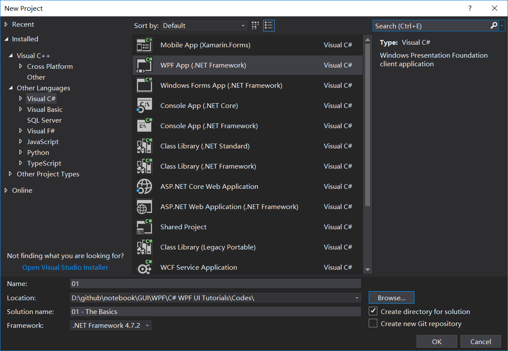
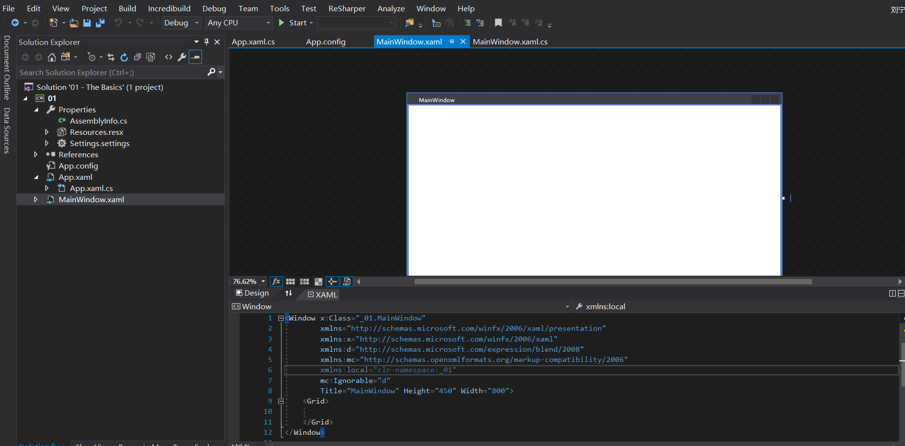
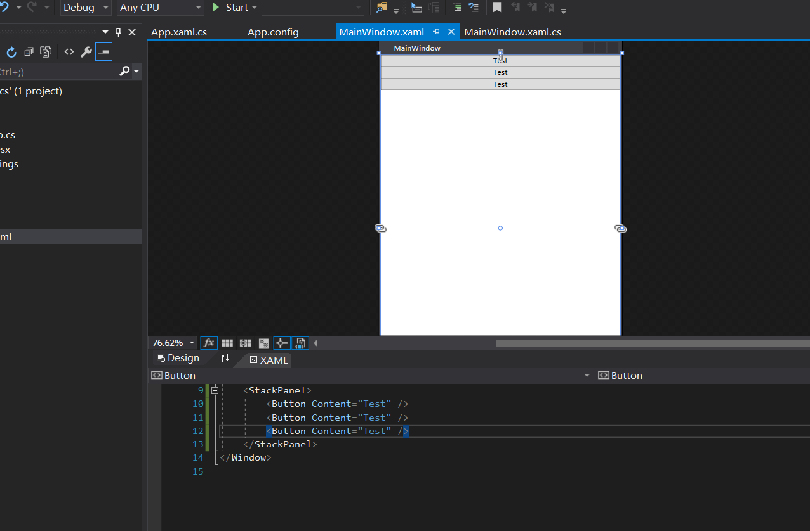
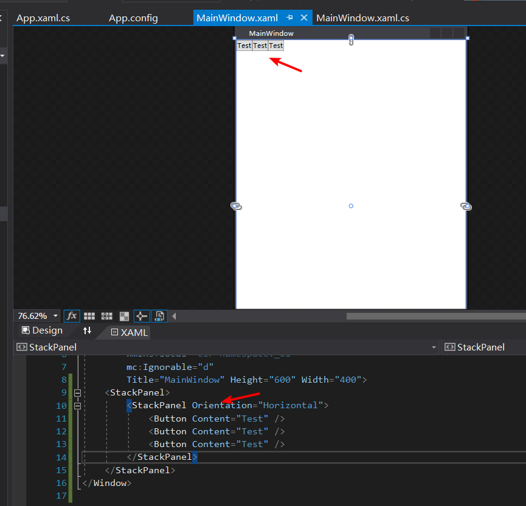
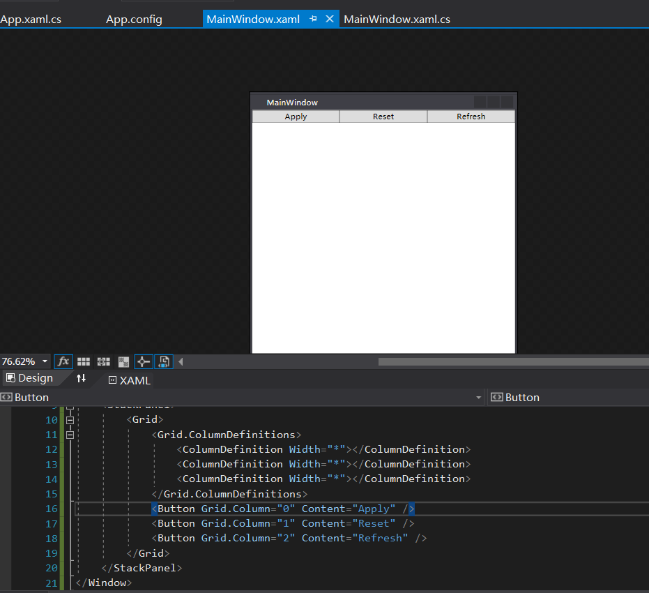
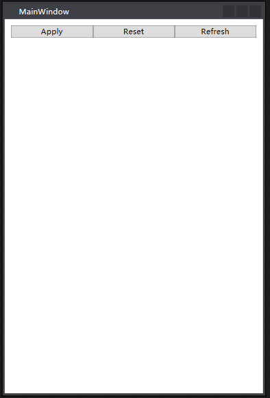
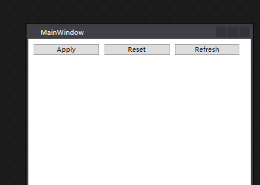
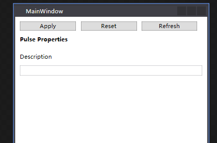

# 01 - The Basics

创建一个WPF App





```xaml
<Window x:Class="_01.MainWindow"
        xmlns="http://schemas.microsoft.com/winfx/2006/xaml/presentation"
        xmlns:x="http://schemas.microsoft.com/winfx/2006/xaml"
        xmlns:d="http://schemas.microsoft.com/expression/blend/2008"
        xmlns:mc="http://schemas.openxmlformats.org/markup-compatibility/2006"
        xmlns:local="clr-namespace:_01"
        mc:Ignorable="d"
        Title="MainWindow" Height="600" Width="400">
    <Grid>
        
    </Grid>
</Window>

```

修改为`Stackpanel`,并加入`Button`



```xaml
<Window x:Class="_01.MainWindow"
        xmlns="http://schemas.microsoft.com/winfx/2006/xaml/presentation"
        xmlns:x="http://schemas.microsoft.com/winfx/2006/xaml"
        xmlns:d="http://schemas.microsoft.com/expression/blend/2008"
        xmlns:mc="http://schemas.openxmlformats.org/markup-compatibility/2006"
        xmlns:local="clr-namespace:_01"
        mc:Ignorable="d"
        Title="MainWindow" Height="600" Width="400">
    <StackPanel>
        <Button Content="Test" />
        <Button Content="Test" />
        <Button Content="Test" />
    </StackPanel>
</Window>
```

通过修改`StackPanel`,改变`Botton`的位置



```xaml
<Window x:Class="_01.MainWindow"
        xmlns="http://schemas.microsoft.com/winfx/2006/xaml/presentation"
        xmlns:x="http://schemas.microsoft.com/winfx/2006/xaml"
        xmlns:d="http://schemas.microsoft.com/expression/blend/2008"
        xmlns:mc="http://schemas.openxmlformats.org/markup-compatibility/2006"
        xmlns:local="clr-namespace:_01"
        mc:Ignorable="d"
        Title="MainWindow" Height="600" Width="400">
    <StackPanel>
        <StackPanel Orientation="Horizontal">
            <Button Content="Test" />
            <Button Content="Test" />
            <Button Content="Test" />
        </StackPanel>
    </StackPanel>
</Window>
```



```xaml
<Window x:Class="_01.MainWindow"
        xmlns="http://schemas.microsoft.com/winfx/2006/xaml/presentation"
        xmlns:x="http://schemas.microsoft.com/winfx/2006/xaml"
        xmlns:d="http://schemas.microsoft.com/expression/blend/2008"
        xmlns:mc="http://schemas.openxmlformats.org/markup-compatibility/2006"
        xmlns:local="clr-namespace:_01"
        mc:Ignorable="d"
        Title="MainWindow" Height="600" Width="400">
    <StackPanel>
        <Grid>
            <Grid.ColumnDefinitions>
                <ColumnDefinition Width="*"></ColumnDefinition>
                <ColumnDefinition Width="*"></ColumnDefinition>
                <ColumnDefinition Width="*"></ColumnDefinition>
            </Grid.ColumnDefinitions>
            
            <Button Grid.Column="0" Content="Apply" />
            <Button Grid.Column="1" Content="Reset" />
            <Button Grid.Column="2" Content="Refresh" />
        </Grid>
    </StackPanel>
</Window>
```



```xaml
<Window x:Class="_01.MainWindow"
        xmlns="http://schemas.microsoft.com/winfx/2006/xaml/presentation"
        xmlns:x="http://schemas.microsoft.com/winfx/2006/xaml"
        xmlns:d="http://schemas.microsoft.com/expression/blend/2008"
        xmlns:mc="http://schemas.openxmlformats.org/markup-compatibility/2006"
        xmlns:local="clr-namespace:_01"
        mc:Ignorable="d"
        Title="MainWindow" Height="600" Width="400">
    <Border Padding="10">
        <StackPanel>
            <Grid>
                <Grid.ColumnDefinitions>
                    <ColumnDefinition Width="*"></ColumnDefinition>
                    <ColumnDefinition Width="*"></ColumnDefinition>
                    <ColumnDefinition Width="*"></ColumnDefinition>
                </Grid.ColumnDefinitions>

                <Button Grid.Column="0" Content="Apply" />
                <Button Grid.Column="1" Content="Reset" />
                <Button Grid.Column="2" Content="Refresh" />
            </Grid>
        </StackPanel>
    </Border>
</Window>
```



```xaml
<Window x:Class="_01.MainWindow"
        xmlns="http://schemas.microsoft.com/winfx/2006/xaml/presentation"
        xmlns:x="http://schemas.microsoft.com/winfx/2006/xaml"
        xmlns:d="http://schemas.microsoft.com/expression/blend/2008"
        xmlns:mc="http://schemas.openxmlformats.org/markup-compatibility/2006"
        xmlns:local="clr-namespace:_01"
        mc:Ignorable="d"
        Title="MainWindow" Height="600" Width="400">
    <Border Padding="10">
        <StackPanel>
            <Grid>
                <Grid.ColumnDefinitions>
                    <ColumnDefinition Width="*"></ColumnDefinition>
                    <ColumnDefinition Width="*"></ColumnDefinition>
                    <ColumnDefinition Width="*"></ColumnDefinition>
                </Grid.ColumnDefinitions>

                <Button Margin="0 0 10 0" Grid.Column="0" Content="Apply" />
                <Button Margin="0 0 10 0" Grid.Column="1" Content="Reset" />
                <Button Margin="0 0 10 0" Grid.Column="2" Content="Refresh" />
            </Grid>
        </StackPanel>
    </Border>
</Window>
```



```xaml
<Window x:Class="_01.MainWindow"
        xmlns="http://schemas.microsoft.com/winfx/2006/xaml/presentation"
        xmlns:x="http://schemas.microsoft.com/winfx/2006/xaml"
        xmlns:d="http://schemas.microsoft.com/expression/blend/2008"
        xmlns:mc="http://schemas.openxmlformats.org/markup-compatibility/2006"
        xmlns:local="clr-namespace:_01"
        mc:Ignorable="d"
        Title="MainWindow" Height="600" Width="400">
    <Border Padding="10">
        <StackPanel>

            <!-- Buttons -->
            <Grid>
                <Grid.ColumnDefinitions>
                    <ColumnDefinition Width="*"></ColumnDefinition>
                    <ColumnDefinition Width="*"></ColumnDefinition>
                    <ColumnDefinition Width="*"></ColumnDefinition>
                </Grid.ColumnDefinitions>

                <Button Margin="0 0 10 0" Grid.Column="0" Content="Apply" />
                <Button Margin="0 0 10 0" Grid.Column="1" Content="Reset" />
                <Button Margin="0 0 10 0" Grid.Column="2" Content="Refresh" />
            </Grid>

            <TextBlock Text="Pulse Properties" FontWeight="Bold" Margin="0 10"/>
            
            <!-- Description -->
            <TextBlock Text="Description"  Margin="0 10"/>
            <TextBox Padding ="2"/>

        </StackPanel>
    </Border>
</Window>
```

