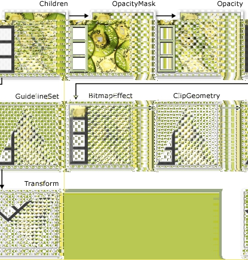

# [Drawings](https://docs.microsoft.com/en-us/dotnet/framework/wpf/graphics-multimedia/drawings)

[Drawing](https://docs.microsoft.com/zh-cn/dotnet/api/system.windows.media.drawing) 对象用于高效地绘制形状、 图像或文本。 当使用进行绘制时，可以使用 drawing[DrawingBrush](https://docs.microsoft.com/zh-cn/dotnet/api/system.windows.media.drawingbrush)或编程与[Visual](https://docs.microsoft.com/zh-cn/dotnet/api/system.windows.media.visual)对象。

## 本节内容

[Drawing 对象概述](https://docs.microsoft.com/zh-cn/dotnet/framework/wpf/graphics-multimedia/drawing-objects-overview)
[帮助主题](https://docs.microsoft.com/zh-cn/dotnet/framework/wpf/graphics-multimedia/drawings-how-to-topics)

## [Drawing Objects Overview](https://docs.microsoft.com/en-us/dotnet/framework/wpf/graphics-multimedia/drawing-objects-overview)

本主题介绍[Drawing](https://docs.microsoft.com/zh-cn/dotnet/api/system.windows.media.drawing)对象，并说明如何使用它们来有效地绘制形状、 位图、 文本和媒体。 使用[Drawing](https://docs.microsoft.com/zh-cn/dotnet/api/system.windows.media.drawing)对象在创建剪贴画时绘制[DrawingBrush](https://docs.microsoft.com/zh-cn/dotnet/api/system.windows.media.drawingbrush)，或使用[Visual](https://docs.microsoft.com/zh-cn/dotnet/api/system.windows.media.visual)对象。

## 什么是 Drawing 对象？

一个[Drawing](https://docs.microsoft.com/zh-cn/dotnet/api/system.windows.media.drawing)对象描述可见内容，如形状、 位图、 视频或文本行。 不同类型的图形描述不同类型的内容。 下面是不同类型图形对象的列表。

- [GeometryDrawing](https://docs.microsoft.com/zh-cn/dotnet/api/system.windows.media.geometrydrawing) – 绘制形状。
- [ImageDrawing](https://docs.microsoft.com/zh-cn/dotnet/api/system.windows.media.imagedrawing) – 绘制图像。
- [GlyphRunDrawing](https://docs.microsoft.com/zh-cn/dotnet/api/system.windows.media.glyphrundrawing) – 绘制文本。
- [VideoDrawing](https://docs.microsoft.com/zh-cn/dotnet/api/system.windows.media.videodrawing) – 播放音频或视频文件。
- [DrawingGroup](https://docs.microsoft.com/zh-cn/dotnet/api/system.windows.media.drawinggroup) – 绘制其他绘图。 使用图形组将其他图形合并到单个复合图形。

[Drawing](https://docs.microsoft.com/zh-cn/dotnet/api/system.windows.media.drawing) 对象具有多种功能;有许多方法可以使用[Drawing](https://docs.microsoft.com/zh-cn/dotnet/api/system.windows.media.drawing)对象。

- 您可以通过将其显示为图像[DrawingImage](https://docs.microsoft.com/zh-cn/dotnet/api/system.windows.media.drawingimage)和一个[Image](https://docs.microsoft.com/zh-cn/dotnet/api/system.windows.controls.image)控件。
- 可以使用其与[DrawingBrush](https://docs.microsoft.com/zh-cn/dotnet/api/system.windows.media.drawingbrush)绘制一个对象，如[Background](https://docs.microsoft.com/zh-cn/dotnet/api/system.windows.controls.page.background)的[Page](https://docs.microsoft.com/zh-cn/dotnet/api/system.windows.controls.page)。
- 可以使用它来描述的外观[DrawingVisual](https://docs.microsoft.com/zh-cn/dotnet/api/system.windows.media.drawingvisual)。
- 可用来枚举的内容[Visual](https://docs.microsoft.com/zh-cn/dotnet/api/system.windows.media.visual)。

WPF 提供能够绘制形状、位图、文本和媒体的其他对象类型。 例如，您还可以使用[Shape](https://docs.microsoft.com/zh-cn/dotnet/api/system.windows.shapes.shape)对象绘制形状，和[MediaElement](https://docs.microsoft.com/zh-cn/dotnet/api/system.windows.controls.mediaelement)控件提供了另一种方法将视频添加到你的应用程序。 因此何时应使用[Drawing](https://docs.microsoft.com/zh-cn/dotnet/api/system.windows.media.drawing)对象？ 当可以牺牲框架级别功能来获得性能优势或需要[Freezable](https://docs.microsoft.com/zh-cn/dotnet/api/system.windows.freezable)功能。 因为[Drawing](https://docs.microsoft.com/zh-cn/dotnet/api/system.windows.media.drawing)对象缺乏对支持[布局](https://docs.microsoft.com/zh-cn/dotnet/framework/wpf/advanced/layout)、 输入和焦点，它们提供性能优势，使它们非常适合用于描述背景、 剪贴画，以及与低级别绘图[Visual](https://docs.microsoft.com/zh-cn/dotnet/api/system.windows.media.visual)对象。

因为它们是一种[Freezable](https://docs.microsoft.com/zh-cn/dotnet/api/system.windows.freezable)对象，[Drawing](https://docs.microsoft.com/zh-cn/dotnet/api/system.windows.media.drawing)对象具有一些特殊功能，包括以下： 它们可以声明为[资源](https://docs.microsoft.com/zh-cn/dotnet/framework/wpf/advanced/xaml-resources)、 在多个对象，变为只读以提高共享性能、 克隆以及变为线程安全。 有关所提供的不同功能的详细信息[Freezable](https://docs.microsoft.com/zh-cn/dotnet/api/system.windows.freezable)对象，请参阅[Freezable 对象概述](https://docs.microsoft.com/zh-cn/dotnet/framework/wpf/advanced/freezable-objects-overview)。

## 绘制形状

若要绘制形状，请使用[GeometryDrawing](https://docs.microsoft.com/zh-cn/dotnet/api/system.windows.media.geometrydrawing)。 几何绘图[Geometry](https://docs.microsoft.com/zh-cn/dotnet/api/system.windows.media.geometrydrawing.geometry)属性描述要绘制的形状及其[Brush](https://docs.microsoft.com/zh-cn/dotnet/api/system.windows.media.geometrydrawing.brush)属性描述应如何绘制形状的内部，并将其[Pen](https://docs.microsoft.com/zh-cn/dotnet/api/system.windows.media.geometrydrawing.pen)属性描述应如何绘制其轮廓。

下面的示例使用[GeometryDrawing](https://docs.microsoft.com/zh-cn/dotnet/api/system.windows.media.geometrydrawing)绘制形状。 由描述形状[GeometryGroup](https://docs.microsoft.com/zh-cn/dotnet/api/system.windows.media.geometrygroup)和两个[EllipseGeometry](https://docs.microsoft.com/zh-cn/dotnet/api/system.windows.media.ellipsegeometry)对象。 用来绘制形状内部[LinearGradientBrush](https://docs.microsoft.com/zh-cn/dotnet/api/system.windows.media.lineargradientbrush)并使用绘制其轮廓[Black](https://docs.microsoft.com/zh-cn/dotnet/api/system.windows.media.brushes.black) [Pen](https://docs.microsoft.com/zh-cn/dotnet/api/system.windows.media.pen)。

此示例将创建以下[GeometryDrawing](https://docs.microsoft.com/zh-cn/dotnet/api/system.windows.media.geometrydrawing)。


一个 GeometryDrawing
```csharp
//
// Create the Geometry to draw.
//
GeometryGroup ellipses = new GeometryGroup();
ellipses.Children.Add(
    new EllipseGeometry(new Point(50,50), 45, 20)
    );
ellipses.Children.Add(
    new EllipseGeometry(new Point(50, 50), 20, 45)
    );
    
    
//
// Create a GeometryDrawing.
//
GeometryDrawing aGeometryDrawing = new GeometryDrawing();
aGeometryDrawing.Geometry = ellipses;

// Paint the drawing with a gradient.
aGeometryDrawing.Brush = 
    new LinearGradientBrush(
        Colors.Blue, 
        Color.FromRgb(204,204,255), 
        new Point(0,0), 
        new Point(1,1));

// Outline the drawing with a solid color.
aGeometryDrawing.Pen = new Pen(Brushes.Black, 10);
```
```xaml
<GeometryDrawing>
  <GeometryDrawing.Geometry>

    <!-- Create a composite shape. -->
    <GeometryGroup>
      <EllipseGeometry Center="50,50" RadiusX="45" RadiusY="20" />
      <EllipseGeometry Center="50,50" RadiusX="20" RadiusY="45" />
    </GeometryGroup>
  </GeometryDrawing.Geometry>
  <GeometryDrawing.Brush>

    <!-- Paint the drawing with a gradient. -->
    <LinearGradientBrush>
      <GradientStop Offset="0.0" Color="Blue" />
      <GradientStop Offset="1.0" Color="#CCCCFF" />
    </LinearGradientBrush>
  </GeometryDrawing.Brush>
  <GeometryDrawing.Pen>

    <!-- Outline the drawing with a solid color. -->
    <Pen Thickness="10" Brush="Black" />
  </GeometryDrawing.Pen>
</GeometryDrawing>
```
有关完整示例，请参阅[创建 GeometryDrawing](https://docs.microsoft.com/zh-cn/dotnet/framework/wpf/graphics-multimedia/how-to-create-a-geometrydrawing)。

其他[Geometry](https://docs.microsoft.com/zh-cn/dotnet/api/system.windows.media.geometry)类，如[PathGeometry](https://docs.microsoft.com/zh-cn/dotnet/api/system.windows.media.pathgeometry)，可以通过创建曲线和弧线来创建更复杂的形状。 有关详细信息[Geometry](https://docs.microsoft.com/zh-cn/dotnet/api/system.windows.media.geometry)对象，请参阅[Geometry 概述](https://docs.microsoft.com/zh-cn/dotnet/framework/wpf/graphics-multimedia/geometry-overview)。

有关其他方法来绘制形状不使用的详细信息[Drawing](https://docs.microsoft.com/zh-cn/dotnet/api/system.windows.media.drawing)对象，请参阅[形状和基本绘图中 WPF 概述](https://docs.microsoft.com/zh-cn/dotnet/framework/wpf/graphics-multimedia/shapes-and-basic-drawing-in-wpf-overview)。

## 绘制图像

若要绘制图像，请使用[ImageDrawing](https://docs.microsoft.com/zh-cn/dotnet/api/system.windows.media.imagedrawing)。 [ImageDrawing](https://docs.microsoft.com/zh-cn/dotnet/api/system.windows.media.imagedrawing)对象的[ImageSource](https://docs.microsoft.com/zh-cn/dotnet/api/system.windows.media.imagedrawing.imagesource)属性描述要绘制图像，并将其[Rect](https://docs.microsoft.com/zh-cn/dotnet/api/system.windows.media.imagedrawing.rect)属性定义绘制图像的区域。

以下示例将在一个矩形的 (75,75) 处绘制一个 100 x 100 像素的图像。 下图显示[ImageDrawing](https://docs.microsoft.com/zh-cn/dotnet/api/system.windows.media.imagedrawing)创建的示例。 添加了灰色边框以显示的边界[ImageDrawing](https://docs.microsoft.com/zh-cn/dotnet/api/system.windows.media.imagedrawing)。


100 x 100 的 ImageDrawing
```csharp
// Create a 100 by 100 image with an upper-left point of (75,75). 
ImageDrawing bigKiwi = new ImageDrawing();
bigKiwi.Rect = new Rect(75, 75, 100, 100);
bigKiwi.ImageSource = new BitmapImage(
    new Uri(@"sampleImages\kiwi.png", UriKind.Relative));
```
```xaml
<!-- The Rect property specifies that the image only fill a 100 by 100
     rectangular area. -->
<ImageDrawing Rect="75,75,100,100" ImageSource="sampleImages\kiwi.png"/>
```
有关图像的详细信息，请参阅[图像处理概述](https://docs.microsoft.com/zh-cn/dotnet/framework/wpf/graphics-multimedia/imaging-overview)。

## 播放媒体（仅代码）

> 虽然可以声明[VideoDrawing](https://docs.microsoft.com/zh-cn/dotnet/api/system.windows.media.videodrawing)在可扩展应用程序标记语言 (XAML)，仅可以加载并播放其媒体使用的代码。 若要播放视频可扩展应用程序标记语言 (XAML)，使用[MediaElement](https://docs.microsoft.com/zh-cn/dotnet/api/system.windows.controls.mediaelement)相反。

若要播放音频或视频文件，请使用[VideoDrawing](https://docs.microsoft.com/zh-cn/dotnet/api/system.windows.media.videodrawing)和一个[MediaPlayer](https://docs.microsoft.com/zh-cn/dotnet/api/system.windows.media.mediaplayer)。 加载并播放媒体有两种方法。 第一种是使用[MediaPlayer](https://docs.microsoft.com/zh-cn/dotnet/api/system.windows.media.mediaplayer)和一个[VideoDrawing](https://docs.microsoft.com/zh-cn/dotnet/api/system.windows.media.videodrawing)通过本身，第二个方法是创建您自己[MediaTimeline](https://docs.microsoft.com/zh-cn/dotnet/api/system.windows.media.mediatimeline)要用于[MediaPlayer](https://docs.microsoft.com/zh-cn/dotnet/api/system.windows.media.mediaplayer)和[VideoDrawing](https://docs.microsoft.com/zh-cn/dotnet/api/system.windows.media.videodrawing)。

> 当媒体随应用程序一起分发时，无法像图像那样将媒体文件用作项目资源。 在项目文件中，必须改为将媒体类型设置为 `Content` 并将 `CopyToOutputDirectory` 设置为 `PreserveNewest` 或 `Always`。

若要播放的媒体，而无需创建您自己[MediaTimeline](https://docs.microsoft.com/zh-cn/dotnet/api/system.windows.media.mediatimeline)，执行以下步骤。

1. 创建 [MediaPlayer](https://docs.microsoft.com/zh-cn/dotnet/api/system.windows.media.mediaplayer) 对象。
```csharp
MediaPlayer player = new MediaPlayer();
```
2. 使用[Open](https://docs.microsoft.com/zh-cn/dotnet/api/system.windows.media.mediaplayer.open)方法加载媒体文件。
```csharp
player.Open(new Uri(@"sampleMedia\xbox.wmv", UriKind.Relative));
```
3. 创建 [VideoDrawing](https://docs.microsoft.com/zh-cn/dotnet/api/system.windows.media.videodrawing)。
```csharp
VideoDrawing aVideoDrawing = new VideoDrawing();
```
4. 指定的大小和位置，通过设置绘制媒体[Rect](https://docs.microsoft.com/zh-cn/dotnet/api/system.windows.media.videodrawing.rect)属性的[VideoDrawing](https://docs.microsoft.com/zh-cn/dotnet/api/system.windows.media.videodrawing)。
```csharp
aVideoDrawing.Rect = new Rect(0, 0, 100, 100);
```
5. 设置[Player](https://docs.microsoft.com/zh-cn/dotnet/api/system.windows.media.videodrawing.player)的属性[VideoDrawing](https://docs.microsoft.com/zh-cn/dotnet/api/system.windows.media.videodrawing)与[MediaPlayer](https://docs.microsoft.com/zh-cn/dotnet/api/system.windows.media.mediaplayer)创建。
```csharp
aVideoDrawing.Player = player;
```
6. 使用[Play](https://docs.microsoft.com/zh-cn/dotnet/api/system.windows.media.mediaplayer.play)方法的[MediaPlayer](https://docs.microsoft.com/zh-cn/dotnet/api/system.windows.media.mediaplayer)开始播放媒体。
```csharp
// Play the video once.
player.Play();        
```
下面的示例使用[VideoDrawing](https://docs.microsoft.com/zh-cn/dotnet/api/system.windows.media.videodrawing)和一个[MediaPlayer](https://docs.microsoft.com/zh-cn/dotnet/api/system.windows.media.mediaplayer)播放视频文件一次。
```csharp
//
// Create a VideoDrawing.
//      
MediaPlayer player = new MediaPlayer();

player.Open(new Uri(@"sampleMedia\xbox.wmv", UriKind.Relative));

VideoDrawing aVideoDrawing = new VideoDrawing();

aVideoDrawing.Rect = new Rect(0, 0, 100, 100);

aVideoDrawing.Player = player;

// Play the video once.
player.Play();        
```
若要获得对媒体的额外计时控制，请使用[MediaTimeline](https://docs.microsoft.com/zh-cn/dotnet/api/system.windows.media.mediatimeline)与[MediaPlayer](https://docs.microsoft.com/zh-cn/dotnet/api/system.windows.media.mediaplayer)和[VideoDrawing](https://docs.microsoft.com/zh-cn/dotnet/api/system.windows.media.videodrawing)对象。 [MediaTimeline](https://docs.microsoft.com/zh-cn/dotnet/api/system.windows.media.mediatimeline)使您能够指定是否应重复显示视频。 若要使用[MediaTimeline](https://docs.microsoft.com/zh-cn/dotnet/api/system.windows.media.mediatimeline)与[VideoDrawing](https://docs.microsoft.com/zh-cn/dotnet/api/system.windows.media.videodrawing)，执行以下步骤：

1. 声明[MediaTimeline](https://docs.microsoft.com/zh-cn/dotnet/api/system.windows.media.mediatimeline)并设置其计时行为。
```csharp
// Create a MediaTimeline.
MediaTimeline mTimeline = 
new MediaTimeline(new Uri(@"sampleMedia\xbox.wmv", UriKind.Relative)); 
// Set the timeline to repeat.
mTimeline.RepeatBehavior = RepeatBehavior.Forever;
```
2. 创建[MediaClock](https://docs.microsoft.com/zh-cn/dotnet/api/system.windows.media.mediaclock)从[MediaTimeline](https://docs.microsoft.com/zh-cn/dotnet/api/system.windows.media.mediatimeline)。
```csharp
// Create a clock from the MediaTimeline.
MediaClock mClock = mTimeline.CreateClock();
```
3. 创建[MediaPlayer](https://docs.microsoft.com/zh-cn/dotnet/api/system.windows.media.mediaplayer)并用[MediaClock](https://docs.microsoft.com/zh-cn/dotnet/api/system.windows.media.mediaclock)若要设置其[Clock](https://docs.microsoft.com/zh-cn/dotnet/api/system.windows.media.mediaplayer.clock)属性。

```csharp
MediaPlayer repeatingVideoDrawingPlayer = new MediaPlayer();
repeatingVideoDrawingPlayer.Clock = mClock;
```

4. 创建[VideoDrawing](https://docs.microsoft.com/zh-cn/dotnet/api/system.windows.media.videodrawing)，并将分配[MediaPlayer](https://docs.microsoft.com/zh-cn/dotnet/api/system.windows.media.mediaplayer)到[Player](https://docs.microsoft.com/zh-cn/dotnet/api/system.windows.media.videodrawing.player)属性的[VideoDrawing](https://docs.microsoft.com/zh-cn/dotnet/api/system.windows.media.videodrawing)。

```csharp
VideoDrawing repeatingVideoDrawing = new VideoDrawing();
repeatingVideoDrawing.Rect = new Rect(150, 0, 100, 100);
repeatingVideoDrawing.Player = repeatingVideoDrawingPlayer;  
```

下面的示例使用[MediaTimeline](https://docs.microsoft.com/zh-cn/dotnet/api/system.windows.media.mediatimeline)与[MediaPlayer](https://docs.microsoft.com/zh-cn/dotnet/api/system.windows.media.mediaplayer)和一个[VideoDrawing](https://docs.microsoft.com/zh-cn/dotnet/api/system.windows.media.videodrawing)以重复播放视频。

```csharp
//
// Create a VideoDrawing that repeats.
//

// Create a MediaTimeline.
MediaTimeline mTimeline = 
    new MediaTimeline(new Uri(@"sampleMedia\xbox.wmv", UriKind.Relative)); 

// Set the timeline to repeat.
mTimeline.RepeatBehavior = RepeatBehavior.Forever;

// Create a clock from the MediaTimeline.
MediaClock mClock = mTimeline.CreateClock();

MediaPlayer repeatingVideoDrawingPlayer = new MediaPlayer();
repeatingVideoDrawingPlayer.Clock = mClock;

VideoDrawing repeatingVideoDrawing = new VideoDrawing();
repeatingVideoDrawing.Rect = new Rect(150, 0, 100, 100);
repeatingVideoDrawing.Player = repeatingVideoDrawingPlayer;  
```

请注意，当您使用[MediaTimeline](https://docs.microsoft.com/zh-cn/dotnet/api/system.windows.media.mediatimeline)，使用交互式[ClockController](https://docs.microsoft.com/zh-cn/dotnet/api/system.windows.media.animation.clockcontroller)从返回[Controller](https://docs.microsoft.com/zh-cn/dotnet/api/system.windows.media.animation.clock.controller)属性[MediaClock](https://docs.microsoft.com/zh-cn/dotnet/api/system.windows.media.mediaclock)而不是交互式的方法控制媒体播放[MediaPlayer](https://docs.microsoft.com/zh-cn/dotnet/api/system.windows.media.mediaplayer)。

## 绘制文本

若要绘制的文本，请使用[GlyphRunDrawing](https://docs.microsoft.com/zh-cn/dotnet/api/system.windows.media.glyphrundrawing)和一个[GlyphRun](https://docs.microsoft.com/zh-cn/dotnet/api/system.windows.media.glyphrun)。 下面的示例使用[GlyphRunDrawing](https://docs.microsoft.com/zh-cn/dotnet/api/system.windows.media.glyphrundrawing)绘制文本"Hello World"。
```csharp
GlyphRun theGlyphRun = new GlyphRun(
    new GlyphTypeface(new Uri(@"C:\WINDOWS\Fonts\TIMES.TTF")),
    0,
    false,
    13.333333333333334,
    new ushort[]{43, 72, 79, 79, 82, 3, 58, 82, 85, 79, 71},
    new Point(0, 12.29),
    new double[]{
        9.62666666666667, 7.41333333333333, 2.96, 
        2.96, 7.41333333333333, 3.70666666666667, 
        12.5866666666667, 7.41333333333333, 
        4.44, 2.96, 7.41333333333333},
    null,
    null,
    null,
    null,
    null,
    null
    );
    
GlyphRunDrawing gDrawing = new GlyphRunDrawing(Brushes.Black, theGlyphRun);
```
```xaml
<GlyphRunDrawing ForegroundBrush="Black">
  <GlyphRunDrawing.GlyphRun>
    <GlyphRun 
      CaretStops="{x:Null}" 
      ClusterMap="{x:Null}" 
      IsSideways="False" 
      GlyphOffsets="{x:Null}" 
      GlyphIndices="43 72 79 79 82 3 58 82 85 79 71" 
      BaselineOrigin="0,12.29"  
      FontRenderingEmSize="13.333333333333334" 
      DeviceFontName="{x:Null}" 
      AdvanceWidths="9.62666666666667 7.41333333333333 2.96 2.96 7.41333333333333 3.70666666666667 12.5866666666667 7.41333333333333 4.44 2.96 7.41333333333333" 
      BidiLevel="0">
      <GlyphRun.GlyphTypeface>
        <GlyphTypeface FontUri="C:\WINDOWS\Fonts\TIMES.TTF" />
      </GlyphRun.GlyphTypeface>
    </GlyphRun>
  </GlyphRunDrawing.GlyphRun>
</GlyphRunDrawing>
```
一个[GlyphRun](https://docs.microsoft.com/zh-cn/dotnet/api/system.windows.media.glyphrun)是适用于固定格式文档演示和打印方案的低级别对象。 在屏幕上绘制文本的更简单方法是使用[Label](https://docs.microsoft.com/zh-cn/dotnet/api/system.windows.controls.label)或[TextBlock](https://docs.microsoft.com/zh-cn/dotnet/api/system.windows.controls.textblock)。 有关详细信息[GlyphRun](https://docs.microsoft.com/zh-cn/dotnet/api/system.windows.media.glyphrun)，请参阅[GlyphRun 对象和 Glyphs 元素简介](https://docs.microsoft.com/zh-cn/dotnet/framework/wpf/advanced/introduction-to-the-glyphrun-object-and-glyphs-element)概述。

## 复合绘图

一个[DrawingGroup](https://docs.microsoft.com/zh-cn/dotnet/api/system.windows.media.drawinggroup)可以合并到单个复合图形的多个绘图。 通过使用[DrawingGroup](https://docs.microsoft.com/zh-cn/dotnet/api/system.windows.media.drawinggroup)，可以将形状、 图像和文本合并到单个[Drawing](https://docs.microsoft.com/zh-cn/dotnet/api/system.windows.media.drawing)对象。
下面的示例使用[DrawingGroup](https://docs.microsoft.com/zh-cn/dotnet/api/system.windows.media.drawinggroup)以组合两个[GeometryDrawing](https://docs.microsoft.com/zh-cn/dotnet/api/system.windows.media.geometrydrawing)对象和一个[ImageDrawing](https://docs.microsoft.com/zh-cn/dotnet/api/system.windows.media.imagedrawing)对象。 本示例生成以下输出。

复合绘图

```csharp
//
// Create three drawings.
//
GeometryDrawing ellipseDrawing =
    new GeometryDrawing(
        new SolidColorBrush(Color.FromArgb(102, 181, 243, 20)),
        new Pen(Brushes.Black, 4),
        new EllipseGeometry(new Point(50,50), 50, 50)
    );

ImageDrawing kiwiPictureDrawing = 
    new ImageDrawing(
        new BitmapImage(new Uri(@"sampleImages\kiwi.png", UriKind.Relative)), 
        new Rect(50,50,100,100));

GeometryDrawing ellipseDrawing2 =
    new GeometryDrawing(
        new SolidColorBrush(Color.FromArgb(102,181,243,20)),
        new Pen(Brushes.Black, 4),
        new EllipseGeometry(new Point(150, 150), 50, 50)
    );

// Create a DrawingGroup to contain the drawings.
DrawingGroup aDrawingGroup = new DrawingGroup();
aDrawingGroup.Children.Add(ellipseDrawing);
aDrawingGroup.Children.Add(kiwiPictureDrawing);
aDrawingGroup.Children.Add(ellipseDrawing2);
```
```xaml
<DrawingGroup>
  <GeometryDrawing Brush="#66B5F314">
    <GeometryDrawing.Geometry>
      <EllipseGeometry Center="50,50" RadiusX="50"  RadiusY="50"/>
    </GeometryDrawing.Geometry>
    <GeometryDrawing.Pen>
      <Pen Brush="Black" Thickness="4" />
    </GeometryDrawing.Pen>
  </GeometryDrawing>
  <ImageDrawing ImageSource="sampleImages\kiwi.png" Rect="50,50,100,100"/>
  <GeometryDrawing Brush="#66B5F314">
    <GeometryDrawing.Geometry>
      <EllipseGeometry Center="150,150" RadiusX="50"  RadiusY="50"/>
    </GeometryDrawing.Geometry>
    <GeometryDrawing.Pen>
      <Pen Brush="Black" Thickness="4" />
    </GeometryDrawing.Pen>
  </GeometryDrawing>
</DrawingGroup>
```
一个[DrawingGroup](https://docs.microsoft.com/zh-cn/dotnet/api/system.windows.media.drawinggroup)还使您能够对其内容应用不透明蒙板、 转换、 位图效果和其他操作。 [DrawingGroup](https://docs.microsoft.com/zh-cn/dotnet/api/system.windows.media.drawinggroup) 操作按以下顺序应用： [OpacityMask](https://docs.microsoft.com/zh-cn/dotnet/api/system.windows.media.drawinggroup.opacitymask)， [Opacity](https://docs.microsoft.com/zh-cn/dotnet/api/system.windows.media.drawinggroup.opacity)， [BitmapEffect](https://docs.microsoft.com/zh-cn/dotnet/api/system.windows.media.drawinggroup.bitmapeffect)， [ClipGeometry](https://docs.microsoft.com/zh-cn/dotnet/api/system.windows.media.drawinggroup.clipgeometry)， [GuidelineSet](https://docs.microsoft.com/zh-cn/dotnet/api/system.windows.media.drawinggroup.guidelineset)，，然后[Transform](https://docs.microsoft.com/zh-cn/dotnet/api/system.windows.media.drawinggroup.transform)。

下图中的显示顺序[DrawingGroup](https://docs.microsoft.com/zh-cn/dotnet/api/system.windows.media.drawinggroup)操作将应用。


DrawingGroup 操作的顺序

下表介绍可用于操作的属性[DrawingGroup](https://docs.microsoft.com/zh-cn/dotnet/api/system.windows.media.drawinggroup)对象的内容。
| 属性                                                         | 描述                                                         | 图示                                                         |
| ------------------------------------------------------------ | ------------------------------------------------------------ | ------------------------------------------------------------ |
| [OpacityMask](https://docs.microsoft.com/zh-cn/dotnet/api/system.windows.media.drawinggroup.opacitymask) | 更改选定部分的不透明度[DrawingGroup](https://docs.microsoft.com/zh-cn/dotnet/api/system.windows.media.drawinggroup)内容。 有关示例，请参见 [如何：控制绘图的不透明度](https://msdn.microsoft.com/library/68580652-7d32-4d27-93cc-a5148cf4d5ee)。 |  |
| [Opacity](https://docs.microsoft.com/zh-cn/dotnet/api/system.windows.media.drawinggroup.opacity) | 统一更改的不透明度[DrawingGroup](https://docs.microsoft.com/zh-cn/dotnet/api/system.windows.media.drawinggroup)内容。 使用此属性可以使[Drawing](https://docs.microsoft.com/zh-cn/dotnet/api/system.windows.media.drawing)透明或部分透明。 有关示例，请参见 [如何：向绘图应用不透明蒙板](https://msdn.microsoft.com/library/d77b420b-9be2-479c-a45e-82f4da30eb9f)。 |  |
| [BitmapEffect](https://docs.microsoft.com/zh-cn/dotnet/api/system.windows.media.drawinggroup.bitmapeffect) | 适用[BitmapEffect](https://docs.microsoft.com/zh-cn/dotnet/api/system.windows.media.effects.bitmapeffect)到[DrawingGroup](https://docs.microsoft.com/zh-cn/dotnet/api/system.windows.media.drawinggroup)内容。有关示例，请参见 [如何：向绘图应用 BitmapEffect](https://msdn.microsoft.com/library/c5b1de83-8d09-47fb-96db-5f174471f4b5)。 |  |
| [ClipGeometry](https://docs.microsoft.com/zh-cn/dotnet/api/system.windows.media.drawinggroup.clipgeometry) | 剪辑[DrawingGroup](https://docs.microsoft.com/zh-cn/dotnet/api/system.windows.media.drawinggroup)内容区域向您介绍如何使用[Geometry](https://docs.microsoft.com/zh-cn/dotnet/api/system.windows.media.geometry)。 有关示例，请参见 [如何：剪裁绘图](https://msdn.microsoft.com/library/1f7d8a2c-c3c2-42cb-a542-e6796f9fb058)。 |  |
| [GuidelineSet](https://docs.microsoft.com/zh-cn/dotnet/api/system.windows.media.drawinggroup.guidelineset) | 根据指定的基准将与设备无关的像素与设备像素对齐。 此属性对于确保细节丰富的图形在低 DPI 屏幕上清晰地呈现很有用。 有关示例，请参阅[向绘图应用 GuidelineSet](https://docs.microsoft.com/zh-cn/dotnet/framework/wpf/graphics-multimedia/how-to-apply-a-guidelineset-to-a-drawing)。 |  |
| [Transform](https://docs.microsoft.com/zh-cn/dotnet/api/system.windows.media.drawinggroup.transform) | 转换[DrawingGroup](https://docs.microsoft.com/zh-cn/dotnet/api/system.windows.media.drawinggroup)内容。 有关示例，请参见 [如何：向绘图应用转换](https://msdn.microsoft.com/library/0d525f2b-682d-4d67-9660-cf46929fbabd)。 |  |

## 将绘图显示为图像

若要显示[Drawing](https://docs.microsoft.com/zh-cn/dotnet/api/system.windows.media.drawing)与[Image](https://docs.microsoft.com/zh-cn/dotnet/api/system.windows.controls.image)控制，请使用[DrawingImage](https://docs.microsoft.com/zh-cn/dotnet/api/system.windows.media.drawingimage)作为[Image](https://docs.microsoft.com/zh-cn/dotnet/api/system.windows.controls.image)控件的[Source](https://docs.microsoft.com/zh-cn/dotnet/api/system.windows.controls.image.source)并设置[DrawingImage](https://docs.microsoft.com/zh-cn/dotnet/api/system.windows.media.drawingimage)对象的[DrawingImage.Drawing](https://docs.microsoft.com/zh-cn/dotnet/api/system.windows.media.drawingimage.drawing)属性设置为你想要显示的绘图。

下面的示例使用[DrawingImage](https://docs.microsoft.com/zh-cn/dotnet/api/system.windows.media.drawingimage)和一个[Image](https://docs.microsoft.com/zh-cn/dotnet/api/system.windows.controls.image)控件来显示[GeometryDrawing](https://docs.microsoft.com/zh-cn/dotnet/api/system.windows.media.geometrydrawing)。 本示例生成以下输出。


一个 DrawingImage

```csharp
using System;
using System.Windows;
using System.Windows.Controls;
using System.Windows.Media;
using System.Windows.Media.Animation;
using System.Windows.Shapes;

namespace SDKSample
{
    public class DrawingImageExample : Page
    {

        public DrawingImageExample()
        {

            //
            // Create the Geometry to draw.
            //
            GeometryGroup ellipses = new GeometryGroup();
            ellipses.Children.Add(
                new EllipseGeometry(new Point(50,50), 45, 20)
                );
            ellipses.Children.Add(
                new EllipseGeometry(new Point(50, 50), 20, 45)
                );

            //
            // Create a GeometryDrawing.
            //
            GeometryDrawing aGeometryDrawing = new GeometryDrawing();
            aGeometryDrawing.Geometry = ellipses;

            // Paint the drawing with a gradient.
            aGeometryDrawing.Brush = 
                new LinearGradientBrush(
                    Colors.Blue, 
                    Color.FromRgb(204,204,255), 
                    new Point(0,0), 
                    new Point(1,1));

            // Outline the drawing with a solid color.
            aGeometryDrawing.Pen = new Pen(Brushes.Black, 10);

            //
            // Use a DrawingImage and an Image control
            // to display the drawing.
            //
            DrawingImage geometryImage = new DrawingImage(aGeometryDrawing);

            // Freeze the DrawingImage for performance benefits.
            geometryImage.Freeze();

            Image anImage = new Image();
            anImage.Source = geometryImage;
            anImage.HorizontalAlignment = HorizontalAlignment.Left;

            //
            // Place the image inside a border and
            // add it to the page.
            //
            Border exampleBorder = new Border();
            exampleBorder.Child = anImage;
            exampleBorder.BorderBrush = Brushes.Gray;
            exampleBorder.BorderThickness = new Thickness(1);
            exampleBorder.HorizontalAlignment = HorizontalAlignment.Left;
            exampleBorder.VerticalAlignment = VerticalAlignment.Top;
            exampleBorder.Margin = new Thickness(10);

            this.Margin = new Thickness(20);
            this.Background = Brushes.White;
            this.Content = exampleBorder;
        }

    }
}
```
```xaml
<Page 
  xmlns="http://schemas.microsoft.com/winfx/2006/xaml/presentation"
  xmlns:x="http://schemas.microsoft.com/winfx/2006/xaml"
  xmlns:PresentationOptions="http://schemas.microsoft.com/winfx/2006/xaml/presentation/options" 
  xmlns:mc="http://schemas.openxmlformats.org/markup-compatibility/2006"
  mc:Ignorable="PresentationOptions"
  Background="White" Margin="20">
  <Border BorderBrush="Gray" BorderThickness="1" 
    HorizontalAlignment="Left" VerticalAlignment="Top"
    Margin="10">
    <!-- This image uses a Drawing object for its source. -->
    <Image>
      <Image.Source>
        <DrawingImage PresentationOptions:Freeze="True">
          <DrawingImage.Drawing>
            <GeometryDrawing>
              <GeometryDrawing.Geometry>
                <GeometryGroup>
                  <EllipseGeometry Center="50,50" RadiusX="45" RadiusY="20" />
                  <EllipseGeometry Center="50,50" RadiusX="20" RadiusY="45" />
                </GeometryGroup>
              </GeometryDrawing.Geometry>
              <GeometryDrawing.Brush>
                <LinearGradientBrush>
                  <GradientStop Offset="0.0" Color="Blue" />
                  <GradientStop Offset="1.0" Color="#CCCCFF" />
                </LinearGradientBrush>
              </GeometryDrawing.Brush>
              <GeometryDrawing.Pen>
                <Pen Thickness="10" Brush="Black" />
              </GeometryDrawing.Pen>
            </GeometryDrawing>
          </DrawingImage.Drawing>
        </DrawingImage>
      </Image.Source>
    </Image>
  </Border>
</Page>
```
## 使用 Drawing 绘制对象

一个[DrawingBrush](https://docs.microsoft.com/zh-cn/dotnet/api/system.windows.media.drawingbrush)是一种使用 drawing 对象绘制区域的画笔。 几乎可以使用它绘制任何带有绘图的图形对象。[Drawing](https://docs.microsoft.com/zh-cn/dotnet/api/system.windows.media.drawing)的属性[DrawingBrush](https://docs.microsoft.com/zh-cn/dotnet/api/system.windows.media.drawingbrush)介绍了其[Drawing](https://docs.microsoft.com/zh-cn/dotnet/api/system.windows.media.drawingbrush.drawing)。 若要呈现[Drawing](https://docs.microsoft.com/zh-cn/dotnet/api/system.windows.media.drawing)与[DrawingBrush](https://docs.microsoft.com/zh-cn/dotnet/api/system.windows.media.drawingbrush)，将其添加到使用画笔的画笔[Drawing](https://docs.microsoft.com/zh-cn/dotnet/api/system.windows.media.drawing)属性，然后使用画笔绘制图形对象，如控件或面板。

以下示例使用[DrawingBrush](https://docs.microsoft.com/zh-cn/dotnet/api/system.windows.media.drawingbrush)绘制[Fill](https://docs.microsoft.com/zh-cn/dotnet/api/system.windows.shapes.shape.fill)的[Rectangle](https://docs.microsoft.com/zh-cn/dotnet/api/system.windows.shapes.rectangle)从创建的图案[GeometryDrawing](https://docs.microsoft.com/zh-cn/dotnet/api/system.windows.media.geometrydrawing)。 本示例生成以下输出。


与 DrawingBrush 结合使用的 GeometryDrawing
```csharp
using System;
using System.Windows;
using System.Windows.Controls;
using System.Windows.Media;
using System.Windows.Media.Animation;
using System.Windows.Shapes;

namespace SDKSample
{
    public class DrawingBrushExample : Page
    {

        public DrawingBrushExample()
        {

            //
            // Create the Geometry to draw.
            //
            GeometryGroup ellipses = new GeometryGroup();
            ellipses.Children.Add(
                new EllipseGeometry(new Point(50,50), 45, 20)
                );
            ellipses.Children.Add(
                new EllipseGeometry(new Point(50, 50), 20, 45)
                );
                
            //
            // Create a GeometryDrawing.
            //
            GeometryDrawing aGeometryDrawing = new GeometryDrawing();
            aGeometryDrawing.Geometry = ellipses;

            // Paint the drawing with a gradient.
            aGeometryDrawing.Brush = 
                new LinearGradientBrush(
                    Colors.Blue, 
                    Color.FromRgb(204,204,255), 
                    new Point(0,0), 
                    new Point(1,1));

            // Outline the drawing with a solid color.
            aGeometryDrawing.Pen = new Pen(Brushes.Black, 10);

            DrawingBrush patternBrush = new DrawingBrush(aGeometryDrawing);
            patternBrush.Viewport = new Rect(0, 0, 0.25, 0.25);
            patternBrush.TileMode = TileMode.Tile;
            patternBrush.Freeze();

            //
            // Create an object to paint.
            //
            Rectangle paintedRectangle = new Rectangle();
            paintedRectangle.Width = 100;
            paintedRectangle.Height = 100;
            paintedRectangle.Fill = patternBrush;

            //
            // Place the image inside a border and
            // add it to the page.
            //
            Border exampleBorder = new Border();
            exampleBorder.Child = paintedRectangle;
            exampleBorder.BorderBrush = Brushes.Gray;
            exampleBorder.BorderThickness = new Thickness(1);
            exampleBorder.HorizontalAlignment = HorizontalAlignment.Left;
            exampleBorder.VerticalAlignment = VerticalAlignment.Top;
            exampleBorder.Margin = new Thickness(10);

            this.Margin = new Thickness(20);
            this.Background = Brushes.White;
            this.Content = exampleBorder;
        }
    }
}
```
```xaml
<Page 
  xmlns="http://schemas.microsoft.com/winfx/2006/xaml/presentation"
  xmlns:x="http://schemas.microsoft.com/winfx/2006/xaml"
  xmlns:PresentationOptions="http://schemas.microsoft.com/winfx/2006/xaml/presentation/options" 
  xmlns:mc="http://schemas.openxmlformats.org/markup-compatibility/2006"
  mc:Ignorable="PresentationOptions"
  Margin="20" Background="White">

  <Border BorderBrush="Gray" BorderThickness="1" 
    HorizontalAlignment="Left" VerticalAlignment="Top"
    Margin="10">
    <Rectangle Width="100" Height="100">
      <Rectangle.Fill>
        <DrawingBrush PresentationOptions:Freeze="True"
                      Viewport="0,0,0.25,0.25" TileMode="Tile">
          <DrawingBrush.Drawing>
            <GeometryDrawing>
              <GeometryDrawing.Geometry>
                <GeometryGroup>
                  <EllipseGeometry Center="50,50" RadiusX="45" RadiusY="20" />
                  <EllipseGeometry Center="50,50" RadiusX="20" RadiusY="45" />
                </GeometryGroup>
              </GeometryDrawing.Geometry>
              <GeometryDrawing.Brush>
                <LinearGradientBrush>
                  <GradientStop Offset="0.0" Color="Blue" />
                  <GradientStop Offset="1.0" Color="#CCCCFF" />
                </LinearGradientBrush>
              </GeometryDrawing.Brush>
              <GeometryDrawing.Pen>
                <Pen Thickness="10" Brush="Black" />
              </GeometryDrawing.Pen>
            </GeometryDrawing>
          </DrawingBrush.Drawing>
        </DrawingBrush>
      </Rectangle.Fill>
    </Rectangle>
  </Border>
</Page>
```
[DrawingBrush](https://docs.microsoft.com/zh-cn/dotnet/api/system.windows.media.drawingbrush)类提供了各种用于拉伸和平铺其内容的选项。 有关详细信息[DrawingBrush](https://docs.microsoft.com/zh-cn/dotnet/api/system.windows.media.drawingbrush)，请参阅[使用图像、 绘图和视觉对象进行绘制](https://docs.microsoft.com/zh-cn/dotnet/framework/wpf/graphics-multimedia/painting-with-images-drawings-and-visuals)概述。

## 使用视觉对象呈现绘图

一个[DrawingVisual](https://docs.microsoft.com/zh-cn/dotnet/api/system.windows.media.drawingvisual)是一种旨在呈现绘图的视觉对象。 对于希望生成高度自定义的图形环境的开发者来说，可以选择直接在视觉对象层上工作，但在本概述中不作介绍。 有关详细信息，请参阅[使用 DrawingVisual 对象](https://docs.microsoft.com/zh-cn/dotnet/framework/wpf/graphics-multimedia/using-drawingvisual-objects)概述。

## DrawingContext 对象

[DrawingContext](https://docs.microsoft.com/zh-cn/dotnet/api/system.windows.media.drawingcontext)类使你能够填充[Visual](https://docs.microsoft.com/zh-cn/dotnet/api/system.windows.media.visual)或[Drawing](https://docs.microsoft.com/zh-cn/dotnet/api/system.windows.media.drawing)可视化内容。 许多此类低级别图形对象使用[DrawingContext](https://docs.microsoft.com/zh-cn/dotnet/api/system.windows.media.drawingcontext)因为它非常高效地描述图形内容。

尽管[DrawingContext](https://docs.microsoft.com/zh-cn/dotnet/api/system.windows.media.drawingcontext)绘制方法看起来类似于的绘制方法[System.Drawing.Graphics](https://docs.microsoft.com/zh-cn/dotnet/api/system.drawing.graphics)类型，它们为实际大不相同。[DrawingContext](https://docs.microsoft.com/zh-cn/dotnet/api/system.windows.media.drawingcontext) 是用于保留的模式图形系统，而[System.Drawing.Graphics](https://docs.microsoft.com/zh-cn/dotnet/api/system.drawing.graphics)类型用于即时模式图形系统。 当你使用[DrawingContext](https://docs.microsoft.com/zh-cn/dotnet/api/system.windows.media.drawingcontext)对象的绘图命令时，实际上存储组绘制指令 (尽管具体的存储机制取决于提供的对象的类型[DrawingContext](https://docs.microsoft.com/zh-cn/dotnet/api/system.windows.media.drawingcontext))，稍后将使用由图形系统; 你都不绘制到屏幕上实时。 有关 Windows Presentation Foundation (WPF) 图形系统的工作原理的详细信息，请参阅[WPF 图形呈现概述](https://docs.microsoft.com/zh-cn/dotnet/framework/wpf/graphics-multimedia/wpf-graphics-rendering-overview)。

您永远不会直接实例化[DrawingContext](https://docs.microsoft.com/zh-cn/dotnet/api/system.windows.media.drawingcontext); 但是，可以获取绘图上下文通过某些方法，如[DrawingGroup.Open](https://docs.microsoft.com/zh-cn/dotnet/api/system.windows.media.drawinggroup.open)和[DrawingVisual.RenderOpen](https://docs.microsoft.com/zh-cn/dotnet/api/system.windows.media.drawingvisual.renderopen)。

## 枚举 Visual 的内容

除了其其他用途，请[Drawing](https://docs.microsoft.com/zh-cn/dotnet/api/system.windows.media.drawing)对象还提供用于枚举的内容的对象模型[Visual](https://docs.microsoft.com/zh-cn/dotnet/api/system.windows.media.visual)。

下面的示例使用[GetDrawing](https://docs.microsoft.com/zh-cn/dotnet/api/system.windows.media.visualtreehelper.getdrawing)方法来检索[DrawingGroup](https://docs.microsoft.com/zh-cn/dotnet/api/system.windows.media.drawinggroup)的值[Visual](https://docs.microsoft.com/zh-cn/dotnet/api/system.windows.media.visual)并枚举该值。
```csharp
public void RetrieveDrawing(Visual v)
{
    DrawingGroup drawingGroup = VisualTreeHelper.GetDrawing(v);
    EnumDrawingGroup(drawingGroup);
}

// Enumerate the drawings in the DrawingGroup.
public void EnumDrawingGroup(DrawingGroup drawingGroup)
{
    DrawingCollection dc = drawingGroup.Children;

    // Enumerate the drawings in the DrawingCollection.
    foreach (Drawing drawing in dc)
    {
        // If the drawing is a DrawingGroup, call the function recursively.
        if (drawing is DrawingGroup group)
        {
            EnumDrawingGroup(group);
        }
        else if (drawing is GeometryDrawing)
        {
            // Perform action based on drawing type.  
        }
        else if (drawing is ImageDrawing)
        {
            // Perform action based on drawing type.
        }
        else if (drawing is GlyphRunDrawing)
        {
            // Perform action based on drawing type.
        }
        else if (drawing is VideoDrawing)
        {
            // Perform action based on drawing type.
        }
    }
}
```
## [How-to Topics](https://docs.microsoft.com/en-us/dotnet/framework/wpf/graphics-multimedia/drawings-how-to-topics)

在本部分中的主题介绍如何使用[Drawing](https://docs.microsoft.com/zh-cn/dotnet/api/system.windows.media.drawing)对象绘制形状、 图像或文本。

### 本节内容

[向绘图应用 GuidelineSet](https://docs.microsoft.com/zh-cn/dotnet/framework/wpf/graphics-multimedia/how-to-apply-a-guidelineset-to-a-drawing)
[创建复合绘图](https://docs.microsoft.com/zh-cn/dotnet/framework/wpf/graphics-multimedia/how-to-create-a-composite-drawing)
[创建 GeometryDrawing](https://docs.microsoft.com/zh-cn/dotnet/framework/wpf/graphics-multimedia/how-to-create-a-geometrydrawing)
[使用 ImageDrawing 绘制图像](https://docs.microsoft.com/zh-cn/dotnet/framework/wpf/graphics-multimedia/how-to-draw-an-image-using-imagedrawing)
[使用 VideoDrawing 播放媒体](https://docs.microsoft.com/zh-cn/dotnet/framework/wpf/graphics-multimedia/how-to-play-media-using-a-videodrawing)
[将绘图用作图像源](https://docs.microsoft.com/zh-cn/dotnet/framework/wpf/graphics-multimedia/how-to-use-a-drawing-as-an-image-source)

### [Apply a GuidelineSet to a Drawing](https://docs.microsoft.com/en-us/dotnet/framework/wpf/graphics-multimedia/how-to-apply-a-guidelineset-to-a-drawing)

此示例演示如何将应用[GuidelineSet](https://docs.microsoft.com/zh-cn/dotnet/api/system.windows.media.guidelineset)到[DrawingGroup](https://docs.microsoft.com/zh-cn/dotnet/api/system.windows.media.drawinggroup)。

[DrawingGroup](https://docs.microsoft.com/zh-cn/dotnet/api/system.windows.media.drawinggroup)类是唯一的类型[Drawing](https://docs.microsoft.com/zh-cn/dotnet/api/system.windows.media.drawing)具有[GuidelineSet](https://docs.microsoft.com/zh-cn/dotnet/api/system.windows.media.drawinggroup.guidelineset)属性。 若要将应用[GuidelineSet](https://docs.microsoft.com/zh-cn/dotnet/api/system.windows.media.guidelineset)为另一种[Drawing](https://docs.microsoft.com/zh-cn/dotnet/api/system.windows.media.drawing)，将其添加到[DrawingGroup](https://docs.microsoft.com/zh-cn/dotnet/api/system.windows.media.drawinggroup)，然后应用[GuidelineSet](https://docs.microsoft.com/zh-cn/dotnet/api/system.windows.media.guidelineset)到你[DrawingGroup](https://docs.microsoft.com/zh-cn/dotnet/api/system.windows.media.drawinggroup)。

#### 示例

下面的示例创建两个[DrawingGroup](https://docs.microsoft.com/zh-cn/dotnet/api/system.windows.media.drawinggroup)对象的几乎完全相同; 唯一的区别是： 第二个[DrawingGroup](https://docs.microsoft.com/zh-cn/dotnet/api/system.windows.media.drawinggroup)具有[GuidelineSet](https://docs.microsoft.com/zh-cn/dotnet/api/system.windows.media.guidelineset)和第一个却没有。

下图显示该示例的输出。 因为之间的两个的呈现差别[DrawingGroup](https://docs.microsoft.com/zh-cn/dotnet/api/system.windows.media.drawinggroup)对象很小，因此放大绘图的各个部分。


```csharp
using System;
using System.Windows;
using System.Windows.Controls;
using System.Windows.Media;
using System.Windows.Media.Animation;
using System.Windows.Shapes;

namespace SDKSample
{
    /// <summary>
    /// This example shows how to apply a GuidelineSet to 
    /// a drawing.
    /// </summary>
    public class DrawingGroupGuidelineSetExample : Page
    {
        public DrawingGroupGuidelineSetExample()
        {

            //
            // Create a DrawingGroup
            // that has no guideline set
            //          
            GeometryDrawing drawing1 = new GeometryDrawing(
                    Brushes.Black, 
                    null,
                    new RectangleGeometry(new Rect(0,20,30,80))
                );

            GeometryGroup whiteRectangles = new GeometryGroup();
            whiteRectangles.Children.Add(new RectangleGeometry(new Rect(5.5, 25, 20, 20)));
            whiteRectangles.Children.Add(new RectangleGeometry(new Rect(5.5, 50, 20, 20)));
            whiteRectangles.Children.Add(new RectangleGeometry(new Rect(5.5, 75, 20, 20)));

            GeometryDrawing drawing2 = new GeometryDrawing(
                    Brushes.White,
                    null,
                    whiteRectangles
                );
            
            // Create a DrawingGroup
            DrawingGroup drawingGroupWithoutGuidelines = new DrawingGroup();
            drawingGroupWithoutGuidelines.Children.Add(drawing1);
            drawingGroupWithoutGuidelines.Children.Add(drawing2);

            // Use an Image control and a DrawingImage to
            // display the drawing.
            DrawingImage drawingImage01 = new DrawingImage(drawingGroupWithoutGuidelines);
            
            // Freeze the DrawingImage for performance benefits.
            drawingImage01.Freeze();

            Image image01 = new Image();
            image01.Source = drawingImage01;
            image01.Stretch = Stretch.None;
            image01.HorizontalAlignment = HorizontalAlignment.Left;
            image01.Margin = new Thickness(10);

            //
            // Create another DrawingGroup and apply 
            // a blur effect to it.
            //

            // Create a clone of the first DrawingGroup.
            DrawingGroup drawingGroupWithGuidelines =
                drawingGroupWithoutGuidelines.Clone();

            // Create a guideline set.
            GuidelineSet guidelines = new GuidelineSet();
            guidelines.GuidelinesX.Add(5.5);
            guidelines.GuidelinesX.Add(25.5);
            guidelines.GuidelinesY.Add(25);
            guidelines.GuidelinesY.Add(50);
            guidelines.GuidelinesY.Add(75);

            // Apply it to the drawing group.
            drawingGroupWithGuidelines.GuidelineSet = guidelines; 

            // Use another Image control and DrawingImage
            // to display the drawing.
            DrawingImage drawingImage02 = new DrawingImage(drawingGroupWithGuidelines);
            
            // Freeze the DrawingImage for performance benefits.
            drawingImage02.Freeze();

            Image image02 = new Image();
            image02.Source = drawingImage02;
            image02.Stretch = Stretch.None;
            image02.HorizontalAlignment = HorizontalAlignment.Left;
            image02.Margin = new Thickness(50, 10, 10, 10);

            StackPanel mainPanel = new StackPanel();
            mainPanel.Orientation = Orientation.Horizontal;
            mainPanel.HorizontalAlignment = HorizontalAlignment.Left;
            mainPanel.Margin = new Thickness(20);
            mainPanel.Children.Add(image01);
            mainPanel.Children.Add(image02);

            //
            // Use a DrawingBrush to create a grid background.
            //
            GeometryDrawing backgroundRectangleDrawing =
                new GeometryDrawing(
                    Brushes.White,
                    null,
                    new RectangleGeometry(new Rect(0,0,1,1))
                );
            PolyLineSegment backgroundLine1 = new PolyLineSegment();
            backgroundLine1.Points.Add(new Point(1, 0));
            backgroundLine1.Points.Add(new Point(1, 0.1));
            backgroundLine1.Points.Add(new Point(0, 0.1));
            PathFigure line1Figure = new PathFigure();
            line1Figure.Segments.Add(backgroundLine1);
            PathGeometry backgroundLine1Geometry = new PathGeometry();
            backgroundLine1Geometry.Figures.Add(line1Figure);
            GeometryDrawing backgroundLineDrawing1 = new GeometryDrawing(
                    new SolidColorBrush(Color.FromArgb(255,204,204,255)),
                    null,
                    backgroundLine1Geometry
                );
            PolyLineSegment backgroundLine2 = new PolyLineSegment();
            backgroundLine2.Points.Add(new Point(0, 1));
            backgroundLine2.Points.Add(new Point(0.1, 1));
            backgroundLine2.Points.Add(new Point(0.1, 0));
            PathFigure line2Figure = new PathFigure();
            line2Figure.Segments.Add(backgroundLine2);
            PathGeometry backgroundLine2Geometry = new PathGeometry();
            backgroundLine2Geometry.Figures.Add(line2Figure);
            GeometryDrawing backgroundLineDrawing2 = new GeometryDrawing(
                    new SolidColorBrush(Color.FromArgb(255, 204, 204, 255)),
                    null,
                    backgroundLine2Geometry
                );

            DrawingGroup backgroundGroup = new DrawingGroup();
            backgroundGroup.Children.Add(backgroundRectangleDrawing);
            backgroundGroup.Children.Add(backgroundLineDrawing1);
            backgroundGroup.Children.Add(backgroundLineDrawing2);

            DrawingBrush gridPatternBrush = new DrawingBrush(backgroundGroup);
            gridPatternBrush.Viewport = new Rect(0, 0, 10, 10);
            gridPatternBrush.ViewportUnits = BrushMappingMode.Absolute;
            gridPatternBrush.TileMode = TileMode.Tile;
            gridPatternBrush.Freeze();

            Border mainBorder = new Border();
            mainBorder.Background = gridPatternBrush;
            mainBorder.BorderThickness = new Thickness(1);
            mainBorder.BorderBrush = Brushes.Gray;
            mainBorder.HorizontalAlignment = HorizontalAlignment.Left;
            mainBorder.VerticalAlignment = VerticalAlignment.Top;
            mainBorder.Margin = new Thickness(20);
            mainBorder.Child = mainPanel;

            //
            // Add the items to the page.
            //
            this.Content = mainBorder;
            this.Background = Brushes.White;

        }


    }
}
```

```xaml
<Page 
  xmlns="http://schemas.microsoft.com/winfx/2006/xaml/presentation"
  xmlns:x="http://schemas.microsoft.com/winfx/2006/xaml"
  xmlns:PresentationOptions="http://schemas.microsoft.com/winfx/2006/xaml/presentation/options" 
  xmlns:mc="http://schemas.openxmlformats.org/markup-compatibility/2006"
  mc:Ignorable="PresentationOptions">
  <Border BorderThickness="1" BorderBrush="Gray" 
    HorizontalAlignment="Left" VerticalAlignment="Top"
    Margin="20">
    <StackPanel Margin="20" Orientation="Horizontal">


        <Image Stretch="None" Margin="10">
          <Image.Source>
            <DrawingImage PresentationOptions:Freeze="True">
              <DrawingImage.Drawing>

                <!-- This DrawingGroup has no GuidelineSet. -->
                <DrawingGroup>
                  <GeometryDrawing Brush="Black">
                    <GeometryDrawing.Geometry>
                      <RectangleGeometry Rect="0,20,30,80" />
                    </GeometryDrawing.Geometry>
                  </GeometryDrawing>
                  <GeometryDrawing Brush="White">
                    <GeometryDrawing.Geometry>
                      <GeometryGroup>
                        <RectangleGeometry Rect="5.5,25, 20,20" />
                        <RectangleGeometry Rect="5.5,50, 20,20" />
                        <RectangleGeometry Rect="5.5,75, 20,20" />
                      </GeometryGroup>
                    </GeometryDrawing.Geometry>
                  </GeometryDrawing>
                </DrawingGroup>
              </DrawingImage.Drawing>
            </DrawingImage>
          </Image.Source>
        </Image>

        <Image Stretch="None" Margin="50,10,10,10">
          <Image.Source>
            <DrawingImage PresentationOptions:Freeze="True">
              <DrawingImage.Drawing>

                <!-- This DrawingGroup has a GuidelineSet. -->
                <DrawingGroup>
                  <GeometryDrawing Brush="Black">
                    <GeometryDrawing.Geometry>
                      <RectangleGeometry Rect="0,20,30,80" />
                    </GeometryDrawing.Geometry>
                  </GeometryDrawing>
                  <GeometryDrawing Brush="White">
                    <GeometryDrawing.Geometry>
                      <GeometryGroup>
                        <RectangleGeometry Rect="5.5,25, 20,20" />
                        <RectangleGeometry Rect="5.5,50, 20,20" />
                        <RectangleGeometry Rect="5.5,75, 20,20" />
                      </GeometryGroup>
                    </GeometryDrawing.Geometry>
                  </GeometryDrawing>
                  <DrawingGroup.GuidelineSet>

                    <!-- The GuidelineSet -->
                    <GuidelineSet
                      GuidelinesX="5.5,25.5" GuidelinesY="25,50,75" />
                  </DrawingGroup.GuidelineSet>
                </DrawingGroup>
              </DrawingImage.Drawing>
            </DrawingImage>
          </Image.Source>
        </Image>
    </StackPanel>

    <Border.Background>
      <DrawingBrush  Viewport="0,0,10,10" ViewportUnits="Absolute" TileMode="Tile"
        PresentationOptions:Freeze="True">
        <DrawingBrush.Drawing>
          <DrawingGroup>
            <GeometryDrawing Brush="White">
              <GeometryDrawing.Geometry>
                <RectangleGeometry Rect="0,0,1,1" />
              </GeometryDrawing.Geometry>
            </GeometryDrawing>
            <GeometryDrawing Geometry="M0,0 L1,0 1,0.1, 0,0.1Z " Brush="#CCCCFF" />
            <GeometryDrawing Geometry="M0,0 L0,1 0.1,1, 0.1,0Z" Brush="#CCCCFF" />
          </DrawingGroup>
        </DrawingBrush.Drawing>
      </DrawingBrush>    
    </Border.Background>
  </Border>
</Page>
```

### [Create a Composite Drawing](https://docs.microsoft.com/en-us/dotnet/framework/wpf/graphics-multimedia/how-to-create-a-composite-drawing)

此示例演示如何使用[DrawingGroup](https://docs.microsoft.com/zh-cn/dotnet/api/system.windows.media.drawinggroup)若要通过组合多个创建复杂的图形[Drawing](https://docs.microsoft.com/zh-cn/dotnet/api/system.windows.media.drawing)为单个复合绘图的对象。

#### 示例

下面的示例使用[DrawingGroup](https://docs.microsoft.com/zh-cn/dotnet/api/system.windows.media.drawinggroup)以创建从绘制组合[GeometryDrawing](https://docs.microsoft.com/zh-cn/dotnet/api/system.windows.media.geometrydrawing)和[ImageDrawing](https://docs.microsoft.com/zh-cn/dotnet/api/system.windows.media.imagedrawing)对象。 下图显示了此示例生成的输出。


通过使用 DrawingGroup 创建复合绘图

请注意显示的绘制边界的灰色边框。

```csharp
//
// Create three drawings.
//
GeometryDrawing ellipseDrawing =
    new GeometryDrawing(
        new SolidColorBrush(Color.FromArgb(102, 181, 243, 20)),
        new Pen(Brushes.Black, 4),
        new EllipseGeometry(new Point(50,50), 50, 50)
    );

ImageDrawing kiwiPictureDrawing = 
    new ImageDrawing(
        new BitmapImage(new Uri(@"sampleImages\kiwi.png", UriKind.Relative)), 
        new Rect(50,50,100,100));

GeometryDrawing ellipseDrawing2 =
    new GeometryDrawing(
        new SolidColorBrush(Color.FromArgb(102,181,243,20)),
        new Pen(Brushes.Black, 4),
        new EllipseGeometry(new Point(150, 150), 50, 50)
    );

// Create a DrawingGroup to contain the drawings.
DrawingGroup aDrawingGroup = new DrawingGroup();
aDrawingGroup.Children.Add(ellipseDrawing);
aDrawingGroup.Children.Add(kiwiPictureDrawing);
aDrawingGroup.Children.Add(ellipseDrawing2);
```

XAML复制

```xaml
<DrawingGroup>

  <GeometryDrawing Brush="#66B5F314">
    <GeometryDrawing.Geometry>
      <EllipseGeometry Center="50,50" RadiusX="50"  RadiusY="50"/>
    </GeometryDrawing.Geometry>
    <GeometryDrawing.Pen>
      <Pen Brush="Black" Thickness="4" />
    </GeometryDrawing.Pen>
  </GeometryDrawing>
  <ImageDrawing ImageSource="sampleImages\kiwi.png" Rect="50,50,100,100"/>
  <GeometryDrawing Brush="#66B5F314">
    <GeometryDrawing.Geometry>
      <EllipseGeometry Center="150,150" RadiusX="50"  RadiusY="50"/>
    </GeometryDrawing.Geometry>
    <GeometryDrawing.Pen>
      <Pen Brush="Black" Thickness="4" />
    </GeometryDrawing.Pen>
  </GeometryDrawing>
</DrawingGroup>
```

可以使用[DrawingGroup](https://docs.microsoft.com/zh-cn/dotnet/api/system.windows.media.drawinggroup)以应用[Transform](https://docs.microsoft.com/zh-cn/dotnet/api/system.windows.media.drawinggroup.transform)，[Opacity](https://docs.microsoft.com/zh-cn/dotnet/api/system.windows.media.drawinggroup.opacity)设置，请[OpacityMask](https://docs.microsoft.com/zh-cn/dotnet/api/system.windows.media.drawinggroup.opacitymask)， [BitmapEffect](https://docs.microsoft.com/zh-cn/dotnet/api/system.windows.media.drawinggroup.bitmapeffect)， [ClipGeometry](https://docs.microsoft.com/zh-cn/dotnet/api/system.windows.media.drawinggroup.clipgeometry)，或[GuidelineSet](https://docs.microsoft.com/zh-cn/dotnet/api/system.windows.media.drawinggroup.guidelineset)于它包含的绘图。 因为[DrawingGroup](https://docs.microsoft.com/zh-cn/dotnet/api/system.windows.media.drawinggroup)也是[Drawing](https://docs.microsoft.com/zh-cn/dotnet/api/system.windows.media.drawing)，它可以包含其他[DrawingGroup](https://docs.microsoft.com/zh-cn/dotnet/api/system.windows.media.drawinggroup)对象。

下面的示例是类似于前面的示例，只不过它使用其他[DrawingGroup](https://docs.microsoft.com/zh-cn/dotnet/api/system.windows.media.drawinggroup)要应用于某些图形的位图效果和不透明蒙板的对象。 下图显示了此示例生成的输出。

复合图形的具有多个 DrawingGroup 对象

请注意显示的绘制边界的灰色边框。

```csharp
// Create a DrawingGroup.
DrawingGroup mainGroup = new DrawingGroup();

//
// Create a GeometryDrawing
//
GeometryDrawing ellipseDrawing =
    new GeometryDrawing(
        new SolidColorBrush(Color.FromArgb(102, 181, 243, 20)),
        new Pen(Brushes.Black, 4),
        new EllipseGeometry(new Point(50, 50), 50, 50)
    );

//
// Use a DrawingGroup to apply a blur
// bitmap effect to the drawing.
//
DrawingGroup blurGroup = new DrawingGroup();
blurGroup.Children.Add(ellipseDrawing);
BlurBitmapEffect blurEffect = new BlurBitmapEffect();
blurEffect.Radius = 5;
blurGroup.BitmapEffect = blurEffect;

// Add the DrawingGroup to the main DrawingGroup.
mainGroup.Children.Add(blurGroup);

//
// Create an ImageDrawing.
// 
ImageDrawing kiwiPictureDrawing =
    new ImageDrawing(
        new BitmapImage(new Uri(@"sampleImages\kiwi.png", UriKind.Relative)),
        new Rect(50, 50, 100, 100));

//
// Use a DrawingGroup to apply an opacity mask
// and a bevel.
//
DrawingGroup maskedAndBeveledGroup = new DrawingGroup();
maskedAndBeveledGroup.Children.Add(kiwiPictureDrawing);

// Create an opacity mask.
RadialGradientBrush rgBrush =new RadialGradientBrush();
rgBrush.GradientStops.Add(new GradientStop(Color.FromArgb(0,0,0,0), 0.55));
rgBrush.GradientStops.Add(new GradientStop(Color.FromArgb(255,0,0,0), 0.65));
rgBrush.GradientStops.Add(new GradientStop(Color.FromArgb(0,0,0,0), 0.75));
rgBrush.GradientStops.Add(new GradientStop(Color.FromArgb(255,0,0,0), 0.80));
rgBrush.GradientStops.Add(new GradientStop(Color.FromArgb(0,0,0,0), 0.90));
rgBrush.GradientStops.Add(new GradientStop(Color.FromArgb(255,0,0,0), 1.0));
maskedAndBeveledGroup.OpacityMask = rgBrush;

// Apply a bevel.
maskedAndBeveledGroup.BitmapEffect = new BevelBitmapEffect();

// Add the DrawingGroup to the main group.
mainGroup.Children.Add(maskedAndBeveledGroup);

//
// Create another GeometryDrawing.
//
GeometryDrawing ellipseDrawing2 =
  new GeometryDrawing(
      new SolidColorBrush(Color.FromArgb(102, 181, 243, 20)),
      new Pen(Brushes.Black, 4),
      new EllipseGeometry(new Point(150, 150), 50, 50)
  );

// Add the DrawingGroup to the main group.
mainGroup.Children.Add(ellipseDrawing2);
```

```xaml
<DrawingGroup>

  <DrawingGroup>
    <GeometryDrawing Brush="#66B5F314">
      <GeometryDrawing.Geometry>
        <EllipseGeometry Center="50,50" RadiusX="50"  RadiusY="50"/>
      </GeometryDrawing.Geometry>
      <GeometryDrawing.Pen>
        <Pen Brush="Black" Thickness="4" />
      </GeometryDrawing.Pen>
    </GeometryDrawing>
    <DrawingGroup.BitmapEffect>
      <BlurBitmapEffect Radius="5" />
    </DrawingGroup.BitmapEffect>
  </DrawingGroup>

  <DrawingGroup>
    <ImageDrawing ImageSource="sampleImages\kiwi.png" Rect="50,50,100,100"/>
    <DrawingGroup.BitmapEffect>
      <BevelBitmapEffect  />
    </DrawingGroup.BitmapEffect>
    <DrawingGroup.OpacityMask>
      <RadialGradientBrush>
        <GradientStop Offset="0.55" Color="#00000000" />
        <GradientStop Offset="0.65" Color="#FF000000" />
        <GradientStop Offset="0.75" Color="#00000000" />
        <GradientStop Offset="0.80" Color="#FF000000" />
        <GradientStop Offset="0.90" Color="#00000000" />
        <GradientStop Offset="1.0" Color="#FF000000" />
      </RadialGradientBrush>
    </DrawingGroup.OpacityMask>
  </DrawingGroup>

  <GeometryDrawing Brush="#66B5F314">
    <GeometryDrawing.Geometry>
      <EllipseGeometry Center="150,150" RadiusX="50"  RadiusY="50"/>
    </GeometryDrawing.Geometry>
    <GeometryDrawing.Pen>
      <Pen Brush="Black" Thickness="4" />
    </GeometryDrawing.Pen>
  </GeometryDrawing>

</DrawingGroup>
```

有关详细信息[Drawing](https://docs.microsoft.com/zh-cn/dotnet/api/system.windows.media.drawing)对象，请参阅[Drawing 对象概述](https://docs.microsoft.com/zh-cn/dotnet/framework/wpf/graphics-multimedia/drawing-objects-overview)。

### [Create a GeometryDrawing](https://docs.microsoft.com/en-us/dotnet/framework/wpf/graphics-multimedia/how-to-create-a-geometrydrawing)

此示例演示如何创建和显示[GeometryDrawing](https://docs.microsoft.com/zh-cn/dotnet/api/system.windows.media.geometrydrawing)。 一个[GeometryDrawing](https://docs.microsoft.com/zh-cn/dotnet/api/system.windows.media.geometrydrawing)使您能够通过关联来创建具有填充和边框的形状[Pen](https://docs.microsoft.com/zh-cn/dotnet/api/system.windows.media.pen)和一个[Brush](https://docs.microsoft.com/zh-cn/dotnet/api/system.windows.media.brush)与[Geometry](https://docs.microsoft.com/zh-cn/dotnet/api/system.windows.media.geometry)。 [Geometry](https://docs.microsoft.com/zh-cn/dotnet/api/system.windows.media.geometrydrawing.geometry)描述形状的结构[Brush](https://docs.microsoft.com/zh-cn/dotnet/api/system.windows.media.geometrydrawing.brush)描述形状的填充和[Pen](https://docs.microsoft.com/zh-cn/dotnet/api/system.windows.media.geometrydrawing.pen)描述形状的轮廓。

#### 示例

下面的示例使用[GeometryDrawing](https://docs.microsoft.com/zh-cn/dotnet/api/system.windows.media.geometrydrawing)来呈现形状。 由描述形状[GeometryGroup](https://docs.microsoft.com/zh-cn/dotnet/api/system.windows.media.geometrygroup)和两个[EllipseGeometry](https://docs.microsoft.com/zh-cn/dotnet/api/system.windows.media.ellipsegeometry)对象。 用来绘制形状内部[LinearGradientBrush](https://docs.microsoft.com/zh-cn/dotnet/api/system.windows.media.lineargradientbrush)并使用绘制其轮廓[Black](https://docs.microsoft.com/zh-cn/dotnet/api/system.windows.media.brushes.black) [Pen](https://docs.microsoft.com/zh-cn/dotnet/api/system.windows.media.pen)。 [GeometryDrawing](https://docs.microsoft.com/zh-cn/dotnet/api/system.windows.media.geometrydrawing)使用显示[ImageDrawing](https://docs.microsoft.com/zh-cn/dotnet/api/system.windows.media.imagedrawing)和[Image](https://docs.microsoft.com/zh-cn/dotnet/api/system.windows.controls.image)元素。

```csharp
using System;
using System.Windows;
using System.Windows.Controls;
using System.Windows.Media;
using System.Windows.Media.Animation;
using System.Windows.Shapes;

namespace SDKSample
{
    public class GeometryDrawingExample : Page
    {
        public GeometryDrawingExample()
        {

            //
            // Create the Geometry to draw.
            //
            GeometryGroup ellipses = new GeometryGroup();
            ellipses.Children.Add(
                new EllipseGeometry(new Point(50,50), 45, 20)
                );
            ellipses.Children.Add(
                new EllipseGeometry(new Point(50, 50), 20, 45)
                );
                
                
            //
            // Create a GeometryDrawing.
            //
            GeometryDrawing aGeometryDrawing = new GeometryDrawing();
            aGeometryDrawing.Geometry = ellipses;

            // Paint the drawing with a gradient.
            aGeometryDrawing.Brush = 
                new LinearGradientBrush(
                    Colors.Blue, 
                    Color.FromRgb(204,204,255), 
                    new Point(0,0), 
                    new Point(1,1));

            // Outline the drawing with a solid color.
            aGeometryDrawing.Pen = new Pen(Brushes.Black, 10);

            //
            // Use a DrawingImage and an Image control
            // to display the drawing.
            //
            DrawingImage geometryImage = new DrawingImage(aGeometryDrawing);

            // Freeze the DrawingImage for performance benefits.
            geometryImage.Freeze();

            Image anImage = new Image();
            anImage.Source = geometryImage;
            anImage.Stretch = Stretch.None;
            anImage.HorizontalAlignment = HorizontalAlignment.Left;

            //
            // Place the image inside a border and
            // add it to the page.
            //
            Border exampleBorder = new Border();
            exampleBorder.Child = anImage;
            exampleBorder.BorderBrush = Brushes.Gray;
            exampleBorder.BorderThickness = new Thickness(1);
            exampleBorder.HorizontalAlignment = HorizontalAlignment.Left;
            exampleBorder.VerticalAlignment = VerticalAlignment.Top;
            exampleBorder.Margin = new Thickness(10);

            this.Margin = new Thickness(20);
            this.Background = Brushes.White;
            this.Content = exampleBorder;
        }

    }
}
```

```xaml
<Page 
  xmlns="http://schemas.microsoft.com/winfx/2006/xaml/presentation"
  xmlns:x="http://schemas.microsoft.com/winfx/2006/xaml"
  xmlns:PresentationOptions="http://schemas.microsoft.com/winfx/2006/xaml/presentation/options" 
  xmlns:mc="http://schemas.openxmlformats.org/markup-compatibility/2006"
  mc:Ignorable="PresentationOptions"
  Margin="20" Background="White">

  <Border BorderBrush="Gray" BorderThickness="1" 
    HorizontalAlignment="Left" VerticalAlignment="Top"
    Margin="10">
    <Image Stretch="None" HorizontalAlignment="Left">
      <Image.Source>
        <DrawingImage PresentationOptions:Freeze="True">
          <DrawingImage.Drawing>
          
            <GeometryDrawing>
              <GeometryDrawing.Geometry>

                <!-- Create a composite shape. -->
                <GeometryGroup>
                  <EllipseGeometry Center="50,50" RadiusX="45" RadiusY="20" />
                  <EllipseGeometry Center="50,50" RadiusX="20" RadiusY="45" />
                </GeometryGroup>
              </GeometryDrawing.Geometry>
              <GeometryDrawing.Brush>

                <!-- Paint the drawing with a gradient. -->
                <LinearGradientBrush>
                  <GradientStop Offset="0.0" Color="Blue" />
                  <GradientStop Offset="1.0" Color="#CCCCFF" />
                </LinearGradientBrush>
              </GeometryDrawing.Brush>
              <GeometryDrawing.Pen>

                <!-- Outline the drawing with a solid color. -->
                <Pen Thickness="10" Brush="Black" />
              </GeometryDrawing.Pen>
            </GeometryDrawing>
          </DrawingImage.Drawing>
        </DrawingImage>
      </Image.Source>
    </Image>
  </Border>


</Page>
```

下图显示了生成[GeometryDrawing](https://docs.microsoft.com/zh-cn/dotnet/api/system.windows.media.geometrydrawing)。


若要创建更复杂的图形，可以将多个图形对象组合到一个单个复合图形使用[DrawingGroup](https://docs.microsoft.com/zh-cn/dotnet/api/system.windows.media.drawinggroup)。

### [Draw an Image Using ImageDrawing](https://docs.microsoft.com/en-us/dotnet/framework/wpf/graphics-multimedia/how-to-draw-an-image-using-imagedrawing)

此示例演示如何使用[ImageDrawing](https://docs.microsoft.com/zh-cn/dotnet/api/system.windows.media.imagedrawing)要绘制图像。 [ImageDrawing](https://docs.microsoft.com/zh-cn/dotnet/api/system.windows.media.imagedrawing)允许您显示[ImageSource](https://docs.microsoft.com/zh-cn/dotnet/api/system.windows.media.imagesource)与[DrawingBrush](https://docs.microsoft.com/zh-cn/dotnet/api/system.windows.media.drawingbrush)， [DrawingImage](https://docs.microsoft.com/zh-cn/dotnet/api/system.windows.media.drawingimage)，或[Visual](https://docs.microsoft.com/zh-cn/dotnet/api/system.windows.media.visual)。 若要绘制图像，则创建[ImageDrawing](https://docs.microsoft.com/zh-cn/dotnet/api/system.windows.media.imagedrawing)并设置其[ImageDrawing.ImageSource](https://docs.microsoft.com/zh-cn/dotnet/api/system.windows.media.imagedrawing.imagesource)和[ImageDrawing.Rect](https://docs.microsoft.com/zh-cn/dotnet/api/system.windows.media.imagedrawing.rect)属性。 [ImageDrawing.ImageSource](https://docs.microsoft.com/zh-cn/dotnet/api/system.windows.media.imagedrawing.imagesource)属性指定要绘制，图像和[ImageDrawing.Rect](https://docs.microsoft.com/zh-cn/dotnet/api/system.windows.media.imagedrawing.rect)属性指定的位置和每个图像的大小。

#### 示例

下面的示例创建复合绘图使用四个[ImageDrawing](https://docs.microsoft.com/zh-cn/dotnet/api/system.windows.media.imagedrawing)对象。 此示例将生成以下映像：


四个 ImageDrawing 对象

```csharp
using System;
using System.Windows;
using System.Windows.Controls;
using System.Windows.Media;
using System.Windows.Media.Animation;
using System.Windows.Shapes;
using System.Windows.Media.Imaging;

namespace SDKSample
{
    public class ImageDrawingExample : Page
    {
        public ImageDrawingExample()
        {
            // Create a DrawingGroup to combine the ImageDrawing objects.
            DrawingGroup imageDrawings = new DrawingGroup();

            // Create a 100 by 100 image with an upper-left point of (75,75). 
            ImageDrawing bigKiwi = new ImageDrawing();
            bigKiwi.Rect = new Rect(75, 75, 100, 100);
            bigKiwi.ImageSource = new BitmapImage(
                new Uri(@"sampleImages\kiwi.png", UriKind.Relative));
            
            imageDrawings.Children.Add(bigKiwi);
            
            // Create a 25 by 25 image with an upper-left point of (0,150). 
            ImageDrawing smallKiwi1 = new ImageDrawing();
            smallKiwi1.Rect = new Rect(0, 150, 25, 25);
            smallKiwi1.ImageSource = new BitmapImage(new Uri(@"sampleImages\kiwi.png", UriKind.Relative));
            imageDrawings.Children.Add(smallKiwi1);

            // Create a 25 by 25 image with an upper-left point of (150,0). 
            ImageDrawing smallKiwi2 = new ImageDrawing();
            smallKiwi2.Rect = new Rect(150, 0, 25, 25);
            smallKiwi2.ImageSource = new BitmapImage(new Uri(@"sampleImages\kiwi.png", UriKind.Relative));
            imageDrawings.Children.Add(smallKiwi2);

            // Create a 75 by 75 image with an upper-left point of (0,0). 
            ImageDrawing wholeKiwi = new ImageDrawing();
            wholeKiwi.Rect = new Rect(0, 0, 75, 75);
            wholeKiwi.ImageSource = new BitmapImage(new Uri(@"sampleImages\wholekiwi.png", UriKind.Relative));
            imageDrawings.Children.Add(wholeKiwi);

            //
            // Use a DrawingImage and an Image control to
            // display the drawings.
            //
            DrawingImage drawingImageSource = new DrawingImage(imageDrawings);
            
            // Freeze the DrawingImage for performance benefits.
            drawingImageSource.Freeze();

            Image imageControl = new Image();
            imageControl.Stretch = Stretch.None;
            imageControl.Source = drawingImageSource;

            // Create a border to contain the Image control.
            Border imageBorder = new Border();
            imageBorder.BorderBrush = Brushes.Gray;
            imageBorder.BorderThickness = new Thickness(1);
            imageBorder.HorizontalAlignment = HorizontalAlignment.Left;
            imageBorder.VerticalAlignment = VerticalAlignment.Top;
            imageBorder.Margin = new Thickness(20);
            imageBorder.Child = imageControl;

            this.Background = Brushes.White;
            this.Margin = new Thickness(20);
            this.Content = imageBorder;
        }

    }
}
```

```xaml
<Page xmlns="http://schemas.microsoft.com/winfx/2006/xaml/presentation" 
  xmlns:x="http://schemas.microsoft.com/winfx/2006/xaml" 
  xmlns:PresentationOptions="http://schemas.microsoft.com/winfx/2006/xaml/presentation/options" 
  xmlns:mc="http://schemas.openxmlformats.org/markup-compatibility/2006"
  mc:Ignorable="PresentationOptions"
  Background="White" Margin="20">
  <Border BorderBrush="Gray" BorderThickness="1" 
    HorizontalAlignment="Left" VerticalAlignment="Top"
    Margin="20">
    <Image Stretch="None">
      <Image.Source>
        <DrawingImage PresentationOptions:Freeze="True">
          <DrawingImage.Drawing>
            <DrawingGroup>

              <!-- The Rect property specifies that the image only fill a 100 by 100
                   rectangular area. -->
              <ImageDrawing Rect="75,75,100,100" ImageSource="sampleImages\kiwi.png"/>

              <!-- This image is set to fill a 25 by 25 rectangular area. -->
              <ImageDrawing Rect="0,150,25,25" ImageSource="sampleImages\kiwi.png"/>

              <!-- This image is set to fill a 25 by 25 rectangular area. -->
              <ImageDrawing Rect="150,0,25,25" ImageSource="sampleImages\kiwi.png"/>

              <!-- This image is set to fill a 75 by 75 rectangular area. -->
              <ImageDrawing Rect="0,0,75,75" ImageSource="sampleImages\wholekiwi.png"/>

            </DrawingGroup>
          </DrawingImage.Drawing>
        </DrawingImage>
      </Image.Source>
    </Image>
  </Border>
</Page>
```

有关演示简单的方法来显示图像而不使用的示例[ImageDrawing](https://docs.microsoft.com/zh-cn/dotnet/api/system.windows.media.imagedrawing)，请参阅[使用 Image 元素](https://docs.microsoft.com/zh-cn/dotnet/framework/wpf/controls/how-to-use-the-image-element)。

### [Play Media using a VideoDrawing](https://docs.microsoft.com/en-us/dotnet/framework/wpf/graphics-multimedia/how-to-play-media-using-a-videodrawing)

若要播放音频或视频文件，请使用[VideoDrawing](https://docs.microsoft.com/zh-cn/dotnet/api/system.windows.media.videodrawing)和一个[MediaPlayer](https://docs.microsoft.com/zh-cn/dotnet/api/system.windows.media.mediaplayer)。 加载并播放媒体有两种方法。 第一种是使用[MediaPlayer](https://docs.microsoft.com/zh-cn/dotnet/api/system.windows.media.mediaplayer)和一个[VideoDrawing](https://docs.microsoft.com/zh-cn/dotnet/api/system.windows.media.videodrawing)通过本身，第二个方法是创建您自己[MediaTimeline](https://docs.microsoft.com/zh-cn/dotnet/api/system.windows.media.mediatimeline)要用于[MediaPlayer](https://docs.microsoft.com/zh-cn/dotnet/api/system.windows.media.mediaplayer)和[VideoDrawing](https://docs.microsoft.com/zh-cn/dotnet/api/system.windows.media.videodrawing)。

> 当媒体随应用程序一起分发时，无法像图像那样将媒体文件用作项目资源。 在项目文件中，必须改为将媒体类型设置为 `Content` 并将 `CopyToOutputDirectory` 设置为 `PreserveNewest` 或 `Always`。

#### 示例

下面的示例使用[VideoDrawing](https://docs.microsoft.com/zh-cn/dotnet/api/system.windows.media.videodrawing)和一个[MediaPlayer](https://docs.microsoft.com/zh-cn/dotnet/api/system.windows.media.mediaplayer)播放视频文件一次。

```csharp
//
// Create a VideoDrawing.
//      
MediaPlayer player = new MediaPlayer();

player.Open(new Uri(@"sampleMedia\xbox.wmv", UriKind.Relative));

VideoDrawing aVideoDrawing = new VideoDrawing();

aVideoDrawing.Rect = new Rect(0, 0, 100, 100);

aVideoDrawing.Player = player;

// Play the video once.
player.Play();        
```

若要获得对媒体的额外计时控制，请使用[MediaTimeline](https://docs.microsoft.com/zh-cn/dotnet/api/system.windows.media.mediatimeline)与[MediaPlayer](https://docs.microsoft.com/zh-cn/dotnet/api/system.windows.media.mediaplayer)和[VideoDrawing](https://docs.microsoft.com/zh-cn/dotnet/api/system.windows.media.videodrawing)对象。 [MediaTimeline](https://docs.microsoft.com/zh-cn/dotnet/api/system.windows.media.mediatimeline)使您能够指定是否应重复显示视频。

#### 示例

下面的示例使用[MediaTimeline](https://docs.microsoft.com/zh-cn/dotnet/api/system.windows.media.mediatimeline)与[MediaPlayer](https://docs.microsoft.com/zh-cn/dotnet/api/system.windows.media.mediaplayer)和[VideoDrawing](https://docs.microsoft.com/zh-cn/dotnet/api/system.windows.media.videodrawing)要重复播放视频的对象。

```csharp
//
// Create a VideoDrawing that repeats.
//

// Create a MediaTimeline.
MediaTimeline mTimeline = 
    new MediaTimeline(new Uri(@"sampleMedia\xbox.wmv", UriKind.Relative)); 

// Set the timeline to repeat.
mTimeline.RepeatBehavior = RepeatBehavior.Forever;

// Create a clock from the MediaTimeline.
MediaClock mClock = mTimeline.CreateClock();

MediaPlayer repeatingVideoDrawingPlayer = new MediaPlayer();
repeatingVideoDrawingPlayer.Clock = mClock;

VideoDrawing repeatingVideoDrawing = new VideoDrawing();
repeatingVideoDrawing.Rect = new Rect(150, 0, 100, 100);
repeatingVideoDrawing.Player = repeatingVideoDrawingPlayer;  
```

请注意，当您使用[MediaTimeline](https://docs.microsoft.com/zh-cn/dotnet/api/system.windows.media.mediatimeline)，使用交互式[ClockController](https://docs.microsoft.com/zh-cn/dotnet/api/system.windows.media.animation.clockcontroller)从返回[Controller](https://docs.microsoft.com/zh-cn/dotnet/api/system.windows.media.animation.clock.controller)属性[MediaClock](https://docs.microsoft.com/zh-cn/dotnet/api/system.windows.media.mediaclock)而不是交互式的方法控制媒体播放[MediaPlayer](https://docs.microsoft.com/zh-cn/dotnet/api/system.windows.media.mediaplayer)。

### [Use a Drawing as an Image Source](https://docs.microsoft.com/en-us/dotnet/framework/wpf/graphics-multimedia/how-to-use-a-drawing-as-an-image-source)

此示例演示如何使用[Drawing](https://docs.microsoft.com/zh-cn/dotnet/api/system.windows.media.drawing)作为[Source](https://docs.microsoft.com/zh-cn/dotnet/api/system.windows.controls.image.source)为[Image](https://docs.microsoft.com/zh-cn/dotnet/api/system.windows.controls.image)控件。 若要显示[Drawing](https://docs.microsoft.com/zh-cn/dotnet/api/system.windows.media.drawing)与[Image](https://docs.microsoft.com/zh-cn/dotnet/api/system.windows.controls.image)控制，请使用[DrawingImage](https://docs.microsoft.com/zh-cn/dotnet/api/system.windows.media.drawingimage)作为[Image](https://docs.microsoft.com/zh-cn/dotnet/api/system.windows.controls.image)控件的[Source](https://docs.microsoft.com/zh-cn/dotnet/api/system.windows.controls.image.source)并设置[DrawingImage](https://docs.microsoft.com/zh-cn/dotnet/api/system.windows.media.drawingimage)对象的[DrawingImage.Drawing](https://docs.microsoft.com/zh-cn/dotnet/api/system.windows.media.drawingimage.drawing)属性设置为你想要显示的绘图。

#### 示例

下面的示例使用[DrawingImage](https://docs.microsoft.com/zh-cn/dotnet/api/system.windows.media.drawingimage)和一个[Image](https://docs.microsoft.com/zh-cn/dotnet/api/system.windows.controls.image)控件来显示[GeometryDrawing](https://docs.microsoft.com/zh-cn/dotnet/api/system.windows.media.geometrydrawing)。 该示例产生下面的输出：


一个 DrawingImage

```csharp
using System;
using System.Windows;
using System.Windows.Controls;
using System.Windows.Media;
using System.Windows.Media.Animation;
using System.Windows.Shapes;

namespace SDKSample
{
    public class DrawingImageExample : Page
    {

        public DrawingImageExample()
        {

            //
            // Create the Geometry to draw.
            //
            GeometryGroup ellipses = new GeometryGroup();
            ellipses.Children.Add(
                new EllipseGeometry(new Point(50,50), 45, 20)
                );
            ellipses.Children.Add(
                new EllipseGeometry(new Point(50, 50), 20, 45)
                );

            //
            // Create a GeometryDrawing.
            //
            GeometryDrawing aGeometryDrawing = new GeometryDrawing();
            aGeometryDrawing.Geometry = ellipses;

            // Paint the drawing with a gradient.
            aGeometryDrawing.Brush = 
                new LinearGradientBrush(
                    Colors.Blue, 
                    Color.FromRgb(204,204,255), 
                    new Point(0,0), 
                    new Point(1,1));

            // Outline the drawing with a solid color.
            aGeometryDrawing.Pen = new Pen(Brushes.Black, 10);

            //
            // Use a DrawingImage and an Image control
            // to display the drawing.
            //
            DrawingImage geometryImage = new DrawingImage(aGeometryDrawing);

            // Freeze the DrawingImage for performance benefits.
            geometryImage.Freeze();

            Image anImage = new Image();
            anImage.Source = geometryImage;
            anImage.HorizontalAlignment = HorizontalAlignment.Left;

            //
            // Place the image inside a border and
            // add it to the page.
            //
            Border exampleBorder = new Border();
            exampleBorder.Child = anImage;
            exampleBorder.BorderBrush = Brushes.Gray;
            exampleBorder.BorderThickness = new Thickness(1);
            exampleBorder.HorizontalAlignment = HorizontalAlignment.Left;
            exampleBorder.VerticalAlignment = VerticalAlignment.Top;
            exampleBorder.Margin = new Thickness(10);

            this.Margin = new Thickness(20);
            this.Background = Brushes.White;
            this.Content = exampleBorder;
        }

    }
}
```

```xaml
<Page 
  xmlns="http://schemas.microsoft.com/winfx/2006/xaml/presentation"
  xmlns:x="http://schemas.microsoft.com/winfx/2006/xaml"
  xmlns:PresentationOptions="http://schemas.microsoft.com/winfx/2006/xaml/presentation/options" 
  xmlns:mc="http://schemas.openxmlformats.org/markup-compatibility/2006"
  mc:Ignorable="PresentationOptions"
  Background="White" Margin="20">

  <Border BorderBrush="Gray" BorderThickness="1" 
    HorizontalAlignment="Left" VerticalAlignment="Top"
    Margin="10">

    <!-- This image uses a Drawing object for its source. -->
    <Image>
      <Image.Source>
        <DrawingImage PresentationOptions:Freeze="True">
          <DrawingImage.Drawing>
            <GeometryDrawing>
              <GeometryDrawing.Geometry>
                <GeometryGroup>
                  <EllipseGeometry Center="50,50" RadiusX="45" RadiusY="20" />
                  <EllipseGeometry Center="50,50" RadiusX="20" RadiusY="45" />
                </GeometryGroup>
              </GeometryDrawing.Geometry>
              <GeometryDrawing.Brush>
                <LinearGradientBrush>
                  <GradientStop Offset="0.0" Color="Blue" />
                  <GradientStop Offset="1.0" Color="#CCCCFF" />
                </LinearGradientBrush>
              </GeometryDrawing.Brush>
              <GeometryDrawing.Pen>
                <Pen Thickness="10" Brush="Black" />
              </GeometryDrawing.Pen>
            </GeometryDrawing>
          </DrawingImage.Drawing>
        </DrawingImage>
      </Image.Source>
    </Image>
  </Border>
</Page>
```