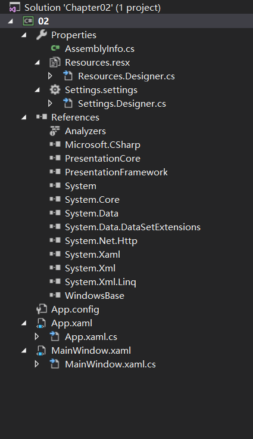
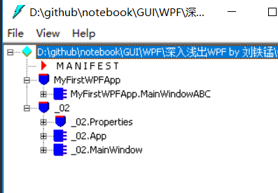

# 从零起步认识XAML

## 新建WPF项目

选择项目模板(Template)->WPF App


项目创建完毕


`F5`运行


查看Solution Explorer



分支介绍

- `Properties`
  - 程序用到的资源(图标,图片,静态的字符串)和配置信息
- `Reference`
  - 标记了当前这个项目需要引用那些其他的项目
- `App.xaml`
  - 程序的主体
    - Windows中,一个GUI进程需要有一个窗体作为主窗体
  - 声明了程序的进程,指明程序的主窗体
  - `App.xaml.cs`
    - `App.xaml`的后台代码
- `MainWindows.xaml`
  - 程序的主窗体

## 剖析最简单的XAML代码

```xaml
<Window x:Class="_02.MainWindow"
        xmlns="http://schemas.microsoft.com/winfx/2006/xaml/presentation"
        xmlns:x="http://schemas.microsoft.com/winfx/2006/xaml"
        xmlns:d="http://schemas.microsoft.com/expression/blend/2008"
        xmlns:mc="http://schemas.openxmlformats.org/markup-compatibility/2006"
        xmlns:local="clr-namespace:_02"
        mc:Ignorable="d"
        Title="MainWindow" Height="450" Width="800">
    <Grid>
        
    </Grid>
</Window>
```

XAML是由XML派生的语言

标签(`Tag`)

- 非空标签
  - `<Tag Attribute1=VAlue1 Attribute2=VAlue2> Content </Tag> `
- 空标签
  - `<Tag Attribute1=VAlue1 Attribute2=VAlue2/>`

区分`Attribute`与`Property`

- `Property`
  - 属于面向对象理论范畴. 面向对象中的类中用来表示事物状态的成员就是`Property`
  - `Property`是针对对象而言
- `Attribute`
  - 属于编程语言文法
  - 区分两个不同语法元素的特征

```xaml
<Window>
    <Grid>
        
    </Grid>
</Window>
```

- 一个`<Window>`标签内部包含这一个`<Grid>`标签
- 一个窗体对象内嵌套这一个`Grid`对象

XAML是一种声明式语言,当你见到一个标签,就意味着声明了一个对象,对象之间的层级关系要么是并列,要么是包含

```xaml
x:Class="_02.MainWindow"
        xmlns="http://schemas.microsoft.com/winfx/2006/xaml/presentation"
        xmlns:x="http://schemas.microsoft.com/winfx/2006/xaml"
        xmlns:d="http://schemas.microsoft.com/expression/blend/2008"
        xmlns:mc="http://schemas.openxmlformats.org/markup-compatibility/2006"
        xmlns:local="clr-namespace:_02"
        mc:Ignorable="d"
        Title="MainWindow" Height="450" Width="800">
```

这些是`<Window>`的`Attribute`

Title="MainWindow" Height="450" Width="800"`与`Window`对象的`Property`相对应

```xaml
xmlns="http://schemas.microsoft.com/winfx/2006/xaml/presentation"
xmlns:x="http://schemas.microsoft.com/winfx/2006/xaml"
xmlns:d="http://schemas.microsoft.com/expression/blend/2008"
xmlns:mc="http://schemas.openxmlformats.org/markup-compatibility/2006"
xmlns:local="clr-namespace:_02"
mc:Ignorable="d"
```

这些是声明的名称空间

```xaml
x:Class="_02.MainWindow"
```

来自于`x:`前缀所对应的名称空间


XML可以在XML文档的标签上使用`xmlns(XML-Namespace)`特征来定义名称空间. 

定义名称空间的好处: 当来源不同的类重名时,可以使用名称空间加以区分

语法如下

```xaml
xmlns[:可选的映射前缀] = "名称空间"
```

XAML引用外来程序集和其中的.NET名称空间


```xaml
xmlns="http://schemas.microsoft.com/winfx/2006/xaml/presentation"
xmlns:x="http://schemas.microsoft.com/winfx/2006/xaml"
xmlns:d="http://schemas.microsoft.com/expression/blend/2008"
xmlns:mc="http://schemas.openxmlformats.org/markup-compatibility/2006"
```

这几个网址是XAML解析器的一个硬性解码,只要看到这些固定的字符串,就会把一些列程序集合程序集包含的.NET名称空间引用进来

默认引用的名称空间`http://schemas.microsoft.com/winfx/2006/xaml/presentation`对应

```csharp
System.Windows;
System.Windows.Automation;
System.Windows.Control;
System.Windows.Control.Primitives;
System.Windows.Data;
System.Windows.Document;
System.Windows.Forms.Intergration;
System.Windows.Ink;
System.Windows.Input;
System.Windows.Media;
System.Windows.Media.Animation;
System.Windows.Media.Effects;
System.Windows.Media.Imaging;
System.Windows.Media.Media3D;
System.Windows.Media.TextFormmatting;
System.Windows.Navigation;
System.Windows.Shapes;
```

> 深入浅出WPF一书写于2010年WPF4.0 现在2018年 WPF已经随着.NET Framework更新到4.7.2

所以在XAML代码可以直接使用这些CLR名称空间的类型,而不用加前缀,否则当使用这些名称空间的类型时需要加前缀`x`

```xaml
xmlns="http://schemas.microsoft.com/winfx/2006/xaml/presentation"
xmlns:x="http://schemas.microsoft.com/winfx/2006/xaml"
```
- 第一个名称空间对应的是绘制UI相关的程序集,是表示层面上的东西
- 第二个名称空间对应XAML语言解析处理相关的程序集,是语言层面上的东西

```xaml
x:Class="_02.MainWindow"
```

- `x`:说明这个Attribute来自于`x`映射的名称空间

做一个测试

**测试一**

- 删除`MainWindow.xaml`的`x:Class="_02.MainWindow"`和`MainWindow.xaml.cs`的`InitializeComponent()`

```xaml
<Window 
        xmlns="http://schemas.microsoft.com/winfx/2006/xaml/presentation"
        xmlns:x="http://schemas.microsoft.com/winfx/2006/xaml"
        xmlns:d="http://schemas.microsoft.com/expression/blend/2008"
        xmlns:mc="http://schemas.openxmlformats.org/markup-compatibility/2006"
        xmlns:local="clr-namespace:_02"
        mc:Ignorable="d"
        Title="MainWindow" Height="450" Width="800">
    <Grid>
        
    </Grid>
</Window>

```

```csharp
namespace _02
{
    /// <summary>
    /// Interaction logic for MainWindow.xaml
    /// </summary>
    public partial class MainWindow : Window
    {
        public MainWindow()
        {
            //InitializeComponent();
        }
    }
}
```

- 运行`F5`

- 程序可以正常运行

- 查看`App.xaml`
  - `StartupUri="MainWindow.xaml"`
    - 这是告诉编译器把由`MainWindow.xaml`解析后生成的窗体作为程序启动时的主窗体, 即主要`MainWindow.xaml`文件能够被正确解析成一个窗体,程序就可以正常运行

```xaml
<Application x:Class="_02.App"
             xmlns="http://schemas.microsoft.com/winfx/2006/xaml/presentation"
             xmlns:x="http://schemas.microsoft.com/winfx/2006/xaml"
             xmlns:local="clr-namespace:_02"
             StartupUri="MainWindow.xaml">
    <Application.Resources>
         
    </Application.Resources>
</Application>
```

**测试二**

- 恢复`MainWindow.xaml`的`x:Class="_02.MainWindow"`(不恢复`MainWindow.xaml.cs`的`InitializeComponent()`),将其改为`x:Class="MyFirstWPFApp.MainWindowABC"`

- 运行`F5`
- 程序可以正常运行
- 使用`IL Disassembler(Ildasm.exe)`打开项目的编译结果,可以看到一个名为`MyFirstWPFApp.MainWindowABC`的类



> 关于`IL Disassembler(Ildasm.exe)`的使用问题,Tools -> IIDasm.如果发现提示找不到该命令行工具,则Tools -> External tools 配置Ildasm.exe所在路径,例如`C:\Program Files (x86)\Microsoft SDKs\Windows\v10.0A\bin`根据你选择.NET Framework版本选择

最后我们得到结论

- `x:Class`这个Attribute的作用是当XAML解析器将包含它的标签解析成C#类后的这个类的类名

使用C#完成XAML同样的设计:一个窗体`<Window>`内嵌套`<Grid>`

```c#
using System.Windows;
using System.Windows.Controls

class windowsABC : Windows{
	private Grid grid;
	
    public WindowABC(){
    	grid = new Grid();
    	this.Content = grid;
    }
}
```

```csharp
namespace _02
{
    /// <summary>
    /// Interaction logic for MainWindow.xaml
    /// </summary>
    public partial class MainWindow : Window
    {
        public MainWindow()
        {
            //InitializeComponent();
        }
    }
}
```

- `MainWindow`使用了`partial`关键字来声明类,可以吧一个类分拆在多处定义,只要各部分代码不冲突即可

- XAML解析器生成的类也使用了`partial`关键字来声明类
- 这样,由XAML解析成的类和C#文件里定义的部分就合二为一

由于`partial`这种机制将逻辑处理留在`.cs`文件中,用C#语言来实现,而那些与声明及布局UI元素相关的代码分离出去,实现UI与逻辑分离.并且,用于绘制UI的代码也不必再使用C#语言,使用XAML和XAML编辑工具即可