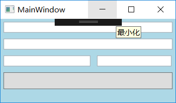
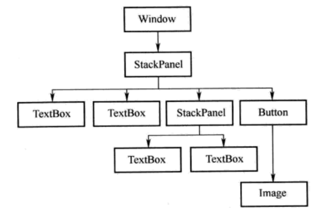
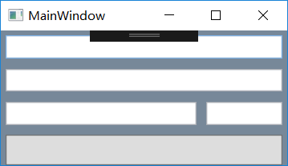
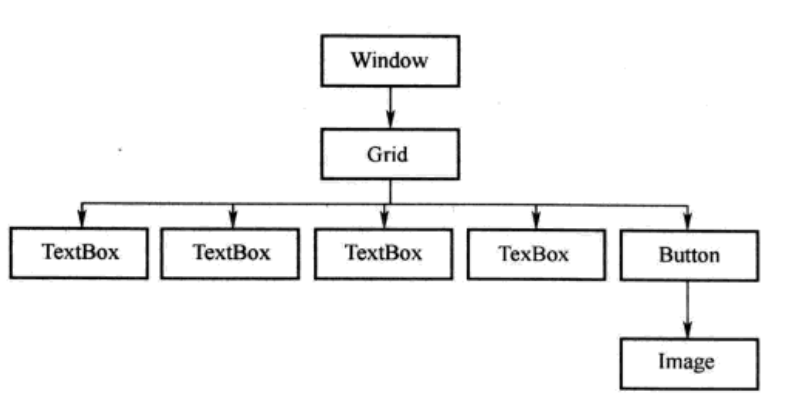
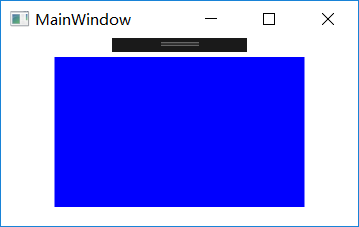
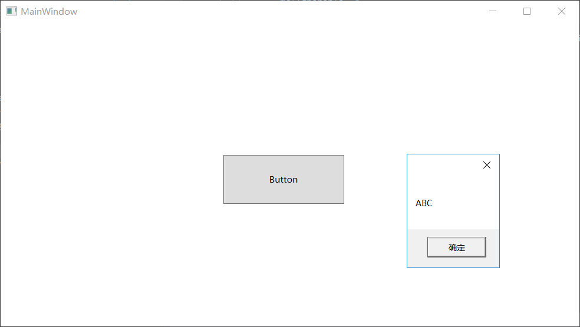
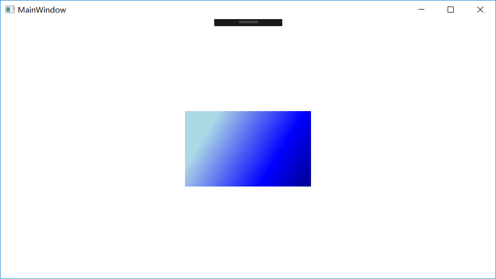
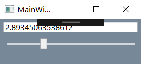
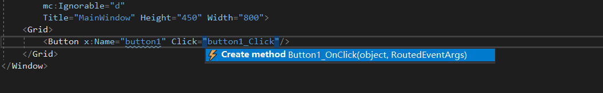
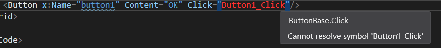

# 系统学习XAMl语法

## 3.1 XAML文档的树形结构

XAML与Windows Form不同,XAML将UI用树形结构来描述


```xaml
<Window x:Class="_01.MainWindow"
        xmlns="http://schemas.microsoft.com/winfx/2006/xaml/presentation"
        xmlns:x="http://schemas.microsoft.com/winfx/2006/xaml"
        xmlns:d="http://schemas.microsoft.com/expression/blend/2008"
        xmlns:mc="http://schemas.openxmlformats.org/markup-compatibility/2006"
        xmlns:local="clr-namespace:_01"
        mc:Ignorable="d"
        Title="MainWindow" Height="173" Width="296">
    <StackPanel Background="LightBlue">
        <TextBox x:Name="textBox1" Margin="5" />
        <TextBox  x:Name="textBox2" Margin="5" />
        <StackPanel Orientation="Horizontal">
            <TextBox  x:Name="textBox3" Width="140" Margin="5" />
            <TextBox  x:Name="textBox4" Width="120" Margin="5" />
        </StackPanel>

        <Button x:Name="button1" Margin="5">
            <Image Source="" Width="23" Height="23"/>
        </Button>
    </StackPanel>
</Window>
```

去除Attribute,以便于查看树形框架结构

```xaml
<Window>
    <StackPanel>
        <TextBox/>
        <TextBox/>
        <StackPanel>
            <TextBox/>
            <TextBox/>
        </StackPanel>
        <Button>
            <Image/>
        </Button>
    </StackPanel>
</Window>
```


另一段XAML实现相同的UI


```xaml
<Window x:Class="_02.MainWindow"
        xmlns="http://schemas.microsoft.com/winfx/2006/xaml/presentation"
        xmlns:x="http://schemas.microsoft.com/winfx/2006/xaml"
        xmlns:d="http://schemas.microsoft.com/expression/blend/2008"
        xmlns:mc="http://schemas.openxmlformats.org/markup-compatibility/2006"
        xmlns:local="clr-namespace:_02"
        mc:Ignorable="d"
        Title="MainWindow" Height="172" Width="300">

    <Grid Background="LightSlateGray">
        <Grid.ColumnDefinitions>
            <ColumnDefinition Width="7*" />
            <ColumnDefinition Width="3*" />
        </Grid.ColumnDefinitions>
        <Grid.RowDefinitions>
            <RowDefinition Height="33" />
            <RowDefinition Height="33" />
            <RowDefinition Height="33" />
            <RowDefinition Height="40" />
        </Grid.RowDefinitions>
        <TextBox x:Name="textBox1" Grid.Column="0" Grid.Row="0" Grid.ColumnSpan="2" Margin="5"/>
        <TextBox x:Name="textBox2" Grid.Column="0" Grid.Row="1" Grid.ColumnSpan="2" Margin="5"/>
        <TextBox x:Name="textBox3" Grid.Column="0" Grid.Row="2" Grid.ColumnSpan="1" Margin="5"/>
        <TextBox x:Name="textBox4" Grid.Column="1" Grid.Row="2" Grid.ColumnSpan="1" Margin="5"/>

        <Button x:Name="button1" Grid.Column="0" Grid.Row="3" Grid.ColumnSpan="2" Margin="5">
            <Image Source="" Width="23" Height="23"/>
        </Button>
    </Grid>
</Window>
```

```xaml
<Window>
    <Grid>
        <Grid.ColumnDefinitions>
            <ColumnDefinition/>
            <ColumnDefinition/>
        </Grid.ColumnDefinitions>
        <Grid.RowDefinitions>
            <RowDefinition/>
            <RowDefinition/>
            <RowDefinition/>
            <RowDefinition/>
        </Grid.RowDefinitions>
        <TextBox/>
        <TextBox/>
        <TextBox/>
        <TextBox/>
        <Button>
            <Image/>
        </Button>
    </Grid>
</Window>
```

树形结构框架



以Window为根结点,一层层向下包含

第一种布局:控件在纵向上只能做一个简单排列

第二种布局:用户在改变窗体尺寸后控件能够成比例缩放自己的尺寸

## 3.2 XAML中为对象属性赋值的语法

XAML是一种声明性语言

XAML编译器会为每一个标签创建一个与之对应的对象. 对象创建出来之后对它的属性进行必要的初始化之后才有使用意义

XAML中为对象属性赋值

- 使用字符串进行简单赋值
- 使用属相元素进行复杂赋值

以`<Rectangle>`标签的`Fill`为例来介绍这两种方法

### 使用标签的Attribute为对象属性赋值

- `<Rectangle>`标签的`Fill`与[`Rectangle`](https://docs.microsoft.com/en-us/uwp/api/Windows.UI.Xaml.Shapes.Rectangle)的类对象的[`Fill`](https://docs.microsoft.com/en-us/dotnet/api/system.windows.shapes.shape.fill?view=netframework-4.7.2#System_Windows_Shapes_Shape_Fill)属性对应
- `Fill`是[`Brush`](https://docs.microsoft.com/en-us/dotnet/api/system.windows.media.brush?view=netframework-4.7.2)类型
  - `public abstract class Brush`是一个抽象类,所以派生自`Brush`的类都可以为`Fill`属性赋值
- `Brush`的派生类
  - [SolidColorBrush](https://docs.microsoft.com/en-us/dotnet/api/system.windows.media.solidcolorbrush?view=netframework-4.7.2): 
    - 单色笔刷 Paints an area with a solid [Color](https://docs.microsoft.com/en-us/dotnet/api/system.windows.media.color?view=netframework-4.7.2).
  - [LinearGradientBrush](https://docs.microsoft.com/en-us/dotnet/api/system.windows.media.lineargradientbrush?view=netframework-4.7.2): 
    - 线性渐变笔刷 Paints an area with a linear gradient.
  - [RadialGradientBrush](https://docs.microsoft.com/en-us/dotnet/api/system.windows.media.radialgradientbrush?view=netframework-4.7.2): 
    - 径向渐变笔刷 Paints an area with a radial gradient.
  - [ImageBrush](https://docs.microsoft.com/en-us/dotnet/api/system.windows.media.imagebrush?view=netframework-4.7.2): 
    - 位图笔刷 Paints an area with an image (represented by an [ImageSource](https://docs.microsoft.com/en-us/dotnet/api/system.windows.media.imagesource?view=netframework-4.7.2) object).
  - [DrawingBrush](https://docs.microsoft.com/en-us/dotnet/api/system.windows.media.drawingbrush?view=netframework-4.7.2): 
    - 矢量图笔刷 Paints an area with a [Drawing](https://docs.microsoft.com/en-us/dotnet/api/system.windows.media.drawing?view=netframework-4.7.2). The drawing may include vector and bitmap objects.
  - [VisualBrush](https://docs.microsoft.com/en-us/dotnet/api/system.windows.media.visualbrush?view=netframework-4.7.2): 
    - 可视元素笔刷 Paints an area with a [Visual](https://docs.microsoft.com/en-us/dotnet/api/system.windows.media.visual?view=netframework-4.7.2) object. A [VisualBrush](https://docs.microsoft.com/en-us/dotnet/api/system.windows.media.visualbrush?view=netframework-4.7.2) enables you to duplicate content from one portion of your application into another area; it's very useful for creating reflection effects and magnifying portions of the screen.


```xaml
<Window x:Class="_03.MainWindow"
        xmlns="http://schemas.microsoft.com/winfx/2006/xaml/presentation"
        xmlns:x="http://schemas.microsoft.com/winfx/2006/xaml"
        xmlns:d="http://schemas.microsoft.com/expression/blend/2008"
        xmlns:mc="http://schemas.openxmlformats.org/markup-compatibility/2006"
        xmlns:local="clr-namespace:_03"
        mc:Ignorable="d"
        Title="MainWindow" Height="188" Width="300">

    <Grid VerticalAlignment="Center" HorizontalAlignment="Center">
        <Rectangle x:Name="rectangle" Width="200" Height="120" Fill="Blue"/>
    </Grid>
</Window>
```

```c#
SolidColorBrush sBrush = new SolidColorBrush();
sBrush.Color = Color.Blue;
this.rectangle.Fill = sBrush;
```

> 目前没有找到将XAML翻译为C#的工具

当使用`Attribute=Value`这种XAML语法赋值时,由于XAML的语法限制,Value只可能是一个字符串值,这导致了两个问题

- 第一个问题
  - 如果一个类能使用XAML语言进行声明,并允许它的Property与XAML标签的Attribute相互映射,那就需要为这些Property准备适当的转换机制
- 解决方案
  - 使用`TypeConverter`类的派生类,在派生类里重写`TypeConverter`的一些方法
- 第二个问题
  - 由于Value是个字符串,所以其格式复杂程度有限,尽管可以在转换机制里包含一定的按格式解析字符串的功能以便转换成较复杂的目标对象,但是这可能过于复杂(可能需要手写一个格式复杂的字符串以满足赋值要求)
- 解决方案
  - 使用属性元素(Property Element)

### 使用`TypeConverter`类将XAML标签的Attribute与对象的Property进行映射

```c#
public class Human{
    public string Name {get; set;}
    public Human Child {get; set;}
}
```

`Human`的两个属性

- `string`类型的`Name`
- `Human`类型的`Child`

期待在XAML中通过为Attribute赋值而给对象的Property赋值

```xaml
<Window.Resources>
	<local:Human x:Key="human" Child="ABC">
</Window.Resources>    
```
```xaml
<Window x:Class="_04.MainWindow"
        xmlns="http://schemas.microsoft.com/winfx/2006/xaml/presentation"
        xmlns:x="http://schemas.microsoft.com/winfx/2006/xaml"
        xmlns:d="http://schemas.microsoft.com/expression/blend/2008"
        xmlns:mc="http://schemas.openxmlformats.org/markup-compatibility/2006"
        xmlns:local="clr-namespace:_04"
        mc:Ignorable="d"
        Title="MainWindow" Height="450" Width="800">
    <Window.Resources>
        <local:Human x:Key="human" Child="ABC"></local:Human>
    </Window.Resources>
    <Grid>
        <Button Content="Button" HorizontalAlignment="Left" Margin="302,180,0,0" VerticalAlignment="Top" Width="164" Height="66" RenderTransformOrigin="0.524,1.101" Click="Button_Click"/>
    </Grid>
</Window>
```
```c#
using System;
using System.Collections.Generic;
using System.ComponentModel;
using System.Globalization;
using System.Linq;
using System.Text;
using System.Threading.Tasks;
using System.Windows;
using System.Windows.Controls;
using System.Windows.Data;
using System.Windows.Documents;
using System.Windows.Input;
using System.Windows.Media;
using System.Windows.Media.Imaging;
using System.Windows.Navigation;
using System.Windows.Shapes;

namespace _04
{
    /// <summary>
    /// Interaction logic for MainWindow.xaml
    /// </summary>
    public partial class MainWindow : Window
    {
        public MainWindow()
        {
            InitializeComponent();
        }

        private void Button_Click(object sender, RoutedEventArgs e)
        {
            Human h = (Human) this.FindResource("human");
            MessageBox.Show(h.Child.Name);
        }
    }

    public class StringToHumanTypeConverter : TypeConverter
    {
        public override object ConvertFrom(ITypeDescriptorContext context, CultureInfo culture, object value)
        {
            if (value is string)
            {
                Human h = new Human();
                h.Name = value as string;
                return h;
            }
            return base.ConvertFrom(context, culture, value);
        }
    }

    // [TypeConverterAttribute(typeof(StringToHumanTypeConverter))]
    [TypeConverter(typeof(StringToHumanTypeConverter))]
    public class Human
    {
        public string Name { get; set; }
        public Human Child { get; set; }
    }
}
```



### 属性元素

XAML中,非空标签具有自己的内容(Content)

标签的内容: 

- 夹在起始标签和结束标签之间的一些子集标签,每个子集标签都是父级标签内容的一个元素
- 属性元素指的是某个标签一个元素对应这个标签的一个属性,即以元素的形式来表达一个实例的属性

```xaml
<ClassName>
    <ClassName.PropertyName>
    	<!--以对象形式为属性赋值-->
    </ClassName.PropertyName>
</ClassName>
```

在这个标签的内部可以使用对象(不在局限于简单的字符串)进行赋值

```xaml
<Grid VerticalAlignment="Center" HorizontalAlignment="Center">
    <Rectangle x:Name="rectangle" Width="200" Height="120" Fill="Blue"/>
</Grid>
```
将上面的例子使用属性标签式语法改写

```xaml
<Grid VerticalAlignment="Center" HorizontalAlignment="Center">
    <Rectangle x:Name="rectangle" Width="200" Height="120">
        <Rectangle.Fill>
            <SolidColorBrush Color="Blue"/>
        </Rectangle.Fill>
    </Rectangle>
</Grid>
```

如果是简单赋值,则属性元素语法显得冗长,但是对于复杂对象时,就能显示出语法的优势  

例如:使用线性变换画刷来填充矩阵

```xaml
<Window x:Class="_06.MainWindow"
        xmlns="http://schemas.microsoft.com/winfx/2006/xaml/presentation"
        xmlns:x="http://schemas.microsoft.com/winfx/2006/xaml"
        xmlns:d="http://schemas.microsoft.com/expression/blend/2008"
        xmlns:mc="http://schemas.openxmlformats.org/markup-compatibility/2006"
        xmlns:local="clr-namespace:_06"
        mc:Ignorable="d"
        Title="MainWindow" Height="450" Width="800">
    <Grid VerticalAlignment="Center" HorizontalAlignment="Center">
        <Rectangle x:Name="rectangle" Width="200" Height="120">
            <Rectangle.Fill>
                <LinearGradientBrush>
                    <LinearGradientBrush.StartPoint>
                        <Point X="0" Y="0"/>
                    </LinearGradientBrush.StartPoint>
                    <LinearGradientBrush.EndPoint>
                        <Point X="1" Y="1"/>
                    </LinearGradientBrush.EndPoint>
                    <LinearGradientBrush.GradientStops>
                        <GradientStopCollection>
                            <GradientStop Offset="0.2" Color="LightBlue"/>
                            <GradientStop Offset="0.7" Color="Blue"/>
                            <GradientStop Offset="1.0" Color="DarkBlue"/>
                        </GradientStopCollection>
                    </LinearGradientBrush.GradientStops>
                </LinearGradientBrush>
            </Rectangle.Fill>
        </Rectangle>
    </Grid>
</Window>
```

`LinearGradientBrush`的`GradientStops`属性是一个`GradientStop`对象的集合(`GradientStopCollection`),即一系列的矢量渐变填充点.在这些填充点之间,系统会自动进行差值运算,计算出过渡色彩.  

填充矢量的方向是`StartPoint`和`EndPoint`这两个属性(类型为`Point`)的连线方向

- 矩形的左上角`(0,0)`,右下角`(1,1)`



优化代码可读性

```xaml
<Window x:Class="_07.MainWindow"
        xmlns="http://schemas.microsoft.com/winfx/2006/xaml/presentation"
        xmlns:x="http://schemas.microsoft.com/winfx/2006/xaml"
        xmlns:d="http://schemas.microsoft.com/expression/blend/2008"
        xmlns:mc="http://schemas.openxmlformats.org/markup-compatibility/2006"
        xmlns:local="clr-namespace:_07"
        mc:Ignorable="d"
        Title="MainWindow" Height="450" Width="800">
    <Grid VerticalAlignment="Center" HorizontalAlignment="Center">
        <Rectangle x:Name="rectangle" Width="200" Height="120">
            <Rectangle.Fill>
                <LinearGradientBrush>
                    <LinearGradientBrush.GradientStops>
                        <GradientStop Offset="0.2" Color="LightBlue"/>
                        <GradientStop Offset="0.7" Color="Blue"/>
                        <GradientStop Offset="1.0" Color="DarkBlue"/>
                    </LinearGradientBrush.GradientStops>
                </LinearGradientBrush>
            </Rectangle.Fill>
        </Rectangle>
    </Grid>
</Window>
```

> 优化技巧
>
> - 能使用`Attribute=Value`形式赋值的就不使用属性元素
> - 充分利用默认值,去除冗余
>   - `StartPoint="0,0"`和`EndPoint="1,1"`是默认值,可以省略
> - 充分利用XAML的简写方式
>   - `LinearGradientBrush.GradientStops`简写为`GradientStopCollection`

> Blend for Visual  Studio 的使用教程见微软官方

### 标记扩展

标记扩展

- 是一种特殊的`Attribute=Value`语法
- 特殊的地方在于`Value`字符串是由一对花括号及其括起来的内容组成的,XAML编译器会对这样的内容作出解析,生成相应的对象

XAML中为对象属性赋值的语法,

- 大多数赋值都是为属性生成一个新对象
- 有时候需要把同一个对象赋值给两个对象的属性
- 还有时候需要被对象的属性赋一个null值
- 甚至允许将一个对象值依赖在其他对象的某个属性上

当需要为对象的属性进行这些特殊类型赋值时就需要使用标记扩展了


下面使用`Binding`类的实例将`TextBox`的`Text`属性依赖在`Slider`上的`Value`上,这样,当`Slider`的滑块滑动时`TextBox`就会显示`Slider`当前的值



```XAML
<Window x:Class="_08.MainWindow"
        xmlns="http://schemas.microsoft.com/winfx/2006/xaml/presentation"
        xmlns:x="http://schemas.microsoft.com/winfx/2006/xaml"
        xmlns:d="http://schemas.microsoft.com/expression/blend/2008"
        xmlns:mc="http://schemas.openxmlformats.org/markup-compatibility/2006"
        xmlns:local="clr-namespace:_08"
        mc:Ignorable="d"
        Title="MainWindow" Height="110" Width="240">
    <StackPanel Background="LightSlateGray">
        <TextBox Text="{Binding ElementName=slider1, Path=Value, Mode=OneWay}" Margin="5"/>
        <Slider x:Name="slider1" Margin="5"/>
    </StackPanel>
</Window>
```

标记扩展:`Text="{Binding ElementName=slider1, Path=Value, Mode=OneWay}" `

- 当编译器看到这句代码时就会把花括号里的内容解析成相应的对象
- 对象的数据类型名就是紧邻左花括号的字符串
- 对象的属性由一串以逗号连接的子字符串负责初始化
  - 这个语法类似于C#3.0的对象初始化用法
  - `Binding binding = new Binding(){Source = slider1,Mode = BingdingMode.OneWay};`

标记扩展是对是对属性的赋值,所以完全可以使用属性标签的形式来替换标记扩展,只是失去了简洁性

```xaml
<Window x:Class="_09.MainWindow"
        xmlns="http://schemas.microsoft.com/winfx/2006/xaml/presentation"
        xmlns:x="http://schemas.microsoft.com/winfx/2006/xaml"
        xmlns:d="http://schemas.microsoft.com/expression/blend/2008"
        xmlns:mc="http://schemas.openxmlformats.org/markup-compatibility/2006"
        xmlns:local="clr-namespace:_09"
        mc:Ignorable="d"
        Title="MainWindow" Height="110" Width="240">
<StackPanel Background="LightSlateGray">
    <TextBox Margin="5">
        <TextBox.Text>
                <Binding ElementName="slider1" Path="Value" Mode="OneWay" />
        </TextBox.Text>
    </TextBox>
    <Slider x:Name="slider1" Margin="5"/>
</StackPanel>
</Window>
```

只有[`MarkupExtension`](https://docs.microsoft.com/en-us/dotnet/api/system.windows.markup.markupextension?redirectedfrom=MSDN&view=netframework-4.8)类的派生类才能使用标记扩展语法来创建对象

- [System.Activities.Presentation.CachedResourceDictionaryExtension](https://docs.microsoft.com/en-us/dotnet/api/system.activities.presentation.cachedresourcedictionaryextension?view=netframework-4.7.2)
- [System.Activities.XamlIntegration.DynamicUpdateMapExtension](https://docs.microsoft.com/en-us/dotnet/api/system.activities.xamlintegration.dynamicupdatemapextension?view=netframework-4.7.2)
- [System.Activities.XamlIntegration.PropertyReferenceExtension](https://docs.microsoft.com/en-us/dotnet/api/system.activities.xamlintegration.propertyreferenceextension-1?view=netframework-4.7.2)
- [System.ServiceModel.EndpointIdentityExtension](https://docs.microsoft.com/en-us/dotnet/api/system.servicemodel.endpointidentityextension?view=netframework-4.7.2)
- [System.ServiceModel.XamlIntegration.SpnEndpointIdentityExtension](https://docs.microsoft.com/en-us/dotnet/api/system.servicemodel.xamlintegration.spnendpointidentityextension?view=netframework-4.7.2)
- [System.ServiceModel.XamlIntegration.UpnEndpointIdentityExtension](https://docs.microsoft.com/en-us/dotnet/api/system.servicemodel.xamlintegration.upnendpointidentityextension?view=netframework-4.7.2)
- [System.ServiceModel.XamlIntegration.XPathMessageContextMarkupExtension](https://docs.microsoft.com/en-us/dotnet/api/system.servicemodel.xamlintegration.xpathmessagecontextmarkupextension?view=netframework-4.7.2)
- [System.Windows.ColorConvertedBitmapExtension](https://docs.microsoft.com/en-us/dotnet/api/system.windows.colorconvertedbitmapextension?view=netframework-4.7.2)
- [System.Windows.DynamicResourceExtension](https://docs.microsoft.com/en-us/dotnet/api/system.windows.dynamicresourceextension?view=netframework-4.7.2)
- [System.Windows.ResourceKey](https://docs.microsoft.com/en-us/dotnet/api/system.windows.resourcekey?view=netframework-4.7.2)
- [System.Windows.StaticResourceExtension](https://docs.microsoft.com/en-us/dotnet/api/system.windows.staticresourceextension?view=netframework-4.7.2)
- [System.Windows.TemplateBindingExtension](https://docs.microsoft.com/en-us/dotnet/api/system.windows.templatebindingextension?view=netframework-4.7.2)
- [System.Windows.ThemeDictionaryExtension](https://docs.microsoft.com/en-us/dotnet/api/system.windows.themedictionaryextension?view=netframework-4.7.2)
- [System.Windows.Data.BindingBase](https://docs.microsoft.com/en-us/dotnet/api/system.windows.data.bindingbase?view=netframework-4.7.2)
- [System.Windows.Data.RelativeSource](https://docs.microsoft.com/en-us/dotnet/api/system.windows.data.relativesource?view=netframework-4.7.2)
- [System.Windows.Markup.ArrayExtension](https://docs.microsoft.com/en-us/dotnet/api/system.windows.markup.arrayextension?view=netframework-4.7.2)
- [System.Windows.Markup.NullExtension](https://docs.microsoft.com/en-us/dotnet/api/system.windows.markup.nullextension?view=netframework-4.7.2)
- [System.Windows.Markup.Reference](https://docs.microsoft.com/en-us/dotnet/api/system.windows.markup.reference?view=netframework-4.7.2)
- [System.Windows.Markup.StaticExtension](https://docs.microsoft.com/en-us/dotnet/api/system.windows.markup.staticextension?view=netframework-4.7.2)
- [System.Windows.Markup.TypeExtension](https://docs.microsoft.com/en-us/dotnet/api/system.windows.markup.typeextension?view=netframework-4.7.2)

> 注意
>
> - 标记扩展是可以嵌套的
>   - `Text="Binding Source = {StaticResource myDataSource}, Path={PersonName}"`
> - 标记扩展的简写
>   - 固定位置参数(`Positional Parameter`)
>     - `{Binding Value, ...}`与`{Binding Path=Value, ...}`等价
>     - 固定位置参数实际上就是标记扩展类构造器的参数,其位置由构造器参数列表决定
>   - 具名参数(`Named Parameters`)
>     - `{StaticResource myString, ...}`与`{StaticResource ResourceKey=myString, ...}`等价
> - 标记扩展类的类名大部分以单词`Extension`为后缀,在XAML使用它们的时候`Extension`后缀可以省略不写
>   - `Text="{x:Static,...}"`与`Text="{x:StaticExtension,...}"`等价

## 3.3 事件处理器与代码后置

一个XAML标签对应着一个对象时,这个标签的一部分Attribute会对应着这个对象的Property.还有一部分Attribute对应着对象的事件(`Event`).

`<Button>`标签有一个名为`Click`的`Attribute`,它对应的就是`Button`类的`Click`事件

> **`.NET`事件处理机制:**
>
> 为对象的某个事件指定一个能与该事件匹配的成员函数,当事件发生时,`.NET`运行时会去调用这个函数(被称为事件处理器),即表示这个事件的响应和处理.

WPF支持在XAML里为对象的事件指定事件处理器,方法是使用事件处理器的函数名为对应对象事件的Attribute进行赋值

```xaml
<ClassName EventName="EventHandlerName"/>
```

当为一个XAML标签的事件性Attribute进行赋值是,XAML编辑器会自动为我们生成相应的事件处理器



```xaml
<Window x:Class="_10.MainWindow"
        xmlns="http://schemas.microsoft.com/winfx/2006/xaml/presentation"
        xmlns:x="http://schemas.microsoft.com/winfx/2006/xaml"
        xmlns:d="http://schemas.microsoft.com/expression/blend/2008"
        xmlns:mc="http://schemas.openxmlformats.org/markup-compatibility/2006"
        xmlns:local="clr-namespace:_10"
        mc:Ignorable="d"
        Title="MainWindow" Height="450" Width="800">
    <Grid>
        <Button x:Name="button1" Click="button1_Click"/>
    </Grid>
</Window>
```

```c#
using System;
using System.Collections.Generic;
using System.Linq;
using System.Text;
using System.Threading.Tasks;
using System.Windows;
using System.Windows.Controls;
using System.Windows.Data;
using System.Windows.Documents;
using System.Windows.Input;
using System.Windows.Media;
using System.Windows.Media.Imaging;
using System.Windows.Navigation;
using System.Windows.Shapes;

namespace _10
{
    /// <summary>
    /// Interaction logic for MainWindow.xaml
    /// </summary>
    public partial class MainWindow : Window
    {
        public MainWindow()
        {
            InitializeComponent();
        }
		
		// 根据XAML自动生成的事件处理器
        private void Button1_OnClick(object sender, RoutedEventArgs e)
        {
            throw new NotImplementedException();
        }
    }
}
```
事件处理器的函数声明与用于声明`Button.Click`事件的委托保持类型和参数上的一致,它的名字已经被拷贝到XAML代码中
```xaml
<Button x:Name="button1" Click="button1_Click"/>
```
等价于
```c#
Button button1 = new Button();
button.Click += new RoutedEventHandler(button1_Click);
```

**代码后置**

- 前提:
  - C#支持partial类, XAML标签可以使用x:Class特征指定将由XAML代码解析生成的类与哪个类合并
- 把用于实现程序逻辑的C#代码放在一个文件里
- 把用于描述UI的XAML代码放在另一个文件里
- 将事件性Attribute充当XAML与C#之间沟通的纽带

### `x:Code`

`x:Code`可以将后置的`C#`代码放置在XAML文件中

```xaml
<Window x:Class="_11.MainWindow"
        xmlns="http://schemas.microsoft.com/winfx/2006/xaml/presentation"
        xmlns:x="http://schemas.microsoft.com/winfx/2006/xaml"
        xmlns:d="http://schemas.microsoft.com/expression/blend/2008"
        xmlns:mc="http://schemas.openxmlformats.org/markup-compatibility/2006"
        xmlns:local="clr-namespace:_11"
        mc:Ignorable="d"
        Title="MainWindow" Height="450" Width="800">
    <Grid>
        <Button x:Name="button1" Content="OK" Click="Button1_Click"/>
    </Grid>

    <x:Code>
        <![CDATA[
            private void Button1_Click(object sender, RoutedEventArgs e)
            {
                MessageBox.Show("Bye!Code-Behind!");
            }
        ]]>
    </x:Code>
</Window>
```

> IDE提示错误
> 

## 3.4 导入程序集合引用其中的名称空间

- 一个程序的架构设计会分为若干个相对独立的模块来编写,每个模块可以独立编译,进行版本升级.模块与模块之间有时会存在一些依赖关系,即有些模块需要借用其他模块中的功能.
- `.NET`的模块称为程序集(`Assembly`).使用VS创建的是解决方案(`Solution`),一个解决方案就是一个完整的程序.解决方案中会包含若干个项目(`Project`),每个项目是可以独立编译的,它的编译结果就是一个程序集.   
- 常见的程序集是以`.exe`为扩展名的可执行程序或者以`.dll`为扩展名的动态链接库,大多数情况下,引用的程序集是动态链接库.
- `.NET`编程接口(`Application Programming Interface`, `API`)以类和类级别的单元为主(`Win32API`)是以函数为主,所以我们又常把引用程序集说成是引用类库
- 类库中的类一般都会安置在合适的名称空间中,名称空间的作用是避免同名类的冲突
  - 例如: 一个程序引用类`LibA.dll`和`LibB.dll`两个类库,这两个类库都有一个名叫`Converter`的类,如果没有名称空间类限定的话,编译器将分不清程序员打算使用哪个类

> 引用类库的步骤
>
> - 编写类库项目并编译得到`.dll`文件或者获得别人编译的`.dll`文件
> - 将类库项目或者`.dll`文件引用进自己的项目
> - 在C#和XAML中引用类库中的名称空间

**在XAML里引用类库汇总的名称空间和类**

把类库引用到项目中是引用其中名称空间的物理基础,一旦将一个类引用进程序,就可以引用其中的名称空间.  

假设引用一个类库程序名为`MyLibrary.dll`,其中包含`Common`和`Controls`两个名称空间,而且已经把这个程序引用进WPF项目

```xaml
xmlns:映射名="clr-namespace:类库中名称空间的名字;assembly=类库文件名"
```

```xaml
xmlns:common="clr-namespace:Common;assembly=MyLibrary"
xmlns:common="clr-namespace:Controls;assembly=MyLibrary"
```

XAML引用名称空间的语法

- `xmlns`是用于XAML中声明名称空间的`Attribute,它从XML语言继承而来,是XMLNamespace`的缩写
- 冒号后的映射名是可选的,但由于可以不加映射名的默认控件已经被WPF的主要名称空间占用,所以所引用的名称空间都需要加上这个映射名.
  - 映射名,团队内部要统一命名,建议使用类库中名称空间的原名或缩写
- 引号中的字符串值确定了要引用的哪个类库以及类库中的哪个名称空间.XAML编辑器可以自动填充

一旦将类库中的名称空间引用XAML文档,我们就可以使用这些名称空间里的类

```xaml
<映射名:类名>...</映射名:类名>
```

```xaml
<common:MessagePanel x:Name="window1"/>
<control:LedButton x:Name="button1"/>
```

XAML中引用名称空间的语法与C#不太一样.XAML需要为被引用的名称空间添加以映射名,用这个映射名来代表被引用的名称空间.

C#也可以这样引用名称空间

```C#
using Cmn=Common;
using Ctl=Controls;
```


## 3.5 XAML的注释

```xaml
<!--需要注释掉的内容-->
```

