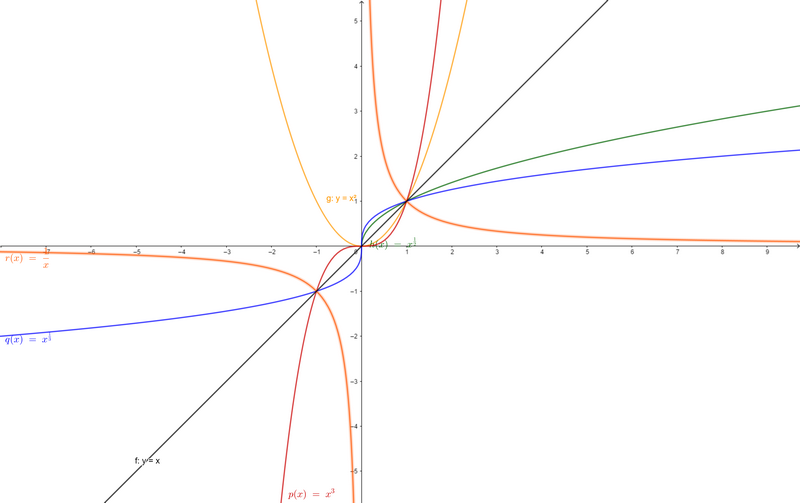

# 第01讲 初等数学知识复习

## 1 函数的概念
当一件事情的变化,会引起另一件事情的变化时,便称这两件事情构成了一个函数关系,两件事情之间如何相互影响,就是一个对应法则     

### 1.1 函数的概念
设$x$与$y$是两个变量,$D$是一个给定的数集,若对于每个值$x \in D$,按照一定的法则有一个确定的值y与之对应,则称$y$是$x$的函数,记为$y = f(x)$  
- $x$:自变量
- $y$:因变量
- $D$:定义域  
    - 定义域一般由实际背景的中的变量或者函数对应法则的要求确定
- $R = \{y | y = f(x), x \in D \}$:函数的值域,$y$的取值范围
    - 值域又称主值区间
- $f$:对应法则
    - 如何建立对应法则涉及到数学建模的知识

### 1.2 反函数的概念
设函数$y = f(x)$的定义域为$D$,值域为$R$.  
- 如果对于每一个$y \in R$,必存在$x \in D$使得$y = f(x)$成立,则由此定义了一个新的函数$x = \psi (y)$.
- 这个函数就被称为函数$y = f(x)$的反函数,一般记为$x = f ^ {-1}(y)$,它的定义域$R$,值域$D$.相对于反函数来说,原来的函数也称为直接函数   

需要说明
- 直接函数的单值性无法保证其反函数的单值性
    - 例如:$ y = x ^ {2}$的反函数是多值函数$x = \pm \sqrt{y}$
- $y = f(x), x = \psi (y), x = f ^ {-1}(y)$和$y = f ^ {-1}(x)$
  - $y = f(x)$的反函数可以表示为
    - $x = \psi (y)$
    - $x = f ^ {-1}(y)$
  - $y = f(x)$和$x = f ^ {-1}(y)$图像重合
  - $y = f(x)$和$y = f ^ {-1}(x)$图像关于$y=x$对称

补充:

- $f ^ {-1}[f(x)] = x$
    - 已知
    - 注意取值范围
    - 例如:$arccos(cos\varphi(x)) = \varphi(x),\varphi(x) \in [0,\pi]$

### 1.3 复合函数的概念
设$y = f(x)$的定义域$D_{1}$,函数$u = g(x)$在$D$上有定义,且$g(D) \subset D_{1}$,则由下式确定的函数$y = f[g(x)], x \in D$称为由函数$u = g(x)$和函数$y = f(u)$构成的复合函数
- $D$:复合函数的定义域 
- $u$:中间变量

需要重点掌握复合函数的分解与复合的技术

### 1.4 基本初等函数
- 对反幂三指
    - 对数函数
    - 反三角函数
    - 幂函数
    - 三角函数
    - 指数函数

#### 幂函数
定义      
$y = x ^ {\mu}$,$\mu$为实数    

定义域和值域
- 取决于$\mu$的取值
- 当$x > 0$时,$y = x ^ {\mu}$都有定义   

常用的幂函数
- $y = x$,$y = x^{2}$,$y = \sqrt{x}$(或$x = y^{2}$),$y = x^{3}$,$y = \sqrt[3]{x}$, $y = \frac{1}{x}$  
函数图像

#### 指数函数  
定义:    
$y = a ^{x} (a > 0, a \neq 1)$  

定义域和值域        
- 定义域:$(-\infty, +\infty )$
- 值域:$(0, +\infty )$  

单调性    
- 当$a > 1$,单调递增
- 当$ 0 < a < 1$,单调递减  

常用的指数函数   
- $y = e^x$  

函数图像  

  

极限   
- $\lim_{x \to -\infty }{e^x} = 0$
- $\lim_{x \to +\infty }{e^x} = +\infty$  

特殊函数值  
- $a^0 = 1$  
- $e^0 = 1$  

运算法则   
- ==$a^x \times a^y = a^{(x + y)}$==  
- $\frac{a^x}{a^y} = a^{(x - y)}$

#### 对数函数
定义:   
$y = log_{a}x (a > 0,a \neq 1)$,并且是对应$y = a^{x} $指数函数的反函数   

定义域和值域   
- 定义域:$(0, +\infty )$
- 值域:$(-\infty, +\infty )$

单调性   
- 当$a > 1$,单调递增
- 当$ 0 < a < 1$,单调递减  

常用的对数函数   
- $y = ln_{x}$:以自然对数$e$为底的对数,$ln_{x} = log_{e}x$,$e=2.71828...$

函数图像

极限   
- $\lim_{x \to {0^+}}{ln_x} = -\infty$
- $\lim_{x \to {0^-}}{ln_x} = +\infty$

特殊函数值   
- $log_a1 = 0$
- $log_aa = 1$
- $ln1 = 0$
- $lne = 1$

常用公式    
$x > 0, u > 0$
- $x = e ^ {ln_x}(x = e^y,y = ln_{x})$
- $u^v = e ^ {ln_{u^v}} = e ^ {vln_{u}}$

换底公式$log_ab = \frac{log_cb}{log_ca}$  
倒数公式$log_ab = \frac{1}{log_ba}$

#### 三角函数

##### 正弦函数与余弦函数
定义:  
- 正弦函数:$y = sin(x)$
- 余弦函数:$y = cos(x)$  

定义域与值域
- 定义域:$(-\infty, +\infty )$
- 值域:$[-1,+1]$

单调性   
$k \in N$
- $y = sin(x)$
    - 在$(-\frac{\pi }{2}+2k\pi, \frac{\pi }{2}+2k\pi)$单调递增
    - 在$(\frac{\pi }{2}+2k\pi, \frac{3\pi }{2}+2k\pi)$单调递减
- $y = cos(x)$  
    - 在$(-\pi+2k\pi, 2k\pi)$单调递增
    - 在$(2k\pi, \pi+2k\pi)$单调递减

奇偶性 
- $y = sin(x)$为奇函数
    - 并且关于任意$x = \frac{\pi }{2} + 2k\pi, k \in Z$对称
- $y = cos(x)$为偶函数
    - 并且关于任意$x = 2k\pi, k \in Z$对称

周期性
- $T = 2\pi, x \in R$

有界性
- $|sinx| \leqslant 1$
- $|cosx| \leqslant 1$

函数图像  

特殊函数值  

 x | 0 | π/6 | π/4 | π/3 | π/2 | π | 3π/2 | 2π
---|---|---|---|---|---|---|---|---
$sinx$ | 0 | $\frac{1}{2}$ | $\frac{\sqrt{2}}{2}$ | $\frac{\sqrt{3}}{2}$ | 1 | 0 | -1 | 0
$cosx$ | 1 | $\frac{\sqrt{3}}{2}$ | $\frac{\sqrt{2}}{2}$ | $\frac{1}{2}$ | 0 | -1 | 0 | 1

##### 正切函数与余切函数
定义   
- 正切函数:$y = tanx$
- 余切函数:$x = cotx$

定义域与值域
- 正切函数
    - 定义域:$x \neq \frac{\pi }{2} + k\pi, k \in Z$
    - 值域:$R$
- 余切函数
    - 定义域:$x \neq k\pi, k \in Z$
    - 值域:$R$

单调性   
$k \in Z$
- 正切函数
    - 在$(-\frac{\pi }{2} + k\pi, \frac{\pi }{2} + k\pi)$上单调递增
- 余切函数
    - 在$(-\pi + k\pi, k\pi)$上单调递减

奇偶性
- 正切函数与余切函数在其定义域内均为奇函数  

周期性
- 正切函数与余切函数在其定义域内,周期均为π

函数图像  

特殊函数值   
 x | 0 | π/6 | π/4 | π/3 | π/2 | π | 3π/2 | 2π
---|---|---|---|---|---|---|---|---
$tanx$ | 0 | $\frac{\sqrt{3}}{3}$ | 1 | $\sqrt{3}$ | $\infty$ | 0 | $\infty$ | 0
$cotx$ | $\infty$ | $\sqrt{3}$ | 1 | $\frac{\sqrt{3}}{3}$ | 0 | $\infty$ | 0 | $\infty$  

##### 正割函数与余割函数  
定义  
- 正割函数$y = secx$ = $\frac{1}{cosx}$
- 余割函数$y = cscx$ = $\frac{1}{sinx}$ 

定义域与值域  
- 定义域:
    - 正割函数$x \neq {\frac{\pi }{2} + 2k\pi}$
    - 余割函数$x \neq  2k\pi$
- 值域
    - 正割函数与余割函数的值域均为$(-\infty, 1]\cup [1, +\infty)$

单调性

奇偶性
- 正割函数$y = secx$在其定义域为偶函数
- 余割函数$y = cscx$在其定义域为奇函数

周期性  
- 正割函数与余割函数的周期均为$2\pi$

==函数图像==

##### 反三角函数 

###### 反正弦函数与反余弦函数
定义
- 反正弦函数$y = arcsinx$
- 反余弦函数$y = arccosx$

定义域与值域 
- 反正弦函数
    - 定义域:$[-1, 1]$
    - 值域:$[-\frac{\pi }{2}, \frac{\pi }{2}]$
- 反余弦函数
    - 定义域:$[-1, 1]$
    - 值域:$[0, \pi]$

单调性
- 反正弦函数在其定义域单调增加
- 反余弦函数在其定义域单调减小

奇偶性
- 反正弦函数在其定义域为奇函数

有界性

性质
- $arcsinx + arccosx = \frac{\pi }{2}$

特殊函数值

==函数图像==**

###### 反正切函数与反余切函数  
定义
- 反正切函数:$y = arctanx$
- 反余切函数:$y = arccotx$  

定义域与值域 
- 反正切函数与反余切函数的定义域均为R
- 反正切函数的值域
    - $(-\frac{\pi}{2}, \frac{\pi }{2})$
- 反余切函数的值域
    - $(0, \pi)$

单调性  
- 反正切函数在其定义域单调递增
- 反余切函数在其定义域单调递减

奇偶性
- 反正切函数与反余切函数在其定义域内均为奇函数  

有界性

性质
- $arctanx + arccotx = \frac{\pi }{2}$  
- $arctanA + arctanB = arctan\frac{A + B}{1 - AB}$

特殊函数值 

极限  

==函数图像==**  

### 1.5 其他几种特殊函数  

#### 分段函数
分段函数:在自变量的不同变化范围中,对应法则用不同狮子来表示的函数
$$
f(x)=\begin{cases}
 \varphi_{1}(x) & x > x_0 \\ 
 a, & x = x_0 \\ 
 \varphi_{2}(x) & x < x_0 
\end{cases}
$$
或
$$
f(x)=\begin{cases}
 \varphi(x) & x \neq x_0 \\ 
 a & x = x_0 
\end{cases}
$$

##### 几个重要的分段函数 

###### 1. 绝对值函数
$$
y=|x|=\begin{cases}
 x & x \geqslant 0 \\ 
 -x & x < 0 
\end{cases}
$$
- 该函数在$x=0$处连续(没有间断),但是不可导(有折点,不光滑)

- 例: 绝对值函数和最大值函数,最小值函数的关系     
设$f(x)$和$g(x)$为连续函数,令$U = max\left\{f(x),g(x)\right\}$,$V = min\left \{ f(x),g(x)\right \}$  
$$
U = max\left\{f(x),g(x)\right\}=\frac{1}{2}[f(x)+g(x)+|f(x)-g(x)|]=\begin{cases}
 f(x) & f(x) \geqslant g(x) \\ 
 g(x) & f(x) < g(x) 
\end{cases}
$$
$$
V = min\left\{f(x),g(x)\right\}=\frac{1}{2}[f(x)+g(x)-|f(x)-g(x)|]=\begin{cases}
 g(x) & f(x) \geqslant g(x) \\ 
 f(x) & f(x) < g(x) 
\end{cases}
$$
则
- $U+V=f(x)+g(x)$
- $U-V=|f(x)-g(x)|$
- $UV=f(x)g(x)$

> 常用于选择题中的特例,来便于解题

###### 2. 符号函数
$$
y=sgnx=\begin{cases}
 1, & x > 0 \\ 
 0, & x = 0 \\ 
 -1 & x < 0 
\end{cases}
$$
- 对于任何实数$x$,有$x=|x|sgnx$
  

###### 3. 取整函数(向下取整) 
$y = [x]$
- $[x]$:设$x$为任一实数,不超过$ x$ 的最大整数称为$ x$ 的整数部分
    - 例如,$[0.99] = 0$,$[\pi] = 3$,$[-0.99] = -1$  
- 定义域为$ R$ ,值域为$ Z$   
    

注意一些重要性质   
- 性质1: 
    - $n$为正整数
    - $x - 1 < [x] \leqslant x $
        - $\frac{1}{x} - 1 < [\frac{1}{x}] \leqslant \frac{1}{x}$
    - $[x + n] = [x] + n$
    - $n[x] \leqslant nx $  
    - $[x] + [y] \leqslant [x + y]$
- 性质2:
    - $\lim_{x \to {0^+}}[x] = 0$
    - $\lim_{x \to {0^-}}[x] = -1$  

###### 4.其他
- 换元法解题
- 复合函数与分段函数相结合的题型,建议先画出图像
    - 例如:$f[g(x)]$,先画出$g(x)$的图像

#### 幂指函数    
幂指函数是初等函数,形如$u(x)^{v(x)}$的一般函数,通常将其转化为复合函数$e^{v(x)ln_u(x)}$来处理    
- $u(x)^{v(x)} = e^{v(x)ln_u(x)}$

## 2 函数的四种特性

### 有界性  
定义:   
设$f(x)$的定义域为$D$,数集$I \subset D$.
- 如果存在某个正整数$M$使之对任一$x \in I$,有$|f(x)|\leqslant M$,则称$f(x)$在$I$上有界
- 如果这样的$M$不存在,则称$f(x)$在$I$上无界    

>注:  
>
>- 从几何上看,如果在给定的区间,函数$y=f(x)$的图形能够被直线$y=M$和$y=-M$完全包起来,则为有界.从解析上说,找到某个正数$M$,使得$|f(x)|\leqslant M$,则为有界  
- 有界还是无界的讨论首先得指明区间$I$,不知区间,无法讨论有界性 
    - 比如$y = \frac{1}{x}$在$(2, \infty )$内有界,但在$(0, 2)$内无界 
- 事实上,主要在区间$I$上存在一点$x_0$使得函数$lim_{x \to {x_0}}f(x)$的值为无穷大,则没有任何两条直线$y=M$和$y=-M$可以把$I$包起来,这叫==无界==
    - 考研中常出这样的题目  

### 单调性
定义:  
设$y=f(x)$的定义域为$D$,区间$I \subset D$,如果对于区间$I$任意两点$x_1$,$x_2$
- 当$x_1 < x_2$时,恒有$f(x_1) < f(x_2)$,则称$f(x)$在区间$I$上单调增加
- 当$x_1 < x_2$时,恒有$f(x_1) > f(x_2)$,则称$f(x)$在区间$I$上单调减少   

>注:   
考研中常用求导来判断单调性,但是也不要忘记了定义法     
如下的定义法的判别形式:   
对于任何$x_1, x_2 \in D, x_1 \neq x_2$,则   
$f(x)$是单调增函数$\Leftrightarrow (x_1 - x_2)(f(x_1)-f(x_2)) > 0$        
$f(x)$是单调减函数$\Leftrightarrow (x_1 - x_2)(f(x_1)-f(x_2)) < 0$   
$f(x)$是单调不减函数$\Leftrightarrow (x_1 - x_2)(f(x_1)-f(x_2)) \geqslant 0$   
$f(x)$是单调不增函数$\Leftrightarrow (x_1 - x_2)(f(x_1)-f(x_2)) \leqslant 0$   

复合函数的单调性:同增异减  

> 题型:题目给出在区间连续,和不等式,利用导数与单调性的关系等

### 奇偶性
定义:  
设$f(x)$的定义域$D$关于原点对称(即$x \in D$,则$-x \in D$)

- 偶函数:如果对于任一$x \in D$,有$f(-x)=f(x)$
    - 偶函数的图像关于y轴对称
    - 当${f(0)}'$存在时,必有${f(0)}' = 0$
- 奇函数:如果对于任一$x \in D$,有$f(-x)=-f(x)$
    - 奇函数的图像关于原点对称
    - 当函数在$x=0$出有定义时,则$f(0)=0$

补充:
- 奇函数在零点连续,则零点的函数值为零
- 原函数为奇函数,则导函数为偶函数

#### $f(x)$必为一个奇函数和一个偶函数之和
设$f(x)$是在$[-l,l]$(关于原点对称)上的任意函数   
- $F_1(x) = f(x) - f(-x)$必为奇函数  
  - $u(x) = \frac{1}{2}F_1(x)$,显然为奇函数 
- $F_2(x) = f(x) + f(-x)$必为偶函数
  - $v(x) = \frac{1}{2}F_2(x)$.显然为偶函数
- $f(x) = u(x) + v(x)$
  - 即$f(x)​$必为一个奇函数和一个偶函数之和

####  对称轴(一)
- 函数$y = f(x)$与$y = -f(x)$关于$x$轴对称
- 函数$y = f(x)$与$y = f(-x)$关于$y$轴对称
- 函数$y = f(x)$与$y = -f(-x)$关于$(0,0)$轴对称  

####  对称轴(二)
函数$y = f(x)$关于直线$x = x_0$对称
- $f( x_0 + x) = f(x_0 - x)$:
    - 关于对称$x = x_0$显然成立
      - $x_0 + x$和$x_0 - x$距离直线$x = x_0$相等
- $f(x) = f(2x_0 - x)$:
    - $f(x_1)=f(x_2)$
    - 方法一:两点距离对称轴距离相等,$x_0-x_1 =     x_2-x_0 \Rightarrow x_2 = 2x_0-x_1 \Rightarrow f(x_1)=f(2x_0-x_1)$   
    - 方法二:令$x + x_0 = t$,则$f(2x_0 - t) = f(t)$,然后$t$替换为$x$,即$f(2x_0 - x) = f(x)$

### 周期性    
定义:   
- 设$f(x)$的定义域$D$.如果存在一个正数$T$,使得对于任一$x \in D$有$x \pm T \in D$,且$f(x+T)=f(x)$,则称$f(x)$为周期函数,$T$称为周期   

> 三角函数的周期: 
>
> - $T = \frac{\pi}{\omega}$

## 3 数列基础

### 等差数列  
定义:   
- 首项为$a_1$,公差为$d$($d \neq 1$)的数列$a_1, a_1 + d, a_1 + 2d,...,a_1 + (n-1)d$   

通项公式  
- $a_n = a_1 + (n-1)d$

前$n$项的和  
- $S_n = \frac{1}{2}[2a_1 + (n-1)d] = \frac{1}{2}(a_1 + a_n)$  

### 等比数列  
定义
- 首项为$a_1$,公比为$r$($r \neq 0$)的数列$a_1, a_1r, a_1r^2,...,a_1r^{(n-1)}$   

通项公式 
- $a_n = a_1r^{(n-1)}d$  

前$n$项的和  
- $S_n = \frac{a_1(1-r^n)}{1-r}(r\neq1)$  

### 一些数列前n项和
- 正整数之和:$\sum^{n}_{k=1}k = 1 + 2 + 3 + ... + n = \frac{n(n + 1))}{2}$
- 正奇数之和:$\sum^{n}_{k=1}{(2k-1)} = 1 + 3 + 5 + ... + (2n-1) = n^2$
- 正整数平方之和:$\sum^{n}_{k=1}{k^2} = 1^2 + 2^2 + 3^2 + ... + n^2 = \frac{n(n+1)(2n+1)}{6}$   
  - 证明:
    - 利用$(n+1)^3 - n^3 = 3n^2 + 2n + 1$,左右展开
      - $(n)^3 - {(n-1)}^3 = 3{(n-1)}^2 + 2(n-1) + 1$
      - ......
      - $2^3-1^3 = 3*1^2 + 2*1 + 1$
      - 左右分别相加
      - 出现$(n+1)^3 - 1 = 3[n^2 + (n-1)^2 + ... + 1^2] + 3(1+2...+n)+n$
    - 然后从其中解出 $\sum_{n}^{k=1} {k^2}$  
- 正整数立方之和:$\sum^{n}_{k=1}{k^3} = {(\frac{n(n + 1))}{2})}^2$  
- $\sum^{n}_{k=1}k(k+1) =\sum_{n}^{k=1}(k^2 + k) = \sum_{n}^{k=1}k + \sum_{n}^{k=1}{k^2}$  
- $\sum^{n}_{k=1}\frac{1}{k(k+1)}=\frac{n}{n+1}$  

## 4 三角函数基础

### 三角函数基本关系
$$sin\alpha = tan\alpha cos\alpha$$

$sec^2\alpha - tan^2\alpha = 1$    
$csc^2\alpha - cot^2\alpha = 1$  

### ==诱导公式==
==奇变偶不变,符号看象限==   
$\frac{k\pi}{2} + \alpha, k \in Z,|\alpha| < \frac{\pi}{4}$      
- 奇变偶不变:
    - 当$k$为奇数时,函数不变化
    - 当$k$为偶数时,函数变化
        - $sin \Leftrightarrow cos$
        - $tan \Leftrightarrow cot$
- 符号看象限:
    - $\frac{k\pi}{2} $加上将$\alpha$看做锐角所得的值,然后将值带入原来的函数中,来判断函数值的正负符号  

例如:
- $sin(\frac{3\pi}{2} + \alpha) = -cos\alpha$
- $tan(\pi+\alpha) = tan\alpha$
- $cos(\alpha - \frac{\pi}{2}) = sin\alpha$

### 三角函数特殊值 

### ==重要公式==

#### 和差公式
$sin(\alpha \pm \beta) = sin{\alpha}cos{\beta} \pm cos{\alpha}sin\beta$   
$cos(\alpha \pm \beta) = cos{\alpha}cos\beta \mp sin{\alpha}sin\beta$   

> 其他公式都可以从和差公式推导出来

#### 二倍角/三倍角/降幂公式/半角公式
- 二倍角/降幂公式/半角公式      
	- $sin2\alpha = 2sin{\alpha}cos\alpha$      
	- $cos2\alpha = cos^2\alpha - sin^2\alpha$     

- 三倍角     
	- $sin3\alpha = -4sin^3\alpha + 3sin\alpha$  
	- $cos3\alpha = 4cos^3\alpha  - 3cos\alpha $ 

#### 积化和差与和差化积公式

##### 积化和差     

##### ==和差化积==
证明:     
$$
\begin{cases}  
\alpha + \beta = u& \\
\alpha - \beta = v&
\end{cases}  

\begin{cases}  
\alpha = \frac{u + v}{2}& \\
\beta = \frac{u - v}{2}&
\end{cases}
$$
$sin\alpha + sin\beta = sin(\frac{u + v}{2}) + sin(\frac{u - v}{2}) = 2sin(\frac{u}{2})cos(\frac{v}{2}) = 2sin{\frac{\alpha + \beta}{2}}cos{\frac{\alpha - \beta}{2}}$        

#### 万能公式
若$u = tan\frac{x}{2}(-\pi < x < \pi)$,则$sinx = \frac{2u}{1+u^2}$,$cosx=\frac{1-u^2}{1+u^2}$  

## 5 其他补充

### 一元二次方程基础 

$ax^2+bx+c=0 (a \neq 0)​$  
  
- 根:$\frac{-b \pm \sqrt{b^2 - 4ac}}{2a}$ 
- 根与系数关系(韦达定理):$x_1 + x_2 = -\frac{b}{a}$,$x_1x_2 = \frac{c}{a}$ 
- ==抛物线的顶点==:$(-\frac{b}{2a},c-\frac{b^2}{4a})$  

### ==因式分解公式==
- $(a - b)^3 = a^3 -3a^2b + 3ab^2 -b^3$
- $a^3 - b^3 = (a - b)(a^2 + ab + b^2)$
- $a^3 + b^3 = (a + b)(a^2 + ab + b^2)$
- $a^n - b^n = (a - b)(a^{n-1} + a^{n-2}b+...+ab^{n-2}+b^{n-1})​$
- 二项式定理:$(a+b)^n = \sum_{n}^{k = 0}C_{n}^{k}a^kb^{n-k}$
    - $C_{n}^{k} = \frac{n(n-1)...(n-k+1)}{k!}$
    - 注意当$a=b=1​$时
      - $\sum_{k=0}^nC_{n}^{k} = 2^n$

### 阶乘与双阶乘  
- 阶乘:$n! = n\times(n-1)\times...\times2\times1$
- 双阶乘
    - $(2n)!! = 2 \times 4 \times 6 \times \cdots \times (2n) = 2^n{ \cdot} n!​$
    - $(2n-1)!! = 1\times3\times5\times...\times(2n-1)$    

##  6 常用的曲线与曲面(待补)