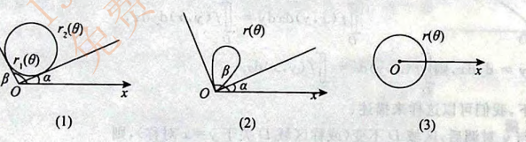

# 第11讲 二重积分

## 11.1 二重积分的概念.性质与对称性

### 二重积分的几何背景  
二重积分的几何背景:
- 曲顶柱体的体积  
  - $\iint_{D}f(x,y)d\sigma$
- 类比
  - 长方体:底面积$\times$高

### 二重积分的存在性/可积性
- 设平面有界闭区域$D$由一条或者几条逐段光滑闭曲线所围成
- 当
  - $f(x,y)$在$D$上连续时
  - 或$f(x,y)$在$D$上有界,且它在$D$上除了有限个点和有限条光滑曲线外都是连续的,
- 则它在$D$上可积,即二重积分存在  

### 二重积分的精确定义

类比于定积分的精确定义

$\iint_{D}f(x,y)d\sigma  = \lim_{n \to \infty}\sum_{i=1}^n\sum_{j=1}^nf(a+\frac{b-a}{n}i, c + \frac{d-c}{n}j) \cdot \frac{b-a}{n} \frac{d-c}{n}$

- $D$是一个”长方形区域”

> 基本用在将和式$\sum$转为积分和$\int$中

"凑二重积分定义"的步骤

- 先提出$\frac{1}{n} \cdot \frac{1}{n}$
- 再凑出$\frac{i}{n},\frac{j}{n}$
- 由于
  - $\frac{i}{n}= 0 + \frac{1-0}{n}i$,
    - $\frac{i}{n}$故可以读作$0$到$1$上的$x$
  - $\frac{j}{n}= 0 + \frac{1-0}{n}j$
    - $\frac{j}{n}$故可以读作$0$到$1$上的$y$
- $\frac{1}{n}=\frac{1-0}{n}$
  - 既可以读作"0到1上的$dx$",也可以读作"0到1上的$dy$"

例如

- $\lim_{n \to \infty}\sum_{i=1}^n\sum_{j=1}^n \frac{ij}{n^4}$
  - 凑定义
    - $\lim_{n \to \infty}\sum_{i=1}^n\sum_{j=1}^n \frac{ij}{n^2} \cdot \frac{1}{n} \cdot \frac{1}{n}$
    - $\lim_{n \to \infty}\sum_{i=1}^n\sum_{j=1}^n \frac{i}{n} \cdot \frac{j}{n} \cdot \frac{1}{n} \cdot \frac{1}{n}$
    - $\int_0^1 \int_0^1 xy dxdy$
    - $\iint_{D}xy d \sigma $
- $\sum_{n \to \infty}\sum_{i=1}^n \sum_{j=1}^n \frac{n}{(n+i)(n^2 + j^2)}$
  - 凑定义
    - $\sum_{n \to \infty}\sum_{i=1}^n \sum_{j=1}^n \frac{n}{(1+\frac{i}{n})(1 + \frac{j^2}{n^2})} \cdot \frac{1}{n^2}$
    - $\int_0^1 \int_0^1 \frac{n}{(1+x)(1 + y^2)} dxdy$

> 定积分$\int_a^bf(x)dx=A$是一个数,二重积分$\iint_{D}f(x,y)dxdy = A$也是一个数

### 二重积分的性质

#### 性质1 求区域面积:

- $\iint_{D} 1\cdot d\sigma = \iint_{D}d\sigma = A$

#### 性质2 可积函数必有界  

- 当$f(x,y)$在有界闭区域$D$上可积时,
  - 则$f(x,y)$在$D$上必有界

#### 性质3 积分的线性性质  

- 设$k_1,k_2$为常数,
  - 则$\iint_{D}[k_1f(x,y) \pm k_2f(x,y)]d\sigma = k_1\iint_{D}f(x,y) \pm k_2\iint_{D}f(x,y)$  

#### 性质4 积分的可加性

- 当$f(x,y)$在有界闭区域$D$上可积时,且$D_1 \cup D_2 = D,D_1 \cap  D_2 = \varnothing$,
  - 则$\iint_{D}f(x,y)d\sigma = \iint_{D_1}f(x,y) + \iint_{D_2}f(x,y)$  

#### 性质5 ==积分的保号性==

- 当$f(x,y),g(x,y)$在有界闭区域D上可积时,若在D上,$f(x,y) \leqslant g(x,y)$
  - 则$\iint_{D}f(x,y) \leqslant \iint_{D}g(x,y)$
    - 特别地有$|\iint_{D}f(x,y)| \leqslant \iint_{D}|f(x,y)|$

#### 性质6 二重积分的估值定理  

- 设$M,m$分别是$f(x,y)$在有界闭区域$D$上的最大值和最小值,$A$为$D$的面积,
  - 则有$mA \leqslant \iint_{D}f(x,y)d\sigma \leqslant MA$

#### 性质7 二重积分的中值定理

- 设函数$f(x,y)$在有界闭区域$D$上连续,$A$为$D$的面积,
  - 则在$D$上至少存在一点$(\varepsilon , \eta)$,使得$\iint_{D}f(x,y)d\sigma = f(\varepsilon , \eta)A$  

### 普通对称性和轮换对称性

- 对称性问题本质上是概念,不是计算  
- 是关于积分区域$D$的对称性

#### 普通对称性
$$
\iint_{D}f(x,y)dxdy = \left\{\begin{matrix}
2\iint_{D_1}f(x,y)dxdy & ,f(x,y) = f(-x,y) \\
0                      & ,f(x,y) = -f(-x,y) 
\end{matrix}\right.
$$
- 区域$D$关于$x$轴对称
  - 两个$f(x,y)\mathrm{d}\sigma = f(-x,y)\mathrm{d}\sigma$
  - 对称位置体积相等
- 区域$D$关于原点对称
  - $f(x,y)\mathrm{d}\sigma = -f(-x,y)\mathrm{d}\sigma$
  - 对称位置体积正好相反

#### 轮换对称性

积分值与用什么字母表示示无关的  
- $\iint_{D_{xy}}f(x,y)dxdy = \iint_{D_{yx}}f(y,x)dydx$ 

轮换对称性:
- 若把$x$与$y$对调后,区域$D$不变
  - 或称区域$D$关于$y = x$对称
- 则$\iint_{D}f(x,y)dxdy = \iint_{D}f(y,x)dydx$

例如

- 区域$D = \{ (x,y) | x^2 + y^2 \leqslant 1, x, y \geqslant  0\}$ $f(x)$为$D$上的正值连续函数, $a,b$为常数,求$I = \iint_{D}\frac{a\sqrt{f(x)} + b\sqrt{f()y}}{\sqrt{f(x)} + \sqrt{f(y)\mathrm{d}\sigma}} $
- 分析
  - 被积函数为抽象的,无法直接计算
  - 观察发现
    - 把$x$和$y$对调后,区域$D$不变,
      - 即区域$D$关于$y=x$对称
  - 根据轮换对称性
    - $I = \iint_{D}\frac{a\sqrt{f(x)} + b\sqrt{f(y)}}{\sqrt{f(x)} + \sqrt{f(y)}}  \mathrm{d}\sigma=  I = \iint_{D}\frac{a\sqrt{f(y)} + b\sqrt{f(x)}}{\sqrt{f(y)} + \sqrt{f(x)}}  \mathrm{d}\sigma$
    - $2I = \iint_{D}(a+b) \mathrm{d}\sigma$

> 应用轮换对称性一般是被积函数不宜计算的或抽象函数一般都是
>
> - $A + B$不容易计算,但是$(A + B) + (B + A)$可能会消去分母便于计算

## 11.2 二重积分的计算

> 将二次(累次)积分转化为二重积分时,必须将积分限写成下限小于上限(累次积分无此要求),然后交换次序

### 直角坐标系

> 下限均小于上限

$D$为$X$型区域  
- $\iint_{D}f(x,y)d\sigma = \int_{a}^{b}dx\int_{\varphi_1}^{\varphi_2}f(x,y)dy,\varphi_1 \leqslant y \leqslant \varphi_2,a \leqslant x \leqslant b$

$D$为$Y$型区域  
- $\iint_{D}f(x,y)d\sigma = \int_{c}^{d}dx\int_{\psi_1}^{\psi_2}f(x,y)dy,\psi_1 \leqslant y \leqslant \psi_2,c \leqslant x \leqslant d$

### 极坐标系

极点$O$在区域$D$外部  
- $\iint_{D}f(x,y)d\sigma = \int_{\alpha }^{\beta }d\theta \int_{r_1(\theta)}^{r_2(\theta)}f(rcos\theta, rsin\theta)rdr$

极点$O$在区域$D$边上  
- $\iint_{D}f(x,y)d\sigma = \int_{\alpha }^{\beta }d\theta \int_{0}^{r(\theta)}f(rcos\theta, rsin\theta)rdr$

极点$O$在区域$D$内部  
- $\iint_{D}f(x,y)d\sigma = \int_{0}^{2\pi}d\theta \int_{0}^{r(\theta)}f(rcos\theta, rsin\theta)rdr$

> 极坐标中几乎都是先计算$r$后积分$\theta$ 

### 极坐标与直角坐标系选择的一般原则

满足以下则选择极坐标否则使用直角坐标  
- 被积函数是否为$f(x^2+y^2)$,$f(\frac{y}{x})$,$f(\frac{x}{y})$等形式
  - 是则选择极坐标
- 再看积分区域是否为圆或者圆的一部分
  - 是则选择极坐标

### 极坐标系与直角坐标系的相互转化

- 公式:
$$
\left\{\begin{matrix}
x = rcos\theta \\ 
x = rsin\theta 
\end{matrix}\right.
$$
- 画好区域$D$的图形,确定好上下限
- $r drd\theta = dxdy$

###  出题角度

二重积分的基础题

- 坐标系
  - 直角坐标系下的计算
  - 极坐标系下的计算
  - 极坐标系与直角坐标系的相互转化后的计算

- 积分次序

  > 首先画出积分区域,方便写出交换次序后的积分上下限

  - 直角坐标系下交换积分次序
    - 被积函数$f(x,y)$关于$x$或$y$的函数,原函数无法用初等函数表示
    - 进行变量替换时观察哪种积分次序方便后续计算
      - 例如
        - $\int_0^1dy\int_y^1 \sqrt{x^2 - y^2}dx$
          - 计算$\int\sqrt{x^2 - y^2}dx$
            - 等价于$\sqrt{x^2-a^2}, x = asecx$
          - 计算$\int\sqrt{x^2 - y^2}dy$
            - 等价于$\sqrt{a^2-y^2}, y = asinx$
          - 对比后者更方便计算
  - 极坐标系下交换积分次序

- 涉及二重积分概念的计算

交换积分次序

- 例如
  - $\int_1^2dx\int_{\sqrt{x}}^xsin\frac{\pi x}{2y}dy + \int_2^4dx\int_{\sqrt{x}}^2 sin\frac{\pi x}{2 y}dy$
    - 如果不进行积分次序的交换,被积函数$sin\frac{\pi x}{2y}$作为$y$的函数,原函数无法用初等函数表示
      - $\int_1^2dx\int_{\sqrt{x}}^xsin\frac{\pi x}{2y}dy + \int_2^4dx\int_{\sqrt{x}}^2 sin\frac{\pi x}{2 y}dy$
      - $\iint_{D}sin\frac{\pi x}{2y}dxdy$
      - 此时$D$由$X$型区域变为$Y$型区域
        - $D = 1 \{(x,y) | \leqslant y \leqslant\ 2, y \leqslant x \leqslant y^2 \}$
      - $\int_1^2dy\int_x^{x^2}sin\frac{\pi x}{2y}dx$