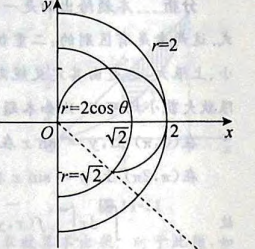

| 题号      | 分析                                                         |      |
| --------- | ------------------------------------------------------------ | ---- |
| 11.1      | 观察被积函数,进行拆分计算                                    |      |
| 11.2      | 直角坐标系下的二重积分计算;注意画出积分区域                  |      |
| 11.3      | 极坐标系与直角坐标系的相互转化;积分的可加性;轮换对称性可以简便计算 |      |
| 11.4      | ==先画出积分区域==;极坐标系与直角坐标系的相互转化;积分的换元技巧;相关公式 |      |
| 11.5      | 极坐标系与直角坐标系的相互转化                               |      |
| 11.6-11.7 | 如果不进行积分次序的交换,被积函数$f(x,y)$关于$x$或$y$的函数,原函数无法用初等函数表示 |      |
| 11.8      | 进行变量替换时观察哪种积分次序方便后续计算                   |      |
| 11.10     | 注意此处的三角函数与反三角函数的图像                         |      |
| 11.11     | 极坐标系与直角坐标系的相互转化                               |      |
| 11.12     | 利用二重积分是一个数的概念                                   |      |
| 11.13     | 由于$sgnx$的存在,所以需要将积分区域进行划分                  |      |
| 11.14     | 由于$max\{x,y\}$和$|y - x^2|$的存在,所以需要将积分区域进行划分 |      |
| 11.15     | 关键在于找好积分区域                                         |      |
| 11.16     | 二重积分与极限                                               |      |
| 11.17     | 二重积分与极限;二重积分中值定理,反三角函数的性质             |      |
| 11.18     | 方法一:积分上限函数,累次积分,导数与单调性;方法二:交换积分次序,更改变量名,利用$f(x)$单调减小,且为正值 |      |
| 11.19     | 方法1:分部积分; 方法二:化为二重积分,交换积分次序             |      |
| 11.20     | 代换,换元技巧                                                |      |
| 11.21     | 二重积分的逆向思维,交换积分次序,算术平均数大于几何平均数     |      |
| 11.22     | 计算技巧,与11.21思想类似                                     |      |
| 11.23     | 等价无穷小,积分上限函数,积分的中值定理,多元函数的可微        |      |
| 11.24     | 将已知条件与偏导数的定义建立联系                             |      |
|           |                                                              |      |

# 11.4

积分区域

- 极坐标为

  - $D = \{(r, \theta) | 0 \leqslant r \leqslant sec\theta, 0 \leqslant  \theta \leqslant  \frac{\pi}{2}\}$
- 化为直角坐标
  - 由$0 \leqslant r \leqslant sec\theta, 0 \leqslant  \theta \leqslant  \frac{\pi}{2}$

    - $ 0 \leqslant x \leqslant  1$

    - $x \geqslant  y \geqslant  0$

# 11.5

积分区域

- 直角坐标为
  - $D = \{(x,y) |0 \leqslant x \leqslant 1 , 1-x \leqslant  y \leqslant  \sqrt{1-x^2} \}$
- 化为极坐标
  - $0 \leqslant \theta  \leqslant \frac{\pi}{2}$
  - 用$x = rcos\theta , y = rsin\theta$和$1-x \leqslant  y \leqslant  \sqrt{1-x^2}$
    - 可得$1 \leqslant r \leqslant \frac{1}{cos\theta + sin\theta}$

# 11.10

积分次序先$y$后$x$

- 积分区域
  - $D =D_1 + D_2$
    - $D_1 = \{ (x,y) | 0 \leqslant  x  \leqslant \pi, 0 \leqslant  y \leqslant  sinx\}$
    - $D_2 = \{ (x,y) | \pi \leqslant  x  \leqslant 2\pi, sinx \leqslant  y \leqslant  0\}$

交换积分次序变为先$x$后$y$
- 积分区域
  - $D =D_1 + D_2$
    - $D_1 = \{ (x,y) | 0 \leqslant  y  \leqslant 1,  arcsiny \leqslant  x \leqslant  \pi - arcsiny\}$
    - $D_2 = \{ (x,y) | -1 \leqslant  x  \leqslant 0, \pi - arcsiny \leqslant  y \leqslant  2\pi + arcsiny\}$

​	

> 未理解图像

### 11.11
> "穿入穿出"的概念

交换$\int_{-\frac{\pi}{4}}^{\frac{\pi}{2}}d\theta \int_0^{2cos\theta}rf(r, \theta)dr$的积分次序,其中$f(r, \theta)$连续

先$r$后$\theta$的积分次序
- 积分区域
  - $-\frac{\pi}{4} \leqslant \theta \leqslant \frac{\pi}{2}$,$0 \leqslant r \leqslant 2cos\theta$

分析穿入与穿出
- $0  \leqslant r  \leqslant \sqrt{2}$
  - 圆弧$r$从$\theta = -\frac{\pi}{4}$进入区域$D$,从$r = 2cos\theta , (\theta > 0)$穿出
- $\sqrt{2}  \leqslant r  \leqslant 2$
  - 圆弧$r$从$r = 2cos\theta, (\theta < 0)$进入区域$D$, 从$r = 2cos\theta,  (\theta > 0)$穿出

交换积分次序,先$\theta$后$r$
- 积分次序
  - $-\frac{\pi}{4} \leqslant \theta \leqslant arccos\frac{r}{2}, \sqrt{2} \leqslant r \leqslant 2$
  - $-arccos\frac{r}{2} \leqslant \theta \leqslant arccos\frac{r}{2}, 0 \leqslant r \leqslant \sqrt{2}$

# 11.12

设区域$D \{(x,y) | x^2+y^2 \leqslant y, x \geqslant  0 \}$.$f(x,y)$为$D$上的连续函数,且$f(x,y) = \sqrt{1-x^2-y^2}-\frac{8}{\pi}\iint_{D}f(u,v)dudv$求$f(x,y)$.

解

设$\iint_{D}f(u,v)dudv = A$

则$\iint_{D}f(x,y) dxdy= \iint_{D}\sqrt{1-x^2-y^2}dxdy-\frac{8}{\pi}A\iint_{D}dxdy$

从而

- $\frac{1}{2}\iint_{D}dxdy = \frac{1}{2}\pi(\frac{1}{2})^2 = \frac{\pi}{8}$
- $A = \iint_{D}\sqrt{1-x^2-y^2}dxdy - A$

接下来由于被积函数含有$x^2,y^2$且积分区域为半球形,变换为极坐标计算

# 11.13 

