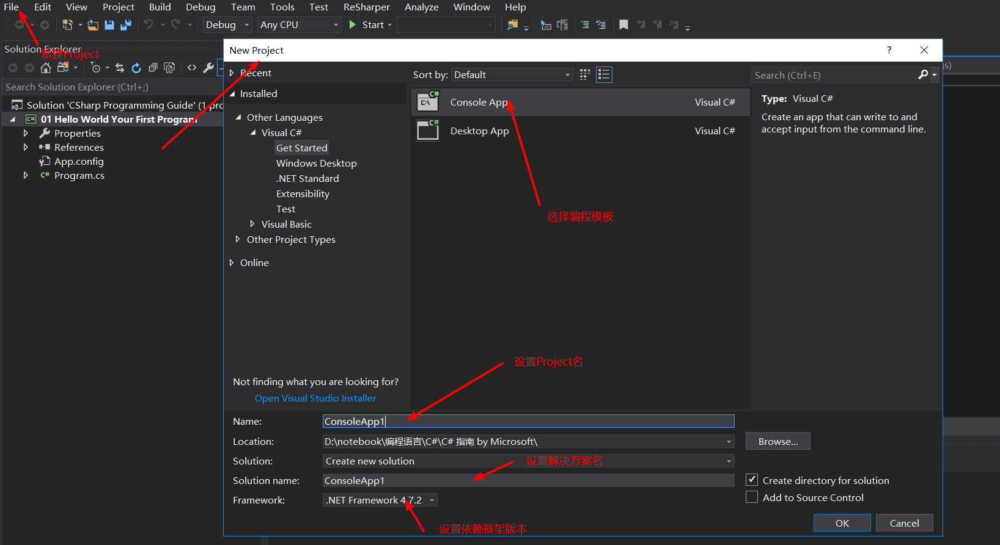
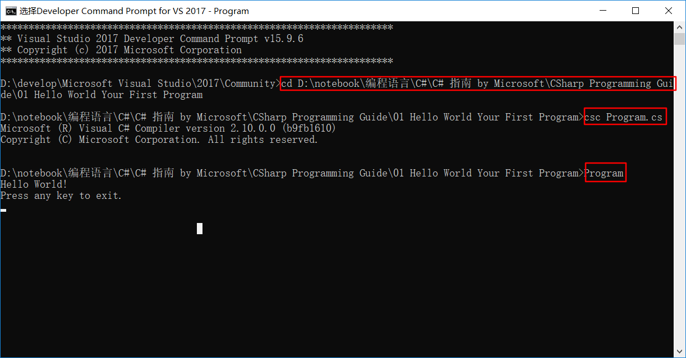

[C# programming guide](https://docs.microsoft.com/zh-cn/dotnet/csharp/programming-guide/index)

# Program sections

## [Inside a C# Program](https://docs.microsoft.com/zh-cn/dotnet/csharp/programming-guide/inside-a-program/index)

###  [Hello World -- 你的第一个程序](https://docs.microsoft.com/zh-cn/dotnet/csharp/programming-guide/inside-a-program/hello-world-your-first-program)



```c#
using System;

namespace _01_Hello_World_Your_First_Program
{
    class Program
    {
        static void Main()
        {
            Console.WriteLine("Hello World!");

            // Keep the console window open in debug mode.
            Console.WriteLine("Press any key to exit.");
            Console.ReadKey();
        }
    }
}
```

#### 注释

方式一

```c#
// A Hello World! program in C#.
```

方式二: 块注释

```c#
/* A "Hello World!" program in C#.
This program displays the string "Hello World!" on the screen. */
```

#### Main 方法
- C# 控制台应用程序必须包含 `Main` 方法，控件在其中开始和结束。 
- 在 `Main` 方法中，可以创建对象并执行其他方法。
- `Main` 方法是驻留在类或结构中的[静态](https://docs.microsoft.com/zh-cn/dotnet/csharp/language-reference/keywords/static)方法。

在上一个“Hello World!” 示例中，该方法驻留在名为 `Hello` 的类中。    
可以通过以下方式之一来声明 `Main` 方法：

- 它可返回 `void`

```c#
static void Main()
{
    //...
}
```

- 还可以返回一个整数

```c#
static int Main()
{
    //...
    return 0;
}
```

- 无论使用哪种返回类型，它都可以带有参数

```c#
static void Main(string[] args)
{
    //...
}
```

```c#
static int Main(string[] args)
{
    //...
    return 0;
}
```

`Main` 方法中定义的参数 `args` 是一个 `string` 类型的数组，该数组包含用于调用该程序的命令行自变量。 与 C++ 不同的是该数组不包括可执行 (exe) 文件的名称。

若要详细了解如何使用命令行参数，请参阅 [Main() 和命令行参数](https://docs.microsoft.com/zh-cn/dotnet/csharp/programming-guide/main-and-command-args/index)和[操作说明：使用命令行创建和使用程序集](https://docs.microsoft.com/zh-cn/dotnet/csharp/programming-guide/concepts/assemblies-gac/how-to-create-and-use-assemblies-using-the-command-line)中的示例。

在调试模式下运行程序时，对 `Main` 方法末尾处 [ReadKey](https://docs.microsoft.com/zh-cn/dotnet/api/system.console.readkey) 的调用可以防止在有可能读取输出内容之前控制台窗口关闭，具体方法是按 F5 键。

#### 输入和输出

C# 程序通常使用由 .NET Framework 的运行时库提供的输入/输出服务。 
- 语句 `System.Console.WriteLine("Hello World!");` 使用 [WriteLine](https://docs.microsoft.com/zh-cn/dotnet/api/system.console.writeline) 方法。 
  - 这是运行时库中 [Console](https://docs.microsoft.com/zh-cn/dotnet/api/system.console) 类的输出方法之一。
  - 该方法将在标准输出流中显示其字符串参数，后接新行。 
  - 其他 [Console](https://docs.microsoft.com/zh-cn/dotnet/api/system.console) 方法可用于不同的输入和输出操作。 
- 如果程序开头包含 `using System;` 指令，则可以直接使用 [System](https://docs.microsoft.com/zh-cn/dotnet/api/system) 类和方法，而不必进行完全限定。

例如，可以调用 `Console.WriteLine`，而非 `System.Console.WriteLine`：

```c#
using System;
```

```c#
Console.WriteLine("Hello World!");
```

> 有关输入/输出方法的详细信息，请参阅 [System.IO](https://docs.microsoft.com/zh-cn/dotnet/api/system.io)。

#### 命令行编译和执行

通过使用命令行 而非 Visual Studio 集成开发环境 (IDE)，可以编译“Hello World!”程序。

##### 从命令提示符中编译并运行



- 将上一过程的代码粘贴到任何文本编辑器中，然后将该文件保存为文本文件。 为 `Hello.cs` 文件命名。 C# 源代码文件使用 `.cs` 扩展
- 执行以下任一步骤以打开命令提示符窗口
  - 在 Windows 10 的“开始”菜单上，搜索 `Developer Command Prompt`，然后点击或选择“VS 2017 开发人员命令提示”。
    - 将出现“开发人员命令提示”窗口。
  - 在 Windows 7 中，打开“启动”菜单，展开当前版本的 Visual Studio 的文件夹，打开“Visual Studio Tools”快捷菜单，然后选择“VS 2017 开发人员命令提示”。
    - 将出现“开发人员命令提示”窗口。
  - 从标准命令提示符窗口启用命令行生成。
> 请参阅[操作说明：设置 Visual Studio 命令行的环境变量](https://docs.microsoft.com/zh-cn/dotnet/csharp/language-reference/compiler-options/how-to-set-environment-variables-for-the-visual-studio-command-line)。

- 在命令提示窗口中，导航到包含 `Hello.cs` 文件的文件夹。
- 输入以下命令以编译 `Hello.cs`。
  - `csc Hello.cs`
  - 如果程序不存在编译错误，系统将创建名为 `Hello.exe` 的可执行文件。
- 在命令提示窗口中，输入以下命令以运行该程序
> 有关 C# 编译器及其选项的详细信息，请参阅 C# 编译器选项。

### [C# 程序的通用结构](https://docs.microsoft.com/zh-cn/dotnet/csharp/programming-guide/inside-a-program/general-structure-of-a-csharp-program)
- C# 程序可由一个或多个文件组成。 
  - 每个文件均可包含零个或多个命名空间。 
  - 一个命名空间除了可包含其他命名空间外,还可包含类、结构、接口、枚举、委托等类型。 

下面是包含所有这些元素的 C# 程序主干。
```c#
namespace _02_General_Structure_of_a_CSharp_Program
{
    class YourClass
    {
    }

    struct YourStruct
    {
    }

    interface IYourInterface
    {
    }

    delegate int YourDelegate();

    enum YourEnum
    {
    }

    namespace YourNestedNamespace
    {
        struct YourStruct
        {
        }
    }

    class YourMainClass
    {
        static void Main(string[] args)
        {
            //Your program starts here...
        }
    }
}
```

### [标识符名称](https://docs.microsoft.com/zh-cn/dotnet/csharp/programming-guide/inside-a-program/identifier-names)

标识符是分配给类型（类、接口、结构、委托或枚举）、成员、变量或命名空间的名称。 有效标识符必须遵循以下规则：

- 标识符必须以字母或 `_` 开头。
- 标识符可以包含 Unicode 字母字符、十进制数字字符、Unicode 连接字符、Unicode 组合字符或 Unicode 格式字符。 
  - 有关 Unicode 类别的详细信息，请参阅 [Unicode 类别数据库](https://www.unicode.org/reports/tr44/)。 
  - 可以在标识符上使用 `@` 前缀来声明与 C# 关键字匹配的标识符。
    -  `@` 不是标识符名称的一部分。 
    -  例如，`@if` 声明名为 `if` 的标识符。 这些[逐字标识符](https://docs.microsoft.com/zh-cn/dotnet/csharp/language-reference/tokens/verbatim)主要用于与使用其他语言声明的标识符的互操作性。

>  有关有效标识符的完整定义，请参阅 [C# 语言规范中的标识符主题](https://docs.microsoft.com/zh-cn/dotnet/csharp/language-reference/language-specification/lexical-structure#identifiers)。

#### 命名约定

除了规则之外，在 .NET API 中还使用了许多标识符[命名约定](https://docs.microsoft.com/zh-cn/dotnet/standard/design-guidelines/naming-guidelines)。 

按照约定，C# 程序对类型名称、命名空间和所有公共成员使用 `PascalCase`。 

此外，以下约定也很常见：

- 接口名称以大写字母 `I` 开头。
- 属性类型以单词 `Attribute` 结尾。
- 枚举类型对非标记使用单数名词，对标记使用复数名词。
- 标识符不应包含两个连续的 `_` 字符。 
  - 这些名称保留给编译器生成的标识符。

#### C# 语言规范

> 有关详细信息，请参阅 [C# 语言规范](https://docs.microsoft.com/zh-cn/dotnet/csharp/language-reference/language-specification/index)。 该语言规范是 C# 语法和用法的权威资料。

### [C# 编码约定](https://docs.microsoft.com/zh-cn/dotnet/csharp/programming-guide/inside-a-program/coding-conventions)

编码约定可实现以下目的：

- 它们为代码创建一致的外观，以确保读取器专注于内容而非布局。
- 它们使得读取器可以通过基于之前的经验进行的假设更快地理解代码。
- 它们便于复制、更改和维护代码。
- 它们展示 C# 最佳做法。

Microsoft 根据本主题中的准则来开发样本和文档。

#### 命名约定

在不包括 [using 指令](https://docs.microsoft.com/zh-cn/dotnet/csharp/language-reference/keywords/using-directive)的短示例中，使用命名空间限定。 

- 如果你知道命名空间默认导入项目中，则不必完全限定来自该命名空间的名称。 
- 如果对于单行来说过长，则可以在点 (.) 后中断限定名称，如下面的示例所示。

```c#
var currentPerformanceCounterCategory = new System.Diagnostics.
    PerformanceCounterCategory();
```

你不必更改通过使用 Visual Studio 设计器工具创建的对象的名称以使它们适合其他准则。

#### 布局约定
好的布局利用格式设置来强调代码的结构并使代码更便于阅读。 
Microsoft 示例和样本符合以下约定：

- 使用默认的代码编辑器设置（智能缩进、4 字符缩进、制表符保存为空格）。 

  > 有关详细信息，请参阅[选项、文本编辑器、C#、格式设置](https://docs.microsoft.com/zh-cn/visualstudio/ide/reference/options-text-editor-csharp-formatting)。

- 每行只写一条语句。

- 每行只写一个声明。

- 如果连续行未自动缩进，请将它们缩进一个制表符位（四个空格）。

- 在方法定义与属性定义之间添加至少一个空白行。

- 使用括号突出表达式中的子句, 如下面的代码所示。

```c#
if ((val1 > val2) && (val1 > val3))
{
    // Take appropriate action.
}
```

#### 注释约定
- 将注释放在单独的行上，而非代码行的末尾。
- 以大写字母开始注释文本。
- 以句点结束注释文本。
- 在注释分隔符 (//) 与注释文本之间插入一个空格，如下面的示例所示。
```c#
// The following declaration creates a query. It does not run
// the query.
```
- 不要在注释周围创建格式化的星号块。

#### 语言准则

以下各节介绍 C# 遵循以准备代码示例和样本的做法。

##### String 数据类型
- 使用[字符串内插](https://docs.microsoft.com/zh-cn/dotnet/csharp/language-reference/tokens/interpolated)来连接短字符串，如下面的代码所示。
```c#
string displayName = $"{nameList[n].LastName}, {nameList[n].FirstName}";
```
- 若要在循环中追加字符串，尤其是在使用大量文本时，请使用 [StringBuilder](https://docs.microsoft.com/zh-cn/dotnet/api/system.text.stringbuilder) 对象。
```c#
var phrase = "lalalalalalalalalalalalalalalalalalalalalalalalalalalalalala";
var manyPhrases = new StringBuilder();
for (var i = 0; i < 10000; i++)
{
    manyPhrases.Append(phrase);
}
//Console.WriteLine("tra" + manyPhrases);
```

##### 隐式类型的局部变量

- 当变量类型明显来自赋值的右侧时，或者当精度类型不重要时，请对本地变量进行[隐式类型化](https://docs.microsoft.com/zh-cn/dotnet/csharp/programming-guide/classes-and-structs/implicitly-typed-local-variables)。

```c#
// When the type of a variable is clear from the context, use var 
// in the declaration.
var var1 = "This is clearly a string.";
var var2 = 27;
var var3 = Convert.ToInt32(Console.ReadLine());
```

- 当类型并非明显来自赋值的右侧时，请勿使用 [var](https://docs.microsoft.com/zh-cn/dotnet/csharp/language-reference/keywords/var)。

```c#
// When the type of a variable is not clear from the context, use an
// explicit type.
int var4 = ExampleClass.ResultSoFar();
```

- 避免使用 `var` 来代替 [dynamic](https://docs.microsoft.com/zh-cn/dotnet/csharp/language-reference/keywords/dynamic)。

- 使用隐式类型化来确定 [for](https://docs.microsoft.com/zh-cn/dotnet/csharp/language-reference/keywords/for) 和 [foreach](https://docs.microsoft.com/zh-cn/dotnet/csharp/language-reference/keywords/foreach-in) 循环中循环变量的类型。

```c#
var syllable = "ha";
var laugh = "";
for (var i = 0; i < 10; i++)
{
    laugh += syllable;
    Console.WriteLine(laugh);
}
```

```c#
foreach (var ch in laugh)
{
    if (ch == 'h')
        Console.Write("H");
    else
        Console.Write(ch);
}
Console.WriteLine();
```

##### 无符号数据类型

通常，使用 `int` 而非无符号类型。 `int` 的使用在整个 C# 中都很常见，并且当你使用 `int` 时，更易于与其他库交互。

##### 数组

当在声明行上初始化数组时，请使用简洁的语法。

```c#
// Preferred syntax. Note that you cannot use var here instead of string[].
string[] vowels1 = { "a", "e", "i", "o", "u" };


// If you use explicit instantiation, you can use var.
var vowels2 = new string[] { "a", "e", "i", "o", "u" };

// If you specify an array size, you must initialize the elements one at a time.
var vowels3 = new string[5];
vowels3[0] = "a";
vowels3[1] = "e";
// And so on.
```

##### 委托

使用简洁的语法来创建委托类型的实例

```c#
// First, in class Program, define the delegate type and a method that  
// has a matching signature.

// Define the type.
public delegate void Del(string message);

// Define a method that has a matching signature.
public static void DelMethod(string str)
{
    Console.WriteLine("DelMethod argument: {0}", str);
}
```

```c#
// In the Main method, create an instance of Del.

// Preferred: Create an instance of Del by using condensed syntax.
Del exampleDel2 = DelMethod;

// The following declaration uses the full syntax.
Del exampleDel1 = new Del(DelMethod);
```

##### 异常处理中的 try-catch 和 using 语句

- 对大多数异常处理使用 [try-catch](https://docs.microsoft.com/zh-cn/dotnet/csharp/language-reference/keywords/try-catch) 语句。

```c#
static string GetValueFromArray(string[] array, int index)
{
    try
    {
        return array[index];
    }
    catch (System.IndexOutOfRangeException ex)
    {
        Console.WriteLine("Index is out of range: {0}", index);
        throw;
    }
}
```

- 通过使用 C# [using 语句](https://docs.microsoft.com/zh-cn/dotnet/csharp/language-reference/keywords/using-statement)简化你的代码。 
  - 如果具有 [try-finally](https://docs.microsoft.com/zh-cn/dotnet/csharp/language-reference/keywords/try-finally) 语句（该语句中 `finally` 块的唯一代码是对 [Dispose](https://docs.microsoft.com/zh-cn/dotnet/api/system.idisposable.dispose) 方法的调用），请使用 `using` 语句代替。

```c#
// This try-finally statement only calls Dispose in the finally block.
Font font1 = new Font("Arial", 10.0f);
try
{
    byte charset = font1.GdiCharSet;
}
finally
{
    if (font1 != null)
    {
        ((IDisposable)font1).Dispose();
    }
}


// You can do the same thing with a using statement.
using (Font font2 = new Font("Arial", 10.0f))
{
    byte charset = font2.GdiCharSet;
}
```

##### && 和 || 运算符

若要通过跳过不必要的比较来避免异常并提高性能，请在执行比较时使用 [`&&`](https://docs.microsoft.com/zh-cn/dotnet/csharp/language-reference/operators/conditional-and-operator)（而不是 [`&`](https://docs.microsoft.com/zh-cn/dotnet/csharp/language-reference/operators/and-operator)），使用 [`||`](https://docs.microsoft.com/zh-cn/dotnet/csharp/language-reference/operators/conditional-or-operator)（而不是 ['|'](https://docs.microsoft.com/zh-cn/dotnet/csharp/language-reference/operators/or-operator)），如下面的示例所示。

```c#
Console.Write("Enter a dividend: ");
var dividend = Convert.ToInt32(Console.ReadLine());

Console.Write("Enter a divisor: ");
var divisor = Convert.ToInt32(Console.ReadLine());

// If the divisor is 0, the second clause in the following condition
// causes a run-time error. The && operator short circuits when the
// first expression is false. That is, it does not evaluate the
// second expression. The & operator evaluates both, and causes 
// a run-time error when divisor is 0.
if ((divisor != 0) && (dividend / divisor > 0))
{
    Console.WriteLine("Quotient: {0}", dividend / divisor);
}
else
{
    Console.WriteLine("Attempted division by 0 ends up here.");
}
```

##### New 运算符

- 隐式类型化时，请使用对象实例化的简洁形式，如下面的声明所示。

```c#
var instance1 = new ExampleClass();
```

```C#
// 上一行等同于下面的声明
ExampleClass instance2 = new ExampleClass();
```

- 使用对象初始值设定项来简化对象创建。

```c#
// Object initializer.
var instance3 = new ExampleClass { Name = "Desktop", ID = 37414, 
    Location = "Redmond", Age = 2.3 };

// Default constructor and assignment statements.
var instance4 = new ExampleClass();
instance4.Name = "Desktop";
instance4.ID = 37414;
instance4.Location = "Redmond";
instance4.Age = 2.3;
```

##### 事件处理

如果你正定义一个稍后不需要删除的事件处理程序，请使用 lambda 表达式。

```c#
public Form2()
{
    // You can use a lambda expression to define an event handler.
    this.Click += (s, e) =>
        {
            MessageBox.Show(
                ((MouseEventArgs)e).Location.ToString());
        };
}
```

```c#
// Using a lambda expression shortens the following traditional definition.
public Form1()
{
    this.Click += new EventHandler(Form1_Click);
}

void Form1_Click(object sender, EventArgs e)
{
    MessageBox.Show(((MouseEventArgs)e).Location.ToString());
}
```

##### 静态成员

使用类名调用 [static](https://docs.microsoft.com/zh-cn/dotnet/csharp/language-reference/keywords/static) 成员：ClassName.StaticMember。 

- 这种做法通过明确静态访问使代码更易于阅读。 
- 请勿使用派生类的名称限定基类中定义的静态成员。 
  - 编译该代码时，代码可读性具有误导性，如果向派生类添加具有相同名称的静态成员，代码可能会被破坏。

##### LINQ 查询
- 对查询变量使用有意义的名称。    

下面的示例为位于西雅图的客户使用 `seattleCustomers`。
```c#
var seattleCustomers = from cust in customers
                       where cust.City == "Seattle"
                       select cust.Name;
```

- 使用别名确保匿名类型的属性名称都使用 Pascal 大小写格式正确大写。

```c#
var localDistributors =
    from customer in customers
    join distributor in distributors on customer.City equals distributor.City
    select new { Customer = customer, Distributor = distributor };
```

- 如果结果中的属性名称模棱两可，请对属性重命名。

例如，如果你的查询返回客户名称和分销商 ID，而不是在结果中将它们保留为 `Name` 和 `ID`，请对它们进行重命名以明确 `Name` 是客户的名称，`ID` 是分销商的 ID。

```c#
var localDistributors2 =
    from cust in customers
    join dist in distributors on cust.City equals dist.City
    select new { CustomerName = cust.Name, DistributorID = dist.ID };
```

- 对齐 [from](https://docs.microsoft.com/zh-cn/dotnet/csharp/language-reference/keywords/from-clause) 子句下的查询子句，如上面的示例所示。
- 在其他查询子句之前使用 [where](https://docs.microsoft.com/zh-cn/dotnet/csharp/language-reference/keywords/where-clause) 子句，以确保后面的查询子句作用于经过减少和筛选的数据集。

```c#
var seattleCustomers2 = from cust in customers
                        where cust.City == "Seattle"
                        orderby cust.Name
                        select cust;
```

- 使用多行 `from` 子句代替 [join](https://docs.microsoft.com/zh-cn/dotnet/csharp/language-reference/keywords/join-clause) 子句以访问内部集合。

例如，`Student` 对象的集合可能包含测验分数的集合。 当执行以下查询时，它返回高于 90 的分数，并返回得到该分数的学生的姓氏。

```c#
// Use a compound from to access the inner sequence within each element.
var scoreQuery = from student in students
                 from score in student.Scores
                 where score > 90
                 select new { Last = student.LastName, score };
```

#### 安全性

> 请遵循[安全编码准则](https://docs.microsoft.com/zh-cn/dotnet/standard/security/secure-coding-guidelines)中的准则。