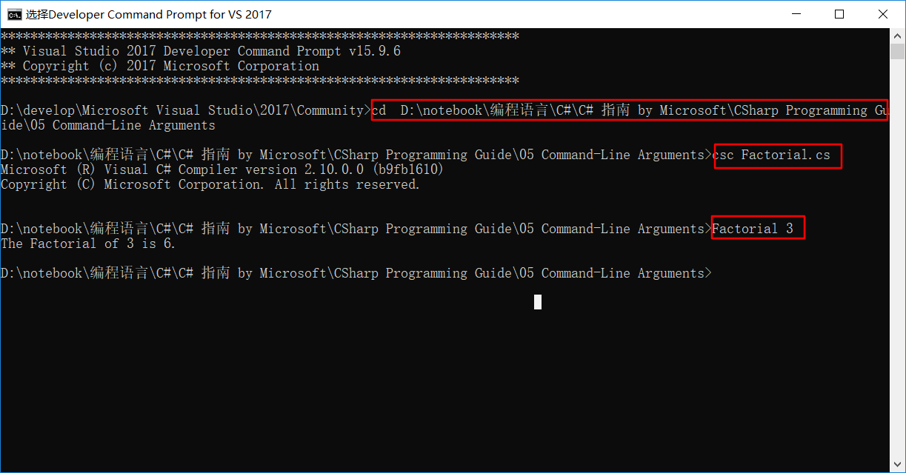
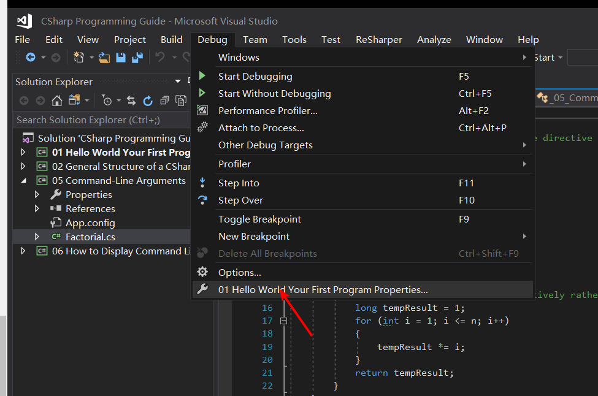
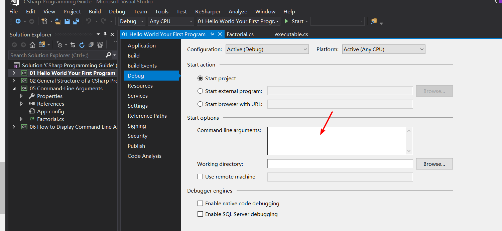
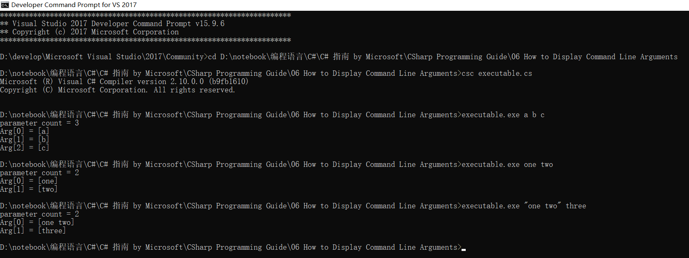
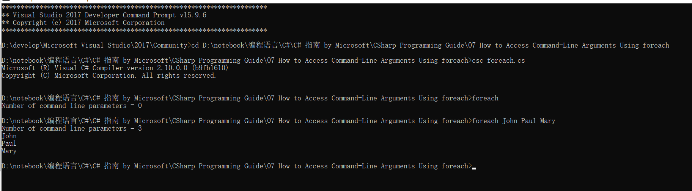

[C# programming guide](https://docs.microsoft.com/zh-cn/dotnet/csharp/programming-guide/index)

# Program sections

## [Main() and Command-Line Arguments](https://docs.microsoft.com/zh-cn/dotnet/csharp/programming-guide/main-and-command-args/index)

`Main` 方法是 C# 应用程序的入口点。 

- 库和服务不要求使用 `Main` 方法作为入口点。
- `Main` 方法是应用程序启动后调用的第一个方法。

C# 程序中只能有一个入口点。 

- 如果多个类包含 `Main` 方法，必须使用 **/main** 编译器选项来编译程序，以指定将哪个 `Main` 方法用作入口点。 

>  有关详细信息，请参阅 [/main（C# 编译器选项）](https://docs.microsoft.com/zh-cn/dotnet/csharp/language-reference/compiler-options/main-compiler-option)。

 概述

- `Main` 方法是可执行程序的入口点，也是程序控制开始和结束的位置。
- `Main` 在类或结构中声明。 `Main` 必须是[静态](https://docs.microsoft.com/zh-cn/dotnet/csharp/language-reference/keywords/static)方法，不得为[公共](https://docs.microsoft.com/zh-cn/dotnet/csharp/language-reference/keywords/public)方法。 （在前面的示例中，它获得的是[私有](https://docs.microsoft.com/zh-cn/dotnet/csharp/language-reference/keywords/private)成员的默认访问权限）。封闭类或结构不一定要是静态的。
- `Main` 可以具有 `void`、`int`，或者以 C# 7.1、`Task` 或 `Task<int>` 返回类型开头。
- 当且仅当 `Main` 返回 `Task` 或 `Task<int>` 时，`Main` 的声明可包括 [`async`](https://docs.microsoft.com/zh-cn/dotnet/csharp/language-reference/keywords/async) 修饰符。 请注意，该操作可明确排除 `async void Main` 方法。
- 使用或不使用包含命令行自变量的 `string[]` 参数声明 `Main` 方法都行。 使用 Visual Studio 创建 Windows 应用程序时，可以手动添加此形参，也可以使用 [Environment](https://docs.microsoft.com/zh-cn/dotnet/api/system.environment) 类来获取命令行实参。 参数被读取为从零开始编制索引的命令行自变量。 与 C 和 C++ 不同，程序的名称不被视为第一个命令行自变量。

添加 `async`、`Task` 和 `Task<int>` 返回类型可简化控制台应用程序需要启动时的程序代码，以及 `Main` 中的 `await` 异步操作。

> 有关详细信息，请参阅 [C# 语言规范](https://docs.microsoft.com/zh-cn/dotnet/csharp/language-reference/language-specification/index)。 该语言规范是 C# 语法和用法的权威资料。

### 命令行参数

可以通过以下方式之一定义方法来将自变量发送到 `Main` 方法：

```c#
static int Main(string[] args)
```

```c#
static void Main(string[] args)
```

> 若要在 Windows 窗体应用程序中的 `Main` 方法中启用命令行参数，必须手动修改 program.cs 中 `Main` 的签名。 Windows 窗体设计器生成的代码创建没有输入参数的 `Main`。 还可使用 [Environment.CommandLine](https://docs.microsoft.com/zh-cn/dotnet/api/system.environment.commandline)或 [Environment.GetCommandLineArgs](https://docs.microsoft.com/zh-cn/dotnet/api/system.environment.getcommandlineargs) 从控制台或 Windows 应用程序的任意位置访问命令行参数。

`Main` 方法的参数是一个表示命令行参数的 [String](https://docs.microsoft.com/zh-cn/dotnet/api/system.string) 数组。 
- 通常，通过测试 `Length` 属性来确定参数是否存在

例如

```c#
if (args.Length == 0)
{
    System.Console.WriteLine("Please enter a numeric argument.");
    return 1;
}
```

还可以使用 [Convert](https://docs.microsoft.com/zh-cn/dotnet/api/system.convert) 类或 `Parse` 方法将字符串参数转换为数字类型。 
例如

- 以下语句使用 [Parse](https://docs.microsoft.com/zh-cn/dotnet/api/system.int64.parse) 方法将 `string`转换为 `long` 数字：

```c#
long num = Int64.Parse(args[0]);  
```

- 也可以使用 C# 类型 `long`，其别名为 `Int64`：

```c#
long num = long.Parse(args[0]);  
```

- 还可以使用 `Convert` 类方法 `ToInt64` 来执行同样的操作：

```c#
long num = Convert.ToInt64(s);  
```

> 有关详细信息，请参阅 [Parse](https://docs.microsoft.com/zh-cn/dotnet/api/system.int64.parse) 和 [Convert](https://docs.microsoft.com/zh-cn/dotnet/api/system.convert)。

#### 示例

以下示例演示如何在控制台应用程序中使用命令行参数。 应用程序在运行时获取一个参数，将该参数转换为整数，并计算数字的阶乘。 如果未提供任何参数，则应用程序会发出一条消息，说明程序的正确用法。

若要在命令提示符下编译并运行该应用程序，请按照下列步骤操作：

- 将以下代码粘贴到任何文本编辑器中，然后将该文件保存为名为 `Factorial.cs` 的文本文件。

```c#
//Add a using directive for System if the directive isn't already present.

public class Functions
{
    public static long Factorial(int n)
    {
        // Test for invalid input
        if ((n < 0) || (n > 20))
        {
            return -1;
        }

        // Calculate the factorial iteratively rather than recursively:
        long tempResult = 1;
        for (int i = 1; i <= n; i++)
        {
            tempResult *= i;
        }
        return tempResult;
    }
}

class MainClass
{
    static int Main(string[] args)
    {
        // Test if input arguments were supplied:
        if (args.Length == 0)
        {
            System.Console.WriteLine("Please enter a numeric argument.");
            System.Console.WriteLine("Usage: Factorial <num>");
            return 1;
        }

        // Try to convert the input arguments to numbers. This will throw
        // an exception if the argument is not a number.
        // num = int.Parse(args[0]);
        int num;
        bool test = int.TryParse(args[0], out num);
        if (test == false)
        {
            System.Console.WriteLine("Please enter a numeric argument.");
            System.Console.WriteLine("Usage: Factorial <num>");
            return 1;
        }

        // Calculate factorial.
        long result = Functions.Factorial(num);

        // Print result.
        if (result == -1)
            System.Console.WriteLine("Input must be >= 0 and <= 20.");
        else
            System.Console.WriteLine("The Factorial of {0} is {1}.", num, result);

        return 0;
    }
}
// If 3 is entered on command line, the
// output reads: The factorial of 3 is 6.
```

- 从“开始”屏幕或“开始”菜单中，打开 Visual Studio“开发人员命令提示”窗口，然后导航到包含刚刚创建的文件的文件夹。
- 输入以下命令以编译应用程序。
  - `csc Factorial.cs`
  - 如果应用程序不存在编译错误，则会创建名为 `Factorial.exe` 的可执行文件。
- 该命令将生成以下输出：`The factorial of 3 is 6.`



> 在 Visual Studio 中运行应用程序时，可在[“项目设计器”->“调试”页](https://docs.microsoft.com/zh-cn/visualstudio/ide/reference/debug-page-project-designer)中指定命令行参数。





> 有关如何使用命令行参数的更多示例，请参阅[操作说明：使用命令行创建和使用程序集](https://docs.microsoft.com/zh-cn/dotnet/csharp/programming-guide/concepts/assemblies-gac/how-to-create-and-use-assemblies-using-the-command-line)。

### 如何：显示命令行参数

可通过 `Main` 的可选参数来访问在命令行处提供给可执行文件的参数。 参数以字符串数组的形式提供。 数组的每个元素都包含 1 个参数。 删除参数之间的空格。

例如，下面是对虚构可执行文件的命令行调用：

| 命令行输入                         | 传递给 Main 的字符串数组 |
| ---------------------------------- | ------------------------ |
| **executable.exe a b c**           | "a"  "b"  “c”            |
| **executable.exe one two**         | "one"  "two"             |
| **executable.exe "one two" three** | "one two"  "three"       |

> 在 Visual Studio 中运行应用程序时，可在[“项目设计器”->“调试”页](https://docs.microsoft.com/zh-cn/visualstudio/ide/reference/debug-page-project-designer)中指定命令行参数。

#### 示例

本示例显示了传递给命令行应用程序的命令行参数。 显示的输出对应于上表中的第一项。

```c#
class CommandLine
{ 
    static void Main(string[] args)
    {
        // The Length property provides the number of array elements
        System.Console.WriteLine("parameter count = {0}", args.Length);

        for (int i = 0; i < args.Length; i++)
        {
            System.Console.WriteLine("Arg[{0}] = [{1}]", i, args[i]);
        }
    }
}
/* Output (assumes 3 cmd line args): 
    parameter count = 3
    Arg[0] = [a]
    Arg[1] = [b]
    Arg[2] = [c]
*/
```



### 如何：使用 foreach 访问命令行参数

循环访问数组的另一种方法是使用 [foreach](https://docs.microsoft.com/zh-cn/dotnet/csharp/language-reference/keywords/foreach-in) 语句，如本例所示。 

- `foreach` 语句可用于循环访问数组、.NET Framework 集合类或任何实现 [IEnumerable](https://docs.microsoft.com/zh-cn/dotnet/api/system.collections.ienumerable) 接口的类或结构。

> 在 Visual Studio 中运行应用程序时，可在[“项目设计器”->“调试”页](https://docs.microsoft.com/zh-cn/visualstudio/ide/reference/debug-page-project-designer)中指定命令行参数。

#### 示例

此示例演示如何使用 `foreach` 打印命令行参数。

```c#
// arguments: John Paul Mary
class CommandLine2
{
    static void Main(string[] args)
    {
        System.Console.WriteLine("Number of command line parameters = {0}", args.Length);

        foreach (string s in args)
        {
            System.Console.WriteLine(s);
        }
    }
}
/* Output:
    Number of command line parameters = 3
    John
    Paul
    Mary
*/
```



### Main() 返回值

- `Main` 方法可以返回 `void`

```c#
static void Main()
{
    //...
}
```

- 还可以返回 `int`：

```c#
static int Main()
{
    //...
    return 0;
}
```

如果未使用 `Main` 的返回值，则返回 `void` 可以使代码变得略微简单。 但是，返回整数可使程序将状态信息传递给调用可执行文件的其他程序或脚本。 来自 `Main` 的返回值视为进程的退出代码。 以下示例演示了如何访问 `Main` 的返回值。

#### 示例

此示例使用 [.NET Core](https://docs.microsoft.com/zh-cn/dotnet/core/index) 命令行工具。 

- 如果不熟悉 .NET Core 命令行工具，可通过本[入门主题](https://docs.microsoft.com/zh-cn/dotnet/core/tutorials/using-with-xplat-cli)进行了解。

修改 program.cs 中的 `Main` 方法，如下所示：

```c#
namespace _08_Main___return_values
{
    class Program
    {
        static int Main()
        {
            //...
            return 0;
        }
    }
}
```

在 Windows 中执行程序时，从 `Main` 函数返回的任何值都存储在环境变量中。 可使用批处理文件中的 `ERRORLEVEL` 或 PowerShell 中的 `$LastExitCode` 来检索此环境变量。

可使用 [dotnet CLI](https://docs.microsoft.com/zh-cn/dotnet/core/tools/dotnet) `dotnet build`命令构建应用程序。

接下来，创建一个 Powershell 脚本来运行应用程序并显示结果。 将以下代码粘贴到文本文件中，并在包含该项目的文件夹中将其另存为 `test.ps1`。 可通过在 PowerShell 提示符下键入 `test.ps1` 来运行 PowerShell 脚本。

因为代码返回零，所以批处理文件将报告成功。 但是，如果将 MainReturnValTest.cs 更改为返回非零值，然后重新编译程序，则 PowerShell 脚本的后续执行将报告失败。

```PowerShell
dotnet run
if ($LastExitCode -eq 0) {
    Write-Host "Execution succeeded"
} else
{
    Write-Host "Execution Failed"
}
Write-Host "Return value = " $LastExitCode
```

```
PS D:\Hello> .\test.ps1
Execution succeeded
Return value =  0
```

#### Async Main 返回值
Async Main 返回值将在 `Main` 中调用异步方法时所需的样本代码移动到编译器生成的代码中。 
以前，需要编写此结构来调用异步代码并确保程序运行至异步操作完成：
```c#
public static void Main()
{
    AsyncConsoleWork().GetAwaiter().GetResult();
}

private static async Task<int> AsyncConsoleWork()
{
    // Main body here
    return 0;
}
```
现在，可以将其替代为：
```c#
static async Task<int> Main(string[] args)
{
    return await AsyncConsoleWork();
}
```
新语法的优点是编译器始终生成正确的代码。

#### 编译器生成的代码
当应用程序入口点返回 `Task` 或 `Task<int>` 时，编译器生成一个新的入口点，该入口点调用应用程序代码中声明的入口点方法。 
假设此入口点名为 `$GeneratedMain`，编译器将为这些入口点生成以下代码：
- `static Task Main()` 
  - 导致编译器发出 `private static void $GeneratedMain() => Main().GetAwaiter().GetResult();` 的等效项
- `static Task Main(string[])` 
  - 导致编译器发出 `private static void $GeneratedMain(string[] args) => Main(args).GetAwaiter().GetResult();` 的等效项
- `static Task<int> Main()` 
  - 导致编译器发出 `private static int $GeneratedMain() => Main().GetAwaiter().GetResult();` 的等效项
- `static Task<int> Main(string[])` 
  - 导致编译器发出 `private static int $GeneratedMain(string[] args) => Main(args).GetAwaiter().GetResult();` 的等

> 如果示例在 `Main` 方法上使用 `async` 修饰符，则编译器将生成相同的代码。