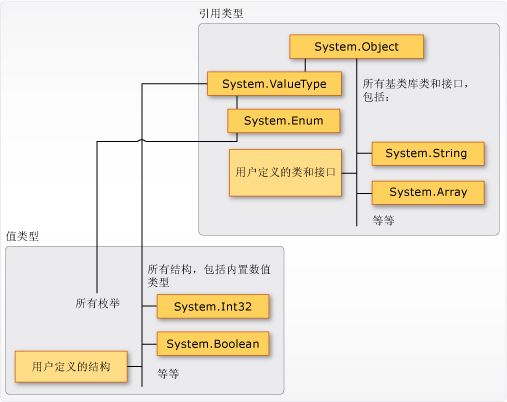
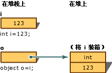
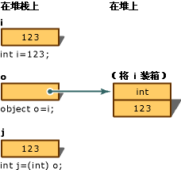

[C# programming guide](https://docs.microsoft.com/zh-cn/dotnet/csharp/programming-guide/index)

# Language Sections

## [Types](https://docs.microsoft.com/zh-cn/dotnet/csharp/programming-guide/types/index)

### Types, Variables, and Values

C# 是一种强类型语言。 每个变量和常量都有一个类型，每个求值的表达式也是如此。 每个方法签名指定了每个输入参数和返回值的类型。 .NET 类库定义了一组内置数值类型以及表示各种逻辑构造的更复杂类型（如文件系统、网络连接、对象的集合和数组以及日期）。 典型的 C# 程序使用类库中的类型，以及对程序问题域的专属概念进行建模的用户定义类型。

类型中可存储以下信息：

- 类型变量所需的存储空间。
- 可以表示的最大值和最小值。
- 包含的成员（方法、字段、事件等）。
- 继承自基类型。
- 在运行时分配变量内存的位置。
- 允许执行的运算种类。

编译器使用类型信息来确保在代码中执行的所有操作都是*类型安全*。 
例如，如果声明 [int](https://docs.microsoft.com/zh-cn/dotnet/csharp/language-reference/keywords/int) 类型的变量，那么编译器允许在加法和减法运算中使用此变量。 如果尝试对 [bool](https://docs.microsoft.com/zh-cn/dotnet/csharp/language-reference/keywords/bool) 类型的变量执行这些相同操作，则编译器将生成错误，如以下示例所示：

```c#
int a = 5;             
int b = a + 2; //OK

bool test = true;
  
// Error. Operator '+' cannot be applied to operands of type 'int' and 'bool'.
int c = a + test;
```

> C 和 C++ 开发人员请注意，在 C# 中，[bool](https://docs.microsoft.com/zh-cn/dotnet/csharp/language-reference/keywords/bool) 不能转换为 [int](https://docs.microsoft.com/zh-cn/dotnet/csharp/language-reference/keywords/int)。

编译器将类型信息作为元数据嵌入可执行文件中。 公共语言运行时 (CLR) 在运行时使用相应的元数据，从而在分配和回收内存时进一步保证类型安全性。

##### Specifying Types in Variable Declarations

在程序中声明变量或常量时，必须指定其类型，或使用 [var](https://docs.microsoft.com/zh-cn/dotnet/csharp/language-reference/keywords/var) 关键字，以便编译器能够推断出其类型。 以下示例显示了一些使用内置数值类型和复杂用户定义类型的变量声明：

```c#
// Declaration only:
float temperature;
string name;
MyClass myClass;

// Declaration with initializers (four examples):
char firstLetter = 'C';
var limit = 3;
int[] source = { 0, 1, 2, 3, 4, 5 };
var query = from item in source
            where item <= limit
            select item;
```

方法签名指定方法参数的类型和返回值。 
以下签名显示了需要 [int](https://docs.microsoft.com/zh-cn/dotnet/csharp/language-reference/keywords/int) 作为输入参数并返回字符串的方法：
```c#
public string GetName(int ID)
{
    if (ID < names.Length)
        return names[ID];
    else
        return String.Empty;
}
private string[] names = { "Spencer", "Sally", "Doug" };
```
在声明变量后，不能使用新类型重新声明该变量，并且不能为其分配与其声明的类型不兼容的值。 例如，不能在声明 [int](https://docs.microsoft.com/zh-cn/dotnet/csharp/language-reference/keywords/int) 后向其赋值 [true](https://docs.microsoft.com/zh-cn/dotnet/csharp/language-reference/keywords/true-literal) 布尔值。 不过，可以将值转换成其他类型。例如，在将值赋给新变量或作为方法自变量传递时。 编译器会自动执行不会导致数据丢失的*类型转换*。 如果类型转换可能会导致数据丢失，必须在源代码中进行*显式转换*。

有关详细信息，请参阅[显式转换和类型转换](https://docs.microsoft.com/zh-cn/dotnet/csharp/programming-guide/types/casting-and-type-conversions)。

### Built-in Types

C# 提供了一组标准的内置数值类型来表示整数、浮点值、布尔表达式、文本字符、十进制值和其他类型数据。 还有内置的 `string` 和 `object` 类型。 这些类型可供在任何 C# 程序中使用。 有关内置类型的详细信息，请参阅[类型参考表](https://docs.microsoft.com/zh-cn/dotnet/csharp/language-reference/keywords/reference-tables-for-types)。

### Custom Types

可以使用[结构](https://docs.microsoft.com/zh-cn/dotnet/csharp/language-reference/keywords/struct)、[类](https://docs.microsoft.com/zh-cn/dotnet/csharp/language-reference/keywords/class)、[接口](https://docs.microsoft.com/zh-cn/dotnet/csharp/language-reference/keywords/interface)，和[枚举](https://docs.microsoft.com/zh-cn/dotnet/csharp/language-reference/keywords/enum)构造创建你自己的自定义类型。 .NET 类库本身就是 Microsoft 提供的一组自定义类型，以供你在自己的应用程序中使用。 默认情况下，类库中最常用的类型在任何 C# 程序中均可用。 对于其他类型，只有在显式添加对定义这些类型的程序集的项目引用时才可用。 编译器引用程序集之后，你可以声明在源代码的此程序集中声明的类型的变量（和常量）。 有关详细信息，请参阅 [.NET 类库](https://docs.microsoft.com/zh-cn/dotnet/standard/class-library-overview)。

### The Common Type System
对于 .NET 中的类型系统，请务必了解以下两个基本要点：
- 它支持继承原则。 
  - 类型可以派生自其他类型（称为*基类型*）。 
  - 派生类型继承（有一些限制）基类型的方法、属性和其他成员。 
  - 基类型可以继而从某种其他类型派生，在这种情况下，派生类型继承其继承层次结构中的两种基类型的成员。 
  - 所有类型（包括 [System.Int32](https://docs.microsoft.com/zh-cn/dotnet/api/system.int32)C# 关键字：[int](https://docs.microsoft.com/zh-cn/dotnet/csharp/language-reference/keywords/int)等内置数值类型）最终都派生自单个基类型，
    - 即 [System.Object](https://docs.microsoft.com/zh-cn/dotnet/api/system.object)（C# 关键字：[object](https://docs.microsoft.com/zh-cn/dotnet/csharp/language-reference/keywords/object)。 这样的统一类型层次结构称为[通用类型系统](https://docs.microsoft.com/zh-cn/dotnet/standard/base-types/common-type-system) (CTS)。 

>  若要详细了解 C# 中的继承，请参阅[继承](https://docs.microsoft.com/zh-cn/dotnet/csharp/programming-guide/classes-and-structs/inheritance)。

- CTS 中的每种类型被定义为值类型或引用类型。 
  - 这包括 .NET 类库中的所有自定义类型以及你自己的用户定义类型。 
  - 使用 [struct](https://docs.microsoft.com/zh-cn/dotnet/csharp/language-reference/keywords/struct) 关键字定义的类型是值类型；
    - 所有内置数值类型都是 `structs`。 
  - 使用 [class](https://docs.microsoft.com/zh-cn/dotnet/csharp/language-reference/keywords/class) 关键字定义的类型是引用类型。 
  - 引用类型和值类型遵循不同的编译时规则和运行时行为。

下图展示了 CTS 中值类型和引用类型之间的关系。



CTS 中的值类型和引用类型

> 你可能会发现，最常用的类型全都被整理到了 [System](https://docs.microsoft.com/zh-cn/dotnet/api/system) 命名空间中。 不过，包含类型的命名空间与类型是值类型还是引用类型没有关系。

#### Value Types

值类型派生自[System.ValueType](https://docs.microsoft.com/zh-cn/dotnet/api/system.valuetype)（派生自 [System.Object](https://docs.microsoft.com/zh-cn/dotnet/api/system.object)）。 派生自 [System.ValueType](https://docs.microsoft.com/zh-cn/dotnet/api/system.valuetype) 的类型在 CLR 中具有特殊行为。 值类型变量直接包含它们的值，这意味着在声明变量的任何上下文中内联分配内存。 对于值类型变量，没有单独的堆分配或垃圾回收开销。

值类型分为两类：[结构](https://docs.microsoft.com/zh-cn/dotnet/csharp/language-reference/keywords/struct)和[枚举](https://docs.microsoft.com/zh-cn/dotnet/csharp/language-reference/keywords/enum)。

内置数值类型是结构，包含可以访问的属性和方法：

```c#
// Static method on type byte.  
byte b = byte.MaxValue;
```

不过，可以声明数值类型并向其赋值，就像它们是简单的非聚合类型一样：

```c#
byte num = 0xA;  
int i = 5;  
char c = 'Z';  
```

例如，值类型为“密封”，这意味着不能从 [System.Int32](https://docs.microsoft.com/zh-cn/dotnet/api/system.int32) 派生类型，并且不能将结构定义为从任何用户定义的类或结构继承，因为结构只能从 [System.ValueType](https://docs.microsoft.com/zh-cn/dotnet/api/system.valuetype) 继承。 但是，一个结构可以实现一个或多个接口。 可将结构类型强制转换为它实现的任何接口类型；这会导致装箱操作发生，以将结构包装在托管堆上的引用类型对象内。 当你将值类型传递给使用 [System.Object](https://docs.microsoft.com/zh-cn/dotnet/api/system.object) 或任何接口类型作为输入参数的方法时，就会发生装箱操作。 有关详细信息，请参阅[装箱和取消装箱](https://docs.microsoft.com/zh-cn/dotnet/csharp/programming-guide/types/boxing-and-unboxing)。

使用 [struct](https://docs.microsoft.com/zh-cn/dotnet/csharp/language-reference/keywords/struct) 关键字可以创建你自己的自定义值类型。 

结构通常用作一小组相关变量的容器，如以下示例所示：

```c#
public struct Coords
{
    public int x, y;

    public Coords(int p1, int p2)
    {
        x = p1;
        y = p2;
    }
}
```

有关结构的详细信息，请参阅[结构](https://docs.microsoft.com/zh-cn/dotnet/csharp/programming-guide/classes-and-structs/structs)。 有关 .NET 中的值类型的详细信息，请参阅[值类型](https://docs.microsoft.com/zh-cn/dotnet/csharp/language-reference/keywords/value-types)。

另一种值类型是[枚举](https://docs.microsoft.com/zh-cn/dotnet/csharp/language-reference/keywords/enum)。 枚举定义的是一组已命名的整型常量。 例如，.NET 类库中的 [System.IO.FileMode](https://docs.microsoft.com/zh-cn/dotnet/api/system.io.filemode) 枚举包含一组已命名的常量整数，用于指定打开文件应采用的方式。 

下面的示例展示了具体定义：

```c#
public enum FileMode
{
    CreateNew = 1,
    Create = 2,
    Open = 3,
    OpenOrCreate = 4,
    Truncate = 5,
    Append = 6,
}
```

`System.IO.FileMode.Create` 常量的值为 2。 不过，名称对于阅读源代码的人来说更有意义，因此，最好使用枚举，而不是常量数字文本。 有关更多信息，请参见[System.IO.FileMode](https://docs.microsoft.com/zh-cn/dotnet/api/system.io.filemode)。

所有枚举从 [System.Enum](https://docs.microsoft.com/zh-cn/dotnet/api/system.enum)（继承自 [System.ValueType](https://docs.microsoft.com/zh-cn/dotnet/api/system.valuetype)）继承。 适用于结构的所有规则也适用于枚举。 有关枚举的详细信息，请参阅[枚举类型](https://docs.microsoft.com/zh-cn/dotnet/csharp/programming-guide/enumeration-types)。

#### Reference Types

定义为[类](https://docs.microsoft.com/zh-cn/dotnet/csharp/language-reference/keywords/class)、[委托](https://docs.microsoft.com/zh-cn/dotnet/csharp/language-reference/keywords/delegate)、数组或[接口](https://docs.microsoft.com/zh-cn/dotnet/csharp/language-reference/keywords/interface)的类型是*引用类型*。 

在运行时，当声明引用类型的变量时，该变量会一直包含值[null](https://docs.microsoft.com/zh-cn/dotnet/csharp/language-reference/keywords/null)，直至使用 [new](https://docs.microsoft.com/zh-cn/dotnet/csharp/language-reference/keywords/new) 运算符显式创建对象，或者为该变量分配已经在其他位置使用 `new` 创建的对象，如下所示：

```c#
MyClass mc = new MyClass();  
MyClass mc2 = mc;  
```

接口必须与实现它的类对象一起初始化。 

如果 `MyClass` 实现 `IMyInterface`，则按以下示例所示创建 `IMyInterface` 的实例：

```c#
IMyInterface iface = new MyClass();  
```

创建对象后，内存会在托管堆上进行分配，并且变量只保留对对象位置的引用。 对于托管堆上的类型，在分配内存和 CLR 自动内存管理功能（称为“*垃圾回收*”）回收内存时都会产生开销。 不过，垃圾回收功能也已经过高度优化，大多数情况下，都不会导致性能问题出现。 有关垃圾回收的详细信息，请参阅[自动内存管理](https://docs.microsoft.com/zh-cn/dotnet/standard/automatic-memory-management)。

所有数组都是引用类型，即使元素是值类型，也不例外。 虽然数组隐式派生自 [System.Array](https://docs.microsoft.com/zh-cn/dotnet/api/system.array) 类，但可以使用 C# 提供的简化语法声明和使用数组，如以下示例所示：

```c#
// Declare and initialize an array of integers.
int[] nums = { 1, 2, 3, 4, 5 };

// Access an instance property of System.Array.
int len = nums.Length;
```

引用类型完全支持继承。 创建类时，可以继承自其他任何未定义为[密封](https://docs.microsoft.com/zh-cn/dotnet/csharp/language-reference/keywords/sealed)的接口或类，而其他类也可以继承自你的类并重写你的虚方法。 若要详细了解如何创建你自己的类，请参阅[类和结构](https://docs.microsoft.com/zh-cn/dotnet/csharp/programming-guide/classes-and-structs/index)。 有关继承和虚方法的详细信息，请参阅[继承](https://docs.microsoft.com/zh-cn/dotnet/csharp/programming-guide/classes-and-structs/inheritance)。

### Types of Literal Values
在 C# 中，文本值可从编译器获取类型。 
- 可以通过在数字末尾追加一个字母来指定数字文本应采用的类型。 
  - 例如，若要将值 4.56 指定为应按浮点值处理，请在数字后面追加“f”或“F”：`4.56f`。 
  - 如果没有追加字母，那么编译器就会推断文本值的类型。 
> 若要详细了解可以使用字母后缀指定哪些类型，请参阅[值类型](https://docs.microsoft.com/zh-cn/dotnet/csharp/language-reference/keywords/value-types)中的各个类型参考页。

由于文本已类型化，且所有类型最终都是从 [System.Object](https://docs.microsoft.com/zh-cn/dotnet/api/system.object) 派生，因此可以编写和编译如下所示的代码：

```c#
string s = "The answer is " + 5.ToString();
// Outputs: "The answer is 5"
Console.WriteLine(s);

Type type = 12345.GetType();
// Outputs: "System.Int32"
Console.WriteLine(type);
```

### Generic Types
泛型类型
- 类型可使用一个或多个*类型参数*进行声明，这些参数用作客户端代码在创建类型实例时提供的实际类型（*具体类型*）的占位符。
- 例如，.NET 类型 [System.Collections.Generic.List](https://docs.microsoft.com/zh-cn/dotnet/api/system.collections.generic.list-1) 具有一个类型参数，它按照惯例被命名为 *T*。

当创建类型的实例时，指定列表将包含的对象的类型，例如字符串：
```c#
List<string> stringList = new List<string>();
stringList.Add("String example");
// compile time error adding a type other than a string:
stringList.Add(4);
```

使用类型参数，可以重用同一个类来保留任何类型的元素，而无需将每个元素转换成[对象](https://docs.microsoft.com/zh-cn/dotnet/csharp/language-reference/keywords/object)。 泛型集合类称为*强类型集合*，因为编译器知道集合元素的具体类型，并能在编译时抛出错误，例如当尝试向上面示例中的 `stringList`对象添加整数时。 有关详细信息，请参阅[泛型](https://docs.microsoft.com/zh-cn/dotnet/csharp/programming-guide/generics/index)。

### Implicit Types, Anonymous Types, and Nullable Types

如上所述，可以使用 [var](https://docs.microsoft.com/zh-cn/dotnet/csharp/language-reference/keywords/var) 关键字隐式键入局部变量（但不是类成员）。 变量仍可在编译时获取类型，但类型是由编译器提供。 有关详细信息，请参阅[隐式类型局部变量](https://docs.microsoft.com/zh-cn/dotnet/csharp/programming-guide/classes-and-structs/implicitly-typed-local-variables)。

在某些情况下，为不打算在方法边界外存储或传递的各组简单的相关值创建已命名的类型并不方便。 因此，可以创建*匿名类型*。 有关详细信息，请参阅[匿名类型](https://docs.microsoft.com/zh-cn/dotnet/csharp/programming-guide/classes-and-structs/anonymous-types)。

普通值类型不能包含值 [null](https://docs.microsoft.com/zh-cn/dotnet/csharp/language-reference/keywords/null)。 不过，可以在类型后面附加 `?`，创建可以为 null 的值类型。 例如，`int?` 是还可以包含值 [null](https://docs.microsoft.com/zh-cn/dotnet/csharp/language-reference/keywords/null) 的 `int` 类型。 在 CTS 中，可以为 null 的类型是泛型结构类型 [System.Nullable](https://docs.microsoft.com/zh-cn/dotnet/api/system.nullable-1) 的实例。 在将数据传入和传出数据库（数值可能为 null）时，可以为 null 的类型特别有用。 有关详细信息，请参阅[可以为 null 的类型](https://docs.microsoft.com/zh-cn/dotnet/csharp/programming-guide/nullable-types/index)。

### [Casting and type conversions](https://docs.microsoft.com/zh-cn/dotnet/csharp/programming-guide/types/casting-and-type-conversions)

由于 C# 是在编译时静态类型化的，因此变量在声明后就无法再次声明，或无法分配另一种类型的值，除非该类型可以隐式转换为变量的类型。 

例如，`string` 无法隐式转换为 `int`。 因此，在将 `i` 声明为 `int` 后，无法将字符串“Hello”分配给它，如以下代码所示：

```c#
int i;  
i = "Hello"; // error CS0029: Cannot implicitly convert type 'string' to 'int'
```

但有时可能需要将值复制到其他类型的变量或方法参数中。 
- 可能需要将一个整数变量传递给参数类型化为 `double` 的方法。 
- 或者可能需要将类变量分配给接口类型的变量。 

这些类型的操作称为类型转换。 在 C# 中，可以执行以下几种类型的转换：

- **隐式转换**：
  - 由于这种转换是类型安全且不会导致数据丢失，因此无需使用任何特殊语法。 
  - 示例包括从较小整数类型到较大整数类型的转换以及从派生类到基类的转换。
- **显式转换（强制转换）**：
  - 必须使用强制转换运算符，才能执行显式转换。 
  - 在转换中可能丢失信息时或在出于其他原因转换可能不成功时，必须进行强制转换。 
  - 典型的示例包括从数值到精度较低或范围较小的类型的转换和从基类实例到派生类的转换。
- **用户定义的转换**：
  - 用户定义的转换是使用特殊方法执行，这些方法可定义为在没有基类和派生类关系的自定义类型之间启用显式转换和隐式转换。 
> 有关详细信息，请参阅[转换运算符](https://docs.microsoft.com/zh-cn/dotnet/csharp/programming-guide/statements-expressions-operators/conversion-operators)。
- **使用帮助程序类进行转换**：
  - 若要在非兼容类型（如整数和 [System.DateTime](https://docs.microsoft.com/zh-cn/dotnet/api/system.datetime) 对象，或十六进制字符串和字节数组）之间转换，可使用 [System.BitConverter](https://docs.microsoft.com/zh-cn/dotnet/api/system.bitconverter) 类、[System.Convert](https://docs.microsoft.com/zh-cn/dotnet/api/system.convert) 类和内置数值类型的 `Parse` 方法（如[Int32.Parse](https://docs.microsoft.com/zh-cn/dotnet/api/system.int32.parse)）。 
> 有关详细信息，请参阅[如何：将字节数组转换为 int](https://docs.microsoft.com/zh-cn/dotnet/csharp/programming-guide/types/how-to-convert-a-byte-array-to-an-int)、[操作说明：将字符串转换为数字](https://docs.microsoft.com/zh-cn/dotnet/csharp/programming-guide/types/how-to-convert-a-string-to-a-number)和[操作说明：在十六进制字符串与数值类型之间转换](https://docs.microsoft.com/zh-cn/dotnet/csharp/programming-guide/types/how-to-convert-between-hexadecimal-strings-and-numeric-types)。

#### 隐式转换

对于内置数值类型，如果要存储的值无需截断或四舍五入即可适应变量，则可以进行隐式转换。 

例如，[long](https://docs.microsoft.com/zh-cn/dotnet/csharp/language-reference/keywords/long) 类型的变量（64 位整数）能够存储 [int](https://docs.microsoft.com/zh-cn/dotnet/csharp/language-reference/keywords/int)（32 位整数）可存储的任何值。 

在下面的示例中，编译器先将右侧的 `num` 值隐式转换为 `long` 类型，再将它赋给 `bigNum`。

```c#
// Implicit conversion. A long can
// hold any value an int can hold, and more!
int num = 2147483647;
long bigNum = num;
```

有关所有隐式数值转换的完整列表，请参阅[隐式数值转换表](https://docs.microsoft.com/zh-cn/dotnet/csharp/language-reference/keywords/implicit-numeric-conversions-table)。

对于引用类型，隐式转换始终存在于从一个类转换为该类的任何一个直接或间接的基类或接口的情况。 由于派生类始终包含基类的所有成员，因此不必使用任何特殊语法。

```c#
Derived d = new Derived();  
Base b = d; // Always OK.  
```

#### 显示转换

但是，如果进行转换可能会导致信息丢失，则编译器会要求执行显式转换，显式转换也称为强制转换。 强制转换是显式告知编译器你打算进行转换且你知道可能会发生数据丢失的一种方式。 若要执行强制转换，请在要转换的值或变量前面的括号中指定要强制转换到的类型。 

下面的程序将 [double](https://docs.microsoft.com/zh-cn/dotnet/csharp/language-reference/keywords/double) 强制转换为 [int](https://docs.microsoft.com/zh-cn/dotnet/csharp/language-reference/keywords/int)。如不强制转换则该程序不会进行编译。

```c#
class Test
{
    static void Main()
    {
        double x = 1234.7;
        int a;
        // Cast double to int.
        a = (int)x;
        System.Console.WriteLine(a);
    }
}
// Output: 1234
```

有关支持的显式数值转换的列表，请参阅[显式数值转换表](https://docs.microsoft.com/zh-cn/dotnet/csharp/language-reference/keywords/explicit-numeric-conversions-table)。

对于引用类型，如果需要从基类型转换为派生类型，则必须进行显式强制转换：

```c#
// Create a new derived type.  
Giraffe g = new Giraffe();  
  
// Implicit conversion to base type is safe.  
Animal a = g;  
  
// Explicit conversion is required to cast back  
// to derived type. Note: This will compile but will  
// throw an exception at run time if the right-side  
// object is not in fact a Giraffe.  
Giraffe g2 = (Giraffe) a;  
```

引用类型之间的强制转换操作不会更改基础对象的运行时类型；它只更改用作对该对象引用的值的类型。 有关详细信息，请参阅[多态性](https://docs.microsoft.com/zh-cn/dotnet/csharp/programming-guide/classes-and-structs/polymorphism)。

#### 运行时的类型转换异常

在某些引用类型转换中，编译器无法确定强制转换是否会有效。 正确进行编译的强制转换操作有可能在运行时失败。 

如下面的示例所示，类型转换在运行时失败将导致引发 [InvalidCastException](https://docs.microsoft.com/zh-cn/dotnet/api/system.invalidcastexception)。

```c#
using System;

class Animal
{
    public void Eat() { Console.WriteLine("Eating."); }
    public override string ToString()
    {
        return "I am an animal.";
    }
}
class Reptile : Animal { }
class Mammal : Animal { }

class UnSafeCast
{
    static void Main()
    {            
        Test(new Mammal());

        // Keep the console window open in debug mode.
        Console.WriteLine("Press any key to exit.");
        Console.ReadKey();
    }

    static void Test(Animal a)
    {
        // Cause InvalidCastException at run time 
        // because Mammal is not convertible to Reptile.
        Reptile r = (Reptile)a;
    }

}
```

C# 提供 [is](https://docs.microsoft.com/zh-cn/dotnet/csharp/language-reference/keywords/is) 和 [as](https://docs.microsoft.com/zh-cn/dotnet/csharp/language-reference/keywords/as) 运算符，使你可以在实际执行强制转换之前测试兼容性。 有关详细信息，请参阅[如何：使用模式匹配以及 as 和 is 运算符安全地进行强制转换](https://docs.microsoft.com/zh-cn/dotnet/csharp/how-to/safely-cast-using-pattern-matching-is-and-as-operators)。

### [Boxing and Unboxing](https://docs.microsoft.com/zh-cn/dotnet/csharp/programming-guide/types/boxing-and-unboxing)

装箱是将[值类型](https://docs.microsoft.com/zh-cn/dotnet/csharp/language-reference/keywords/value-types)转换为 `object` 类型或由此值类型实现的任何接口类型的过程。 

- 当 CLR 对值类型进行装箱时，会将该值包装到 System.Object 内部，再将后者存储在托管堆上。 
- 取消装箱将从对象中提取值类型。 
- 装箱是隐式的；取消装箱是显式的。 
- 装箱和取消装箱的概念是类型系统 C# 统一视图的基础，其中任一类型的值都被视为一个对象。

下例将整型变量 `i` 进行了装箱并分配给对象 `o`。

```c#
int i = 123;
// The following line boxes i.
object o = i;  
```

然后，可以将对象 `o` 取消装箱并分配给整型变量 `i`：

```c#
o = 123;
i = (int)o;  // unboxing
```

以下示例演示如何在 C# 中使用装箱。

```c#
// String.Concat example.
// String.Concat has many versions. Rest the mouse pointer on 
// Concat in the following statement to verify that the version
// that is used here takes three object arguments. Both 42 and
// true must be boxed.
Console.WriteLine(String.Concat("Answer", 42, true));


// List example.
// Create a list of objects to hold a heterogeneous collection 
// of elements.
List<object> mixedList = new List<object>();

// Add a string element to the list. 
mixedList.Add("First Group:");

// Add some integers to the list. 
for (int j = 1; j < 5; j++)
{
    // Rest the mouse pointer over j to verify that you are adding
    // an int to a list of objects. Each element j is boxed when 
    // you add j to mixedList.
    mixedList.Add(j);
}

// Add another string and more integers.
mixedList.Add("Second Group:");
for (int j = 5; j < 10; j++)
{
    mixedList.Add(j);
}

// Display the elements in the list. Declare the loop variable by 
// using var, so that the compiler assigns its type.
foreach (var item in mixedList)
{
    // Rest the mouse pointer over item to verify that the elements
    // of mixedList are objects.
    Console.WriteLine(item);
}

// The following loop sums the squares of the first group of boxed
// integers in mixedList. The list elements are objects, and cannot
// be multiplied or added to the sum until they are unboxed. The
// unboxing must be done explicitly.
var sum = 0;
for (var j = 1; j < 5; j++)
{
    // The following statement causes a compiler error: Operator 
    // '*' cannot be applied to operands of type 'object' and
    // 'object'. 
    //sum += mixedList[j] * mixedList[j]);

    // After the list elements are unboxed, the computation does 
    // not cause a compiler error.
    sum += (int)mixedList[j] * (int)mixedList[j];
}

// The sum displayed is 30, the sum of 1 + 4 + 9 + 16.
Console.WriteLine("Sum: " + sum);

// Output:
// Answer42True
// First Group:
// 1
// 2
// 3
// 4
// Second Group:
// 5
// 6
// 7
// 8
// 9
// Sum: 30
```

#### 性能

相对于简单的赋值而言，装箱和取消装箱过程需要进行大量的计算。 对值类型进行装箱时，必须分配并构造一个新对象。 取消装箱所需的强制转换也需要进行大量的计算，只是程度较轻。 有关更多信息，请参阅[性能](https://docs.microsoft.com/zh-cn/dotnet/framework/performance/performance-tips)。

#### 装箱

装箱用于在垃圾回收堆中存储值类型。 
装箱是[值类型](https://docs.microsoft.com/zh-cn/dotnet/csharp/language-reference/keywords/value-types)到 `object` 类型或到此值类型所实现的任何接口类型的隐式转换。 
对值类型装箱会在堆中分配一个对象实例，并将该值复制到新的对象中。

请看以下值类型变量的声明：

```c#
int i = 123;
```

以下语句对变量 `i` 隐式应用了装箱操作：

```c#
// Boxing copies the value of i into object o.
object o = i;  
```

此语句的结果是在栈上创建对象引用 `o`，而在堆上则引用 `int` 类型的值。 该值是赋给变量 `i` 的值类型值的一个副本。 下图说明了两个变量 `i` 和 `o` 之间的差异。



还可以像下面的示例一样执行显式装箱，但显式装箱从来不是必需的：

```c#
int i = 123;
object o = (object)i;  // explicit boxing
```

#### 说明

此示例使用装箱将整型变量 `i` 转换为对象 `o`。 这样一来，存储在变量 `i` 中的值就从 `123` 更改为 `456`。 该示例表明原始值类型和装箱的对象使用不同的内存位置，因此能够存储不同的值。

##### 示例

```c#
class TestBoxing
{
    static void Main()
    {
        int i = 123;

        // Boxing copies the value of i into object o.
        object o = i;  

        // Change the value of i.
        i = 456;  

        // The change in i doesn't affect the value stored in o.
        System.Console.WriteLine("The value-type value = {0}", i);
        System.Console.WriteLine("The object-type value = {0}", o);
    }
}
/* Output:
    The value-type value = 456
    The object-type value = 123
*/
```

#### 取消装箱

取消装箱是从 `object` 类型到[值类型](https://docs.microsoft.com/zh-cn/dotnet/csharp/language-reference/keywords/value-types)或从接口类型到实现该接口的值类型的显式转换。 

取消装箱操作包括：
- 检查对象实例，以确保它是给定值类型的装箱值。
- 将该值从实例复制到值类型变量中。

下面的语句演示装箱和取消装箱两种操作：
```c#
int i = 123;      // a value type
object o = i;     // boxing
int j = (int)o;   // unboxing
```

下图演示上述语句的结果。

取消装箱转换
要在运行时成功取消装箱值类型，被取消装箱的项必须是对一个对象的引用，该对象是先前通过装箱该值类型的实例创建的。 尝试取消装箱 `null` 会导致 [NullReferenceException](https://docs.microsoft.com/zh-cn/dotnet/api/system.nullreferenceexception)。 尝试取消装箱对不兼容值类型的引用会导致[InvalidCastException](https://docs.microsoft.com/zh-cn/dotnet/api/system.invalidcastexception)。

##### 示例
下面的示例演示无效的取消装箱及引发的 `InvalidCastException`。 使用 `try` 和 `catch`，在发生错误时显示错误信息。

```c#
class TestUnboxing
{
    static void Main()
    {
        int i = 123;
        object o = i;  // implicit boxing

        try
        {
            int j = (short)o;  // attempt to unbox

            System.Console.WriteLine("Unboxing OK.");
        }
        catch (System.InvalidCastException e)
        {
            System.Console.WriteLine("{0} Error: Incorrect unboxing.", e.Message);
        }
    }
}
```
此程序输出：
```
Specified cast is not valid. Error: Incorrect unboxing.
```
如果将下列语句：
```c#
int j = (short) o;  
```
更改为：
```c#
int j = (int) o;  
```
将执行转换，并将得到以下输出：
```c#
Unboxing OK.
```

### [Using type dynamic](https://docs.microsoft.com/zh-cn/dotnet/csharp/programming-guide/types/using-type-dynamic)

C# 4 引入了一个新类型 `dynamic`。 该类型是一种静态类型，但类型为 `dynamic` 的对象会跳过静态类型检查。 大多数情况下，该对象就像具有类型 `object` 一样。 在编译时，将假定类型化为 `dynamic` 的元素支持任何操作。因此，不必考虑对象是从 COM API、从动态语言（例如 IronPython）、从 HTML 文档对象模型 (DOM)、从反射还是从程序中的其他位置获取自己的值。 但是，如果代码无效，则在运行时会捕获到错误。

例如，如果以下代码中的实例方法 `exampleMethod1` 只有一个形参，则编译器会将对该方法的第一个调用 `ec.exampleMethod1(10, 4)` 识别为无效，因为它包含两个实参。 该调用将导致编译器错误。 编译器不会检查对该方法的第二个调用 `dynamic_ec.exampleMethod1(10, 4)`，因为 `dynamic_ec` 的类型为 `dynamic`。 因此，不会报告编译器错误。 但是，该错误不会被无限期疏忽。 它将在运行时被捕获，并导致运行时异常。

```c#
static void Main(string[] args)
{
    ExampleClass ec = new ExampleClass();
    // The following call to exampleMethod1 causes a compiler error 
    // if exampleMethod1 has only one parameter. Uncomment the line
    // to see the error.
    //ec.exampleMethod1(10, 4);

    dynamic dynamic_ec = new ExampleClass();
    // The following line is not identified as an error by the
    // compiler, but it causes a run-time exception.
    dynamic_ec.exampleMethod1(10, 4);

    // The following calls also do not cause compiler errors, whether 
    // appropriate methods exist or not.
    dynamic_ec.someMethod("some argument", 7, null);
    dynamic_ec.nonexistentMethod();
}
```

```c#
class ExampleClass
{
    public ExampleClass() { }
    public ExampleClass(int v) { }

    public void exampleMethod1(int i) { }

    public void exampleMethod2(string str) { }
}
```

在这些示例中，编译器的作用是将有关每个语句的预期作用的信息一起打包到类型化为 `dynamic` 的对象或表达式。 在运行时，将对存储的信息进行检查，并且任何无效的语句都将导致运行时异常。

大多数动态操作的结果是其本身 `dynamic`。 例如，如果将鼠标指针放在以下示例中使用的 `testSum` 上，则 IntelliSense 将显示类型“（局部变量）dynamic testSum”。

```c#
dynamic d = 1;
var testSum = d + 3;
// Rest the mouse pointer over testSum in the following statement.
System.Console.WriteLine(testSum);
```

结果不为 `dynamic` 的操作包括：

- 从 `dynamic` 到另一种类型的转换。
- 包括类型为 `dynamic` 的自变量的构造函数调用。

例如，以下声明中 `testInstance` 的类型为 `ExampleClass`，而不是 `dynamic`：

```c#
var testInstance = new ExampleClass(d);
```

#### 转换

动态对象和其他类型之间的转换非常简单。 这样，开发人员将能够在动态行为和非动态行为之间切换。

任何对象都可隐式转换为动态类型，如以下示例所示。

```c#
dynamic d1 = 7;
dynamic d2 = "a string";
dynamic d3 = System.DateTime.Today;
dynamic d4 = System.Diagnostics.Process.GetProcesses();
```

反之，隐式转换也可动态地应用于类型为 `dynamic` 的任何表达式。

```c#
int i = d1;
string str = d2;
DateTime dt = d3;
System.Diagnostics.Process[] procs = d4;
```

#### 使用类型为 dynamic 的参数重载决策

如果方法调用中的一个或多个参数的类型为 `dynamic`，或者方法调用的接收方的类型为 `dynamic`，则会在运行时（而不是在编译时）进行重载决策。 在以下示例中，如果唯一可访问的 `exampleMethod2` 方法定义为接受字符串参数，则将 `d1` 作为参数发送不会导致编译器错误，但却会导致运行时异常。 重载决策之所以会在运行时失败，是因为 `d1` 的运行时类型为 `int`，而 `exampleMethod2` 要求为字符串。

```c#
// Valid.
ec.exampleMethod2("a string");

// The following statement does not cause a compiler error, even though ec is not
// dynamic. A run-time exception is raised because the run-time type of d1 is int.
ec.exampleMethod2(d1);
// The following statement does cause a compiler error.
//ec.exampleMethod2(7);
```

#### 动态语言运行时

动态语言运行时 (DLR) 是 .NET Framework 4 中的一个新 API。 它提供了支持 C# 中 `dynamic` 类型的基础结构，还提供了 IronPython 和 IronRuby 等动态编程语言的实现。 有关 DLR 的详细信息，请参阅[动态语言运行时概述](https://docs.microsoft.com/zh-cn/dotnet/framework/reflection-and-codedom/dynamic-language-runtime-overview)。

#### COM 互操作

C# 4 包括若干功能，这些功能改善了与 COM API（例如 Office 自动化 API）的互操作体验。 这些改进之处包括 `dynamic` 类型以及[命名参数和可选参数](https://docs.microsoft.com/zh-cn/dotnet/csharp/programming-guide/classes-and-structs/named-and-optional-arguments)的用法。

通过将类型指定为 `object`，许多 COM 方法都允许参数类型和返回类型发生变化。 这样，就必须显式强制转换值，以便与 C# 中的强类型变量保持协调。 如果使用 [/link（C# 编译器选项）](https://docs.microsoft.com/zh-cn/dotnet/csharp/language-reference/compiler-options/link-compiler-option)选项进行编译，则可以通过引入 `dynamic` 类型将 COM 签名中出现的 `object` 看作是 `dynamic` 类型，从而避免大量的强制转换。 例如，以下语句对比了在使用 `dynamic` 类型和不使用 `dynamic` 类型的情况下如何访问 Microsoft Office Excel 电子表格中的单元格。

```c#
// Before the introduction of dynamic.
((Excel.Range)excelApp.Cells[1, 1]).Value2 = "Name";
Excel.Range range2008 = (Excel.Range)excelApp.Cells[1, 1];
```

```c#
// After the introduction of dynamic, the access to the Value property and
// the conversion to Excel.Range are handled by the run-time COM binder.
excelApp.Cells[1, 1].Value = "Name";
Excel.Range range2010 = excelApp.Cells[1, 1];
```

#### 相关主题

| [dynamic](https://docs.microsoft.com/zh-cn/dotnet/csharp/language-reference/keywords/dynamic) | 描述 `dynamic` 关键字的用法。                                |
| ------------------------------------------------------------ | ------------------------------------------------------------ |
| [动态语言运行时概述](https://docs.microsoft.com/zh-cn/dotnet/framework/reflection-and-codedom/dynamic-language-runtime-overview) | 提供有关 DLR 的概述，DLR 是一种运行时环境，它将一组适用于动态语言的服务添加到公共语言运行时 (CLR)。 |
| [演练：创建和使用动态对象](https://docs.microsoft.com/zh-cn/dotnet/csharp/programming-guide/types/walkthrough-creating-and-using-dynamic-objects) | 提供有关如何创建自定义动态对象以及创建访问 `IronPython` 库的对象的分步说明。 |
| [如何：通过使用 Visual C# 功能访问 Office 互操作对象](https://docs.microsoft.com/zh-cn/dotnet/csharp/programming-guide/interop/how-to-access-office-onterop-objects) | 演示如何创建一个项目，该项目使用命名参数和可选参数、`dynamic` 类型以及可简化对 Office API 对象的访问的其他增强功能。 |

#### [Walkthrough: Creating and Using Dynamic Objects(待补)](https://docs.microsoft.com/zh-cn/dotnet/csharp/programming-guide/types/walkthrough-creating-and-using-dynamic-objects)

### [How to: safely cast by using pattern matching is and as operators](https://docs.microsoft.com/zh-cn/dotnet/csharp/how-to/safely-cast-using-pattern-matching-is-and-as-operators)

> 该节原文变换位置

### [How to: Convert a byte Array to an int](https://docs.microsoft.com/zh-cn/dotnet/csharp/programming-guide/types/how-to-convert-a-byte-array-to-an-int)

此示例演示如何使用 [BitConverter](https://docs.microsoft.com/zh-cn/dotnet/api/system.bitconverter) 类将字节数组转换为 [int](https://docs.microsoft.com/zh-cn/dotnet/csharp/language-reference/keywords/int) 然后又转换回字节数组。 
- 例如，在从网络读取字节之后，可能需要将字节转换为内置数据类型。 

除了示例中的 [ToInt32(Byte[], Int32)](https://docs.microsoft.com/zh-cn/dotnet/api/system.bitconverter.toint32#System_BitConverter_ToInt32_System_Byte___System_Int32_) 方法之外，下表还列出了[BitConverter](https://docs.microsoft.com/zh-cn/dotnet/api/system.bitconverter) 类中将字节（来自字节数组）转换为其他内置类型的方法。

| 返回类型 | 方法                                                         |
| -------- | ------------------------------------------------------------ |
| `bool`   | [`ToBoolean(Byte[], Int32)`](https://docs.microsoft.com/zh-cn/dotnet/api/system.bitconverter.toboolean#System_BitConverter_ToBoolean_System_Byte___System_Int32_) |
| `char`   | [`ToChar(Byte[], Int32)`](https://docs.microsoft.com/zh-cn/dotnet/api/system.bitconverter.tochar#System_BitConverter_ToChar_System_Byte___System_Int32_) |
| `double` | [ToDouble(Byte[], Int32)](https://docs.microsoft.com/zh-cn/dotnet/api/system.bitconverter.todouble#System_BitConverter_ToDouble_System_Byte___System_Int32_) |
| `short`  | [ToInt16(Byte[], Int32)](https://docs.microsoft.com/zh-cn/dotnet/api/system.bitconverter.toint16#System_BitConverter_ToInt16_System_Byte___System_Int32_) |
| `int`    | [ToInt32(Byte[], Int32)](https://docs.microsoft.com/zh-cn/dotnet/api/system.bitconverter.toint32#System_BitConverter_ToInt32_System_Byte___System_Int32_) |
| `long`   | [ToInt64(Byte[], Int32)](https://docs.microsoft.com/zh-cn/dotnet/api/system.bitconverter.toint64#System_BitConverter_ToInt64_System_Byte___System_Int32_) |
| `float`  | [ToSingle(Byte[], Int32)](https://docs.microsoft.com/zh-cn/dotnet/api/system.bitconverter.tosingle#System_BitConverter_ToSingle_System_Byte___System_Int32_) |
| `ushort` | [ToUInt16(Byte[], Int32)](https://docs.microsoft.com/zh-cn/dotnet/api/system.bitconverter.touint16#System_BitConverter_ToUInt16_System_Byte___System_Int32_) |
| `uint`   | [ToUInt32(Byte[], Int32)](https://docs.microsoft.com/zh-cn/dotnet/api/system.bitconverter.touint32#System_BitConverter_ToUInt32_System_Byte___System_Int32_) |
| `ulong`  | [ToUInt64(Byte[], Int32)](https://docs.microsoft.com/zh-cn/dotnet/api/system.bitconverter.touint64#System_BitConverter_ToUInt64_System_Byte___System_Int32_) |

#### 示例1

此示例初始化字节数组，并在计算机体系结构为 little-endian（即首先存储最低有效字节）的情况下反转数组，然后调用 [ToInt32(Byte[], Int32)](https://docs.microsoft.com/zh-cn/dotnet/api/system.bitconverter.toint32#System_BitConverter_ToInt32_System_Byte___System_Int32_) 方法以将数组中的四个字节转换为 `int`。 [ToInt32(Byte[], Int32)](https://docs.microsoft.com/zh-cn/dotnet/api/system.bitconverter.toint32#System_BitConverter_ToInt32_System_Byte___System_Int32_) 的第二个参数指定字节数组的起始索引。

> 输出可能会根据计算机体系结构的 endian 设置而不同。

```c#
byte[] bytes = { 0, 0, 0, 25 };

// If the system architecture is little-endian (that is, little end first),
// reverse the byte array.
if (BitConverter.IsLittleEndian)
    Array.Reverse(bytes);

int i = BitConverter.ToInt32(bytes, 0);
Console.WriteLine("int: {0}", i);
// Output: int: 25
```

#### 示例2

在本示例中，将调用 [BitConverter](https://docs.microsoft.com/zh-cn/dotnet/api/system.bitconverter) 类的 [GetBytes(Int32)](https://docs.microsoft.com/zh-cn/dotnet/api/system.bitconverter.getbytes#System_BitConverter_GetBytes_System_Int32_) 方法，将 `int` 转换为字节数组。

>  输出可能会根据计算机体系结构的 endian 设置而不同。

```C#
byte[] bytes = BitConverter.GetBytes(201805978);
Console.WriteLine("byte array: " + BitConverter.ToString(bytes));
// Output: byte array: 9A-50-07-0C
```

### [How to: Convert a String to a Number](https://docs.microsoft.com/zh-cn/dotnet/csharp/programming-guide/types/how-to-convert-a-string-to-a-number)

可以使用 [Convert](https://docs.microsoft.com/zh-cn/dotnet/api/system.convert) 类中的方法或使用各种数值类型（int、long、float 等）中的 `TryParse` 方法将[字符串](https://docs.microsoft.com/zh-cn/dotnet/csharp/language-reference/keywords/string)转换为数字。

如果你具有字符串，则调用 `TryParse` 方法（例如，[`int.TryParse("11", out number)`](https://docs.microsoft.com/zh-cn/dotnet/api/system.int32.tryparse)）会稍微更加高效且简单。 使用 [Convert](https://docs.microsoft.com/zh-cn/dotnet/api/system.convert) 方法对于实现 [IConvertible](https://docs.microsoft.com/zh-cn/dotnet/api/system.iconvertible) 的常规对象更有用。

可以对预期字符串会包含的数值类型（如 [System.Int32](https://docs.microsoft.com/zh-cn/dotnet/api/system.int32) 类型）使用 `Parse` 或 `TryParse` 方法。 [Convert.ToUInt32](https://docs.microsoft.com/zh-cn/dotnet/api/system.convert.touint32)方法在内部使用 [Parse](https://docs.microsoft.com/zh-cn/dotnet/api/system.int32.parse)。 如果字符串的格式无效，则 `Parse` 会引发异常，而 `TryParse` 会返回 [false](https://docs.microsoft.com/zh-cn/dotnet/csharp/language-reference/keywords/false)。

#### 示例1

`Parse` 和 `TryParse` 方法会忽略字符串开头和末尾的空白符，但其他所有字符都必须是组成合适数值类型（int、long、ulong、float、decimal 等）的字符。 如果组成数字的字符中有任何空白符，都会导致错误出现。 例如，可以使用 `decimal.TryParse` 分析“10”、“10.3”、“ 10 ”，但不能使用此方法分析从“10X”、“1 0”（注意空格）、“10 .3”（注意空格）、“10e1”（`float.TryParse` 在此处适用）等中分析出 10。

下面的示例演示了对 `Parse` 和 `TryParse` 的成功调用和不成功的调用。

```c#
using System;
using System.Text;
```

```c#
int numVal = Int32.Parse("-105");
Console.WriteLine(numVal);
// Output: -105
```

```c#
// TryParse returns true if the conversion succeeded
// and stores the result in j.
int j;
if (Int32.TryParse("-105", out j))
    Console.WriteLine(j);
else
    Console.WriteLine("String could not be parsed.");
// Output: -105
```

```c#
try
{
    int m = Int32.Parse("abc");
}
catch (FormatException e)
{
    Console.WriteLine(e.Message);
}
// Output: Input string was not in a correct format.
```

```c#
string inputString = "abc";
int numValue;
bool parsed = Int32.TryParse(inputString, out numValue);

if (!parsed)
    Console.WriteLine("Int32.TryParse could not parse '{0}' to an int.\n", inputString);

// Output: Int32.TryParse could not parse 'abc' to an int.
```

```c#
// This snippet shows a couple of examples that extract number characters from the
// beginning of the string to avoid TryParse errors.
StringBuilder sb = new StringBuilder();
var str = "  10FFxxx";
foreach (char c in str) {
    // Check for numeric characters (hex in this case).  Add "." and "e" if float,
    // and remove letters.  Include initial space because it is harmless.
    if ((c >= '0' && c <= '9') || (c >= 'A' && c <= 'F') || (c >= 'a' && c <= 'f') || c == ' ') {
        sb.Append(c);
    }
    else
        break;
}
if (int.TryParse(sb.ToString(), System.Globalization.NumberStyles.HexNumber, null, out int i))
    Console.WriteLine(sb.ToString());

str = "   -10FFXXX";
sb.Clear();
foreach (char c in str) {
    // Check for numeric characters (allow negative in this case but no hex digits). 
    // Though we use int.TryParse in the previous example and this one, int.TryParse does NOT
    // allow a sign character (-) AND hex digits at the same time.
    // Include initial space because it is harmless.
    if ((c >= '0' && c <= '9') || c == ' ' || c == '-') {
        sb.Append(c);
    } else
        break;
}
if (int.TryParse(sb.ToString(), out int j))
    Console.WriteLine(sb.ToString());
```

#### 示例2

下表列出了 [Convert](https://docs.microsoft.com/zh-cn/dotnet/api/system.convert) 类中可使用的一些方法。

| 数值类型  | 方法                                                         |
| --------- | ------------------------------------------------------------ |
| `decimal` | [ToDecimal(String)](https://docs.microsoft.com/zh-cn/dotnet/api/system.convert.todecimal#System_Convert_ToDecimal_System_String_) |
| `float`   | [ToSingle(String)](https://docs.microsoft.com/zh-cn/dotnet/api/system.convert.tosingle#System_Convert_ToSingle_System_String_) |
| `double`  | [ToDouble(String)](https://docs.microsoft.com/zh-cn/dotnet/api/system.convert.todouble#System_Convert_ToDouble_System_String_) |
| `short`   | [ToInt16(String)](https://docs.microsoft.com/zh-cn/dotnet/api/system.convert.toint16#System_Convert_ToInt16_System_String_) |
| `int`     | [ToInt32(String)](https://docs.microsoft.com/zh-cn/dotnet/api/system.convert.toint32#System_Convert_ToInt32_System_String_) |
| `long`    | [ToInt64(String)](https://docs.microsoft.com/zh-cn/dotnet/api/system.convert.toint64#System_Convert_ToInt64_System_String_) |
| `ushort`  | [ToUInt16(String)](https://docs.microsoft.com/zh-cn/dotnet/api/system.convert.touint16#System_Convert_ToUInt16_System_String_) |
| `uint`    | [ToUInt32(String)](https://docs.microsoft.com/zh-cn/dotnet/api/system.convert.touint32#System_Convert_ToUInt32_System_String_) |
| `ulong`   | [ToUInt64(String)](https://docs.microsoft.com/zh-cn/dotnet/api/system.convert.touint64#System_Convert_ToUInt64_System_String_) |

此示例调用 [Convert.ToInt32(String)](https://docs.microsoft.com/zh-cn/dotnet/api/system.convert.toint32#System_Convert_ToInt32_System_String_) 方法将输入的 [string](https://docs.microsoft.com/zh-cn/dotnet/csharp/language-reference/keywords/string) 转换为 [int](https://docs.microsoft.com/zh-cn/dotnet/csharp/language-reference/keywords/int)。 代码将捕获此方法可能引发的最常见的两个异常：[FormatException](https://docs.microsoft.com/zh-cn/dotnet/api/system.formatexception) 和 [OverflowException](https://docs.microsoft.com/zh-cn/dotnet/api/system.overflowexception)。 如果该数字可以递增而不溢出整数存储位置，则程序使结果加上 1 并打印输出。

```C#
using System;
using System.Text;
```

```c#
static void Main(string[] args)
{
    int numVal = -1;
    bool repeat = true;

    while (repeat)
    {
        Console.WriteLine("Enter a number between −2,147,483,648 and +2,147,483,647 (inclusive).");

        string input = Console.ReadLine();

        // ToInt32 can throw FormatException or OverflowException.
        try
        {
            numVal = Convert.ToInt32(input);
        }
        catch (FormatException e)
        {
            Console.WriteLine("Input string is not a sequence of digits.");
        }
        catch (OverflowException e)
        {
            Console.WriteLine("The number cannot fit in an Int32.");
        }
        finally
        {
            if (numVal < Int32.MaxValue)
            {
                Console.WriteLine("The new value is {0}", numVal + 1);
            }
            else
            {
                Console.WriteLine("numVal cannot be incremented beyond its current value");
            }
        }
        Console.WriteLine("Go again? Y/N");
        string go = Console.ReadLine();
        if (go == "Y" || go == "y")
        {
            repeat = true;
        }
        else
        {
            repeat = false;
        }
    }
    // Keep the console open in debug mode.
    Console.WriteLine("Press any key to exit.");
    Console.ReadKey();    
}
// Sample Output:
// Enter a number between -2,147,483,648 and +2,147,483,647 (inclusive).
// 473
// The new value is 474
// Go again? Y/N
// y
// Enter a number between -2,147,483,648 and +2,147,483,647 (inclusive).
// 2147483647
// numVal cannot be incremented beyond its current value
// Go again? Y/N
// Y
// Enter a number between -2,147,483,648 and +2,147,483,647 (inclusive).
// -1000
// The new value is -999
// Go again? Y/N
// n
// Press any key to exit.
```

### [How to: Convert Between Hexadecimal Strings and Numeric Types](https://docs.microsoft.com/zh-cn/dotnet/csharp/programming-guide/types/how-to-convert-between-hexadecimal-strings-and-numeric-types)

以下示例演示如何执行下列任务：

- 获取[字符串](https://docs.microsoft.com/zh-cn/dotnet/csharp/language-reference/keywords/string)中每个字符的十六进制值。
- 获取与十六进制字符串中的每个值对应的 [char](https://docs.microsoft.com/zh-cn/dotnet/csharp/language-reference/keywords/char)。
- 将十六进制 `string` 转换为 [int](https://docs.microsoft.com/zh-cn/dotnet/csharp/language-reference/keywords/int)。
- 将十六进制 `string` 转换为 [float](https://docs.microsoft.com/zh-cn/dotnet/csharp/language-reference/keywords/float)。
- 将[字节](https://docs.microsoft.com/zh-cn/dotnet/csharp/language-reference/keywords/byte)数组转换为十六进制 `string`。

#### 示例1

此示例输出 `string` 中每个字符的十六进制值。 首先，将 `string` 分析为字符数组。 然后，对每个字符调用[ToInt32(Char)](https://docs.microsoft.com/zh-cn/dotnet/api/system.convert.toint32#System_Convert_ToInt32_System_Char_)获取相应的数值。 最后，在 `string` 中将数字的格式设置为十六进制表示形式。

```c#
string input = "Hello World!";
char[] values = input.ToCharArray();
foreach (char letter in values)
{
    // Get the integral value of the character.
    int value = Convert.ToInt32(letter);
    // Convert the integer value to a hexadecimal value in string form.
    Console.WriteLine($"Hexadecimal value of {letter} is {value:X}");
}
/* Output:
    Hexadecimal value of H is 48
    Hexadecimal value of e is 65
    Hexadecimal value of l is 6C
    Hexadecimal value of l is 6C
    Hexadecimal value of o is 6F
    Hexadecimal value of   is 20
    Hexadecimal value of W is 57
    Hexadecimal value of o is 6F
    Hexadecimal value of r is 72
    Hexadecimal value of l is 6C
    Hexadecimal value of d is 64
    Hexadecimal value of ! is 21
 */
```

#### 示例2

此示例分析十六进制值的 `string` 并输出对应于每个十六进制值的字符。 首先，调用 [Split(Char[\])](https://docs.microsoft.com/zh-cn/dotnet/api/system.string.split#System_String_Split_System_Char___) 方法以获取每个十六进制值作为数组中的单个 `string`。 然后，调用 [ToInt32(String, Int32)](https://docs.microsoft.com/zh-cn/dotnet/api/system.convert.toint32#System_Convert_ToInt32_System_String_System_Int32_)将十六进制值转换为表示为 [int](https://docs.microsoft.com/zh-cn/dotnet/csharp/language-reference/keywords/int) 的十进制值。示例中演示了 2 种不同方法，用于获取对应于该字符代码的字符。 第 1 种方法是使用[ConvertFromUtf32(Int32)](https://docs.microsoft.com/zh-cn/dotnet/api/system.char.convertfromutf32#System_Char_ConvertFromUtf32_System_Int32_)，它将对应于整型参数的字符作为 `string` 返回。 第 2 种方法是将 `int` 显式转换为 [char](https://docs.microsoft.com/zh-cn/dotnet/csharp/language-reference/keywords/char)。

```c#
string hexValues = "48 65 6C 6C 6F 20 57 6F 72 6C 64 21";
string[] hexValuesSplit = hexValues.Split(' ');
foreach (string hex in hexValuesSplit)
{
    // Convert the number expressed in base-16 to an integer.
    int value = Convert.ToInt32(hex, 16);
    // Get the character corresponding to the integral value.
    string stringValue = Char.ConvertFromUtf32(value);
    char charValue = (char)value;
    Console.WriteLine("hexadecimal value = {0}, int value = {1}, char value = {2} or {3}",
                        hex, value, stringValue, charValue);
}
/* Output:
    hexadecimal value = 48, int value = 72, char value = H or H
    hexadecimal value = 65, int value = 101, char value = e or e
    hexadecimal value = 6C, int value = 108, char value = l or l
    hexadecimal value = 6C, int value = 108, char value = l or l
    hexadecimal value = 6F, int value = 111, char value = o or o
    hexadecimal value = 20, int value = 32, char value =   or
    hexadecimal value = 57, int value = 87, char value = W or W
    hexadecimal value = 6F, int value = 111, char value = o or o
    hexadecimal value = 72, int value = 114, char value = r or r
    hexadecimal value = 6C, int value = 108, char value = l or l
    hexadecimal value = 64, int value = 100, char value = d or d
    hexadecimal value = 21, int value = 33, char value = ! or !
*/
示例

```

#### 示例3

此示例演示了将十六进制 `string` 转换为整数的另一种方法，即调用 [Parse(String, NumberStyles)](https://docs.microsoft.com/zh-cn/dotnet/api/system.int32.parse#System_Int32_Parse_System_String_System_Globalization_NumberStyles_) 方法。

```c#
string hexString = "8E2";
int num = Int32.Parse(hexString, System.Globalization.NumberStyles.HexNumber);
Console.WriteLine(num);
//Output: 2274
```

#### 示例4

下面的示例演示了如何使用 [System.BitConverter](https://docs.microsoft.com/zh-cn/dotnet/api/system.bitconverter) 类和 [UInt32.Parse](https://docs.microsoft.com/zh-cn/dotnet/api/system.uint32.parse) 方法将十六进制 `string` 转换为 [float](https://docs.microsoft.com/zh-cn/dotnet/csharp/language-reference/keywords/float)。

```c#
string hexString = "43480170";
uint num = uint.Parse(hexString, System.Globalization.NumberStyles.AllowHexSpecifier);

byte[] floatVals = BitConverter.GetBytes(num);
float f = BitConverter.ToSingle(floatVals, 0);
Console.WriteLine("float convert = {0}", f);

// Output: 200.0056        
```

#### 示例5

下面的示例演示了如何使用 [System.BitConverter](https://docs.microsoft.com/zh-cn/dotnet/api/system.bitconverter) 类将[字节](https://docs.microsoft.com/zh-cn/dotnet/csharp/language-reference/keywords/byte)数组转换为十六进制字符串。

```c#
byte[] vals = { 0x01, 0xAA, 0xB1, 0xDC, 0x10, 0xDD };

string str = BitConverter.ToString(vals);
Console.WriteLine(str);

str = BitConverter.ToString(vals).Replace("-", "");
Console.WriteLine(str);

/*Output:
  01-AA-B1-DC-10-DD
  01AAB1DC10DD
 */
```