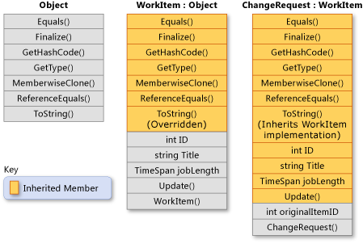

[C# programming guide](https://docs.microsoft.com/zh-cn/dotnet/csharp/programming-guide/index)

# Language Sections

## [Classes and Structs](https://docs.microsoft.com/zh-cn/dotnet/csharp/programming-guide/classes-and-structs/index)

类和结构是 .NET Framework 通用类型系统的两种基本构造。 每种本质上都是一种数据结构，其中封装了同属一个逻辑单元的一组数据和行为。 数据和行为是类或结构的*成员*，包括方法、属性和事件等（此主题稍后将具体列举）。

类或结构声明类似于一张蓝图，用于在运行时创建实例或对象。 如果定义 `Person` 类或结构，那么 `Person` 就是类型名称。 如果声明和初始化 `Person` 类型的变量 `p`，那么 `p` 就是所谓的 `Person` 对象或实例。 可以创建同一 `Person` 类型的多个实例，每个实例都可以有不同的属性和字段值。

类是引用类型。 创建类的对象后，向其分配对象的变量仅保留对相应内存的引用。 将对象引用分配给新变量后，新变量会引用原始对象。 通过一个变量所做的更改将反映在另一个变量中，因为它们引用相同的数据。

结构是值类型。 创建结构时，向其分配结构的变量保留结构的实际数据。 将结构分配给新变量时，会复制结构。因此，新变量和原始变量包含相同数据的副本（共两个）。 对一个副本所做的更改不会影响另一个副本。

一般来说，类用于对更复杂的行为或应在类对象创建后进行修改的数据建模。 结构最适用于所含大部分数据不得在结构创建后进行修改的小型数据结构。

有关详细信息，请参阅[类](https://docs.microsoft.com/zh-cn/dotnet/csharp/programming-guide/classes-and-structs/classes)、[对象](https://docs.microsoft.com/zh-cn/dotnet/csharp/programming-guide/classes-and-structs/objects)和[结构](https://docs.microsoft.com/zh-cn/dotnet/csharp/programming-guide/classes-and-structs/structs)。

### 示例

在以下示例中，`ProgrammingGuide` 命名空间中的 `CustomClass` 有以下三个成员：实例构造函数、`Number` 属性和 `Multiply` 方法。 `Program` 类中的 `Main` 方法创建 `CustomClass` 的实例（对象），此对象的方法和属性可使用点表示法进行访问。

```c#
using System;

namespace ProgrammingGuide
{
   // Class definition.
   public class CustomClass
   {
      // Class members.
      //
      // Property.
      public int Number { get; set; }

      // Method.
      public int Multiply(int num)
      {
          return num * Number;
      }

      // Instance Constructor.
      public CustomClass()
      {
          Number = 0;
      }
   }

   // Another class definition that contains Main, the program entry point.
   class Program
   {
      static void Main(string[] args)
      {
         // Create an object of type CustomClass.
         CustomClass custClass = new CustomClass();

         // Set the value of the public property.
         custClass.Number = 27;

         // Call the public method.
         int result = custClass.Multiply(4);
         Console.WriteLine($"The result is {result}.");
      }
   }
}
// The example displays the following output:
//      The result is 108. 
```

### Encapsulation

*封装*有时称为面向对象的编程的第一支柱或原则。 根据封装原则，类或结构可以指定自己的每个成员对外部代码的可访问性。 可以隐藏不得在类或程序集外部使用的方法和变量，以限制编码错误或恶意攻击发生的可能性。

有关类的详细信息，请参阅[类](https://docs.microsoft.com/zh-cn/dotnet/csharp/programming-guide/classes-and-structs/classes)和[对象](https://docs.microsoft.com/zh-cn/dotnet/csharp/programming-guide/classes-and-structs/objects)。

#### 成员

所有方法、字段、常量、属性和事件都必须在类型中进行声明；这些被称为类型的*成员*。 C# 没有全局变量或方法，这一点其他某些语言不同。 即使是程序的入口点 `Main` 方法，也必须在类或结构中进行声明。 下面列出了所有可以在类或结构中声明的各种成员。

- [字段](https://docs.microsoft.com/zh-cn/dotnet/csharp/programming-guide/classes-and-structs/fields)
- [常量](https://docs.microsoft.com/zh-cn/dotnet/csharp/programming-guide/classes-and-structs/constants)
- [属性](https://docs.microsoft.com/zh-cn/dotnet/csharp/programming-guide/classes-and-structs/properties)
- [方法](https://docs.microsoft.com/zh-cn/dotnet/csharp/programming-guide/classes-and-structs/methods)
- [构造函数](https://docs.microsoft.com/zh-cn/dotnet/csharp/programming-guide/classes-and-structs/constructors)
- [事件](https://docs.microsoft.com/zh-cn/dotnet/csharp/programming-guide/events/index)
- [终结器](https://docs.microsoft.com/zh-cn/dotnet/csharp/programming-guide/classes-and-structs/destructors)
- [索引器](https://docs.microsoft.com/zh-cn/dotnet/csharp/programming-guide/indexers/index)
- [运算符](https://docs.microsoft.com/zh-cn/dotnet/csharp/programming-guide/statements-expressions-operators/operators)
- [嵌套类型](https://docs.microsoft.com/zh-cn/dotnet/csharp/programming-guide/classes-and-structs/nested-types)

#### 可访问性

一些方法和属性可供类或结构外部的代码（称为“*客户端代码*”）调用或访问。 另一些方法和属性只能在类或结构本身中使用。 请务必限制代码的可访问性，仅供预期的客户端代码进行访问。 使用访问修饰符 [public](https://docs.microsoft.com/zh-cn/dotnet/csharp/language-reference/keywords/public)、[protected](https://docs.microsoft.com/zh-cn/dotnet/csharp/language-reference/keywords/protected)、[internal](https://docs.microsoft.com/zh-cn/dotnet/csharp/language-reference/keywords/internal)、[protected internal](https://docs.microsoft.com/zh-cn/dotnet/csharp/language-reference/keywords/protected-internal)、[private](https://docs.microsoft.com/zh-cn/dotnet/csharp/language-reference/keywords/private) 和 [private protected](https://docs.microsoft.com/zh-cn/dotnet/csharp/language-reference/keywords/private-protected) 可指定类型及其成员对客户端代码的可访问性。 可访问性的默认值为 `private`。 有关详细信息，请参阅[访问修饰符](https://docs.microsoft.com/zh-cn/dotnet/csharp/programming-guide/classes-and-structs/access-modifiers)。

#### 继承

类（而非结构）支持继承的概念。 派生自另一个类（基类）的类自动包含基类的所有公共、受保护和内部成员（其构造函数和终结器除外）。 有关详细信息，请参阅[继承](https://docs.microsoft.com/zh-cn/dotnet/csharp/programming-guide/classes-and-structs/inheritance)和[多态性](https://docs.microsoft.com/zh-cn/dotnet/csharp/programming-guide/classes-and-structs/polymorphism)。

可以将类声明为 [abstract](https://docs.microsoft.com/zh-cn/dotnet/csharp/language-reference/keywords/abstract)，即一个或多个方法没有实现代码。 尽管抽象类无法直接实例化，但可以作为提供缺少实现代码的其他类的基类。 类还可以声明为 [sealed](https://docs.microsoft.com/zh-cn/dotnet/csharp/language-reference/keywords/sealed)，以阻止其他类继承。 有关详细信息，请参阅[抽象类、密封类及类成员](https://docs.microsoft.com/zh-cn/dotnet/csharp/programming-guide/classes-and-structs/abstract-and-sealed-classes-and-class-members)。

#### 接口

类和结构可以继承多个接口。 继承自接口意味着类型实现接口中定义的所有方法。 有关详细信息，请参阅[接口](https://docs.microsoft.com/zh-cn/dotnet/csharp/programming-guide/interfaces/index)。

#### 泛型类型

类和结构可以使用一个或多个类型参数进行定义。 客户端代码在创建类型实例时提供类型。 例如，[System.Collections.Generic](https://docs.microsoft.com/zh-cn/dotnet/api/system.collections.generic) 命名空间中的 [List](https://docs.microsoft.com/zh-cn/dotnet/api/system.collections.generic.list-1) 类就是用一个类型参数进行定义的。 客户端代码创建 `List<string>` 或 `List<int>` 的实例来指定列表将包含的类型。 有关详细信息，请参阅[泛型](https://docs.microsoft.com/zh-cn/dotnet/csharp/programming-guide/generics/index)。

#### 静态类型

类（而非结构）可以声明为 [static](https://docs.microsoft.com/zh-cn/dotnet/csharp/language-reference/keywords/static)。 静态类只能包含静态成员，不能使用新的关键字进行实例化。 在程序加载时，类的一个副本会加载到内存中，而其成员则可通过类名进行访问。 类和结构都能包含静态成员。 有关详细信息，请参阅[静态类和静态类成员](https://docs.microsoft.com/zh-cn/dotnet/csharp/programming-guide/classes-and-structs/static-classes-and-static-class-members)。

#### 嵌套类型

类或结构可以嵌套在另一类或结构中。 有关详细信息，请参阅[嵌套类型](https://docs.microsoft.com/zh-cn/dotnet/csharp/programming-guide/classes-and-structs/nested-types)。

#### 分部类型

可以在一个代码文件中定义类、结构或方法的一部分，并在其他代码文件中定义另一部分。 有关详细信息，请参阅[分部类和方法](https://docs.microsoft.com/zh-cn/dotnet/csharp/programming-guide/classes-and-structs/partial-classes-and-methods)。

#### 对象初始值设定项

无需显式调用构造函数，即可实例化和初始化类或结构对象和对象集合。 有关详细信息，请参阅[对象和集合初始值设定项](https://docs.microsoft.com/zh-cn/dotnet/csharp/programming-guide/classes-and-structs/object-and-collection-initializers)。

#### 匿名类型

如果不方便或没有必要创建已命名的类（例如，使用无需保留或传递给其他方法的数据结构填充列表时），可以使用匿名类型。 有关详细信息，请参阅[匿名类型](https://docs.microsoft.com/zh-cn/dotnet/csharp/programming-guide/classes-and-structs/anonymous-types)。

#### 扩展方法

可以单独创建类型（其方法可以调用，就像它们属于原始类型一样）来“扩展”类，而无需创建派生类。 有关详细信息，请参阅[扩展方法](https://docs.microsoft.com/zh-cn/dotnet/csharp/programming-guide/classes-and-structs/extension-methods)。

#### 隐式类型的局部变量

在类或结构方法中，可以使用隐式类型指示编译器在编译时确定正确的类型。 有关详细信息，请参阅[隐式类型局部变量](https://docs.microsoft.com/zh-cn/dotnet/csharp/programming-guide/classes-and-structs/implicitly-typed-local-variables)。

### [Classes](https://docs.microsoft.com/zh-cn/dotnet/csharp/programming-guide/classes-and-structs/classes)

#### 引用类型

定义为[类](https://docs.microsoft.com/zh-cn/dotnet/csharp/language-reference/keywords/class)的一个类型是*引用类型*。 在运行时，如果声明引用类型的变量，此变量就会一直包含值 [null](https://docs.microsoft.com/zh-cn/dotnet/csharp/language-reference/keywords/null)，直到使用 [new](https://docs.microsoft.com/zh-cn/dotnet/csharp/language-reference/keywords/new) 运算符显式创建类实例，或直到为此变量分配可能已在其他位置创建的兼容类型的对象，如下面的示例所示：

```c#
//Declaring an object of type MyClass.
MyClass mc = new MyClass();

//Declaring another object of the same type, assigning it the value of the first object.
MyClass mc2 = mc;
```

创建对象时，在该托管堆上为该特定对象分足够的内存，并且该变量仅保存对所述对象位置的引用。 当分配托管堆上的类型和由 CLR 的自动内存管理功能对其进行回收（称为*垃圾回收*）时，需要开销。 但是，垃圾回收已是高度优化，并且在大多数情况下，不会产生性能问题。 有关垃圾回收的详细信息，请参阅[自动内存管理和垃圾回收](https://docs.microsoft.com/zh-cn/dotnet/standard/garbage-collection/gc)。

#### 声明类

使用后跟唯一标识符的 [class](https://docs.microsoft.com/zh-cn/dotnet/csharp/language-reference/keywords/class) 关键字可以声明类，如下例所示：

```c#
//[access modifier] - [class] - [identifier]
public class Customer
{
   // Fields, properties, methods and events go here...
}
```

`class` 关键字前面是访问级别。 因为此例中使用的是 [public](https://docs.microsoft.com/zh-cn/dotnet/csharp/language-reference/keywords/public)，所以任何人都可以创建此类的实例。 类的名称遵循 `class` 关键字。 类名称必须是有效的 C# [标识符名称](https://docs.microsoft.com/zh-cn/dotnet/csharp/programming-guide/inside-a-program/identifier-names)。 定义的其余部分是类的主体，其中定义了行为和数据。类上的字段、属性、方法和事件统称为*类成员*。

#### 创建对象

虽然它们有时可以互换使用，但类和对象是不同的概念。 类定义对象类型，但不是对象本身。 对象是基于类的具体实体，有时称为类的实例。

可通过使用 [new](https://docs.microsoft.com/zh-cn/dotnet/csharp/language-reference/keywords/new) 关键字，后跟对象要基于的类的名称，来创建对象，如：

```c#
Customer object1 = new Customer();
```

创建类的实例后，会将一个该对象的引用传递回程序员。 在上一示例中，`object1` 是对基于 `Customer` 的对象的引用。 该引用指向新对象，但不包含对象数据本身。 事实上，可以创建对象引用，而完全无需创建对象本身：

```c#
Customer object2;
```

不建议创建这样一个不引用对象的对象引用，因为尝试通过这类引用访问对象会在运行时失败。 但实际上可以使用这类引用来引用某个对象，方法是创建新对象，或者将其分配给现有对象，例如：

```c#
Customer object3 = new Customer();
Customer object4 = object3;
```

此代码创建指向同一对象的两个对象引用。 因此，通过 `object3` 对对象做出的任何更改都会在后续使用 `object4` 时反映出来。 由于基于类的对象是通过引用来实现其引用的，因此类被称为引用类型。

#### 类继承

类完全支持继承，这是面向对象的编程的基本特点。 创建类时，可以继承自其他任何未定义为 [sealed](https://docs.microsoft.com/zh-cn/dotnet/csharp/language-reference/keywords/sealed) 的接口或类，而且其他类也可以继承自你的类并重写类虚方法。

继承是通过使用*派生*来完成的，这意味着类是通过使用其数据和行为所派生自的*基类*来声明的。 基类通过在派生的类名称后面追加冒号和基类名称来指定，如：

```c#
public class Manager : Employee
{
    // Employee fields, properties, methods and events are inherited
    // New Manager fields, properties, methods and events go here...
}
```

类声明基类时，会继承基类除构造函数外的所有成员。 有关详细信息，请参阅[继承](https://docs.microsoft.com/zh-cn/dotnet/csharp/programming-guide/classes-and-structs/inheritance)。

与 C++ 不同，C# 中的类只能直接从基类继承。 但是，因为基类本身可能继承自其他类，因此类可能间接继承多个基类。 此外，类还可以直接实现多个接口。 有关详细信息，请参阅[接口](https://docs.microsoft.com/zh-cn/dotnet/csharp/programming-guide/interfaces/index)。

类可以声明为 [abstract](https://docs.microsoft.com/zh-cn/dotnet/csharp/language-reference/keywords/abstract)（抽象）。 抽象类包含抽象方法，抽象方法包含签名定义但不包含实现。 抽象类不能实例化。 只能通过可实现抽象方法的派生类来使用该类。 与此相反，[sealed](https://docs.microsoft.com/zh-cn/dotnet/csharp/language-reference/keywords/sealed)（密封）类不允许其他类继承。 有关详细信息，请参阅[抽象类、密封类和类成员](https://docs.microsoft.com/zh-cn/dotnet/csharp/programming-guide/classes-and-structs/abstract-and-sealed-classes-and-class-members)。

类定义可以在不同的源文件之间分割。 有关详细信息，请参阅[分部类和方法](https://docs.microsoft.com/zh-cn/dotnet/csharp/programming-guide/classes-and-structs/partial-classes-and-methods)。

#### 示例

以下示例定义了一个公共类，该类包含一个[自动实现的属性](https://docs.microsoft.com/zh-cn/dotnet/csharp/programming-guide/classes-and-structs/auto-implemented-properties)、一个方法和一个名为构造函数的特殊方法。 有关详细信息，请参阅[属性](https://docs.microsoft.com/zh-cn/dotnet/csharp/programming-guide/classes-and-structs/properties)、[方法](https://docs.microsoft.com/zh-cn/dotnet/csharp/programming-guide/classes-and-structs/methods)和[构造函数](https://docs.microsoft.com/zh-cn/dotnet/csharp/programming-guide/classes-and-structs/constructors)主题。 然后使用 `new` 关键字实例化类的实例。

```c#
using System;

public class Person
{
    // Constructor that takes no arguments:
    public Person()
    {
        Name = "unknown";
    }

    // Constructor that takes one argument:
    public Person(string name)
    {
        Name = name;
    }

    // Auto-implemented readonly property:
    public string Name { get; }

    // Method that overrides the base class (System.Object) implementation.
    public override string ToString()
    {
        return Name;
    }
}
class TestPerson
{
    static void Main()
    {
        // Call the constructor that has no parameters.
        var person1 = new Person();
        Console.WriteLine(person1.Name);

        // Call the constructor that has one parameter.
        var person2 = new Person("Sarah Jones");
        Console.WriteLine(person2.Name);
        // Get the string representation of the person2 instance.
        Console.WriteLine(person2);

        Console.WriteLine("Press any key to exit.");
        Console.ReadKey();
    }
}
// Output:
// unknown
// Sarah Jones
// Sarah Jones
```

### [Objects](https://docs.microsoft.com/zh-cn/dotnet/csharp/programming-guide/classes-and-structs/objects)

类或结构定义的作用类似于蓝图，指定该类型可以进行哪些操作。 

- 从本质上说，对象是按照此蓝图分配和配置的内存块。 
- 程序可以创建同一个类的多个对象。 
- 对象也称为实例，可以存储在命名变量中，也可以存储在数组或集合中。 
- 使用这些变量来调用对象方法及访问对象公共属性的代码称为客户端代码。 
- 在 C# 等面向对象的语言中，典型的程序由动态交互的多个对象组成。

> 静态类型的行为与此处介绍的不同。 有关详细信息，请参阅[静态类和静态类成员](https://docs.microsoft.com/zh-cn/dotnet/csharp/programming-guide/classes-and-structs/static-classes-and-static-class-members)。

#### 结构实例与类实例

由于类是引用类型，因此类对象的变量引用该对象在托管堆上的地址。 

如果将同一类型的第二个对象分配给第一个对象，则两个变量都引用该地址的对象。 这一点将在本主题后面部分进行更详细的讨论。

类的实例是使用 [new 运算符](https://docs.microsoft.com/zh-cn/dotnet/csharp/language-reference/keywords/new-operator)创建的。 

在下面的示例中，`Person` 为类型，`person1` 和 `person 2` 为该类型的实例（即对象）。

```c#
public class Person
{
    public string Name { get; set; }
    public int Age { get; set; }
    public Person(string name, int age)
    {
        Name = name;
        Age = age;
    }
    // Other properties, methods, events...
}

class Program
{
    static void Main()
    {
        Person person1 = new Person("Leopold", 6);
        Console.WriteLine("person1 Name = {0} Age = {1}", person1.Name, person1.Age);

        // Declare new person, assign person1 to it.
        Person person2 = person1;

        // Change the name of person2, and person1 also changes.
        person2.Name = "Molly";
        person2.Age = 16;

        Console.WriteLine("person2 Name = {0} Age = {1}", person2.Name, person2.Age);
        Console.WriteLine("person1 Name = {0} Age = {1}", person1.Name, person1.Age);

        // Keep the console open in debug mode.
        Console.WriteLine("Press any key to exit.");
        Console.ReadKey();

    }
}
/*
    Output:
    person1 Name = Leopold Age = 6
    person2 Name = Molly Age = 16
    person1 Name = Molly Age = 16
*/
```

由于结构是值类型，因此结构对象的变量具有整个对象的副本。 结构的实例也可以使用 `new` 运算符来创建，但这不是必需的，如下面的示例所示：

```c#
public struct Person
{
    public string Name;
    public int Age;
    public Person(string name, int age)
    {
        Name = name;
        Age = age;
    }
}

public class Application
{
    static void Main()
    {
        // Create  struct instance and initialize by using "new".
        // Memory is allocated on thread stack.
        Person p1 = new Person("Alex", 9);
        Console.WriteLine("p1 Name = {0} Age = {1}", p1.Name, p1.Age);

        // Create  new struct object. Note that  struct can be initialized
        // without using "new".
        Person p2 = p1;

        // Assign values to p2 members.
        p2.Name = "Spencer";
        p2.Age = 7;
        Console.WriteLine("p2 Name = {0} Age = {1}", p2.Name, p2.Age);

        // p1 values remain unchanged because p2 is  copy.
        Console.WriteLine("p1 Name = {0} Age = {1}", p1.Name, p1.Age);

        // Keep the console open in debug mode.
        Console.WriteLine("Press any key to exit.");
        Console.ReadKey();
    }
}
/*
  Output:
    p1 Name = Alex Age = 9
    p2 Name = Spencer Age = 7
    p1 Name = Alex Age = 9
*/
```

`p1` 和 `p2` 的内存在线程堆栈上进行分配。 该内存随声明它的类型或方法一起回收。 这就是在赋值时复制结构的一个原因。 相比之下，当对类实例对象的所有引用都超出范围时，为该类实例分配的内存将由公共语言运行时自动回收（垃圾回收）。 无法像在 C++ 中那样明确地销毁类对象。 有关 .NET Framework 中的垃圾回收的详细信息，请参阅[垃圾回收](https://docs.microsoft.com/zh-cn/dotnet/standard/garbage-collection/index)。

> 公共语言运行时中高度优化了托管堆上内存的分配和释放。 在大多数情况下，在堆上分配类实例与在堆栈上分配结构实例在性能成本上没有显著的差别。

#### 对象标识与值相等性

在比较两个对象是否相等时，首先必须明确是想知道两个变量是否表示内存中的同一对象，还是想知道这两个对象的一个或多个字段的值是否相等。 如果要对值进行比较，则必须考虑这两个对象是值类型（结构）的实例，还是引用类型（类、委托、数组）的实例。

- 若要确定两个类实例是否引用内存中的同一位置（这意味着它们具有相同的标识），可使用静态 [Equals](https://docs.microsoft.com/zh-cn/dotnet/api/system.object.equals) 方法。 （[System.Object](https://docs.microsoft.com/zh-cn/dotnet/api/system.object) 是所有值类型和引用类型的隐式基类，其中包括用户定义的结构和类。）
- 若要确定两个结构实例中的实例字段是否具有相同的值，可使用 [ValueType.Equals](https://docs.microsoft.com/zh-cn/dotnet/api/system.valuetype.equals) 方法。 由于所有结构都隐式继承自 [System.ValueType](https://docs.microsoft.com/zh-cn/dotnet/api/system.valuetype)，因此可以直接在对象上调用该方法，如以下示例所示：

```c#
// Person is defined in the previous example.

//public struct Person
//{
//    public string Name;
//    public int Age;
//    public Person(string name, int age)
//    {
//        Name = name;
//        Age = age;
//    }
//}

Person p1 = new Person("Wallace", 75);
Person p2;
p2.Name = "Wallace";
p2.Age = 75;

if (p2.Equals(p1))
    Console.WriteLine("p2 and p1 have the same values.");

// Output: p2 and p1 have the same values.
```

`Equals` 的 [System.ValueType](https://docs.microsoft.com/zh-cn/dotnet/api/system.valuetype) 实现使用反射，因为它必须能够确定任何结构中有哪些字段。 在创建自己的结构时，重写 `Equals` 方法可以提供特定于你的类型的高效求等算法。

- 若要确定两个类实例中字段的值是否相等，可以使用 [Equals](https://docs.microsoft.com/zh-cn/dotnet/api/system.object.equals) 方法或 [== 运算符](https://docs.microsoft.com/zh-cn/dotnet/csharp/language-reference/operators/equality-comparison-operator)。 但是，只有类通过重写或重载提供关于那种类型对象的“相等”含义的自定义时，才能使用它们。 类也可能实现 [IEquatable](https://docs.microsoft.com/zh-cn/dotnet/api/system.iequatable-1) 接口或[IEqualityComparer](https://docs.microsoft.com/zh-cn/dotnet/api/system.collections.generic.iequalitycomparer-1) 接口。 这两个接口都提供可用于测试值相等性的方法。 设计自己的替代 `Equals` 的类后，请务必遵循[操作说明：为类型定义值相等性](https://docs.microsoft.com/zh-cn/dotnet/csharp/programming-guide/statements-expressions-operators/how-to-define-value-equality-for-a-type)和 [Object.Equals(Object)](https://docs.microsoft.com/zh-cn/dotnet/api/system.object.equals#System_Object_Equals_System_Object_) 中介绍的准则。

### [Structs](https://docs.microsoft.com/zh-cn/dotnet/csharp/programming-guide/classes-and-structs/structs)

通过使用[结构](https://docs.microsoft.com/zh-cn/dotnet/csharp/language-reference/keywords/struct)关键字来定义结构，例如：

```c#
public struct PostalAddress
{
    // Fields, properties, methods and events go here...
}
```

结构与类的大部分语法相同。 结构名称必须是有效的 C# [标识符名称](https://docs.microsoft.com/zh-cn/dotnet/csharp/programming-guide/inside-a-program/identifier-names)。 结构在以下方面比类的限制更多：

- 在结构声明中，除非将字段声明为 const 或 static，否则无法初始化。
- 结构不能声明默认构造函数（没有参数的构造函数）或终结器。
- 结构在分配时进行复制。 将结构分配给新变量时，将复制所有数据，并且对新副本所做的任何修改不会更改原始副本的数据。 在处理值类型的集合（如 `Dictionary<string, myStruct>`）时，请务必记住这一点。
- 结构是值类型，不同于类，类是引用类型。
- 与类不同，无需使用 `new` 运算符即可对结构进行实例化。
- 结构可以声明具有参数的构造函数。
- 一个结构无法继承自另一个结构或类，并且它不能为类的基类。 所有结构都直接继承自 [ValueType](https://docs.microsoft.com/zh-cn/dotnet/api/system.valuetype)，后者继承自 [Object](https://docs.microsoft.com/zh-cn/dotnet/api/system.object)。
- 结构可以实现接口。
- 结构可用作可以为 null 的类型，并且可以向其分配一个 null 值。

#### [Using Structs](https://docs.microsoft.com/zh-cn/dotnet/csharp/programming-guide/classes-and-structs/using-structs)

`struct` 类型适用于表示轻量级对象，如 `Point`、 `Rectangle`和 `Color`。 尽管用它来表示一个点就如同具有[Auto-Implemented Properties（自动实现的属性）](https://docs.microsoft.com/zh-cn/dotnet/csharp/language-reference/keywords/class) 的 [类](https://docs.microsoft.com/zh-cn/dotnet/csharp/programming-guide/classes-and-structs/auto-implemented-properties)那样方便，但在某些情况下，使用 [结构](https://docs.microsoft.com/zh-cn/dotnet/csharp/language-reference/keywords/struct) 可能更高效。 例如，如果你声明具有 1000 个 `Point` 对象的数组，那么你将分配额外的内存用于引用每个对象；在这种情况下，使用结构将更为便宜。 因为 .NET Framework 包含一个称为 [Point](https://docs.microsoft.com/zh-cn/dotnet/api/system.drawing.point) 的对象，因此在此示例中的结构改名为“Coords”。

```c#
public struct Coords
{
    public int x, y;

    public Coords(int p1, int p2)
    {
        x = p1;
        y = p2;
    }
}
```

定义结构的默认（无参数）构造函数是错误的。 在结构体中初始化实例字段也是错误的。 只能通过使用参数化构造函数、隐式默认构造函数、[对象初始值设定项](https://docs.microsoft.com/zh-cn/dotnet/csharp/programming-guide/classes-and-structs/object-and-collection-initializers)，或在声明结构之后通过单独访问各个成员，才能初始化可从外部访问的结构成员。 任何私有或其他不可访问的成员需要以独占方式使用构造函数。

使用 [new](https://docs.microsoft.com/zh-cn/dotnet/csharp/language-reference/keywords/new) 运算符创建结构对象时，会创建结构对象且会遵循[构造函数签名](https://docs.microsoft.com/zh-cn/dotnet/csharp/programming-guide/classes-and-structs/constructors#constructor-syntax)来调用相应的构造函数。 与类不同，可以对结构进行实例化，而无需使用 `new` 运算符。 在这种情况下，没有调用任何构造函数，从而提高了分配效率。 但是，字段将保持为未分配状态且必须在在初始化所有字段之后才可使用对象。 这包括无法通过自动实现的属性获取或设置值。

如果使用默认的无参数构造函数实例化结构对象，则根据成员的[默认值](https://docs.microsoft.com/zh-cn/dotnet/csharp/programming-guide/statements-expressions-operators/default-value-expressions)分配所有成员。

当为某个结构编写带有参数的构造函数时，必须显式初始化所有成员，否则一个或更多的成员将不被分配，并且不能使用结构，这会生成编译器错误 CS0171。

由于全都是用于类的继承，因此没有用于结构的继承。 一个结构无法继承自另一个结构或类，并且它不能为类的基类。 但是，它可以从基类 [Object](https://docs.microsoft.com/zh-cn/dotnet/api/system.object)继承。 结构也可以实现接口，且实现方法与类相同。

不能使用关键字 `struct`声明一个类。 在 C# 中，类和结构在语义上是不同的。 结构是值类型，而类是引用类型。 有关更多信息，请参阅 [值类型](https://docs.microsoft.com/zh-cn/dotnet/csharp/language-reference/keywords/value-types)。

除非需要引用类型语义，将较小的类声明为结构，可以提高系统的处理效率。

##### 示例 1

此示例同时使用了默认构造函数和参数化构造函数来演示 `struct` 初始化。

```c#
public struct Coords
{
    public int x, y;

    public Coords(int p1, int p2)
    {
        x = p1;
        y = p2;
    }
}
```

```c#
// Declare and initialize struct objects.
class TestCoords
{
    static void Main()
    {
        // Initialize:   
        Coords coords1 = new Coords();
        Coords coords2 = new Coords(10, 10);

        // Display results:
        Console.Write("Coords 1: ");
        Console.WriteLine("x = {0}, y = {1}", coords1.x, coords1.y);

        Console.Write("Coords 2: ");
        Console.WriteLine("x = {0}, y = {1}", coords2.x, coords2.y);

        // Keep the console window open in debug mode.
        Console.WriteLine("Press any key to exit.");
        Console.ReadKey();
    }
}
/* Output:
    Coords 1: x = 0, y = 0
    Coords 2: x = 10, y = 10
*/
```

##### 示例2

此示例演示了一个特定于结构的功能。 此功能可以创建 Coords 对象，而无需使用 `new` 运算符。 如果将 `struct` 替换为 `class`，程序将不会进行编译。

```c#
public struct Coords
{
    public int x, y;

    public Coords(int p1, int p2)
    {
        x = p1;
        y = p2;
    }
}
```

```c#
// Declare a struct object without "new."
class TestCoordsNoNew
{
    static void Main()
    {
        // Declare an object:
        Coords coords1;

        // Initialize:
        coords1.x = 10;
        coords1.y = 20;

        // Display results:
        Console.Write("Coords 1: ");
        Console.WriteLine("x = {0}, y = {1}", coords1.x, coords1.y);

        // Keep the console window open in debug mode.
        Console.WriteLine("Press any key to exit.");
        Console.ReadKey();
    }
}
// Output: Coords 1: x = 10, y = 20
```

### [Inheritance](https://docs.microsoft.com/zh-cn/dotnet/csharp/programming-guide/classes-and-structs/inheritance)

继承（以及封装和多态）是面向对象的编程的三个主要特征之一。 通过继承，可以创建重用、扩展和修改在其他类中定义的行为的新类。 其成员被继承的类称为“基类”，继承这些成员的类称为“派生类”。 派生类只能有一个直接基类。 但是，继承是可传递的。 如果 ClassC 派生自 ClassB，并且 ClassB 派生自 ClassA，则 ClassC 会继承在 ClassB 和 ClassA 中声明的成员。

> 结构不支持继承，但它们可以实现接口。 有关详细信息，请参阅[接口](https://docs.microsoft.com/zh-cn/dotnet/csharp/programming-guide/interfaces/index)。

从概念上讲，派生类是基类的专门化。 例如，如果有一个基类 `Animal`，则可以有一个名为 `Mammal` 的派生类，以及另一个名为 `Reptile` 的派生类。 `Mammal` 是 `Animal`，`Reptile` 也是 `Animal`，但每个派生类表示基类的不同专门化。

定义要从其他类派生的类时，派生类会隐式获得基类的所有成员（除了其构造函数和终结器）。 派生类因而可以重用基类中的代码，而无需重新实现。 在派生类中，可以添加更多成员。 通过这种方法，派生类可扩展基类的功能。

下图显示一个类 `WorkItem`，它表示某个业务流程中的工作项。 像所有类一样，它派生自 [System.Object](https://docs.microsoft.com/zh-cn/dotnet/api/system.object) 且继承其所有方法。 `WorkItem` 添加了自己的五个成员。 其中包括一个构造函数，因为无法继承构造函数。 类 `ChangeRequest` 继承自 `WorkItem`，表示特定类型的工作项。 `ChangeRequest` 将另外两个成员添加到它从 `WorkItem` 和 [Object](https://docs.microsoft.com/zh-cn/dotnet/api/system.object) 继承的成员中。 它必须添加自己的构造函数，并且还添加了 `originalItemID`。 属性 `originalItemID` 使 `ChangeRequest` 实例可以与向其应用更改请求的原始 `WorkItem` 相关联。

类继承
下面的示例演示如何在 C# 中表示前面图中所示的类关系。 该示例还演示了 `WorkItem` 替代虚方法[Object.ToString](https://docs.microsoft.com/zh-cn/dotnet/api/system.object.tostring) 的方式，以及 `ChangeRequest` 类继承该方法的 `WorkItem` 的实现方式。

```c#
// WorkItem implicitly inherits from the Object class.
public class WorkItem
{
    // Static field currentID stores the job ID of the last WorkItem that
    // has been created.
    private static int currentID;

    //Properties.
    protected int ID { get; set; }
    protected string Title { get; set; }
    protected string Description { get; set; }
    protected TimeSpan jobLength { get; set; }

    // Default constructor. If a derived class does not invoke a base-
    // class constructor explicitly, the default constructor is called
    // implicitly. 
    public WorkItem()
    {
        ID = 0;
        Title = "Default title";
        Description = "Default description.";
        jobLength = new TimeSpan();
    }

    // Instance constructor that has three parameters.
    public WorkItem(string title, string desc, TimeSpan joblen)
    {
        this.ID = GetNextID();
        this.Title = title;
        this.Description = desc;
        this.jobLength = joblen;
    }

    // Static constructor to initialize the static member, currentID. This
    // constructor is called one time, automatically, before any instance
    // of WorkItem or ChangeRequest is created, or currentID is referenced.
    static WorkItem()
    {
        currentID = 0;
    }


    protected int GetNextID()
    {
        // currentID is a static field. It is incremented each time a new
        // instance of WorkItem is created.
        return ++currentID;
    }

    // Method Update enables you to update the title and job length of an
    // existing WorkItem object.
    public void Update(string title, TimeSpan joblen)
    {
        this.Title = title;
        this.jobLength = joblen;
    }

    // Virtual method override of the ToString method that is inherited
    // from System.Object.
    public override string ToString()
    {
        return $"{this.ID} - {this.Title}";
    }
}

// ChangeRequest derives from WorkItem and adds a property (originalItemID) 
// and two constructors.
public class ChangeRequest : WorkItem
{
    protected int originalItemID { get; set; }

    // Constructors. Because neither constructor calls a base-class 
    // constructor explicitly, the default constructor in the base class
    // is called implicitly. The base class must contain a default 
    // constructor.

    // Default constructor for the derived class.
    public ChangeRequest() { }

    // Instance constructor that has four parameters.
    public ChangeRequest(string title, string desc, TimeSpan jobLen,
                         int originalID)
    {
        // The following properties and the GetNexID method are inherited 
        // from WorkItem.
        this.ID = GetNextID();
        this.Title = title;
        this.Description = desc;
        this.jobLength = jobLen;

        // Property originalItemId is a member of ChangeRequest, but not 
        // of WorkItem.
        this.originalItemID = originalID;
    }
}

class Program
{
    static void Main()
    {
        // Create an instance of WorkItem by using the constructor in the 
        // base class that takes three arguments.
        WorkItem item = new WorkItem("Fix Bugs",
                                     "Fix all bugs in my code branch",
                                     new TimeSpan(3, 4, 0, 0));

        // Create an instance of ChangeRequest by using the constructor in
        // the derived class that takes four arguments.
        ChangeRequest change = new ChangeRequest("Change Base Class Design",
                                                 "Add members to the class",
                                                 new TimeSpan(4, 0, 0),
                                                 1);

        // Use the ToString method defined in WorkItem.
        Console.WriteLine(item.ToString());

        // Use the inherited Update method to change the title of the 
        // ChangeRequest object.
        change.Update("Change the Design of the Base Class",
            new TimeSpan(4, 0, 0));

        // ChangeRequest inherits WorkItem's override of ToString.
        Console.WriteLine(change.ToString());

        // Keep the console open in debug mode.
        Console.WriteLine("Press any key to exit.");
        Console.ReadKey();
    }
}
/* Output:
    1 - Fix Bugs
    2 - Change the Design of the Base Class
*/
```
#### 抽象方法和虚方法
基类将方法声明为[虚拟](https://docs.microsoft.com/zh-cn/dotnet/csharp/language-reference/keywords/virtual) 时，派生类可以使用其自己的实现[重写](https://docs.microsoft.com/zh-cn/dotnet/csharp/language-reference/keywords/override)该方法。 如果基类将成员声明为[抽象](https://docs.microsoft.com/zh-cn/dotnet/csharp/language-reference/keywords/abstract)，则必须在直接继承自该类的任何非抽象类中重写该方法。 如果派生类本身是抽象的，则它会继承抽象成员而不会实现它们。抽象和虚拟成员是多形性（面向对象的编程的第二个主要特征）的基础。 有关详细信息，请参阅[多态性](https://docs.microsoft.com/zh-cn/dotnet/csharp/programming-guide/classes-and-structs/polymorphism)。

#### 抽象基类

如果要使用 [new](https://docs.microsoft.com/zh-cn/dotnet/csharp/language-reference/keywords/new) 关键字防止直接实例化，则可以将类声明为[抽象](https://docs.microsoft.com/zh-cn/dotnet/csharp/language-reference/keywords/abstract)。 如果这样做，则仅当从该类派生新类时，才能使用该类。 抽象类可以包含一个或多个本身声明为抽象的方法签名。 这些签名指定参数和返回值，但没有任何实现（方法体）。 抽象类不必包含抽象成员；但是，如果类包含抽象成员，则类本身必须声明为抽象。 本身不抽象的派生类必须为来自抽象基类的任何抽象方法提供实现。 有关详细信息，请参阅[抽象类、密封类和类成员](https://docs.microsoft.com/zh-cn/dotnet/csharp/programming-guide/classes-and-structs/abstract-and-sealed-classes-and-class-members)。

#### 接口

接口是引用类型，有些类似于仅包含抽象成员的抽象基类。 类实现接口时，它必须为接口的所有成员提供实现。类可以实现多个接口，即使它只能派生自单个直接基类。

接口用于为类定义特定功能，这些功能不一定具有“是”关系。 例如，[System.IEquatable](https://docs.microsoft.com/zh-cn/dotnet/api/system.iequatable-1) 接口可由任何类或结构实现，这些类或构造必须启用客户端代码来确定该类型的两个对象是否等效（但是由该类型定义等效性）。[IEquatable](https://docs.microsoft.com/zh-cn/dotnet/api/system.iequatable-1) 不表示基类和派生类之间存在的同一种“是”关系（例如，`Mammal` 是 `Animal`）。 有关详细信息，请参阅[接口](https://docs.microsoft.com/zh-cn/dotnet/csharp/programming-guide/interfaces/index)。

#### 防止进一步派生

类可以通过将自己或成员声明为[密封](https://docs.microsoft.com/zh-cn/dotnet/csharp/language-reference/keywords/sealed)，来防止其他类继承自它或继承自其任何成员。 有关详细信息，请参阅[抽象类、密封类和类成员](https://docs.microsoft.com/zh-cn/dotnet/csharp/programming-guide/classes-and-structs/abstract-and-sealed-classes-and-class-members)。

#### 基类成员的派生类隐藏

派生类可以通过使用相同名称和签名声明成员来隐藏基类成员。 [new](https://docs.microsoft.com/zh-cn/dotnet/csharp/language-reference/keywords/new) 修饰符可以用于显式指示成员不应作为基类成员的重写。 使用 [new](https://docs.microsoft.com/zh-cn/dotnet/csharp/language-reference/keywords/new) 不是必需的，但如果未使用 [new](https://docs.microsoft.com/zh-cn/dotnet/csharp/language-reference/keywords/new)，则会生成编译器警告。 有关详细信息，请参阅[使用 Override 和 New 关键字进行版本控制](https://docs.microsoft.com/zh-cn/dotnet/csharp/programming-guide/classes-and-structs/versioning-with-the-override-and-new-keywords)和[了解何时使用 Override 和 New 关键字](https://docs.microsoft.com/zh-cn/dotnet/csharp/programming-guide/classes-and-structs/knowing-when-to-use-override-and-new-keywords)。

### [Polymorphism](https://docs.microsoft.com/en-us/dotnet/csharp/programming-guide/classes-and-structs/polymorphism)

多态性常被视为自封装和继承之后，面向对象的编程的第三个支柱。 Polymorphism（多态性）是一个希腊词，指“多种形态”，多态性具有两个截然不同的方面：

- 在运行时，在方法参数和集合或数组等位置，派生类的对象可以作为基类的对象处理。 发生此情况时，该对象的声明类型不再与运行时类型相同。
- 基类可以定义并实现[虚](https://docs.microsoft.com/zh-cn/dotnet/csharp/language-reference/keywords/virtual)方法，派生类可以[重写](https://docs.microsoft.com/zh-cn/dotnet/csharp/language-reference/keywords/override)这些方法，即派生类提供自己的定义和实现。 在运行时，客户端代码调用该方法，CLR 查找对象的运行时类型，并调用虚方法的重写方法。 因此，你可以在源代码中调用基类的方法，但执行该方法的派生类版本。

虚方法允许你以统一方式处理多组相关的对象。 例如，假定你有一个绘图应用程序，允许用户在绘图图面上创建各种形状。 你在编译时不知道用户将创建哪些特定类型的形状。 但应用程序必须跟踪创建的所有类型的形状，并且必须更新这些形状以响应用户鼠标操作。 你可以使用多态性通过两个基本步骤解决这一问题：

1. 创建一个类层次结构，其中每个特定形状类均派生自一个公共基类。
2. 使用虚方法通过对基类方法的单个调用来调用任何派生类上的相应方法。

首先，创建一个名为 `Rectangle``Shape` 的基类，并创建一些派生类，例如 `Triangle``Circle`、 和 。 为 `Shape`类提供一个名为 `Draw` 的虚拟方法，并在每个派生类中重写该方法以绘制该类表示的特定形状。 创建一个 `List<Shape>` 对象，并向该对象添加 Circle、Triangle 和 Rectangle。 若要更新绘图图面，请使用 [foreach](https://docs.microsoft.com/zh-cn/dotnet/csharp/language-reference/keywords/foreach-in) 循环对该列表进行循环访问，并对其中的每个 `Shape` 对象调用 `Draw` 方法。 虽然列表中的每个对象都具有声明类型 `Shape`，但调用的将是运行时类型（该方法在每个派生类中的重写版本）。

```c#
using System;
using System.Collections.Generic;

public class Shape
{
    // A few example members
    public int X { get; private set; }
    public int Y { get; private set; }
    public int Height { get; set; }
    public int Width { get; set; }
   
    // Virtual method
    public virtual void Draw()
    {
        Console.WriteLine("Performing base class drawing tasks");
    }
}

class Circle : Shape
{
    public override void Draw()
    {
        // Code to draw a circle...
        Console.WriteLine("Drawing a circle");
        base.Draw();
    }
}
class Rectangle : Shape
{
    public override void Draw()
    {
        // Code to draw a rectangle...
        Console.WriteLine("Drawing a rectangle");
        base.Draw();
    }
}
class Triangle : Shape
{
    public override void Draw()
    {
        // Code to draw a triangle...
        Console.WriteLine("Drawing a triangle");
        base.Draw();
    }
}

class Program
{
    static void Main(string[] args)
    {
        // Polymorphism at work #1: a Rectangle, Triangle and Circle
        // can all be used whereever a Shape is expected. No cast is
        // required because an implicit conversion exists from a derived 
        // class to its base class.
        var shapes = new List<Shape>
        {
            new Rectangle(),
            new Triangle(),
            new Circle()
        };

        // Polymorphism at work #2: the virtual method Draw is
        // invoked on each of the derived classes, not the base class.
        foreach (var shape in shapes)
        {
            shape.Draw();
        }

        // Keep the console open in debug mode.
        Console.WriteLine("Press any key to exit.");
        Console.ReadKey();
    }

}

/* Output:
    Drawing a rectangle
    Performing base class drawing tasks
    Drawing a triangle
    Performing base class drawing tasks
    Drawing a circle
    Performing base class drawing tasks
 */
```

> 在 C# 中，每个类型都是多态的，因为包括用户定义类型在内的所有类型都继承自 [Object](https://docs.microsoft.com/zh-cn/dotnet/api/system.object)。

#### 多态性概述

##### 虚成员

当派生类从基类继承时，它会获得基类的所有方法、字段、属性和事件。 派生类的设计器可以选择是否

- 重写基类中的虚拟成员。
- 继承最接近的基类方法而不重写它
- 定义隐藏基类实现的成员的新非虚实现

仅当基类成员声明为 [virtual](https://docs.microsoft.com/zh-cn/dotnet/csharp/language-reference/keywords/virtual) 或 [abstract](https://docs.microsoft.com/zh-cn/dotnet/csharp/language-reference/keywords/abstract) 时，派生类才能重写基类成员。 派生成员必须使用 [override](https://docs.microsoft.com/zh-cn/dotnet/csharp/language-reference/keywords/override) 关键字显式指示该方法将参与虚调用。 以下代码提供了一个示例：

```c#
public class BaseClass
{
    public virtual void DoWork() { }
    public virtual int WorkProperty
    {
        get { return 0; }
    }
}
public class DerivedClass : BaseClass
{
    public override void DoWork() { }
    public override int WorkProperty
    {
        get { return 0; }
    }
}
```

字段不能是虚拟的，只有方法、属性、事件和索引器才可以是虚拟的。 当派生类重写某个虚拟成员时，即使该派生类的实例被当作基类的实例访问，也会调用该成员。 以下代码提供了一个示例：

```csharp
DerivedClass B = new DerivedClass();
B.DoWork();  // Calls the new method.

BaseClass A = (BaseClass)B;
A.DoWork();  // Also calls the new method.
```

虚方法和属性允许派生类扩展基类，而无需使用方法的基类实现。 有关详细信息，请参阅[使用 Override 和 New 关键字进行版本控制](https://docs.microsoft.com/zh-cn/dotnet/csharp/programming-guide/classes-and-structs/versioning-with-the-override-and-new-keywords)。 接口提供另一种方式来定义将实现留给派生类的方法或方法集。 有关详细信息，请参阅[接口](https://docs.microsoft.com/zh-cn/dotnet/csharp/programming-guide/interfaces/index)。

##### 使用新成员隐藏基类成员

如果希望派生成员具有与基类中的成员相同的名称，但又不希望派生成员参与虚调用，则可以使用 [new](https://docs.microsoft.com/zh-cn/dotnet/csharp/language-reference/keywords/new) 关键字。 `new` 关键字放置在要替换的类成员的返回类型之前。 以下代码提供了一个示例：


```csharp
public class BaseClass
{
    public void DoWork() { WorkField++; }
    public int WorkField;
    public int WorkProperty
    {
        get { return 0; }
    }
}

public class DerivedClass : BaseClass
{
    public new void DoWork() { WorkField++; }
    public new int WorkField;
    public new int WorkProperty
    {
        get { return 0; }
    }
}
```

通过将派生类的实例强制转换为基类的实例，仍然可以从客户端代码访问隐藏的基类成员。 例如:


```csharp
DerivedClass B = new DerivedClass();
B.DoWork();  // Calls the new method.

BaseClass A = (BaseClass)B;
A.DoWork();  // Calls the old method.
```

##### 阻止派生类重写虚拟成员

无论在虚拟成员和最初声明虚拟成员的类之间已声明了多少个类，虚拟成员永远都是虚拟的。 如果类 A 声明了一个虚拟成员，类 B 从 A 派生，类 C 从类 B 派生，则类 C 继承该虚拟成员，并且可以选择重写它，而不管类 B 是否为该成员声明了重写。 以下代码提供了一个示例：

```csharp
public class A
{
    public virtual void DoWork() { }
}
public class B : A
{
    public override void DoWork() { }
}
```

派生类可以通过将重写声明为 [sealed](https://docs.microsoft.com/zh-cn/dotnet/csharp/language-reference/keywords/sealed) 来停止虚拟继承。 这需要在类成员声明中的 `override``sealed` 关键字前面放置 关键字。 以下代码提供了一个示例：

```csharp
public class C : B
{
    public sealed override void DoWork() { }
}
```

在上一示例中，方法 `DoWork` 对从 C 派生的任何类都不再是虚方法。它对 C 的实例仍是虚拟的，即使它们转换为类型 B 或类型 A。使用 `new` 关键字可以将密封方法替换为派生类，如下方示例所示：

```csharp
public class D : C
{
    public new void DoWork() { }
}
```

在此情况下，如果在 D 中使用类型为 D 的变量调用 `DoWork`，被调用的将是新的 `DoWork`。 如果使用类型为 C、B 或 A 的变量访问 D 的实例，对 `DoWork``DoWork` 的调用将遵循虚拟继承的规则，即把这些调用传送到类 C 的 实现。

##### 从派生类访问基类虚拟成员

已替换或重写某个方法或属性的派生类仍然可以使用基关键字访问基类的该方法或属性。 以下代码提供了一个示例：

```csharp
public class Base
{
    public virtual void DoWork() {/*...*/ }
}
public class Derived : Base
{
    public override void DoWork()
    {
        //Perform Derived's work here
        //...
        // Call DoWork on base class
        base.DoWork();
    }
}
```

有关详细信息，请参阅 [base](https://docs.microsoft.com/zh-cn/dotnet/csharp/language-reference/keywords/base)。

> 建议虚拟成员在它们自己的实现中使用 `base` 来调用该成员的基类实现。 允许基类行为发生使得派生类能够集中精力实现特定于派生类的行为。 未调用基类实现时，由派生类负责使它们的行为与基类的行为兼容。

#### [Versioning with the Override and New Keywords](https://docs.microsoft.com/en-us/dotnet/csharp/programming-guide/classes-and-structs/versioning-with-the-override-and-new-keywords)

C# 语言经过专门设计，以便不同库中的[基类](https://docs.microsoft.com/zh-cn/dotnet/csharp/language-reference/keywords/base)与派生类之间的版本控制可以不断向前发展，同时保持后向兼容。 这具有多方面的意义。例如，这意味着在基[类](https://docs.microsoft.com/zh-cn/dotnet/csharp/language-reference/keywords/class)中引入与派生类中的某个成员具有相同名称的新成员在 C# 中是完全支持的，不会导致意外行为。 它还意味着类必须显式声明某方法是要替代一个继承方法，还是本身就是一个隐藏具有类似名称的继承方法的新方法。

在 C# 中，派生类可以包含与基类方法同名的方法。

- 基类方法必须定义为 [virtual](https://docs.microsoft.com/zh-cn/dotnet/csharp/language-reference/keywords/virtual)。
- 如果派生类中的方法前面没有 [new](https://docs.microsoft.com/zh-cn/dotnet/csharp/language-reference/keywords/new) 或 [override](https://docs.microsoft.com/zh-cn/dotnet/csharp/language-reference/keywords/override) 关键字，则编译器将发出警告，该方法将如同存在 `new` 关键字一样执行操作。
- 如果派生类中的方法前面带有 `new` 关键字，则该方法被定义为独立于基类中的方法。
- 如果派生类中的方法前面带有 `override` 关键字，则派生类的对象将调用该方法，而不是调用基类方法。
- 可以从派生类中使用 `base` 关键字调用基类方法。
- `override`、`virtual` 和 `new` 关键字还可以用于属性、索引器和事件中。

默认情况下，C# 方法为非虚方法。 如果某个方法被声明为虚方法，则继承该方法的任何类都可以实现它自己的版本。 若要使方法成为虚方法，需要在基类的方法声明中使用 `virtual` 修饰符。 然后，派生类可以使用 `override`关键字替代基虚方法，或使用 `new` 关键字隐藏基类中的虚方法。 如果 `override` 关键字和 `new` 关键字均未指定，编译器将发出警告，并且派生类中的方法将隐藏基类中的方法。

为了在实践中演示上述情况，暂时假定公司 A 创建了一个名为 `GraphicsClass` 的类，程序将使用此类。 `GraphicsClass` 如下所示：

```csharp
class GraphicsClass
{
    public virtual void DrawLine() { }
    public virtual void DrawPoint() { }
}
```

公司使用此类，并且你在添加新方法时将其用于派生自己的类：

```csharp
class YourDerivedGraphicsClass : GraphicsClass
{
    public void DrawRectangle() { }
}
```

你的应用程序运行正常，未出现问题，直到公司 A 发布了 `GraphicsClass` 的新版本，类似于以下代码：

```csharp
class GraphicsClass
{
    public virtual void DrawLine() { }
    public virtual void DrawPoint() { }
    public virtual void DrawRectangle() { }
}
```

现在，`GraphicsClass` 的新版本中包含一个名为 `DrawRectangle` 的方法。 开始时，没有出现任何问题。 新版本仍然与旧版本保持二进制兼容。 已经部署的任何软件都将继续正常工作，即使新类已安装到这些计算机系统上。 在你的派生类中，对方法 `DrawRectangle` 的任何现有调用将继续引用你的版本。

但是，一旦你使用 `GraphicsClass` 的新版本重新编译应用程序，就会收到来自编译器的警告 CS0108。 此警告提示，必须考虑你所期望的 `DrawRectangle` 方法在应用程序中的工作方式。

如果需要自己的方法替代新的基类方法，请使用 `override` 关键字：

```csharp
class YourDerivedGraphicsClass : GraphicsClass
{
    public override void DrawRectangle() { }
}
```

`override` 关键字可确保派生自 `YourDerivedGraphicsClass` 的任何对象都将使用 `DrawRectangle` 的派生类版本。派生自 `YourDerivedGraphicsClass` 的对象仍可以使用 base 关键字访问 `DrawRectangle` 的基类版本：

```csharp
base.DrawRectangle();
```

如果不需要自己的方法替代新的基类方法，则需要注意以下事项。 为了避免这两个方法之间发生混淆，可以重命名你的方法。 这可能很耗费时间且容易出错，而且在某些情况下并不可行。 但是，如果项目相对较小，则可以使用 Visual Studio 的重构选项来重命名方法。 有关详细信息，请参阅[重构类和类型（类设计器）](https://docs.microsoft.com/zh-cn/visualstudio/ide/refactoring-classes-and-types-class-designer)。

或者，也可以通过在派生类定义中使用关键字 `new` 来防止出现该警告：

```csharp
class YourDerivedGraphicsClass : GraphicsClass
{
    public new void DrawRectangle() { }
}
```

使用 `new` 关键字可告诉编译器你的定义将隐藏基类中包含的定义。 这是默认行为。

##### 替代和方法选择

当在类中对方法进行命名时，如果有多个方法与调用兼容（例如，存在两种同名的方法，并且其参数与传递的参数兼容），则 C# 编译器将选择最佳方法进行调用。 以下方法将是兼容的：


```csharp
public class Derived : Base
{
    public override void DoWork(int param) { }
    public void DoWork(double param) { }
}
```

在 `Derived` 的一个实例中调用 `DoWork` 时，C# 编译器将首先尝试使该调用与最初在 `Derived` 上声明的 `DoWork`版本兼容。 替代方法不被视为是在类上进行声明的，而是在基类上声明的方法的新实现。 仅当 C# 编译器无法将方法调用与 `Derived` 上的原始方法匹配时，才尝试将该调用与具有相同名称和兼容参数的替代方法匹配。 例如:


```csharp
int val = 5;
Derived d = new Derived();
d.DoWork(val);  // Calls DoWork(double).
```

由于变量 `val` 可以隐式转换为 double 类型，因此 C# 编译器将调用 `DoWork(double)`，而不是 `DoWork(int)`。有两种方法可以避免此情况。 首先，避免将新方法声明为与虚方法相同的名称。 其次，可以通过将 `Derived` 的实例强制转换为 `Base` 来使 C# 编译器搜索基类方法列表，从而使其调用虚方法。 由于是虚方法，因此将调用 `Derived` 上的 `DoWork(int)` 的实现。 例如:


```csharp
((Base)d).DoWork(val);  // Calls DoWork(int) on Derived.
```

有关 `new` 和 `override` 的更多示例，请参阅[了解何时使用 Override 和 New 关键字](https://docs.microsoft.com/zh-cn/dotnet/csharp/programming-guide/classes-and-structs/knowing-when-to-use-override-and-new-keywords)。

#### [Knowing When to Use Override and New Keywords](https://docs.microsoft.com/en-us/dotnet/csharp/programming-guide/classes-and-structs/knowing-when-to-use-override-and-new-keywords)

在 C# 中，派生类中的方法可具有与基类中的方法相同的名称。 可使用 [new](https://docs.microsoft.com/zh-cn/dotnet/csharp/language-reference/keywords/new) 和 [override](https://docs.microsoft.com/zh-cn/dotnet/csharp/language-reference/keywords/override) 关键字指定方法的交互方式。 `override` 修饰符用于扩展基类方法，而 `new` 修饰符则用于隐藏该方法。 本主题中的示例阐释了这种差异。

在控制台应用程序中，声明以下两个类：`BaseClass` 和 `DerivedClass`。 `DerivedClass` 继承自 `BaseClass`。


```csharp
class BaseClass  
{  
    public void Method1()  
    {  
        Console.WriteLine("Base - Method1");  
    }  
}  
  
class DerivedClass : BaseClass  
{  
    public void Method2()  
    {  
        Console.WriteLine("Derived - Method2");  
    }  
}  
```

在 `Main` 方法中，声明变量 `bc`、`dc` 和 `bcdc`。

- `bc` 为 `BaseClass` 类型，其值为 `BaseClass` 类型。
- `dc` 为 `DerivedClass` 类型，其值为 `DerivedClass` 类型。
- `bcdc` 为 `BaseClass` 类型，其值为 `DerivedClass` 类型。 需注意此变量。

由于 `bc` 和 `bcdc` 具有 `BaseClass` 类型，因此它们只能直接访问 `Method1`，除非使用强制转换。 变量 `dc` 可同时访问 `Method1` 和 `Method2`。 下面的代码演示了这些关系。


```csharp
class Program  
{  
    static void Main(string[] args)  
    {  
        BaseClass bc = new BaseClass();  
        DerivedClass dc = new DerivedClass();  
        BaseClass bcdc = new DerivedClass();  
  
        bc.Method1();  
        dc.Method1();  
        dc.Method2();  
        bcdc.Method1();  
    }  
    // Output:  
    // Base - Method1  
    // Base - Method1  
    // Derived - Method2  
    // Base - Method1  
}  
```

接着，将以下 `Method2` 方法添加到 `BaseClass`。 此方法的签名与 `DerivedClass` 中 `Method2` 方法的签名匹配。


```csharp
public void Method2()  
{  
    Console.WriteLine("Base - Method2");  
}  
```

由于 `BaseClass` 现在具有 `Method2` 方法，因此可以为 `BaseClass` 变量 `bc` 和 `bcdc` 添加第二个调用语句，如下面的代码所示。


```csharp
bc.Method1();  
bc.Method2();  
dc.Method1();  
dc.Method2();  
bcdc.Method1();  
bcdc.Method2();  
```

当生成项目时，你将看到在 `BaseClass` 中添加 `Method2` 方法将引发警告。 警告显示 `DerivedClass` 中的 `Method2` 方法隐藏了 `BaseClass` 中的 `Method2` 方法。 如果希望获得该结果，则建议使用 `Method2` 定义中的 `new` 关键字。 或者，可重命名 `Method2` 方法之一来消除警告，但这始终不实用。

添加 `new` 之前，请运行程序，查看其他调用语句生成的输出。 显示以下结果。


```csharp
// Output:  
// Base - Method1  
// Base - Method2  
// Base - Method1  
// Derived - Method2  
// Base - Method1  
// Base - Method2  
```

`new` 关键字可以保留生成该输出的关系，但它会禁止显示警告。 具有 `BaseClass` 类型的变量继续访问 `BaseClass` 的成员，而具有 `DerivedClass` 类型的变量首先继续访问 `DerivedClass` 中的成员，然后再考虑从 `BaseClass` 继承的成员。

若要禁止显示警告，请将 `new` 修饰符添加到 `DerivedClass` 中的 `Method2` 定义，如下面的代码所示。 可在 `public` 前后添加修饰符。


```csharp
public new void Method2()  
{  
    Console.WriteLine("Derived - Method2");  
}  
```

再次运行该程序，确认输出未发生更改。 此外，确认不再显示警告。 通过使用 `new`，断言你知道它修饰的成员将隐藏从基类继承的成员。 有关通过继承隐藏名称的详细信息，请参阅 [new 修饰符](https://docs.microsoft.com/zh-cn/dotnet/csharp/language-reference/keywords/new-modifier)。

若要将此行为与使用 `override` 的效果进行对比，请将以下方法添加到 `DerivedClass`。 可在 `public` 前后添加 `override` 修饰符。


```csharp
public override void Method1()  
{  
    Console.WriteLine("Derived - Method1");  
}  
```

将 `virtual` 修饰符添加到 `BaseClass` 中的 `Method1` 定义。 可在 `public` 前后添加 `virtual` 修饰符。


```csharp
public virtual void Method1()  
{  
    Console.WriteLine("Base - Method1");  
}  
```

再次运行该项目。 尤其注意以下输出的最后两行。


```csharp
// Output:  
// Base - Method1  
// Base - Method2  
// Derived - Method1  
// Derived - Method2  
// Derived - Method1  
// Base - Method2  
```

使用 `override` 修饰符可使 `bcdc` 访问 `DerivedClass` 中定义的 `Method1` 方法。 通常，这是继承层次结构中所需的行为。 让具有从派生类创建的值的对象使用派生类中定义的方法。 可使用 `override` 扩展基类方法实现该行为。

下面的代码包括完整的示例。


```csharp
using System;  
using System.Text;  
  
namespace OverrideAndNew  
{  
    class Program  
    {  
        static void Main(string[] args)  
        {  
            BaseClass bc = new BaseClass();  
            DerivedClass dc = new DerivedClass();  
            BaseClass bcdc = new DerivedClass();  
  
            // The following two calls do what you would expect. They call  
            // the methods that are defined in BaseClass.  
            bc.Method1();  
            bc.Method2();  
            // Output:  
            // Base - Method1  
            // Base - Method2  
  
            // The following two calls do what you would expect. They call  
            // the methods that are defined in DerivedClass.  
            dc.Method1();  
            dc.Method2();  
            // Output:  
            // Derived - Method1  
            // Derived - Method2  
  
            // The following two calls produce different results, depending   
            // on whether override (Method1) or new (Method2) is used.  
            bcdc.Method1();  
            bcdc.Method2();  
            // Output:  
            // Derived - Method1  
            // Base - Method2  
        }  
    }  
  
    class BaseClass  
    {  
        public virtual void Method1()  
        {  
            Console.WriteLine("Base - Method1");  
        }  
  
        public virtual void Method2()  
        {  
            Console.WriteLine("Base - Method2");  
        }  
    }  
  
    class DerivedClass : BaseClass  
    {  
        public override void Method1()  
        {  
            Console.WriteLine("Derived - Method1");  
        }  
  
        public new void Method2()  
        {  
            Console.WriteLine("Derived - Method2");  
        }  
    }  
}  
```

下列阐释了不同上下文中的类似行为。 该示例定义了三个类：一个名为 `Car` 的基类和两个由其派生的 `ConvertibleCar` 和 `Minivan`。 基类中包含 `DescribeCar` 方法。 该方法给出了对一辆车的基本描述，然后调用 `ShowDetails` 提供其他信息。 这三个类中的每一个类都定义了 `ShowDetails` 方法。 `new` 修饰符用于定义 `ConvertibleCar` 类中的 `ShowDetails`。 `override` 修饰符用于定义 `Minivan` 类中的 `ShowDetails`。


```csharp
// Define the base class, Car. The class defines two methods,  
// DescribeCar and ShowDetails. DescribeCar calls ShowDetails, and each derived  
// class also defines a ShowDetails method. The example tests which version of  
// ShowDetails is selected, the base class method or the derived class method.  
class Car  
{  
    public void DescribeCar()  
    {  
        System.Console.WriteLine("Four wheels and an engine.");  
        ShowDetails();  
    }  
  
    public virtual void ShowDetails()  
    {  
        System.Console.WriteLine("Standard transportation.");  
    }  
}  
  
// Define the derived classes.  
  
// Class ConvertibleCar uses the new modifier to acknowledge that ShowDetails  
// hides the base class method.  
class ConvertibleCar : Car  
{  
    public new void ShowDetails()  
    {  
        System.Console.WriteLine("A roof that opens up.");  
    }  
}  
  
// Class Minivan uses the override modifier to specify that ShowDetails  
// extends the base class method.  
class Minivan : Car  
{  
    public override void ShowDetails()  
    {  
        System.Console.WriteLine("Carries seven people.");  
    }  
}  
```

该示例测试被调用的 `ShowDetails` 版本。 下面的方法 `TestCars1` 为每个类声明了一个实例，并在每个实例上调用 `DescribeCar`。


```csharp
public static void TestCars1()  
{  
    System.Console.WriteLine("\nTestCars1");  
    System.Console.WriteLine("----------");  
  
    Car car1 = new Car();  
    car1.DescribeCar();  
    System.Console.WriteLine("----------");  
  
    // Notice the output from this test case. The new modifier is  
    // used in the definition of ShowDetails in the ConvertibleCar  
    // class.    
  
    ConvertibleCar car2 = new ConvertibleCar();  
    car2.DescribeCar();  
    System.Console.WriteLine("----------");  
  
    Minivan car3 = new Minivan();  
    car3.DescribeCar();  
    System.Console.WriteLine("----------");  
}  
```

`TestCars1` 将生成以下输出。 请特别注意 `car2` 的结果，该结果可能不是你需要的内容。 对象的类型是 `ConvertibleCar`，但 `DescribeCar` 不会访问 `ConvertibleCar` 类中定义的 `ShowDetails` 版本，因为方法已声明包含 `new` 修饰符声明，而不是 `override` 修饰符。 因此，`ConvertibleCar` 对象与 `Car` 对象显示的说明相同。 比较 `car3` 的结果，这是一个 `Minivan` 对象。 在这种情况下，`Minivan` 类中声明的 `ShowDetails` 方法会替代 `Car` 类中声明的 `ShowDetails` 方法，显示的说明描述小型货车。


```csharp
// TestCars1  
// ----------  
// Four wheels and an engine.  
// Standard transportation.  
// ----------  
// Four wheels and an engine.  
// Standard transportation.  
// ----------  
// Four wheels and an engine.  
// Carries seven people.  
// ----------  
```

`TestCars2` 创建具有 `Car` 类型的对象列表。 对象的值由 `Car` 类、`ConvertibleCar` 类和 `Minivan` 类实例化所得。 对列表中的每个元素调用 `DescribeCar`。 以下代码显示 `TestCars2` 的定义。


```csharp
public static void TestCars2()  
{  
    System.Console.WriteLine("\nTestCars2");  
    System.Console.WriteLine("----------");  
  
    var cars = new List<Car> { new Car(), new ConvertibleCar(),   
        new Minivan() };  
  
    foreach (var car in cars)  
    {  
        car.DescribeCar();  
        System.Console.WriteLine("----------");  
    }  
}  
```

显示以下输出。 请注意，它与 `TestCars1` 显示的输出相同。 不调用 `ConvertibleCar` 类的 `ShowDetails` 方法，不管该对象的类型是 `ConvertibleCar`（在 `TestCars1` 中）还是 `Car`（在 `TestCars2` 中）。 相反，在这两种情况下，`car3` 从 `Minivan` 调用 `ShowDetails` 方法，不管它拥有类型 `Minivan` 还是类型 `Car`。


```csharp
// TestCars2  
// ----------  
// Four wheels and an engine.  
// Standard transportation.  
// ----------  
// Four wheels and an engine.  
// Standard transportation.  
// ----------  
// Four wheels and an engine.  
// Carries seven people.  
// ----------  
```

方法 `TestCars3` 和方法 `TestCars4` 完成示例。 这些方法直接调用 `ShowDetails`，先从声明具有类型 `ConvertibleCar` 和 `Minivan` (`TestCars3`) 的对象开始，然后再转到声明具有类型 `Car` (`TestCars4`) 的对象。 以下代码定义了这两种方法。


```csharp
public static void TestCars3()  
{  
    System.Console.WriteLine("\nTestCars3");  
    System.Console.WriteLine("----------");  
    ConvertibleCar car2 = new ConvertibleCar();  
    Minivan car3 = new Minivan();  
    car2.ShowDetails();  
    car3.ShowDetails();  
}  
  
public static void TestCars4()  
{  
    System.Console.WriteLine("\nTestCars4");  
    System.Console.WriteLine("----------");  
    Car car2 = new ConvertibleCar();  
    Car car3 = new Minivan();  
    car2.ShowDetails();  
    car3.ShowDetails();  
}  
```

这两种方法将产生以下输出，输出对应本主题第一个示例的结果。


```csharp
// TestCars3  
// ----------  
// A roof that opens up.  
// Carries seven people.  
  
// TestCars4  
// ----------  
// Standard transportation.  
// Carries seven people.  
```

以下代码显示了完整项目及其输出。


```csharp
using System;  
using System.Collections.Generic;  
using System.Linq;  
using System.Text;  
  
namespace OverrideAndNew2  
{  
    class Program  
    {  
        static void Main(string[] args)  
        {  
            // Declare objects of the derived classes and test which version  
            // of ShowDetails is run, base or derived.  
            TestCars1();  
  
            // Declare objects of the base class, instantiated with the  
            // derived classes, and repeat the tests.  
            TestCars2();  
  
            // Declare objects of the derived classes and call ShowDetails  
            // directly.  
            TestCars3();  
  
            // Declare objects of the base class, instantiated with the  
            // derived classes, and repeat the tests.  
            TestCars4();  
        }  
  
        public static void TestCars1()  
        {  
            System.Console.WriteLine("\nTestCars1");  
            System.Console.WriteLine("----------");  
  
            Car car1 = new Car();  
            car1.DescribeCar();  
            System.Console.WriteLine("----------");  
  
            // Notice the output from this test case. The new modifier is  
            // used in the definition of ShowDetails in the ConvertibleCar  
            // class.    
            ConvertibleCar car2 = new ConvertibleCar();  
            car2.DescribeCar();  
            System.Console.WriteLine("----------");  
  
            Minivan car3 = new Minivan();  
            car3.DescribeCar();  
            System.Console.WriteLine("----------");  
        }  
        // Output:  
        // TestCars1  
        // ----------  
        // Four wheels and an engine.  
        // Standard transportation.  
        // ----------  
        // Four wheels and an engine.  
        // Standard transportation.  
        // ----------  
        // Four wheels and an engine.  
        // Carries seven people.  
        // ----------  
  
        public static void TestCars2()  
        {  
            System.Console.WriteLine("\nTestCars2");  
            System.Console.WriteLine("----------");  
  
            var cars = new List<Car> { new Car(), new ConvertibleCar(),   
                new Minivan() };  
  
            foreach (var car in cars)  
            {  
                car.DescribeCar();  
                System.Console.WriteLine("----------");  
            }  
        }  
        // Output:  
        // TestCars2  
        // ----------  
        // Four wheels and an engine.  
        // Standard transportation.  
        // ----------  
        // Four wheels and an engine.  
        // Standard transportation.  
        // ----------  
        // Four wheels and an engine.  
        // Carries seven people.  
        // ----------  
  
        public static void TestCars3()  
        {  
            System.Console.WriteLine("\nTestCars3");  
            System.Console.WriteLine("----------");  
            ConvertibleCar car2 = new ConvertibleCar();  
            Minivan car3 = new Minivan();  
            car2.ShowDetails();  
            car3.ShowDetails();  
        }  
        // Output:  
        // TestCars3  
        // ----------  
        // A roof that opens up.  
        // Carries seven people.  
  
        public static void TestCars4()  
        {  
            System.Console.WriteLine("\nTestCars4");  
            System.Console.WriteLine("----------");  
            Car car2 = new ConvertibleCar();  
            Car car3 = new Minivan();  
            car2.ShowDetails();  
            car3.ShowDetails();  
        }  
        // Output:  
        // TestCars4  
        // ----------  
        // Standard transportation.  
        // Carries seven people.  
    }  
  
    // Define the base class, Car. The class defines two virtual methods,  
    // DescribeCar and ShowDetails. DescribeCar calls ShowDetails, and each derived  
    // class also defines a ShowDetails method. The example tests which version of  
    // ShowDetails is used, the base class method or the derived class method.  
    class Car  
    {  
        public virtual void DescribeCar()  
        {  
            System.Console.WriteLine("Four wheels and an engine.");  
            ShowDetails();  
        }  
  
        public virtual void ShowDetails()  
        {  
            System.Console.WriteLine("Standard transportation.");  
        }  
    }  
  
    // Define the derived classes.  
  
    // Class ConvertibleCar uses the new modifier to acknowledge that ShowDetails  
    // hides the base class method.  
    class ConvertibleCar : Car  
    {  
        public new void ShowDetails()  
        {  
            System.Console.WriteLine("A roof that opens up.");  
        }  
    }  
  
    // Class Minivan uses the override modifier to specify that ShowDetails  
    // extends the base class method.  
    class Minivan : Car  
    {  
        public override void ShowDetails()  
        {  
            System.Console.WriteLine("Carries seven people.");  
        }  
    }  
  
}  
```

#### [How to: Override the ToString Method](https://docs.microsoft.com/en-us/dotnet/csharp/programming-guide/classes-and-structs/how-to-override-the-tostring-method)

C# 中的每个类或结构都可隐式继承 [Object](https://docs.microsoft.com/zh-cn/dotnet/api/system.object) 类。 因此，C# 中的每个对象都会获取 [ToString](https://docs.microsoft.com/zh-cn/dotnet/api/system.object.tostring) 方法，该方法返回该对象的字符串表示形式。 例如，类型为 `int` 的所有变量都有一个 `ToString` 方法，使它们可以将其内容作为字符串返回：


```csharp
int x = 42;
string strx = x.ToString();
Console.WriteLine(strx);
// Output:
// 42
```

创建自定义类或结构时，应替代 [ToString](https://docs.microsoft.com/zh-cn/dotnet/api/system.object.tostring) 方法，以向客户端代码提供有关你的类型的信息。

若要深入了解如何通过 `ToString` 方法使用格式字符串和其他类型的自定义格式设置，请参阅[格式化类型](https://docs.microsoft.com/zh-cn/dotnet/standard/base-types/formatting-types)。

>  决定通过此方法提供信息内容时，请考虑你的类或结构是否会被不受信任的代码使用。 请务必确保不提供可能被恶意代码利用的任何信息。

##### 替代类或结构中的 ToString 方法

1. 声明具有下列修饰符和返回类型的 `ToString` 方法：

    

   ```csharp
   public override string ToString(){}  
   ```

2. 实现该方法，使其返回一个字符串。

   下面的示例返回类的名称，但特定于该类的特定实例的数据除外。

   

   ```csharp
   class Person
   {
       public string Name { get; set; }
       public int Age { get; set; }
   
       public override string ToString()
       {
           return "Person: " + Name + " " + Age;
       }
   }
   ```

   可以测试 `ToString` 方法，如以下代码示例所示：

   

   ```csharp
   Person person = new Person { Name = "John", Age = 12 };
   Console.WriteLine(person);
   // Output:
   // Person: John 12
   ```

### [Abstract and Sealed Classes and Class Members](https://docs.microsoft.com/en-us/dotnet/csharp/programming-guide/classes-and-structs/abstract-and-sealed-classes-and-class-members)

使用 [abstract](https://docs.microsoft.com/zh-cn/dotnet/csharp/language-reference/keywords/abstract) 关键字可以创建不完整且必须在派生类中实现的类和 [class](https://docs.microsoft.com/zh-cn/dotnet/csharp/language-reference/keywords/class) 成员。

使用 [sealed](https://docs.microsoft.com/zh-cn/dotnet/csharp/language-reference/keywords/sealed) 关键字可以防止继承以前标记为 [virtual](https://docs.microsoft.com/zh-cn/dotnet/csharp/language-reference/keywords/virtual) 的类或某些类成员。

#### 抽象类和类成员

通过在类定义前面放置关键字 `abstract`，可以将类声明为抽象类。 例如:

```csharp
public abstract class A
{
    // Class members here.
}
```

抽象类不能实例化。 抽象类的用途是提供一个可供多个派生类共享的通用基类定义。 例如，类库可以定义一个抽象类，将其用作多个类库函数的参数，并要求使用该库的程序员通过创建派生类来提供自己的类实现。

抽象类也可以定义抽象方法。 方法是将关键字 `abstract` 添加到方法的返回类型的前面。 例如:

```csharp
public abstract class A
{
    public abstract void DoWork(int i);
}
```

抽象方法没有实现，所以方法定义后面是分号，而不是常规的方法块。 抽象类的派生类必须实现所有抽象方法。当抽象类从基类继承虚方法时，抽象类可以使用抽象方法重写该虚方法。 例如:

```csharp
// compile with: -target:library
public class D
{
    public virtual void DoWork(int i)
    {
        // Original implementation.
    }
}

public abstract class E : D
{
    public abstract override void DoWork(int i);
}

public class F : E
{
    public override void DoWork(int i)
    {
        // New implementation.
    }
}
```

如果将 `virtual` 方法声明为 `abstract`，则该方法对于从抽象类继承的所有类而言仍然是虚方法。 继承抽象方法的类无法访问方法的原始实现，因此在上一示例中，类 F 上的 `DoWork` 无法调用类 D 上的 `DoWork`。通过这种方式，抽象类可强制派生类向虚拟方法提供新的方法实现。

#### 密封类和类成员

通过在类定义前面放置关键字 `sealed`，可以将类声明为[密封类](https://docs.microsoft.com/zh-cn/dotnet/csharp/language-reference/keywords/sealed)。 例如:

```csharp
public sealed class D
{
    // Class members here.
}
```

密封类不能用作基类。 因此，它也不能是抽象类。 密封类禁止派生。 由于密封类从不用作基类，所以有些运行时优化可以略微提高密封类成员的调用速度。

在对基类的虚成员进行重写的派生类上，方法、索引器、属性或事件可以将该成员声明为密封成员。 在用于以后的派生类时，这将取消成员的虚效果。 方法是在类成员声明中将 `sealed` 关键字置于 [override](https://docs.microsoft.com/zh-cn/dotnet/csharp/language-reference/keywords/override) 关键字前面。 例如:

```csharp
public class D : C
{
    public sealed override void DoWork() { }
}
```

#### [How to: Define Abstract Properties](https://docs.microsoft.com/en-us/dotnet/csharp/programming-guide/classes-and-structs/how-to-define-abstract-properties)

以下示例演示如何定义[抽象](https://docs.microsoft.com/zh-cn/dotnet/csharp/language-reference/keywords/abstract)属性。 抽象属性声明不提供属性访问器的实现，它声明该类支持属性，而将访问器实现留给派生类。 以下示例演示如何实现从基类继承抽象属性。

此示例由三个文件组成，其中每个文件都单独编译，产生的程序集由下一次编译引用：

- abstractshape.cs：包含抽象 `Area` 属性的 `Shape` 类。
- shapes.cs：`Shape` 类的子类。
- shapetest.cs：测试程序，用于显示一些 `Shape` 派生对象的区域。

若要编译该示例，请使用以下命令：

```
csc abstractshape.cs shapes.cs shapetest.cs
```

这将创建可执行文件 shapetest.exe。

##### 示例1

此文件声明 `Shape` 类，该类包含 `double` 类型的 `Area` 属性。

```c#
// compile with: csc -target:library abstractshape.cs
public abstract class Shape
{
    private string name;

    public Shape(string s)
    {
        // calling the set accessor of the Id property.
        Id = s;
    }

    public string Id
    {
        get
        {
            return name;
        }

        set
        {
            name = value;
        }
    }

    // Area is a read-only property - only a get accessor is needed:
    public abstract double Area
    {
        get;
    }

    public override string ToString()
    {
        return $"{Id} Area = {Area:F2}";
    }
}
```

属性的修饰符放置在属性声明中。 例如:

```c#
public abstract double Area  
```

声明抽象属性时（如本示例中的 `Area`），只需指明哪些属性访问器可用即可，不要实现它们。 在此示例中，仅 [get](https://docs.microsoft.com/zh-cn/dotnet/csharp/language-reference/keywords/get) 访问器可用，因此该属性是只读属性。

##### 示例2

下面的代码演示 `Shape` 的三个子类，并演示它们如何替代 `Area` 属性来提供自己的实现。

```c#
// compile with: csc -target:library -reference:abstractshape.dll shapes.cs
public class Square : Shape
{
    private int side;

    public Square(int side, string id)
        : base(id)
    {
        this.side = side;
    }

    public override double Area
    {
        get
        {
            // Given the side, return the area of a square:
            return side * side;
        }
    }
}

public class Circle : Shape
{
    private int radius;

    public Circle(int radius, string id)
        : base(id)
    {
        this.radius = radius;
    }

    public override double Area
    {
        get
        {
            // Given the radius, return the area of a circle:
            return radius * radius * System.Math.PI;
        }
    }
}

public class Rectangle : Shape
{
    private int width;
    private int height;

    public Rectangle(int width, int height, string id)
        : base(id)
    {
        this.width = width;
        this.height = height;
    }

    public override double Area
    {
        get
        {
            // Given the width and height, return the area of a rectangle:
            return width * height;
        }
    }
}
```

##### 示例3

下面的代码演示一个创建若干 `Shape` 派生对象并输出其区域的测试程序。

```c#
// compile with: csc -reference:abstractshape.dll;shapes.dll shapetest.cs
class TestClass
{
    static void Main()
    {
        Shape[] shapes =
        {
            new Square(5, "Square #1"),
            new Circle(3, "Circle #1"),
            new Rectangle( 4, 5, "Rectangle #1")
        };

        System.Console.WriteLine("Shapes Collection");
        foreach (Shape s in shapes)
        {
            System.Console.WriteLine(s);
        }
    }
}
/* Output:
    Shapes Collection
    Square #1 Area = 25.00
    Circle #1 Area = 28.27
    Rectangle #1 Area = 20.00
*/
```

### [Static Classes and Static Class Members](https://docs.microsoft.com/en-us/dotnet/csharp/programming-guide/classes-and-structs/static-classes-and-static-class-members)

[静态](https://docs.microsoft.com/zh-cn/dotnet/csharp/language-reference/keywords/static)类基本上与非静态类相同，但存在一个差异：静态类无法实例化。 
-  换句话说，无法使用 [new](https://docs.microsoft.com/zh-cn/dotnet/csharp/language-reference/keywords/new) 关键字创建类类型的变量。 
-  由于不存在任何实例变量，因此可以使用类名本身访问静态类的成员。 

例如，如果你具有一个静态类，该类名为 `UtilityClass`，并且具有一个名为 `MethodA` 的公共静态方法，如下面的示例所示：

```csharp
UtilityClass.MethodA();  
```

静态类可以用作只对输入参数进行操作并且不必获取或设置任何内部实例字段的方法集的方便容器。 例如，在 .NET Framework 类库中，静态 [System.Math](https://docs.microsoft.com/zh-cn/dotnet/api/system.math) 类包含执行数学运算，而无需存储或检索对 [Math](https://docs.microsoft.com/zh-cn/dotnet/api/system.math) 类特定实例唯一的数据的方法。 即，通过指定类名和方法名称来应用类的成员，如下面的示例所示。

```csharp
double dub = -3.14;  
Console.WriteLine(Math.Abs(dub));  
Console.WriteLine(Math.Floor(dub));  
Console.WriteLine(Math.Round(Math.Abs(dub)));  
  
// Output:  
// 3.14  
// -4  
// 3  
```

与所有类类型的情况一样，静态类的类型信息在引用该类的程序加载时，由 .NET Framework 公共语言运行时 (CLR) 加载。 程序无法确切指定类加载的时间。 但是，可保证进行加载，以及在程序中首次引用类之前初始化其字段并调用其静态构造函数。 静态构造函数只调用一次，在程序所驻留的应用程序域的生存期内，静态类会保留在内存中。

>  若要创建仅允许创建本身的一个实例的非静态类，请参阅[在 C# 中实现单一实例](https://docs.microsoft.com/previous-versions/msp-n-p/ff650316%28v=pandp.10%29)。

以下列表提供静态类的主要功能：

- 只包含静态成员。
- 无法进行实例化。
- 会进行密封。
- 不能包含[实例构造函数](https://docs.microsoft.com/zh-cn/dotnet/csharp/programming-guide/classes-and-structs/instance-constructors)。

因此，创建静态类基本上与创建只包含静态成员和私有构造函数的类相同。 私有构造函数可防止类进行实例化。使用静态类的优点是编译器可以进行检查，以确保不会意外地添加任何实例成员。 编译器可保证无法创建此类的实例。

静态类会进行密封，因此不能继承。 它们不能继承自任何类（除了 [Object](https://docs.microsoft.com/zh-cn/dotnet/api/system.object)）。 静态类不能包含实例构造函数；但是，它们可以包含静态构造函数。 如果非静态类包含了需要进行有意义的初始化的静态成员，则它也应该定义一个静态构造器。 有关详细信息，请参阅[静态构造函数](https://docs.microsoft.com/zh-cn/dotnet/csharp/programming-guide/classes-and-structs/static-constructors)。

#### 示例

下面是静态类的示例，该类包含将温度从摄氏度从华氏度以及从华氏度转换为摄氏度的两个方法：

```csharp
public static class TemperatureConverter
{
    public static double CelsiusToFahrenheit(string temperatureCelsius)
    {
        // Convert argument to double for calculations.
        double celsius = Double.Parse(temperatureCelsius);

        // Convert Celsius to Fahrenheit.
        double fahrenheit = (celsius * 9 / 5) + 32;

        return fahrenheit;
    }

    public static double FahrenheitToCelsius(string temperatureFahrenheit)
    {
        // Convert argument to double for calculations.
        double fahrenheit = Double.Parse(temperatureFahrenheit);

        // Convert Fahrenheit to Celsius.
        double celsius = (fahrenheit - 32) * 5 / 9;

        return celsius;
    }
}

class TestTemperatureConverter
{
    static void Main()
    {
        Console.WriteLine("Please select the convertor direction");
        Console.WriteLine("1. From Celsius to Fahrenheit.");
        Console.WriteLine("2. From Fahrenheit to Celsius.");
        Console.Write(":");

        string selection = Console.ReadLine();
        double F, C = 0;

        switch (selection)
        {
            case "1":
                Console.Write("Please enter the Celsius temperature: ");
                F = TemperatureConverter.CelsiusToFahrenheit(Console.ReadLine());
                Console.WriteLine("Temperature in Fahrenheit: {0:F2}", F);
                break;

            case "2":
                Console.Write("Please enter the Fahrenheit temperature: ");
                C = TemperatureConverter.FahrenheitToCelsius(Console.ReadLine());
                Console.WriteLine("Temperature in Celsius: {0:F2}", C);
                break;

            default:
                Console.WriteLine("Please select a convertor.");
                break;
        }

        // Keep the console window open in debug mode.
        Console.WriteLine("Press any key to exit.");
        Console.ReadKey();
    }
}
/* Example Output:
    Please select the convertor direction
    1. From Celsius to Fahrenheit.
    2. From Fahrenheit to Celsius.
    :2
    Please enter the Fahrenheit temperature: 20
    Temperature in Celsius: -6.67
    Press any key to exit.
 */
```

#### 静态成员

非静态类可以包含静态方法、字段、属性或事件。 即使未创建类的任何实例，也可对类调用静态成员。 静态成员始终按类名（而不是实例名称）进行访问。 静态成员只有一个副本存在（与创建的类的实例数有关）。 静态方法和属性无法在其包含类型中访问非静态字段和事件，它们无法访问任何对象的实例变量，除非在方法参数中显式传递它。

更典型的做法是声明具有一些静态成员的非静态类（而不是将整个类都声明为静态）。 静态字段的两个常见用途是保留已实例化的对象数的计数，或是存储必须在所有实例间共享的值。

静态方法可以进行重载，但不能进行替代，因为它们属于类，而不属于类的任何实例。

虽然字段不能声明为 `static const`，不过 [const](https://docs.microsoft.com/zh-cn/dotnet/csharp/language-reference/keywords/const) 字段在其行为方面本质上是静态的。 它属于类型，而不属于类型的实例。 因此，可以使用用于静态字段的相同 `ClassName.MemberName` 表示法来访问常量字段。 无需进行对象实例化。

C# 不支持静态局部变量（在方法范围中声明的变量）。

可在成员的返回类型之前使用 `static` 关键字声明静态类成员，如下面的示例所示：

```csharp
public class Automobile
{
    public static int NumberOfWheels = 4;
    public static int SizeOfGasTank
    {
        get
        {
            return 15;
        }
    }
    public static void Drive() { }
    public static event EventType RunOutOfGas;

    // Other non-static fields and properties...
}
```

在首次访问静态成员之前以及在调用构造函数（如果有）之前，会初始化静态成员。 若要访问静态类成员，请使用类的名称（而不是变量名称）指定成员的位置，如下面的示例所示：

C#复制

```csharp
Automobile.Drive();
int i = Automobile.NumberOfWheels;
```

如果类包含静态字段，则提供在类加载时初始化它们的静态构造函数。

对静态方法的调用会采用 Microsoft 中间语言 (MSIL) 生成调用指令，而对实例方法的调用会生成 `callvirt` 指令，该指令还会检查是否存在 null 对象引用。 但是在大多数时候，两者之间的性能差异并不显著。

### [Members](https://docs.microsoft.com/en-us/dotnet/csharp/programming-guide/classes-and-structs/members)

类和结构具有表示其数据和行为的成员。 类的成员包括在类中声明的所有成员，以及在该类的继承层次结构中的所有类中声明的所有成员（构造函数和析构函数除外）。 基类中的私有成员被继承，但不能从派生类访问。

下表列出类或结构中可包含的成员类型：

| 成员                                                         | 说明                                                         |
| ------------------------------------------------------------ | ------------------------------------------------------------ |
| [字段](https://docs.microsoft.com/zh-cn/dotnet/csharp/programming-guide/classes-and-structs/fields) | 字段是在类范围声明的变量。 字段可以是内置数值类型或其他类的实例。 例如，日历类可能具有一个包含当前日期的字段。 |
| [常量](https://docs.microsoft.com/zh-cn/dotnet/csharp/programming-guide/classes-and-structs/constants) | 常量是在编译时设置其值并且不能更改其值的字段或属性。         |
| [属性](https://docs.microsoft.com/zh-cn/dotnet/csharp/programming-guide/classes-and-structs/properties) | 属性是类中可以像类中的字段一样访问的方法。 属性可以为类字段提供保护，以避免字段在对象不知道的情况下被更改。 |
| [方法](https://docs.microsoft.com/zh-cn/dotnet/csharp/programming-guide/classes-and-structs/methods) | 方法定义类可以执行的操作。 方法可接受提供输入数据的参数，并可通过参数返回输出数据。 方法还可以不使用参数而直接返回值。 |
| [事件](https://docs.microsoft.com/zh-cn/dotnet/csharp/programming-guide/events/index) | 事件向其他对象提供有关发生的事情（如单击按钮或成功完成某个方法）的通知。 事件是使用委托定义和触发的。 |
| [运算符](https://docs.microsoft.com/zh-cn/dotnet/csharp/programming-guide/statements-expressions-operators/operators) | 重载运算符被视为类成员。 在重载运算符时，在类中将该运算符定义为公共静态方法。 预定义的运算符（`+`、`*`、`<` 等）不被视为成员。 有关详细信息，请参阅[可重载运算符](https://docs.microsoft.com/zh-cn/dotnet/csharp/programming-guide/statements-expressions-operators/overloadable-operators)。 |
| [索引器](https://docs.microsoft.com/zh-cn/dotnet/csharp/programming-guide/indexers/index) | 使用索引器可以用类似于数组的方式为对象建立索引。             |
| [构造函数](https://docs.microsoft.com/zh-cn/dotnet/csharp/programming-guide/classes-and-structs/constructors) | 构造函数是首次创建对象时调用的方法。 它们通常用于初始化对象的数据。 |
| [终结器](https://docs.microsoft.com/zh-cn/dotnet/csharp/programming-guide/classes-and-structs/destructors) | C# 中很少使用终结器。 终结器是当对象即将从内存中移除时由运行时执行引擎调用的方法。 它们通常用来确保任何必须释放的资源都得到适当的处理。 |
| [嵌套类型](https://docs.microsoft.com/zh-cn/dotnet/csharp/programming-guide/classes-and-structs/nested-types) | 嵌套类型是在其他类型中声明的类型。 嵌套类型通常用于描述仅由包含它们的类型使用的对象。 |

### [Access Modifiers](https://docs.microsoft.com/en-us/dotnet/csharp/programming-guide/classes-and-structs/access-modifiers)

所有类型和类型成员都具有可访问性级别，该级别可以控制是否可以从你的程序集或其他程序集中的其他代码中使用它们。 可以使用以下访问修饰符在进行声明时指定类型或成员的可访问性：

[public](https://docs.microsoft.com/zh-cn/dotnet/csharp/language-reference/keywords/public)
同一程序集中的任何其他代码或引用该程序集的其他程序集都可以访问该类型或成员。

[private](https://docs.microsoft.com/zh-cn/dotnet/csharp/language-reference/keywords/private)
只有同一类或结构中的代码可以访问该类型或成员。

[受保护](https://docs.microsoft.com/zh-cn/dotnet/csharp/language-reference/keywords/protected)
只有同一类或者从该类派生的类中的代码可以访问该类型或成员。
[internal](https://docs.microsoft.com/zh-cn/dotnet/csharp/language-reference/keywords/internal)
同一程序集中的任何代码都可以访问该类型或成员，但其他程序集中的代码不可以。

[受保护的内部](https://docs.microsoft.com/zh-cn/dotnet/csharp/language-reference/keywords/protected-internal) 该类型或成员可由对其进行声明的程序集或另一程序集中的派生类中的任何代码访问。

[专用受保护](https://docs.microsoft.com/zh-cn/dotnet/csharp/language-reference/keywords/private-protected)只有在其声明程序集内，通过相同类中的代码或派生自该类的类型，才能访问类型或成员。

下面的示例演示如何在类型和成员上指定访问修饰符：

```csharp
public class Bicycle
{
    public void Pedal() { }
}
```

并非所有的访问修饰符都可以由所有上下文中的所有类型或成员使用，并且在某些情况下，类型成员的可访问性受其包含类型的可访问性限制。 以下各节提供了有关可访问性的更多详细信息。

#### 类和结构可访问性

在命名空间内直接声明（换句话说，不嵌套在其他类或结构中）的类和结构可以为公共或内部。 如果未指定任何访问修饰符，则默认设置为内部。

结构成员（包括嵌套的类和结构）可以声明为公共、内部或私有。 类成员（包括嵌套的类和结构）可以为公共、受保护的内部、受保护、内部、专用受保护或专用。 默认情况下，类成员和结构成员（包括嵌套的类和结构）的访问级别为私有。 不能从包含类型的外部访问私有嵌套类型。

派生类不能具有高于其基类型的可访问性。 换而言之，不能具有派生自内部类 `A` 的公共类 `B`。 如果允许这样，则它将具有使 `A` 公开的效果，因为可从派生类访问 `A` 的所有受保护的或内部成员。

可以通过使用 InternalsVisibleToAttribute 启用特定的其他程序集访问内部类型。 有关详细信息，请参阅[友元程序集](https://docs.microsoft.com/zh-cn/dotnet/csharp/programming-guide/concepts/assemblies-gac/friend-assemblies)。

#### 类和结构成员可访问性

可以使用六种访问类型中的任意一种声明类成员（包括嵌套的类和结构）。 结构成员无法声明为受保护，因为结构不支持继承。

通常情况下，成员的可访问性不大于包含该成员的类型的可访问性。 但是，如果内部类的公共成员实现了接口方法或替代了在公共基类中定义的虚拟方法，则可从该程序集的外部访问该成员。

为字段、属性或事件的任何成员的类型必须至少与该成员本身具有相同的可访问性。 同样，为方法、索引器或委托的任何成员的返回类型和参数类型必须至少与该成员本身具有相同的可访问性。 例如，不能具有返回类 `C` 的公共方法 `M`，除非 `C` 也是公共的。 同样，如果 `A` 声明为私有，则不能具有类型 `A` 的受保护的属性。

用户定义的运算符始终必须声明为公共。 有关详细信息，请参阅[运算符（C# 参考）](https://docs.microsoft.com/zh-cn/dotnet/csharp/language-reference/keywords/operator)。

终结器不能具有可访问性修饰符。

若要设置类或结构成员的访问级别，向成员声明添加适当的关键字，如以下示例中所示。

```csharp
// public class:
public class Tricycle
{
    // protected method:
    protected void Pedal() { }

    // private field:
    private int wheels = 3;

    // protected internal property:
    protected internal int Wheels
    {
        get { return wheels; }
    }
}
```

>  受保护的内部可访问性级别意味着受保护或内部，而非受保护和内部。 换而言之，可以从同一程序集中的任何类（包括派生类）访问受保护的内部成员。 若要将同一程序集中的可访问性限制为仅派生类，请声明类本身为内部，并声明其成员为受保护。 此外，从 C# 7.2 开始，可以使用专用受保护的访问修饰符实现相同的效果，而无需使包含的类属于内部。

#### 其他类型

在命名空间内直接声明的接口可以声明为公共或内部，就像类和结构一样，接口默认设置为内部访问。 接口成员始终为公共的，因为接口的用途是启用其他类型以访问类或结构。 没有访问修饰符可以应用于接口成员。

枚举成员始终为公共的，并且不应用任何访问修饰符。

委托类似于类和结构。 默认情况下，当在命名空间内直接声明它们时，它们具有内部访问，当将它们嵌套在命名空间内时，它们具有私有访问。

### [Fields](https://docs.microsoft.com/en-us/dotnet/csharp/programming-guide/classes-and-structs/fields)

字段是在[类](https://docs.microsoft.com/zh-cn/dotnet/csharp/language-reference/keywords/class)或[结构](https://docs.microsoft.com/zh-cn/dotnet/csharp/language-reference/keywords/struct)中直接声明的任意类型的变量。 字段是其包含类型的成员。

类或结构可能具有实例字段和/或静态字段。 实例字段特定于类型的实例。 如果你有包含实例字段 F 的类 T，则可以创建两个类型为 T 的对象并修改每个对象中 F 的值，而不会影响另一个对象中的值。 与此相比，静态字段属于类本身，并在该类的所有实例之间共享。 从实例 A 进行的更改将立刻呈现给实例 B 和 C（如果它们访问该字段）。

通常情况下，应仅对具有 private 或 protected 可访问性的变量使用字段。 类向客户端代码公开的数据应通过[方法](https://docs.microsoft.com/zh-cn/dotnet/csharp/programming-guide/classes-and-structs/methods)、[属性](https://docs.microsoft.com/zh-cn/dotnet/csharp/programming-guide/classes-and-structs/properties)和[索引器](https://docs.microsoft.com/zh-cn/dotnet/csharp/programming-guide/indexers/index)提供。 通过使用这些构造间接访问内部字段，可以防止出现无效的输入值。 存储由公共属性公开的数据的私有字段称为后备存储或支持字段。

字段通常存储必须对多个类方法可访问且存储时间必须长于任何单个方法的生存期的数据。 例如，表示日历日期的类可能具有三个整数字段：一个用于月、一个用于日、一个用于年。 不在单个方法作用域外使用的变量应声明为方法主体本身中的局部变量。

字段是通过指定该字段的访问级别在类块中声明的，其后跟字段的类型，再跟字段的名称。 例如:

```csharp
   public class CalendarEntry
   {
       // private field
       private DateTime date;

       // public field (Generally not recommended.)
       public string day;

       // Public property exposes date field safely.
       public DateTime Date 
       {
           get 
           {
               return date;
           }
           set 
           {
               // Set some reasonable boundaries for likely birth dates.
               if (value.Year > 1900 && value.Year <= DateTime.Today.Year)
               {
                   date = value;
               }
               else
                   throw new ArgumentOutOfRangeException();
           }

       }

       // Public method also exposes date field safely.
       // Example call: birthday.SetDate("1975, 6, 30");
       public void SetDate(string dateString)
       {
           DateTime dt = Convert.ToDateTime(dateString);

           // Set some reasonable boundaries for likely birth dates.
           if (dt.Year > 1900 && dt.Year <= DateTime.Today.Year)
           {
               date = dt;
           }
           else
               throw new ArgumentOutOfRangeException();
       }

       public TimeSpan GetTimeSpan(string dateString)
       {
           DateTime dt = Convert.ToDateTime(dateString);

           if (dt != null && dt.Ticks < date.Ticks)
           {
               return date - dt;
           }
           else
               throw new ArgumentOutOfRangeException();  

       }
   }
```

若要访问对象中的字段，请在对象名称后添加一个句点，后跟字段的名称，如 `objectname.fieldname` 中所示。 例如:

```csharp
CalendarEntry birthday = new CalendarEntry();
birthday.day = "Saturday";
```

声明字段时，可以使用赋值运算符为字段指定一个初始值。 例如，若要为 `day` 字段自动赋值 `"Monday"`，则需要声明 `day`，如以下示例所示：

```csharp
public class CalendarDateWithInitialization
{
    public string day = "Monday";
    //...
}
```

字段会在对象实例的构造函数被调用之前即刻初始化。 如果构造函数分配了字段的值，则它将覆盖在字段声明期间给定的任何值。 有关详细信息，请参阅[使用构造函数](https://docs.microsoft.com/zh-cn/dotnet/csharp/programming-guide/classes-and-structs/using-constructors)。

>  字段初始化表达式不能引用其他实例字段。

可以将字段标记为[public](https://docs.microsoft.com/zh-cn/dotnet/csharp/language-reference/keywords/public)、[private](https://docs.microsoft.com/zh-cn/dotnet/csharp/language-reference/keywords/private)、[protected](https://docs.microsoft.com/zh-cn/dotnet/csharp/language-reference/keywords/protected)、[internal](https://docs.microsoft.com/zh-cn/dotnet/csharp/language-reference/keywords/internal)、[protected internal](https://docs.microsoft.com/zh-cn/dotnet/csharp/language-reference/keywords/protected-internal) 或 [private protected](https://docs.microsoft.com/zh-cn/dotnet/csharp/language-reference/keywords/private-protected)。 这些访问修饰符定义该类的用户访问该字段的方式。 有关详细信息，请参阅[访问修饰符](https://docs.microsoft.com/zh-cn/dotnet/csharp/programming-guide/classes-and-structs/access-modifiers)。

可以选择性地将字段声明为[静态](https://docs.microsoft.com/zh-cn/dotnet/csharp/language-reference/keywords/static)。 这可使字段可供调用方在任何时候进行调用，即使不存在任何类的实例。 有关详细信息，请参阅[静态类和静态类成员](https://docs.microsoft.com/zh-cn/dotnet/csharp/programming-guide/classes-and-structs/static-classes-and-static-class-members)。

可以将字段声明为[只读](https://docs.microsoft.com/zh-cn/dotnet/csharp/language-reference/keywords/readonly)。 只能在初始化期间或在构造函数中为只读字段赋值。 `static readonly` 字段非常类似于常量，只不过 C# 编译器在编译时不具有对静态只读字段的值的访问权限，而只有在运行时才具有访问权限。 有关详细信息，请参阅[常量](https://docs.microsoft.com/zh-cn/dotnet/csharp/programming-guide/classes-and-structs/constants)。

### [Constants](https://docs.microsoft.com/en-us/dotnet/csharp/programming-guide/classes-and-structs/constants)

常量是不可变的值，在编译时是已知的，在程序的生命周期内不会改变。 常量使用 [const](https://docs.microsoft.com/zh-cn/dotnet/csharp/language-reference/keywords/const) 修饰符声明。 仅 C# 内置类型（不包括 [System.Object](https://docs.microsoft.com/zh-cn/dotnet/api/system.object)）可声明为 `const`。 有关内置类型的列表，请参阅[内置类型表](https://docs.microsoft.com/zh-cn/dotnet/csharp/language-reference/keywords/built-in-types-table)。 用户定义的类型（包括类、结构和数组）不能为 `const`。 使用 [readonly](https://docs.microsoft.com/zh-cn/dotnet/csharp/language-reference/keywords/readonly) 修饰符创建在运行时一次性（例如在构造函数中）初始化的类、结构或数组，此后不能更改。

C# 不支持 `const` 方法、属性或事件。

枚举类型使你能够为整数内置类型定义命名常量（例如 `int`、`uint`、`long` 等）。 有关详细信息，请参阅[枚举](https://docs.microsoft.com/zh-cn/dotnet/csharp/language-reference/keywords/enum)。

常量在声明时必须初始化。 例如:

```csharp
class Calendar1
{
    public const int months = 12;
}
```

在此示例中，常量 `months` 始终为 12，即使类本身也无法更改它。 实际上，当编译器遇到 C# 源代码中的常量标识符（例如，`months`）时，它直接将文本值替换到它生成的中间语言 (IL) 代码中。 因为运行时没有与常量相关联的变量地址，所以 `const` 字段不能通过引用传递，并且不能在表达式中显示为左值。

>  引用其他代码（如 DLL）中定义的常量值时要格外小心。 如果新版本的 DLL 定义了新的常量值，则程序仍将保留旧的文本值，直到根据新版本重新编译。

可以同时声明多个同一类型的常量，例如：

```csharp
class Calendar2
{
    const int months = 12, weeks = 52, days = 365;
}
```

如果不创建循环引用，则用于初始化常量的表达式可以引用另一个常量。 例如:

```csharp
class Calendar3
{
    const int months = 12;
    const int weeks = 52;
    const int days = 365;

    const double daysPerWeek = (double) days / (double) weeks;
    const double daysPerMonth = (double) days / (double) months;
}
```

可以将常量标记为[public](https://docs.microsoft.com/zh-cn/dotnet/csharp/language-reference/keywords/public)、[private](https://docs.microsoft.com/zh-cn/dotnet/csharp/language-reference/keywords/private)、[protected](https://docs.microsoft.com/zh-cn/dotnet/csharp/language-reference/keywords/protected)、[internal](https://docs.microsoft.com/zh-cn/dotnet/csharp/language-reference/keywords/internal)、[protected internal](https://docs.microsoft.com/zh-cn/dotnet/csharp/language-reference/keywords/protected-internal) 或 [private protected](https://docs.microsoft.com/zh-cn/dotnet/csharp/language-reference/keywords/private-protected)。 这些访问修饰符定义该类的用户访问该常量的方式。 有关详细信息，请参阅[访问修饰符](https://docs.microsoft.com/zh-cn/dotnet/csharp/programming-guide/classes-and-structs/access-modifiers)。

常量是作为[静态](https://docs.microsoft.com/zh-cn/dotnet/csharp/language-reference/keywords/static)字段访问的，因为常量的值对于该类型的所有实例都是相同的。 不使用 `static` 关键字来声明这些常量。 不在定义常量的类中的表达式必须使用类名、句点和常量名称来访问该常量。 例如:

```csharp
int birthstones = Calendar.months;
```

#### [How to: Define Constants in C#](https://docs.microsoft.com/en-us/dotnet/csharp/programming-guide/classes-and-structs/how-to-define-constants)

常量是在编译时设置其值并且永远不能更改其值的字段。 使用常量可以为特殊值提供有意义的名称，而不是数字文本（“幻数”）。

>  在 C# 中，不能以 C 和 C++ 中通常采用的方式使用 [#define](https://docs.microsoft.com/zh-cn/dotnet/csharp/language-reference/preprocessor-directives/preprocessor-define) 预处理器指令定义常量。

若要定义整型类型（`int`、`byte` 等）的常量值，请使用枚举类型。 有关详细信息，请参阅[枚举](https://docs.microsoft.com/zh-cn/dotnet/csharp/language-reference/keywords/enum)。

若要定义非整型常量，一种方法是将它们分组到一个名为 `Constants` 的静态类。 这要求对常量的所有引用都在其前面加上该类名，如下例所示。

##### 示例

```csharp
static class Constants
{
    public const double Pi = 3.14159;
    public const int SpeedOfLight = 300000; // km per sec.
}
class Program
{
    static void Main()
    {
        double radius = 5.3;
        double area = Constants.Pi * (radius * radius);
        int secsFromSun = 149476000 / Constants.SpeedOfLight; // in km
    }
}
```

使用类名限定符有助于确保你和使用该常量的其他人了解它是常量并且不能修改。

### [Properties](https://docs.microsoft.com/en-us/dotnet/csharp/programming-guide/classes-and-structs/properties)

属性是一种成员，它提供灵活的机制来读取、写入或计算私有字段的值。 属性可用作公共数据成员，但它们实际上是称为*访问器*的特殊方法。 这使得可以轻松访问数据，还有助于提高方法的安全性和灵活性。

#### 属性概述

- 属性允许类公开获取和设置值的公共方法，而隐藏实现或验证代码。
- [get](https://docs.microsoft.com/zh-cn/dotnet/csharp/language-reference/keywords/get) 属性访问器用于返回属性值，而 [set](https://docs.microsoft.com/zh-cn/dotnet/csharp/language-reference/keywords/set) 属性访问器用于分配新值。 这些访问器可以具有不同的访问级别。有关详细信息，请参阅[限制访问器可访问性](https://docs.microsoft.com/zh-cn/dotnet/csharp/programming-guide/classes-and-structs/restricting-accessor-accessibility)。
- [value](https://docs.microsoft.com/zh-cn/dotnet/csharp/language-reference/keywords/value) 关键字用于定义由 `set` 访问器分配的值。
- 属性可以是*读-写*属性（既有 `get` 访问器又有 `set` 访问器）、*只读*属性（有 `get` 访问器，但没有 `set`访问器）或*只写*访问器（有 `set` 访问器，但没有 `get` 访问器）。 只写属性很少出现，常用于限制对敏感数据的访问。
- 不需要自定义访问器代码的简单属性可以作为表达式主体定义或[自动实现的属性](https://docs.microsoft.com/zh-cn/dotnet/csharp/programming-guide/classes-and-structs/auto-implemented-properties)来实现。

#### 具有支持字段的属性

有一个实现属性的基本模式，该模式使用私有支持字段来设置和检索属性值。 `get` 访问器返回私有字段的值，`set` 访问器在向私有字段赋值之前可能会执行一些数据验证。 这两个访问器还可以在存储或返回数据之前对其执行某些转换或计算。

下面的示例阐释了此模式。 在此示例中，`TimePeriod` 类表示时间间隔。 在内部，该类将时间间隔以秒为单位存储在名为 `_seconds` 的私有字段中。 名为 `Hours` 的读-写属性允许客户以小时为单位指定时间间隔。 `get` 和 `set` 访问器都会执行小时与秒之间的必要转换。 此外，`set` 访问器还会验证数据，如果小时数无效，则引发 [ArgumentOutOfRangeException](https://docs.microsoft.com/zh-cn/dotnet/api/system.argumentoutofrangeexception)。

C#复制

```csharp
using System;

class TimePeriod
{
   private double _seconds;

   public double Hours
   {
       get { return _seconds / 3600; }
       set { 
          if (value < 0 || value > 24)
             throw new ArgumentOutOfRangeException(
                   $"{nameof(value)} must be between 0 and 24.");

          _seconds = value * 3600; 
       }
   }
}

class Program
{
   static void Main()
   {
       TimePeriod t = new TimePeriod();
       // The property assignment causes the 'set' accessor to be called.
       t.Hours = 24;

       // Retrieving the property causes the 'get' accessor to be called.
       Console.WriteLine($"Time in hours: {t.Hours}");
   }
}
// The example displays the following output:
//    Time in hours: 24
```

#### 表达式主体定义

属性访问器通常由单行语句组成，这些语句只分配或只返回表达式的结果。 可以将这些属性作为 expression-bodied 成员来实现。 `=>` 符号后跟用于为属性赋值或从属性中检索值的表达式，即组成了表达式主体定义。

从 C# 6 开始，只读属性可以将 `get` 访问器作为 expression-bodied 成员实现。 在这种情况下，既不使用 `get`访问器关键字，也不使用 `return` 关键字。 下面的示例将只读 `Name` 属性作为 expression-bodied 成员实现。

C#复制

```csharp
using System;

public class Person
{
   private string _firstName;
   private string _lastName;
   
   public Person(string first, string last)
   {
      _firstName = first;
      _lastName = last;
   }

   public string Name => $"{_firstName} {_lastName}";   
}

public class Example
{
   public static void Main()
   {
      var person = new Person("Isabelle", "Butts");
      Console.WriteLine(person.Name);
   }
}
// The example displays the following output:
//      Isabelle Butts
```

从 C# 7.0 开始，`get` 和 `set` 访问器都可以作为 expression-bodied 成员实现。 在这种情况下，必须使用 `get`和 `set` 关键字。 下面的示例阐释如何为这两个访问器使用表达式主体定义。 请注意，`return` 关键字不与 `get`访问器搭配使用。

C#复制

```csharp
using System;

public class SaleItem
{
   string _name;
   decimal _cost;
   
   public SaleItem(string name, decimal cost)
   {
      _name = name;
      _cost = cost;
   }

   public string Name 
   {
      get => _name;
      set => _name = value;
   }

   public decimal Price
   {
      get => _cost;
      set => _cost = value; 
   }
}

class Program
{
   static void Main(string[] args)
   {
      var item = new SaleItem("Shoes", 19.95m);
      Console.WriteLine($"{item.Name}: sells for {item.Price:C2}");
   }
}
// The example displays output like the following:
//       Shoes: sells for $19.95
```

#### 自动实现的属性

在某些情况下，属性 `get` 和 `set` 访问器仅向支持字段赋值或仅从其中检索值，而不包括任何附加逻辑。 通过使用自动实现的属性，既能简化代码，还能让 C# 编译器透明地提供支持字段。

如果属性具有 `get` 和 `set` 访问器，则必须自动实现这两个访问器。 自动实现的属性通过以下方式定义：使用 `get` 和 `set` 关键字，但不提供任何实现。 下面的示例与上一个示例基本相同，只不过 `Name` 和 `Price` 是自动实现的属性。 请注意，该示例还删除了参数化构造函数，以便通过调用默认构造函数和[对象初始值设定项](https://docs.microsoft.com/zh-cn/dotnet/csharp/programming-guide/classes-and-structs/object-and-collection-initializers)立即初始化 `SaleItem` 对象。

C#复制

```csharp
using System;

public class SaleItem
{
   public string Name 
   { get; set; }

   public decimal Price
   { get; set; }
}

class Program
{
   static void Main(string[] args)
   {
      var item = new SaleItem{ Name = "Shoes", Price = 19.95m };
      Console.WriteLine($"{item.Name}: sells for {item.Price:C2}");
   }
}
// The example displays output like the following:
//       Shoes: sells for $19.95
```

#### [Using Properties](https://docs.microsoft.com/en-us/dotnet/csharp/programming-guide/classes-and-structs/using-properties)

属性结合了字段和方法的多个方面。 
- 对于对象的用户来说，属性似乎是一个字段，访问属性需要相同的语法。 
- 对于类的实现者来说，属性是一两个代码块，表示 [get](https://docs.microsoft.com/zh-cn/dotnet/csharp/language-reference/keywords/get) 访问器和/或 [set](https://docs.microsoft.com/zh-cn/dotnet/csharp/language-reference/keywords/set) 访问器。 
- 读取属性时，执行 `get` 访问器的代码块；
- 向属性赋予新值时，执行 `set` 访问器的代码块。 将不带 `set` 访问器的属性视为只读。 
- 将不带 `get`访问器的属性视为只写。 
- 将具有以上两个访问器的属性视为读写。
- 与字段不同，属性不会被归类为变量。 因此，不能将属性作为 [ref](https://docs.microsoft.com/zh-cn/dotnet/csharp/language-reference/keywords/ref) 或 [out](https://docs.microsoft.com/zh-cn/dotnet/csharp/language-reference/keywords/out-parameter-modifier) 参数传递。

属性具有许多用途：

- 它们可以先验证数据，再允许进行更改；
- 可以在类上透明地公开数据，其中数据实际是从某个其他源（如数据库）检索到的；
- 可以在数据发生更改时采取措施，例如引发事件或更改其他字段的值。

通过依次指定字段的访问级别、属性类型、属性名、声明 `get` 访问器和/或 `set` 访问器的代码块，在类块中声明属性。 

例如:

```csharp
public class Date
{
    private int month = 7;  // Backing store

    public int Month
    {
        get
        {
            return month;
        }
        set
        {
            if ((value > 0) && (value < 13))
            {
                month = value;
            }
        }
    }
}
```

此示例中将 `Month` 声明为属性，以便 `set` 访问器可确保 `Month` 值设置在 1 至 12 之间。 
`Month` 属性使用私有字段跟踪实际值。 属性的数据的实际位置通常被称为属性的“后备存储”。 
属性使用私有字段作为后备存储，这很常见。 
将字段被标记为私有，确保只能通过调用属性来对其进行更改。 
有关公共和专用访问限制的详细信息，请参阅[访问修饰符](https://docs.microsoft.com/zh-cn/dotnet/csharp/programming-guide/classes-and-structs/access-modifiers)。

自动实现的属性为简单属性声明提供简化的语法。 有关详细信息，请参阅[自动实现的属性](https://docs.microsoft.com/zh-cn/dotnet/csharp/programming-guide/classes-and-structs/auto-implemented-properties)。

##### get 访问器

`get` 访问器的正文类似于方法。 它必须返回属性类型的值。 执行 `get` 访问器等效于读取字段的值。 例如，在从 `get` 访问器返回私有变量且已启用优化时，对 `get` 访问器方法的调用由编译器内联，因此不存在方法调用开销。 但是，无法内联虚拟 `get` 访问器方法，因为编译器在编译时不知道在运行时实际可调用哪些方法。 以下是一个 `get` 访问器，它返回私有字段 `name` 的值：

```csharp
class Person
{
    private string name;  // the name field
    public string Name    // the Name property
    {
        get
        {
            return name;
        }
    }
}
```

引用属性时，除了作为赋值目标外，还调用 `get` 访问器读取属性值。 例如:

```csharp
Person person = new Person();
//...

System.Console.Write(person.Name);  // the get accessor is invoked here
```

`get` 访问器必须以 [return](https://docs.microsoft.com/zh-cn/dotnet/csharp/language-reference/keywords/return) 或 [throw](https://docs.microsoft.com/zh-cn/dotnet/csharp/language-reference/keywords/throw) 语句结尾，且控件不能超出访问器正文。

使用 `get` 访问器更改对象的状态是一种糟糕的编程风格。 例如，以下访问器将产生在每次访问 `number` 字段时更改对象状态的副作用。

```csharp
private int number;
public int Number
{
    get
    {
        return number++;   // Don't do this
    }
}
```

`get` 访问器可以用于返回字段值或计算并返回字段值。 例如:

```csharp
class Employee
{
    private string name;
    public string Name
    {
        get
        {
            return name != null ? name : "NA";
        }
    }
}
```

在上一个代码段中，如果不给 `Name` 属性赋值，则它将返回值 NA。

##### set 访问器

`set` 访问器类似于返回类型为 [void](https://docs.microsoft.com/zh-cn/dotnet/csharp/language-reference/keywords/void) 的方法。 它使用名为 `value` 的隐式参数，该参数的类型为属性的类型。 在下面的示例中，将 `set` 访问器添加到 `Name` 属性：

```csharp
class Person
{
    private string name;  // the name field
    public string Name    // the Name property
    {
        get
        {
            return name;
        }
        set
        {
            name = value;
        }
    }
}
```

向属性赋值时，通过使用提供新值的自变量调用 `set` 访问器。 例如:

C#复制

```csharp
Person person = new Person();
person.Name = "Joe";  // the set accessor is invoked here                

System.Console.Write(person.Name);  // the get accessor is invoked here
```

为 `set` 访问器中的本地变量声明使用隐式参数名 `value` 是错误的。

##### 备注

可以将属性标记为 `public`、`private`、`protected`、`internal`、`protected internal` 或 `private protected`。这些访问修饰符定义该类的用户访问该属性的方式。 相同属性的 `get` 和 `set` 访问器可以具有不同的访问修饰符。 例如，`get` 可能为 `public`允许从类型外部进行只读访问；而 `set` 可能为 `private` 或 `protected`。 有关详细信息，请参阅[访问修饰符](https://docs.microsoft.com/zh-cn/dotnet/csharp/programming-guide/classes-and-structs/access-modifiers)。

可以通过使用 `static` 关键字将属性声明为静态属性。 这使属性可供调用方在任何时候使用，即使不存在类的任何实例。 有关详细信息，请参阅[静态类和静态类成员](https://docs.microsoft.com/zh-cn/dotnet/csharp/programming-guide/classes-and-structs/static-classes-and-static-class-members)。

可以通过使用 [virtual](https://docs.microsoft.com/zh-cn/dotnet/csharp/language-reference/keywords/virtual) 关键字将属性标记为虚拟属性。 这可使派生类使用 [override](https://docs.microsoft.com/zh-cn/dotnet/csharp/language-reference/keywords/override) 关键字重写属性行为。 有关这些选项的详细信息，请参阅[继承](https://docs.microsoft.com/zh-cn/dotnet/csharp/programming-guide/classes-and-structs/inheritance)。

重写虚拟属性的属性也可以是 [sealed](https://docs.microsoft.com/zh-cn/dotnet/csharp/language-reference/keywords/sealed)，指定对于派生类，它不再是虚拟的。 最后，可以将属性声明为 [abstract](https://docs.microsoft.com/zh-cn/dotnet/csharp/language-reference/keywords/abstract)。这意味着类中没有实现，派生类必须写入自己的实现。 有关这些选项的详细信息，请参阅[抽象类、密封类及类成员](https://docs.microsoft.com/zh-cn/dotnet/csharp/programming-guide/classes-and-structs/abstract-and-sealed-classes-and-class-members)。

>  在 [static](https://docs.microsoft.com/zh-cn/dotnet/csharp/language-reference/keywords/static) 属性的访问器上使用 [virtual](https://docs.microsoft.com/zh-cn/dotnet/csharp/language-reference/keywords/virtual)、[abstract](https://docs.microsoft.com/zh-cn/dotnet/csharp/language-reference/keywords/abstract) 或 [override](https://docs.microsoft.com/zh-cn/dotnet/csharp/language-reference/keywords/override) 修饰符是错误的。

##### 示例1

此示例演示实例、静态和只读属性。 它接收通过键盘键入的员工姓名，按 1 递增 `NumberOfEmployees`，并显示员工姓名和编号。

```csharp
public class Employee
{
    public static int NumberOfEmployees;
    private static int counter;
    private string name;

    // A read-write instance property:
    public string Name
    {
        get { return name; }
        set { name = value; }
    }

    // A read-only static property:
    public static int Counter
    {
        get { return counter; }
    }

    // A Constructor:
    public Employee()
    {
        // Calculate the employee's number:
        counter = ++NumberOfEmployees;
    }
}

class TestEmployee
{
    static void Main()
    {
        Employee.NumberOfEmployees = 107;
        Employee e1 = new Employee();
        e1.Name = "Claude Vige";

        System.Console.WriteLine("Employee number: {0}", Employee.Counter);
        System.Console.WriteLine("Employee name: {0}", e1.Name);
    }
}
/* Output:
    Employee number: 108
    Employee name: Claude Vige
*/
```

##### 示例2

此示例演示如何访问由派生类中同名的另一属性隐藏的基类中的属性。

```csharp
public class Employee
{
    private string name;
    public string Name
    {
        get { return name; }
        set { name = value; }
    }
}

public class Manager : Employee
{
    private string name;

    // Notice the use of the new modifier:
    public new string Name
    {
        get { return name; }
        set { name = value + ", Manager"; }
    }
}

class TestHiding
{
    static void Main()
    {
        Manager m1 = new Manager();

        // Derived class property.
        m1.Name = "John";

        // Base class property.
        ((Employee)m1).Name = "Mary";

        System.Console.WriteLine("Name in the derived class is: {0}", m1.Name);
        System.Console.WriteLine("Name in the base class is: {0}", ((Employee)m1).Name);
    }
}
/* Output:
    Name in the derived class is: John, Manager
    Name in the base class is: Mary
*/
```

以下内容是前一示例中的要点：

- 派生类中的属性 `Name` 隐藏基类中的属性 `Name`。 在这种情况下，`new` 修饰符用于派生类的属性声明中：

  ```csharp
  public new string Name
  ```

- `(Employee)` 转换用于访问基类中的隐藏属性：

  ```csharp
  ((Employee)m1).Name = "Mary";
  ```

  有关隐藏成员的详细信息，请参阅 [new 修饰符](https://docs.microsoft.com/zh-cn/dotnet/csharp/language-reference/keywords/new-modifier)。

##### 示例3

在此示例中，两个类（`Cube` 和 `Square`）实现抽象类 `Shape`，并重写其抽象 `Area` 属性。 请注意属性上的 [override](https://docs.microsoft.com/zh-cn/dotnet/csharp/language-reference/keywords/override) 修饰符的使用。 程序接受将边长作为输入，计算正方形和立方体的面积。 它还接受将面积作为输入，计算正方形和立方体的相应边长。

```csharp
abstract class Shape
{
    public abstract double Area
    {
        get;
        set;
    }
}

class Square : Shape
{
    public double side;

    public Square(double s)  //constructor
    {
        side = s;
    }

    public override double Area
    {
        get
        {
            return side * side;
        }
        set
        {
            side = System.Math.Sqrt(value);
        }
    }
}

class Cube : Shape
{
    public double side;

    public Cube(double s)
    {
        side = s;
    }

    public override double Area
    {
        get
        {
            return 6 * side * side;
        }
        set
        {
            side = System.Math.Sqrt(value / 6);
        }
    }
}

class TestShapes
{
    static void Main()
    {
        // Input the side:
        System.Console.Write("Enter the side: ");
        double side = double.Parse(System.Console.ReadLine());

        // Compute the areas:
        Square s = new Square(side);
        Cube c = new Cube(side);

        // Display the results:
        System.Console.WriteLine("Area of the square = {0:F2}", s.Area);
        System.Console.WriteLine("Area of the cube = {0:F2}", c.Area);
        System.Console.WriteLine();

        // Input the area:
        System.Console.Write("Enter the area: ");
        double area = double.Parse(System.Console.ReadLine());

        // Compute the sides:
        s.Area = area;
        c.Area = area;

        // Display the results:
        System.Console.WriteLine("Side of the square = {0:F2}", s.side);
        System.Console.WriteLine("Side of the cube = {0:F2}", c.side);
    }
}
/* Example Output:
    Enter the side: 4
    Area of the square = 16.00
    Area of the cube = 96.00

    Enter the area: 24
    Side of the square = 4.90
    Side of the cube = 2.00
*/
```

#### [Interface Properties](https://docs.microsoft.com/en-us/dotnet/csharp/programming-guide/classes-and-structs/interface-properties)

可以在[接口](https://docs.microsoft.com/zh-cn/dotnet/csharp/language-reference/keywords/interface)上声明属性。 下面是接口属性访问器的示例：

```csharp
public interface ISampleInterface
{
    // Property declaration:
    string Name
    {
        get;
        set;
    }
}
```

接口属性的访问器没有正文。 因此，访问器的用途是指示属性为读写、只读还是只写。

示例

在此示例中，接口 `IEmployee` 具有读写属性 `Name` 和只读属性 `Counter`。 类 `Employee` 实现 `IEmployee` 接口，并使用这两个属性。 程序读取新员工的姓名以及当前员工数，并显示员工名称和计算的员工数。

可以使用属性的完全限定名称，它引用其中声明成员的接口。 例如:

```csharp
string IEmployee.Name
{
    get { return "Employee Name"; }
    set { }
}
```

这称为[显式接口实现](https://docs.microsoft.com/zh-cn/dotnet/csharp/programming-guide/interfaces/explicit-interface-implementation)。 例如，如果 `Employee` 类正在实现接口 `ICitizen` 和接口 `IEmployee`，而这两个接口都具有 `Name` 属性，则需要用到显式接口成员实现。 即是说下列属性声明：

```csharp
string IEmployee.Name
{
    get { return "Employee Name"; }
    set { }
}
```

在 `IEmployee` 接口中实现 `Name` 属性，而以下声明：

```csharp
string ICitizen.Name
{
    get { return "Citizen Name"; }
    set { }
}
```

在 `ICitizen` 接口中实现 `Name` 属性。

```csharp
interface IEmployee
{
    string Name
    {
        get;
        set;
    }

    int Counter
    {
        get;
    }
}

public class Employee : IEmployee
{
    public static int numberOfEmployees;

    private string name;
    public string Name  // read-write instance property
    {
        get
        {
            return name;
        }
        set
        {
            name = value;
        }
    }

    private int counter;
    public int Counter  // read-only instance property
    {
        get
        {
            return counter;
        }
    }

    public Employee()  // constructor
    {
        counter = ++numberOfEmployees;
    }
}

class TestEmployee
{
    static void Main()
    {
        System.Console.Write("Enter number of employees: ");
        Employee.numberOfEmployees = int.Parse(System.Console.ReadLine());

        Employee e1 = new Employee();
        System.Console.Write("Enter the name of the new employee: ");
        e1.Name = System.Console.ReadLine();

        System.Console.WriteLine("The employee information:");
        System.Console.WriteLine("Employee number: {0}", e1.Counter);
        System.Console.WriteLine("Employee name: {0}", e1.Name);
    }
}
```

```
210 Hazem Abolrous
```

输出

```
Enter number of employees: 210
Enter the name of the new employee: Hazem Abolrous
The employee information:
Employee number: 211
Employee name: Hazem Abolrous
```

#### [Restricting Accessor Accessibility](https://docs.microsoft.com/en-us/dotnet/csharp/programming-guide/classes-and-structs/restricting-accessor-accessibility)

属性或索引器的 [get](https://docs.microsoft.com/zh-cn/dotnet/csharp/language-reference/keywords/get) 和 [set](https://docs.microsoft.com/zh-cn/dotnet/csharp/language-reference/keywords/set) 部分称为访问器。 默认情况下，这些访问器具有与其所属属性或索引器相同的可见性或访问级别。 有关详细信息，请参阅[可访问性级别](https://docs.microsoft.com/zh-cn/dotnet/csharp/language-reference/keywords/accessibility-levels)。 不过，有时限制对其中某个访问器的访问是有益的。 通常是在保持 `get` 访问器可公开访问的情况下，限制 `set` 访问器的可访问性。 例如:

C#复制

```csharp
private string name = "Hello";

public string Name
{
    get
    {
        return name;
    }
    protected set
    {
        name = value;
    }
}
```

在此示例中，名为 `Name` 的属性定义 `get` 访问器和 `set` 访问器。 `get` 访问器接收该属性本身的可访问性级别（此示例中为 `public`），而对于 `set` 访问器，则通过对该访问器本身应用 [protected](https://docs.microsoft.com/zh-cn/dotnet/csharp/language-reference/keywords/protected) 访问修饰符来进行显式限制。

##### 对访问器的访问修饰符的限制

对属性或索引器使用访问修饰符受以下条件的制约：

- 不能对接口或显式[接口](https://docs.microsoft.com/zh-cn/dotnet/csharp/language-reference/keywords/interface)成员实现使用访问器修饰符。
- 仅当属性或索引器同时具有 `set` 和 `get` 访问器时，才能使用访问器修饰符。 这种情况下，只允许对其中一个访问器使用修饰符。
- 如果属性或索引器具有 [override](https://docs.microsoft.com/zh-cn/dotnet/csharp/language-reference/keywords/override) 修饰符，则访问器修饰符必须与重写的访问器的访问器（如有）匹配。
- 访问器的可访问性级别必须比属性或索引器本身的可访问性级别具有更严格的限制。

##### 重写访问器的访问修饰符

重写属性或索引器时，被重写的访问器对重写代码而言必须是可访问的。 此外，属性/索引器及其访问器的可访问性都必须与相应的被重写属性/索引器及其访问器匹配。 例如:

C#复制

```csharp
public class Parent
{
    public virtual int TestProperty
    {
        // Notice the accessor accessibility level.
        protected set { }

        // No access modifier is used here.
        get { return 0; }
    }
}
public class Kid : Parent
{
    public override int TestProperty
    {
        // Use the same accessibility level as in the overridden accessor.
        protected set { }

        // Cannot use access modifier here.
        get { return 0; }
    }
}
```

##### 实现接口

使用访问器实现接口时，访问器不一定有访问修饰符。 但如果使用一个访问器（如 `get`）实现接口，则另一个访问器可以具有访问修饰符，如下面的示例所示：

```csharp
public interface ISomeInterface
{
    int TestProperty
    {
        // No access modifier allowed here
        // because this is an interface.
        get;
    }
}

public class TestClass : ISomeInterface
{
    public int TestProperty
    {
        // Cannot use access modifier here because
        // this is an interface implementation.
        get { return 10; }

        // Interface property does not have set accessor,
        // so access modifier is allowed.
        protected set { }
    }
}
```

##### 访问器可访问性域

如果对访问器使用访问修饰符，则访问器的[可访问性域](https://docs.microsoft.com/zh-cn/dotnet/csharp/language-reference/keywords/accessibility-domain)由该修饰符确定。

如果未对访问器使用访问修饰符，则访问器的可访问性域由属性或索引器的可访问性级别确定。

##### 示例

下面的示例包含三个类：`BaseClass`、`DerivedClass` 和 `MainClass`。 每个类的 `BaseClass`、`Name` 和 `Id` 都有两个属性。 该示例演示在使用限制性访问修饰符（如 [protected](https://docs.microsoft.com/zh-cn/dotnet/csharp/language-reference/keywords/protected) 或 [private](https://docs.microsoft.com/zh-cn/dotnet/csharp/language-reference/keywords/private)）时，`BaseClass` 的 `Id` 属性如何隐藏 `DerivedClass` 的 `Id` 属性。 因此，向该属性赋值时将调用 `BaseClass` 类中的属性。 将访问修饰符替换为 [public](https://docs.microsoft.com/zh-cn/dotnet/csharp/language-reference/keywords/public) 将使该属性可供访问。

该示例还演示 `DerivedClass` 中 `Name` 属性上 `set` 访问器的限制性访问修饰符（如 `private` 或 `protected`）如何防止对该访问器的访问，并在向它赋值时生成错误。

C#复制

```csharp
public class BaseClass
{
    private string name = "Name-BaseClass";
    private string id = "ID-BaseClass";

    public string Name
    {
        get { return name; }
        set { }
    }

    public string Id
    {
        get { return id; }
        set { }
    }
}

public class DerivedClass : BaseClass
{
    private string name = "Name-DerivedClass";
    private string id = "ID-DerivedClass";

    new public string Name
    {
        get
        {
            return name;
        }

        // Using "protected" would make the set accessor not accessible. 
        set
        {
            name = value;
        }
    }

    // Using private on the following property hides it in the Main Class.
    // Any assignment to the property will use Id in BaseClass.
    new private string Id
    {
        get
        {
            return id;
        }
        set
        {
            id = value;
        }
    }
}

class MainClass
{
    static void Main()
    {
        BaseClass b1 = new BaseClass();
        DerivedClass d1 = new DerivedClass();

        b1.Name = "Mary";
        d1.Name = "John";

        b1.Id = "Mary123";
        d1.Id = "John123";  // The BaseClass.Id property is called.

        System.Console.WriteLine("Base: {0}, {1}", b1.Name, b1.Id);
        System.Console.WriteLine("Derived: {0}, {1}", d1.Name, d1.Id);

        // Keep the console window open in debug mode.
        System.Console.WriteLine("Press any key to exit.");
        System.Console.ReadKey();
    }
}
/* Output:
    Base: Name-BaseClass, ID-BaseClass
    Derived: John, ID-BaseClass
*/
```

##### 注释

注意，如果将声明 `new private string Id` 替换为 `new public string Id`，则得到如下输出：

```
Name and ID in the base class: Name-BaseClass, ID-BaseClass
Name and ID in the derived class: John, John123
```

#### [How to: Declare and Use Read Write Properties](https://docs.microsoft.com/en-us/dotnet/csharp/programming-guide/classes-and-structs/how-to-declare-and-use-read-write-properties)

属性提供了公共数据成员的便利性，且不会产生未受保护、不可控制和未经验证地访问对象的数据的风险。 这通过访问器实现：从基础数据成员中赋值和检索值的特殊方法。 [set](https://docs.microsoft.com/zh-cn/dotnet/csharp/language-reference/keywords/set) 访问器可分配数据成员，[get](https://docs.microsoft.com/zh-cn/dotnet/csharp/language-reference/keywords/get) 访问器检索数据成员值。

此示例演示具有两个属性的 `Person` 类：`Name`（字符串）和 `Age`（整型）。 这两个属性均提供 `get` 和 `set`访问器，因此它们被视为读/写属性。

##### 示例

```csharp
class Person
{
    private string name = "N/A";
    private int age = 0;

    // Declare a Name property of type string:
    public string Name
    {
        get
        {
            return name;
        }
        set
        {
            name = value;
        }
    }

    // Declare an Age property of type int:
    public int Age
    {
        get
        {
            return age;
        }

        set
        {
            age = value;
        }
    }

    public override string ToString()
    {
        return "Name = " + Name + ", Age = " + Age;
    }
}

class TestPerson
{
    static void Main()
    {
        // Create a new Person object:
        Person person = new Person();

        // Print out the name and the age associated with the person:
        Console.WriteLine("Person details - {0}", person);

        // Set some values on the person object:
        person.Name = "Joe";
        person.Age = 99;
        Console.WriteLine("Person details - {0}", person);

        // Increment the Age property:
        person.Age += 1;
        Console.WriteLine("Person details - {0}", person);

        // Keep the console window open in debug mode.
        Console.WriteLine("Press any key to exit.");
        Console.ReadKey();
    }
}
/* Output:
    Person details - Name = N/A, Age = 0
    Person details - Name = Joe, Age = 99
    Person details - Name = Joe, Age = 100
*/
```

##### 可靠编程

在前面的示例中，`Name` 和 `Age` 属性为 [public](https://docs.microsoft.com/zh-cn/dotnet/csharp/language-reference/keywords/public)，同时包含 `get` 和 `set` 访问器。 这使得任何对象均可读取和写入这些属性。 但是，有时需要排除其中的一个访问器。 例如，省略 `set` 访问器可使属性为只读：

```csharp
public string Name
{
    get
    {
        return name;
    }
}
```

或者，可以公开一个访问器，但使另一个访问器为私有或受保护。 有关详细信息，请参阅[非对称性访问器可访问性](https://docs.microsoft.com/zh-cn/dotnet/csharp/programming-guide/classes-and-structs/restricting-accessor-accessibility)。

声明属性后，便可使用这些属性，就像它们是类的字段一样。 在获取和设置属性的值时，这允许一种非常自然的语法，如以下语句所示：

```csharp
person.Name = "Joe";
person.Age = 99;
```

请注意，在属性 `set` 方法中，特殊的 `value` 变量为可用。 此变量包含用户指定的值，例如：

```csharp
name = value;
```

请注意在 `Person` 对象上递增 `Age` 属性的简洁语法：

```csharp
person.Age += 1;
```

如果将单独的 `set` 和 `get` 方法用于模型属性，则等效的代码可能如下所示：

```csharp
person.SetAge(person.GetAge() + 1);   
```

`ToString` 方法在此示例中被重写：

```csharp
public override string ToString()
{
    return "Name = " + Name + ", Age = " + Age;
}
```

请注意，`ToString` 未显式用于程序中。 默认情况下，通过 `WriteLine` 调用对其进行调用。

#### [Auto-Implemented Properties](https://docs.microsoft.com/en-us/dotnet/csharp/programming-guide/classes-and-structs/auto-implemented-properties)

在 C# 3.0 及更高版本，当属性访问器中不需要任何其他逻辑时，自动实现的属性会使属性声明更加简洁。 它们还允许客户端代码创建对象。 当你声明以下示例中所示的属性时，编译器将创建仅可以通过该属性的 `get` 和 `set`访问器访问的专用、匿名支持字段。

下列示例演示一个简单的类，它具有某些自动实现的属性：

```c#
// This class is mutable. Its data can be modified from
// outside the class.
class Customer
{
    // Auto-implemented properties for trivial get and set
    public double TotalPurchases { get; set; }
    public string Name { get; set; }
    public int CustomerID { get; set; }

    // Constructor
    public Customer(double purchases, string name, int ID)
    {
        TotalPurchases = purchases;
        Name = name;
        CustomerID = ID;
    }

    // Methods
    public string GetContactInfo() { return "ContactInfo"; }
    public string GetTransactionHistory() { return "History"; }

    // .. Additional methods, events, etc.
}

class Program
{
    static void Main()
    {
        // Intialize a new object.
        Customer cust1 = new Customer(4987.63, "Northwind", 90108);

        // Modify a property.
        cust1.TotalPurchases += 499.99;
    }
}
```

在 C# 6 和更高版本中，你可以像字段一样初始化自动实现属性：

```c#
public string FirstName { get; set; } = "Jane";  
```

上一示例中所示的类是可变的。 创建客户端代码后可以用于更改对象中的值。 在包含重要行为（方法）以及数据的复杂类中，通常有必要具有公共属性。 但是，对于较小类或仅封装一组值（数据）且只有很少行为或没有行为的结构，则应该通过声明 set 访问器为[专用](https://docs.microsoft.com/zh-cn/dotnet/csharp/language-reference/keywords/private)（对使用者的不可变）或通过声明仅一个 get 访问器（除构造函数外都不可变），使对象不可变。 有关详细信息，请参阅[如何：使用自动实现的属性实现轻量类](https://docs.microsoft.com/zh-cn/dotnet/csharp/programming-guide/classes-and-structs/how-to-implement-a-lightweight-class-with-auto-implemented-properties)。

#### [How to: Implement a Lightweight Class with Auto-Implemented Properties](https://docs.microsoft.com/en-us/dotnet/csharp/programming-guide/classes-and-structs/how-to-implement-a-lightweight-class-with-auto-implemented-properties)

本示例演示如何创建一个仅用于封装一组自动实现的属性的不可变轻型类。 当你必须使用引用类型语义时，请使用此种构造而不是结构。

可通过两种方法来实现不可变的属性。 可以将 [set](https://docs.microsoft.com/zh-cn/dotnet/csharp/language-reference/keywords/set) 访问器声明为[专用](https://docs.microsoft.com/zh-cn/dotnet/csharp/language-reference/keywords/private)。 属性只能在该类型中设置，但它对于使用者是不可变的。 也可以仅声明 [get](https://docs.microsoft.com/zh-cn/dotnet/csharp/language-reference/keywords/get) 访问器，使属性除了能在该类型的构造函数中可变，在其他任何位置都不可变。

当你声明一个 private `set` 取值函数时，你无法使用对象初始值设定项来初始化属性。 你必须使用构造函数或工厂方法。

下面的示例演示了实现具有自动实现属性的不可变类的两种方法。 这两种方法均使用 private `set` 声明其中一个属性，使用单独的 `get` 声明另一个属性。 第一个类仅使用构造函数来初始化属性，第二个类则使用可调用构造函数的静态工厂方法。

```c#
// This class is immutable. After an object is created,   
    // it cannot be modified from outside the class. It uses a   
    // constructor to initialize its properties.   
    class Contact  
    {  
        // Read-only properties.   
        public string Name { get; }  
        public string Address { get; private set; }  
  
        // Public constructor.   
        public Contact(string contactName, string contactAddress)  
        {  
            Name = contactName;  
            Address = contactAddress;                 
        }  
    }  
  
    // This class is immutable. After an object is created,   
    // it cannot be modified from outside the class. It uses a   
    // static method and private constructor to initialize its properties.      
    public class Contact2  
    {  
        // Read-only properties.   
        public string Name { get; private set; }  
        public string Address { get; }  
  
        // Private constructor.   
        private Contact2(string contactName, string contactAddress)  
        {  
            Name = contactName;  
            Address = contactAddress;                 
        }  
  
        // Public factory method.   
        public static Contact2 CreateContact(string name, string address)  
        {  
            return new Contact2(name, address);  
        }  
    }  
  
    public class Program  
    {   
        static void Main()  
        {  
            // Some simple data sources.   
            string[] names = {"Terry Adams","Fadi Fakhouri", "Hanying Feng",   
                              "Cesar Garcia", "Debra Garcia"};  
            string[] addresses = {"123 Main St.", "345 Cypress Ave.", "678 1st Ave",  
                                  "12 108th St.", "89 E. 42nd St."};  
  
            // Simple query to demonstrate object creation in select clause.   
            // Create Contact objects by using a constructor.   
            var query1 = from i in Enumerable.Range(0, 5)  
                        select new Contact(names[i], addresses[i]);  
  
            // List elements cannot be modified by client code.   
            var list = query1.ToList();  
            foreach (var contact in list)  
            {  
                Console.WriteLine("{0}, {1}", contact.Name, contact.Address);  
            }  
  
            // Create Contact2 objects by using a static factory method.   
            var query2 = from i in Enumerable.Range(0, 5)  
                         select Contact2.CreateContact(names[i], addresses[i]);  
  
            // Console output is identical to query1.   
            var list2 = query2.ToList();  
  
            // List elements cannot be modified by client code.   
            // CS0272:   
            // list2[0].Name = "Eugene Zabokritski";   
  
            // Keep the console open in debug mode.  
            Console.WriteLine("Press any key to exit.");  
            Console.ReadKey();                  
        }  
    }  
  
/* Output:  
    Terry Adams, 123 Main St.  
    Fadi Fakhouri, 345 Cypress Ave.  
    Hanying Feng, 678 1st Ave  
    Cesar Garcia, 12 108th St.  
    Debra Garcia, 89 E. 42nd St.  
*/  
```

编译器为每个自动实现的属性创建了支持字段。 这些字段无法直接从源代码进行访问。

### [Methods](https://docs.microsoft.com/en-us/dotnet/csharp/programming-guide/classes-and-structs/methods)

方法是包含一系列语句的代码块。 程序通过调用该方法并指定任何所需的方法参数使语句得以执行。 在 C# 中，每个执行的指令均在方法的上下文中执行。 Main 方法是每个 C# 应用程序的入口点，并在启动程序时由公共语言运行时 (CLR) 调用。

>  本主题讨论命名的方法。 有关匿名函数的信息，请参阅[匿名函数](https://docs.microsoft.com/zh-cn/dotnet/csharp/programming-guide/statements-expressions-operators/anonymous-functions)。

#### 方法签名

通过指定访问级别（如 [或](https://docs.microsoft.com/zh-cn/dotnet/csharp/language-reference/keywords/class) ）、可选修饰符（如 [或](https://docs.microsoft.com/zh-cn/dotnet/csharp/language-reference/keywords/struct) ）、返回值、方法的名称以及任何方法参数，在 `public` 类 `private`或 `abstract` 结构 `sealed`中声明方法。 这些部件一起构成方法的签名。

> 出于方法重载的目的，方法的返回类型不是方法签名的一部分。 但是在确定委托和它所指向的方法之间的兼容性时，它是方法签名的一部分。

方法参数在括号内，并且用逗号分隔。 空括号指示方法不需要任何参数。 此类包含四种方法：

```csharp
abstract class Motorcycle
{
    // Anyone can call this.
    public void StartEngine() {/* Method statements here */ }

    // Only derived classes can call this.
    protected void AddGas(int gallons) { /* Method statements here */ }

    // Derived classes can override the base class implementation.
    public virtual int Drive(int miles, int speed) { /* Method statements here */ return 1; }

    // Derived classes must implement this.
    public abstract double GetTopSpeed(); 
}
```

#### 方法访问

调用对象上的方法就像访问字段。 在对象名之后添加一个句点、方法名和括号。 参数列在括号里，并且用逗号分隔。 因此，可在以下示例中调用 `Motorcycle` 类的方法：

```csharp
class TestMotorcycle : Motorcycle
{

    public override double GetTopSpeed()
    {
        return 108.4;
    }

    static void Main()
    {
        
        TestMotorcycle moto = new TestMotorcycle();

        moto.StartEngine();
        moto.AddGas(15);
        moto.Drive(5, 20);
        double speed = moto.GetTopSpeed();
        Console.WriteLine("My top speed is {0}", speed);            
    }
}
```

#### 方法参数与自变量

该方法定义指定任何所需参数的名称和类型。 调用代码调用该方法时，它为每个参数提供了称为参数的具体值。参数必须与参数类型兼容，但调用代码中使用的参数名（如果有）不需要与方法中定义的参数名相同。 例如:

```csharp
 public void Caller()
 {
     int numA = 4;
     // Call with an int variable.
     int productA = Square(numA);

     int numB = 32;
     // Call with another int variable.
     int productB = Square(numB);

     // Call with an integer literal.
     int productC = Square(12);

     // Call with an expression that evaulates to int.
     productC = Square(productA * 3);
 }

 int Square(int i)
 {
     // Store input argument in a local variable.
     int input = i;
     return input * input;
 }
```

#### 按引用传递与按值传递

默认情况下，值类型传递给方法时，传递的是副本而不是对象本身。 因此，对参数的更改不会影响调用方法中的原始副本。 可以使用 ref 关键字按引用传递值类型。 有关详细信息，请参阅[传递值类型参数](https://docs.microsoft.com/zh-cn/dotnet/csharp/programming-guide/classes-and-structs/passing-value-type-parameters)。 有关内置值类型的列表，请参阅[值类型表](https://docs.microsoft.com/zh-cn/dotnet/csharp/language-reference/keywords/value-types-table)。

引用类型的对象传递到方法中时，将传递对对象的引用。 也就是说，该方法接收的不是对象本身，而是指示该对象位置的参数。 如果通过使用此引用更改对象的成员，即使是按值传递该对象，此更改也会反映在调用方法的参数中。

通过使用 `class` 关键字创建引用类型，如以下示例所示。

```csharp
public class SampleRefType
{
    public int value;
}
```

现在，如果将基于此类型的对象传递到方法，则将传递对对象的引用。 下面的示例将 `SampleRefType` 类型的对象传递到 `ModifyObject`方法。

```csharp
public static void TestRefType()
{
    SampleRefType rt = new SampleRefType();
    rt.value = 44;
    ModifyObject(rt);
    Console.WriteLine(rt.value);
}
static void ModifyObject(SampleRefType obj)
{
    obj.value = 33;
}
```

该示例执行的内容实质上与先前示例相同，均按值将参数传递到方法。 但是因为使用了引用类型，结果有所不同。 `ModifyObject` 中所做的对形参 `value` 的 `obj`字段的修改，也会更改 `value` 方法中实参 `rt`的 `TestRefType` 字段。 `TestRefType` 方法显示 33 作为输出。

有关如何通过引用和值传递引用类型的详细信息，请参阅[传递引用类型参数](https://docs.microsoft.com/zh-cn/dotnet/csharp/programming-guide/classes-and-structs/passing-reference-type-parameters)和[引用类型](https://docs.microsoft.com/zh-cn/dotnet/csharp/language-reference/keywords/reference-types)。

#### 返回值

方法可以将值返回到调用方。 如果列在方法名之前的返回类型不是 `void`，则该方法可通过使用 `return` 关键字返回值。 带 `return` 关键字，后跟与返回类型匹配的值的语句将该值返回到方法调用方。

值可以按值或[按引用](https://docs.microsoft.com/zh-cn/dotnet/csharp/programming-guide/classes-and-structs/ref-returns)返回到调用方，以 C# 7.0 开头。 如果在方法签名中使用 `ref` 关键字且其跟随每个 `return`关键字，值将按引用返回到调用方。 例如，以下方法签名和返回语句指示该方法按对调用方的引用返回变量名 `estDistance`。

```csharp
public ref double GetEstimatedDistance()
{
   return ref estDistance;
}
```

`return` 关键字还会停止执行该方法。 如果返回类型为 `void`，没有值的 `return` 语句仍可用于停止执行该方法。 没有 `return` 关键字，当方法到达代码块结尾时，将停止执行。 具有非空的返回类型的方法都需要使用 `return` 关键字来返回值。 例如，这两种方法都使用 `return` 关键字来返回整数：

```csharp
class SimpleMath
{
    public int AddTwoNumbers(int number1, int number2)
    {
        return number1 + number2;
    }

    public int SquareANumber(int number)
    {
        return number * number;
    }
}
```

若要使用从方法返回的值，调用方法可以在相同类型的值足够的地方使用该方法调用本身。 也可以将返回值分配给变量。 例如，以下两个代码示例实现了相同的目标：

```csharp
int result = obj.AddTwoNumbers(1, 2);
result = obj.SquareANumber(result);
// The result is 9.
Console.WriteLine(result);
```

```csharp
result = obj.SquareANumber(obj.AddTwoNumbers(1, 2));
// The result is 9.
Console.WriteLine(result);
```

在这种情况下，使用本地变量 `result`存储值是可选的。 此步骤可以帮助提高代码的可读性，或者如果需要存储该方法整个范围内自变量的原始值，则此步骤可能很有必要。

若要使用按引用从方法返回的值，必须声明 [ref local](https://docs.microsoft.com/zh-cn/dotnet/csharp/programming-guide/classes-and-structs/ref-returns#ref-locals) 变量（如果想要修改其值）。 例如，如果 `Planet.GetEstimatedDistance` 方法按引用返回 [Double](https://docs.microsoft.com/zh-cn/dotnet/api/system.double) 值，则可以将其定义为具有如下所示代码的 ref local 变量：

```csharp
ref int distance = plant 
```

如果调用函数将数组传递到 `M`，则无需从修改数组内容的方法 `M` 返回多维数组。 你可能会从 `M` 返回生成的数组以获得值的良好样式或功能流，但这是不必要的，因为 C# 按值传递所有引用类型，且数组引用的值是指向数组的指针。 在方法 `M` 中，引用该数组的任何代码都能观察到数组内容的任何更改，如以下示例所示。

```csharp
static void Main(string[] args)
{
    int[,] matrix = new int[2, 2];
    FillMatrix(matrix);
    // matrix is now full of -1
}

public static void FillMatrix(int[,] matrix)
{
    for (int i = 0; i < matrix.GetLength(0); i++)
    {
        for (int j = 0; j < matrix.GetLength(1); j++)
        {
            matrix[i, j] = -1;
        }
    }
}
```

有关详细信息，请参阅 [return](https://docs.microsoft.com/zh-cn/dotnet/csharp/language-reference/keywords/return)。

#### 异步方法

通过使用异步功能，你可以调用异步方法而无需使用显式回调，也不需要跨多个方法或 lambda 表达式来手动拆分代码。

如果用 [async](https://docs.microsoft.com/zh-cn/dotnet/csharp/language-reference/keywords/async) 修饰符标记方法，则可以使用该方法中的 [await](https://docs.microsoft.com/zh-cn/dotnet/csharp/language-reference/keywords/await) 运算符。 当控件到达异步方法中的 await 表达式时，控件将返回到调用方，并在等待任务完成前，方法中进度将一直处于挂起状态。 任务完成后，可以在方法中恢复执行。

 备注

异步方法在遇到第一个尚未完成的 awaited 对象或到达异步方法的末尾时（以先发生者为准），将返回到调用方。

异步方法可以具有 [Task](https://docs.microsoft.com/zh-cn/dotnet/api/system.threading.tasks.task-1)、 [Task](https://docs.microsoft.com/zh-cn/dotnet/api/system.threading.tasks.task)或 void 返回类型。 Void 返回类型主要用于定义需要 void 返回类型的事件处理程序。 无法等待返回 void 的异步方法，并且返回 void 方法的调用方无法捕获该方法引发的异常。

在以下示例中， `DelayAsync` 是具有 [Task](https://docs.microsoft.com/zh-cn/dotnet/api/system.threading.tasks.task-1)返回类型的异步方法。 `DelayAsync` 具有返回整数的 `return`语句。 因此， `DelayAsync` 的方法声明必须具有 `Task<int>`的返回类型。 因为返回类型是 `Task<int>`， `await`中 `DoSomethingAsync` 表达式的计算如以下语句所示得出整数： `int result = await delayTask`。

`startButton_Click` 方法是具有 void 返回类型的异步方法的示例。 因为 `DoSomethingAsync` 是异步方法，调用 `DoSomethingAsync` 的任务必须等待，如以下语句所示： `await DoSomethingAsync();`。 `startButton_Click` 方法必须使用 `async` 修饰符进行定义，因为该方法具有 `await` 表达式。

```csharp
// using System.Diagnostics;
// using System.Threading.Tasks;

// This Click event is marked with the async modifier.
private async void startButton_Click(object sender, RoutedEventArgs e)
{
    await DoSomethingAsync();
}

private async Task DoSomethingAsync()
{
    Task<int> delayTask = DelayAsync();
    int result = await delayTask;

    // The previous two statements may be combined into
    // the following statement.
    //int result = await DelayAsync();

    Debug.WriteLine("Result: " + result);
}

private async Task<int> DelayAsync()
{
    await Task.Delay(100);
    return 5;
}

// Output:
//  Result: 5
```

异步方法不能声明任何 [ref](https://docs.microsoft.com/zh-cn/dotnet/csharp/language-reference/keywords/ref) 或 [out](https://docs.microsoft.com/zh-cn/dotnet/csharp/language-reference/keywords/out-parameter-modifier) 参数，但是可以调用具有这类参数的方法。

有关异步方法的详细信息，请参阅[使用 async 和 await 的异步编程](https://docs.microsoft.com/zh-cn/dotnet/csharp/programming-guide/concepts/async/index)、[异步程序中的控制流](https://docs.microsoft.com/zh-cn/dotnet/csharp/programming-guide/concepts/async/control-flow-in-async-programs)和[异步返回类型](https://docs.microsoft.com/zh-cn/dotnet/csharp/programming-guide/concepts/async/async-return-types)。

#### 表达式主体定义

具有立即仅返回表达式结果，或单个语句作为方法主题的方法定义很常见。 以下是使用 `=>`定义此类方法的语法快捷方式：

```csharp
public Point Move(int dx, int dy) => new Point(x + dx, y + dy);   
public void Print() => Console.WriteLine(First + " " + Last);  
// Works with operators, properties, and indexers too.  
public static Complex operator +(Complex a, Complex b) => a.Add(b);  
public string Name => First + " " + Last;   
public Customer this[long id] => store.LookupCustomer(id);  
```

如果该方法返回 `void` 或是异步方法，则该方法的主体必须是语句表达式（与 lambda 相同）。 对于属性和索引器，两者必须是只读的，并且不使用 `get` 访问器关键字。

####  [Local functions](https://docs.microsoft.com/en-us/dotnet/csharp/programming-guide/classes-and-structs/local-functions)

从 C# 7.0 开始，C# 支持本地函数。 本地函数是一种嵌套在另一成员中的类型的私有方法。 仅能从其包含成员中调用它们。 可以在以下位置中声明和调用本地函数：

- 方法（尤其是迭代器方法和异步方法）
- 构造函数
- 属性访问器
- 事件访问器
- 匿名方法
- Lambda 表达式
- 终结器
- 其他本地函数

但是，不能在 expression-bodied 成员中声明本地函数。

> 在某些情况下，可以使用 lambda 表达式实现本地函数也支持的功能。 有关比较，请参阅[本地函数与 Lambda 表达式比较](https://docs.microsoft.com/zh-cn/dotnet/csharp/local-functions-vs-lambdas)。

本地函数可使代码意图明确。 任何读取代码的人都可以看到，此方法不可调用，包含方法除外。 对于团队项目，它们也使得其他开发人员无法直接从类或结构中的其他位置错误调用此方法。

##### 本地函数语法

本地函数被定义为包含成员中的嵌套方法。 其定义具有以下语法：

```txt
<modifiers: async | unsafe> <return-type> <method-name> <parameter-list>
```

本地函数可以使用 [async](https://docs.microsoft.com/zh-cn/dotnet/csharp/language-reference/keywords/async) 和 [unsafe](https://docs.microsoft.com/zh-cn/dotnet/csharp/language-reference/keywords/unsafe) 修饰符。

请注意，在包含成员中定义的所有本地变量（包括其方法参数）都可在本地函数中访问。

与方法定义不同，本地函数定义不能包含下列元素：

- 成员访问修饰符。 因为所有本地函数都是私有的，包括访问修饰符（如 `private` 关键字）会生成编译器错误 CS0106“修饰符‘private’对于此项无效”。
- [Static](https://docs.microsoft.com/zh-cn/dotnet/csharp/language-reference/keywords/static) 关键字。 包括 `static` 关键字将生成编译器错误 CS0106“修饰符‘static’对于此项无效”。

此外，属性不能应用于本地函数或其参数和类型参数。

以下示例定义了一个名为 `AppendPathSeparator` 的本地函数，该函数对于名为 `GetText` 的方法是私有的：

```csharp
using System;
using System.IO;

class Example
{
    static void Main()
    {
        string contents = GetText(@"C:\temp", "example.txt");
        Console.WriteLine("Contents of the file:\n" + contents);
    }
   
    private static string GetText(string path, string filename)
    {
         var sr = File.OpenText(AppendPathSeparator(path) + filename);
         var text = sr.ReadToEnd();
         return text;
         
         // Declare a local function.
         string AppendPathSeparator(string filepath)
         {
            if (! filepath.EndsWith(@"\"))
               filepath += @"\";

            return filepath;   
         }
    } 
}
```

##### 本地函数和异常

本地函数的一个实用功能是可以允许立即显示异常。 对于方法迭代器，仅在枚举返回的序列时才显示异常，而非在检索迭代器时。 对于异步方法，在等待返回的任务时，将观察到异步方法中引发的任何异常。

以下示例定义 `OddSequence` 方法，用于枚举指定范围之间的奇数。 因为它会将一个大于 100 的数字传递到 `OddSequence` 迭代器方法，该方法将引发 [ArgumentOutOfRangeException](https://docs.microsoft.com/zh-cn/dotnet/api/system.argumentoutofrangeexception)。 如示例中的输出所示，仅当循环访问数字时才显示异常，而非检索迭代器时。

```csharp
using System;
using System.Collections.Generic;

class Example
{
   static void Main()
   {
      IEnumerable<int> ienum = OddSequence(50, 110);
      Console.WriteLine("Retrieved enumerator...");
      
      foreach (var i in ienum)
      {
         Console.Write($"{i} ");
      }
   }

   public static IEnumerable<int> OddSequence(int start, int end)
   {
      if (start < 0 || start > 99)
         throw new ArgumentOutOfRangeException("start must be between 0 and 99.");
      if (end > 100)
         throw new ArgumentOutOfRangeException("end must be less than or equal to 100.");
      if (start >= end)
         throw new ArgumentException("start must be less than end.");
         
      for (int i = start; i <= end; i++)
      {
         if (i % 2 == 1)
            yield return i;
      }   
   }
}
// The example displays the following output:
//    Retrieved enumerator...
//    
//    Unhandled Exception: System.ArgumentOutOfRangeException: Specified argument was out of the range of valid values.
//    Parameter name: end must be less than or equal to 100.
//       at Sequence.<GetNumericRange>d__1.MoveNext() in Program.cs:line 23
//       at Example.Main() in Program.cs:line 43
```

相反，可以在执行验证时和通过从本地函数返回迭代器检索迭代器之前引发异常，如以下示例所示。

```csharp
using System;
using System.Collections.Generic;

class Example
{
   static void Main()
   {
      IEnumerable<int> ienum = OddSequence(50, 110);
      Console.WriteLine("Retrieved enumerator...");
      
      foreach (var i in ienum)
      {
         Console.Write($"{i} ");
      }
   }

   public static IEnumerable<int> OddSequence(int start, int end)
   {
      if (start < 0 || start > 99)
         throw new ArgumentOutOfRangeException("start must be between 0 and 99.");
      if (end > 100)
         throw new ArgumentOutOfRangeException("end must be less than or equal to 100.");
      if (start >= end)
         throw new ArgumentException("start must be less than end.");
         
      return GetOddSequenceEnumerator();
      
      IEnumerable<int> GetOddSequenceEnumerator()
      {
         for (int i = start; i <= end; i++)
         {
            if (i % 2 == 1)
               yield return i;
         }   
      }
   }
}
// The example displays the following output:
//    Unhandled Exception: System.ArgumentOutOfRangeException: Specified argument was out of the range of valid values.
//    Parameter name: end must be less than or equal to 100.
//       at Sequence.<GetNumericRange>d__1.MoveNext() in Program.cs:line 23
//       at Example.Main() in Program.cs:line 43
```

可以通过类似的方式使用本地函数来处理异步操作之外的异常。 异步方法中引发的异常通常都需要检查 [AggregateException](https://docs.microsoft.com/zh-cn/dotnet/api/system.aggregateexception) 的内部异常。 本地函数允许代码快速失败，并允许同步引发和观察异常。

以下示例使用名为 `GetMultipleAsync` 的异步方法暂停指定的秒数并返回一个值，该值是该秒数的任意倍数。 最大延迟为 5 秒；如果该值大于 5，则结果为 [ArgumentOutOfRangeException](https://docs.microsoft.com/zh-cn/dotnet/api/system.argumentoutofrangeexception)。 如以下示例所示，开始执行 `GetMultipleAsync` 方法后，将值 6 传递到 `GetMultipleAsync` 方法时引发的异常将在 [AggregateException](https://docs.microsoft.com/zh-cn/dotnet/api/system.aggregateexception) 中进行包装。

```csharp
using System;
using System.Threading.Tasks;

class Example
{
   static void Main()
   {
      int result = GetMultipleAsync(6).Result;
      Console.WriteLine($"The returned value is {result:N0}");
   }

   static async Task<int> GetMultipleAsync(int secondsDelay)
   {
      Console.WriteLine("Executing GetMultipleAsync...");
      if (secondsDelay < 0 || secondsDelay > 5)
         throw new ArgumentOutOfRangeException("secondsDelay cannot exceed 5.");
         
      await Task.Delay(secondsDelay * 1000);
      return secondsDelay * new Random().Next(2,10);
   } 
}
// The example displays the following output:
//    Executing GetMultipleAsync...
//
//    Unhandled Exception: System.AggregateException: 
//         One or more errors occurred. (Specified argument was out of the range of valid values.
//    Parameter name: secondsDelay cannot exceed 5.) ---> 
//         System.ArgumentOutOfRangeException: Specified argument was out of the range of valid values.
//    Parameter name: secondsDelay cannot exceed 5.
//       at Example.<GetMultiple>d__1.MoveNext() in Program.cs:line 17
//       --- End of inner exception stack trace ---
//       at System.Threading.Tasks.Task.ThrowIfExceptional(Boolean includeTaskCanceledExceptions)
//       at System.Threading.Tasks.Task`1.GetResultCore(Boolean waitCompletionNotification)
//       at Example.Main() in C:\Users\ronpet\Documents\Visual Studio 2017\Projects\local-functions\async1\Program.cs:line 8
```

正如处理方法迭代器一样，可以在调用异步方法之前重构本示例中的代码以执行验证。 如以下示例中的输出所示，[ArgumentOutOfRangeException](https://docs.microsoft.com/zh-cn/dotnet/api/system.argumentoutofrangeexception) 不在 [AggregateException](https://docs.microsoft.com/zh-cn/dotnet/api/system.aggregateexception) 中进行包装。

```csharp
using System;
using System.Threading.Tasks;

class Example
{
   static void Main()
   {
      int result = GetMultiple(6).Result;
      Console.WriteLine($"The returned value is {result:N0}");
   }

   static Task<int> GetMultiple(int secondsDelay)
   {
      if (secondsDelay < 0 || secondsDelay > 5)
         throw new ArgumentOutOfRangeException("secondsDelay cannot exceed 5.");
         
      return GetValueAsync();
      
      async Task<int> GetValueAsync()
      {
         Console.WriteLine("Executing GetValueAsync...");
         await Task.Delay(secondsDelay * 1000);
         return secondsDelay * new Random().Next(2,10);
      }   
   } 
}
// The example displays the following output:
//    Unhandled Exception: System.ArgumentOutOfRangeException: 
//       Specified argument was out of the range of valid values.
//    Parameter name: secondsDelay cannot exceed 5.
//       at Example.GetMultiple(Int32 secondsDelay) in Program.cs:line 17
//       at Example.Main() in Program.cs:line 8
```

#### [Ref returns and ref locals](https://docs.microsoft.com/en-us/dotnet/csharp/programming-guide/classes-and-structs/ref-returns)

从 C# 7.0 开始，C# 支持引用返回值（ref 返回值）。 借助引用返回值，方法可以将对变量的引用（而不是值）返回给调用方。 然后，调用方可以选择将返回的变量视为按值返回或按引用返回。 调用方可以新建称为“引用本地”的变量，其本身就是对返回值的引用。

#####  什么是引用返回值？

绝大多数开发者都很熟悉将参数按引用传递给被调用的方法。 已调用方法的参数列表包含以引用方式传递的变量。 调用方会监测已调用方法对其值做出的任何更改。 引用返回值是指，方法返回对某变量的引用（或别名）。相应变量的作用域必须包括方法。 相应变量的生存期必须超过方法的返回值。 调用方对方法的返回值进行的修改应用于方法返回的变量。

如果声明方法返回引用返回值，表明方法返回变量别名。 这样做通常是为了让调用代码有权通过别名访问此变量（包括修改它）。 因此，方法的引用返回值不得包含返回类型 `void`。

对于方法能以引用返回值的形式返回的表达式，存在一些限制。 具体限制包括：

- 返回值的生存期必须长于方法执行时间。 换言之，它不能是返回自身的方法中的本地变量。 它可以是实例或类的静态字段，也可是传递给方法的参数。 尝试返回局部变量将生成编译器错误 CS8168：“无法按引用返回局部 "obj"，因为它不是 ref 局部变量”。

- 返回值不得为文本 `null`。 返回 `null` 会生成编译器错误 CS8156“无法在此上下文中使用表达式，因为它可能不是以引用方式返回”。

  使用引用返回值的方法可以返回值当前为 null（未实例化）或[可以为 null 的类型](https://docs.microsoft.com/zh-cn/dotnet/csharp/programming-guide/nullable-types/index)的变量别名。

- 返回值不得为常量、枚举成员、通过属性的按值返回值或 `class`/`struct` 方法。 违反此规则会生成编译器错误 CS8156“无法在此上下文中使用表达式，因为它可能不是以引用方式返回”。

此外，禁止对异步方法使用引用返回值。 异步方法可能会在执行尚未完成时就返回值，尽管返回值仍未知。

#####  定义 ref 返回值

返回引用返回值的方法必须满足以下两个条件：

- 方法签名在返回类型前面有 [ref](https://docs.microsoft.com/zh-cn/dotnet/csharp/language-reference/keywords/ref) 关键字。
- 方法主体中的每个 [return](https://docs.microsoft.com/zh-cn/dotnet/csharp/language-reference/keywords/return) 语句都在返回实例的名称前面有 [ref](https://docs.microsoft.com/zh-cn/dotnet/csharp/language-reference/keywords/ref) 关键字。

下面的示例方法满足这些条件，且返回对名为 `p` 的 `Person` 对象的引用：

```csharp
public ref Person GetContactInformation(string fname, string lname)
{
    // ...method implementation...
    return ref p;
}
```

##### 使用 ref 返回值

引用返回值是被调用方法范围中另一个变量的别名。 可以将引用返回值的所有使用都解释为，使用它取别名的变量：

- 分配值时，就是将值分配到它取别名的变量。
- 读取值时，就是读取它取别名的变量的值。
- 如果以引用方式返回它，就是返回对相同变量所取的别名。
- 如果以引用方式将它传递到另一个方法，就是传递对它取别名的变量的引用。
- 如果返回[引用本地](https://docs.microsoft.com/zh-cn/dotnet/csharp/programming-guide/classes-and-structs/ref-returns#ref-locals)别名，就是返回相同变量的新别名。

#####  ref 局部变量

假设 `GetContactInformation` 方法声明为引用返回：

```csharp
public ref Person GetContactInformation(string fname, string lname)
```

按值分配会读取变量值，并将它分配给新变量：

```csharp
Person p = contacts.GetContactInformation("Brandie", "Best");
```

上面的分配将 `p` 声明为本地变量。 它的初始值是通过读取 `GetContactInformation` 返回的值进行复制。 之后对 `p` 的任何分配都不会更改 `GetContactInformation` 返回的变量值。 变量 `p` 不再是返回的变量的别名。

声明引用本地变量，复制原始值的别名。 在下面的分配中，`p` 是从 `GetContactInformation` 返回的变量的别名。

```csharp
ref Person p = ref contacts.GetContactInformation("Brandie", "Best");
```

后续使用 `p` 等同于使用 `GetContactInformation` 返回的变量，因为 `p` 是此变量的别名。 对 `p` 所做的更改也会更改从 `GetContactInformation` 返回的变量。

`ref` 关键字用于局部变量声明前面和方法调用前面。

可通过相同方式按引用访问值。 在某些情况下，按引用访问值可避免潜在的高开销复制操作，从而提高性能。 例如，以下语句显示用户可如何定义一个用于引用值的 ref 局部变量值。

```csharp
ref VeryLargeStruct reflocal = ref veryLargeStruct;
```

`ref` 关键字用于局部变量声明前面和第二个示例中的值前面。 在这两个示例中，如果无法同时将 `ref` 关键字包含在变量声明和赋值中，则会导致编译器错误 CS8172：“无法使用值对按引用变量进行初始化”。

在低于 C# 7.3 的版本中，无法将 ref 局部变量重新分配为，在初始化后引用其他存储。 此限制已取消。 下面的示例展示了如何重新分配：

```csharp
ref VeryLargeStruct reflocal = ref veryLargeStruct; // initialization
refLocal = ref anotherVeryLargeStruct; // reassigned, refLocal refers to different storage.
```

Ref 局部变量仍必须在声明时进行初始化。

##### ref 返回结果和 ref 局部变量：示例

下列示例定义存储整数值数组的 `NumberStore` 类。 `FindNumber` 方法按引用返回第一个大于或等于作为参数传递的数字的数字。 如果没有大于或等于该参数的数字，则方法返回索引 0 中的数字。

```csharp
using System;

class NumberStore
{
    int[] numbers = { 1, 3, 7, 15, 31, 63, 127, 255, 511, 1023 };

    public ref int FindNumber(int target)
    {
        for (int ctr = 0; ctr < numbers.Length; ctr++)
        {
            if (numbers[ctr] >= target)
                return ref numbers[ctr];
        }
        return ref numbers[0];
    }

    public override string ToString() => string.Join(" ", numbers);
}
```

下列示例调用 `NumberStore.FindNumber` 方法来检索大于或等于 16 的第一个值。 然后，调用方将该方法返回的值加倍。 示例输出表明，`NumberStore` 实例的数组元素值反映了更改。

```csharp
var store = new NumberStore();
Console.WriteLine($"Original sequence: {store.ToString()}");
int number = 16;
ref var value = ref store.FindNumber(number);
value *= 2;
Console.WriteLine($"New sequence:      {store.ToString()}");
// The example displays the following output:
//       Original sequence: 1 3 7 15 31 63 127 255 511 1023
//       New sequence:      1 3 7 15 62 63 127 255 511 1023
```

如果引用返回值不受支持，需要通过返回数组元素及其值的索引来执行此类操作。 然后，调用方可使用此索引修改单个方法调用中的值。 但调用方也可修改要访问的索引，还可修改其他数组值。

下面的示例展示了如何在高于 C# 7.3 的版本中将 `FindNumber` 方法重写为使用 ref 局部重新分配：

```csharp
using System;

class NumberStore
{
    int[] numbers = { 1, 3, 7, 15, 31, 63, 127, 255, 511, 1023 };

    public ref int FindNumber(int target)
    {
        ref int returnVal = ref numbers[0];
        var ctr = numbers.Length - 1;
        while ((ctr > 0) && numbers[ctr] >= target)
        {
            returnVal = ref numbers[ctr];
            ctr--;
        }
        return ref returnVal;
    }

    public override string ToString() => string.Join(" ", numbers);
}
```

如果查找的数字更接近数组末尾，这第二个版本就更高效且序列更长。

#### [Passing Parameters](https://docs.microsoft.com/en-us/dotnet/csharp/programming-guide/classes-and-structs/passing-parameters)

在 C# 中，实参可以按值或按引用传递给形参。 按引用传递使函数成员、方法、属性、索引器、运算符和构造函数可以更改参数的值，并让该更改在调用环境中保持。 若要按引用传递参数，且具有更改值的意向，请使用 `ref`或 `out` 关键字。 若要按引用传递，且只有避免复制而不更改值的意向，请使用 `in` 修饰符。 为简单起见，本主题的示例中只使用 `ref` 关键字。 有关 `in`、`ref` 和 `out` 之间差异的详细信息，请参阅 [in](https://docs.microsoft.com/zh-cn/dotnet/csharp/language-reference/keywords/in-parameter-modifier)、[ref](https://docs.microsoft.com/zh-cn/dotnet/csharp/language-reference/keywords/ref) 及 [out](https://docs.microsoft.com/zh-cn/dotnet/csharp/language-reference/keywords/out-parameter-modifier)。

以下示例演示值与引用参数之间的差异。

```csharp
class Program
{
    static void Main(string[] args)
    {
        int arg;

        // Passing by value.
        // The value of arg in Main is not changed.
        arg = 4;
        squareVal(arg);
        Console.WriteLine(arg);
        // Output: 4

        // Passing by reference.
        // The value of arg in Main is changed.
        arg = 4;
        squareRef(ref arg);
        Console.WriteLine(arg);
        // Output: 16 
    }

    static void squareVal(int valParameter)
    {
        valParameter *= valParameter;
    }

    // Passing by reference
    static void squareRef(ref int refParameter)
    {
        refParameter *= refParameter;
    }
}
```

##### [Passing Value-Type Parameters](https://docs.microsoft.com/en-us/dotnet/csharp/programming-guide/classes-and-structs/passing-value-type-parameters)

一个[值类型](https://docs.microsoft.com/zh-cn/dotnet/csharp/language-reference/keywords/value-types)变量包含它直接与[引用类型](https://docs.microsoft.com/zh-cn/dotnet/csharp/language-reference/keywords/reference-types)变量相对的数据，其中包含对其数据的引用。 按值将值-类型变量传递给方法，意味着将变量副本传递给该方法。 在方法内发生的对该实参进行的任何更改不会影响存储在形参变量中的原始数据。 如果想用调用的方法来更改参数的值，必须使用 [ref](https://docs.microsoft.com/zh-cn/dotnet/csharp/language-reference/keywords/ref) 或 [out](https://docs.microsoft.com/zh-cn/dotnet/csharp/language-reference/keywords/out-parameter-modifier) 关键字，通过引用进行传递。 还可以使用 [in](https://docs.microsoft.com/zh-cn/dotnet/csharp/language-reference/keywords/in-parameter-modifier)关键字来按引用传递值参数，以避免复制并同时保证不更改值。 为简单起见，下面的示例使用 `ref`。

###### 按值传递值类型

下面的示例演示按值传递值-类型参数。 变量 `n` 按值传递给方法 `SquareIt`。 在方法内发生的任何更改不会影响该变量的原始值。

```csharp
class PassingValByVal
{
    static void SquareIt(int x)
    // The parameter x is passed by value.
    // Changes to x will not affect the original value of x.
    {
        x *= x;
        System.Console.WriteLine("The value inside the method: {0}", x);
    }
    static void Main()
    {
        int n = 5;
        System.Console.WriteLine("The value before calling the method: {0}", n);

        SquareIt(n);  // Passing the variable by value.
        System.Console.WriteLine("The value after calling the method: {0}", n);

        // Keep the console window open in debug mode.
        System.Console.WriteLine("Press any key to exit.");
        System.Console.ReadKey();
    }
}
/* Output:
    The value before calling the method: 5
    The value inside the method: 25
    The value after calling the method: 5
*/
```

变量 `n` 是值类型。 它包含其数据，值为 `5`。 调用 `SquareIt` 时，`n` 的内容复制到参数 `x` 中，这是该方法内的平方值。 但是在 `Main` 中，`n` 的值在调用 `SquareIt` 方法之后与之前相同。 在方法内发生的更改只影响本地变量 `x`。

###### 按引用传递值类型

下面的示例与上述示例相同，除了自变量是作为 `ref` 参数传递的。 `x` 在方法中更改时，基础自变量的值 `n` 也更改。

```csharp
class PassingValByRef
{
    static void SquareIt(ref int x)
    // The parameter x is passed by reference.
    // Changes to x will affect the original value of x.
    {
        x *= x;
        System.Console.WriteLine("The value inside the method: {0}", x);
    }
    static void Main()
    {
        int n = 5;
        System.Console.WriteLine("The value before calling the method: {0}", n);

        SquareIt(ref n);  // Passing the variable by reference.
        System.Console.WriteLine("The value after calling the method: {0}", n);

        // Keep the console window open in debug mode.
        System.Console.WriteLine("Press any key to exit.");
        System.Console.ReadKey();
    }
}
/* Output:
    The value before calling the method: 5
    The value inside the method: 25
    The value after calling the method: 25
*/
```

在此示例中，它传递的不是 `n` 的值；而是传递 `n` 的引用。 参数 `x` 不是 [int](https://docs.microsoft.com/zh-cn/dotnet/csharp/language-reference/keywords/int)；它是对 `int` 的引用，在这种情况下，是对 `n` 的引用。 因此，当 `x` 在方法中进行平方计算时，实际求平方值的就是 `x` 所指的 `n`。

###### 交换值类型

更改自变量值的一个常见示例是交换方法，其中将两个变量传递给方法，并由该方法交换其内容。 必须通过引用将自变量传递给交换方法。 否则，交换参数在方法中的本地副本，并且调用方法中不会发生更改。 下面的示例交换整数值。

```csharp
static void SwapByRef(ref int x, ref int y)
{
    int temp = x;
    x = y;
    y = temp;
}
```

调用 `SwapByRef` 方法时，在调用中使用 `ref` 关键字，如下面的示例中所示。

```csharp
static void Main()
{
    int i = 2, j = 3;
    System.Console.WriteLine("i = {0}  j = {1}" , i, j);

    SwapByRef (ref i, ref j);

    System.Console.WriteLine("i = {0}  j = {1}" , i, j);

    // Keep the console window open in debug mode.
    System.Console.WriteLine("Press any key to exit.");
    System.Console.ReadKey();
}
/* Output:
    i = 2  j = 3
    i = 3  j = 2
*/
```

##### [Passing Reference-Type Parameters](https://docs.microsoft.com/en-us/dotnet/csharp/programming-guide/classes-and-structs/passing-reference-type-parameters)

[引用类型](https://docs.microsoft.com/zh-cn/dotnet/csharp/language-reference/keywords/reference-types)的变量不直接包含其数据；它包含对其数据的引用。 如果按值传递引用类型参数，则可能更改属于所引用对象的数据，例如类成员的值。 但是，不能更改引用本身的值；例如，不能使用相同引用为新类分配内存，并将其保留在方法外部。 为此，请使用 [ref](https://docs.microsoft.com/zh-cn/dotnet/csharp/language-reference/keywords/ref) 或 [out](https://docs.microsoft.com/zh-cn/dotnet/csharp/language-reference/keywords/out-parameter-modifier) 关键字传递参数。 为简单起见，下面的示例使用 `ref`。

######  按值传递引用类型

以下示例演示将引用类型参数 `arr` 按值传递给方法 `Change`。 由于该参数是对 `arr` 的引用，因此可以更改数组元素的值。 但是，只有在方法内才能将参数重新分配给其他内存位置，且不会影响原始变量 `arr`。

```csharp
class PassingRefByVal 
{
    static void Change(int[] pArray)
    {
        pArray[0] = 888;  // This change affects the original element.
        pArray = new int[5] {-3, -1, -2, -3, -4};   // This change is local.
        System.Console.WriteLine("Inside the method, the first element is: {0}", pArray[0]);
    }

    static void Main() 
    {
        int[] arr = {1, 4, 5};
        System.Console.WriteLine("Inside Main, before calling the method, the first element is: {0}", arr [0]);

        Change(arr);
        System.Console.WriteLine("Inside Main, after calling the method, the first element is: {0}", arr [0]);
    }
}
/* Output:
    Inside Main, before calling the method, the first element is: 1
    Inside the method, the first element is: -3
    Inside Main, after calling the method, the first element is: 888
*/
```

在前面的示例中，数组 `arr` 属于引用类型，传递给不含 `ref` 参数的方法。 在这种情况下，将向该方法传递一个指向 `arr` 的引用副本。 输出表明，此方法可以更改数组元素的内容，在本示例中将 `1` 更改为了 `888`。 但是，通过在 `Change` 方法内使用 [new](https://docs.microsoft.com/zh-cn/dotnet/csharp/language-reference/keywords/new) 运算符来分配一份新的内存可使变量 `pArray` 引用新的数组。 因此，此后的任意更改都不会影响创建于 `Main` 内的原始数组 `arr`。 实际上，本示例创建了两个数组，一个在 `Main` 方法内，另一个在 `Change` 方法内。

######  按引用传递引用类型

除了 `ref` 关键字添加到方法标头和调用，以下示例与上述示例相同。 方法中所作的任何更改都会影响调用程序中的原始变量。

```csharp
class PassingRefByRef 
{
    static void Change(ref int[] pArray)
    {
        // Both of the following changes will affect the original variables:
        pArray[0] = 888;
        pArray = new int[5] {-3, -1, -2, -3, -4};
        System.Console.WriteLine("Inside the method, the first element is: {0}", pArray[0]);
    }
        
    static void Main() 
    {
        int[] arr = {1, 4, 5};
        System.Console.WriteLine("Inside Main, before calling the method, the first element is: {0}", arr[0]);

        Change(ref arr);
        System.Console.WriteLine("Inside Main, after calling the method, the first element is: {0}", arr[0]);
    }
}
/* Output:
    Inside Main, before calling the method, the first element is: 1
    Inside the method, the first element is: -3
    Inside Main, after calling the method, the first element is: -3
*/
```

方法内所作的所有更改都将影响 `Main` 中的原始数组。 事实上，将使用 `new` 运算符重新分配原始数组。 因此，调用 `Change` 方法后，对 `arr` 的任何引用都将指向 `Change` 方法中创建的五元素数组。

###### 交换两个字符串

按引用传递引用类型参数的一个很好的示例是交换字符串。 在示例中，`str1` 和 `str2`两个字符串在 `Main` 中初始化，然后传递给 `SwapStrings` 方法，作为由 `ref` 关键字修改的参数。 这两个字符串在该方法以及 `Main` 内交换。

```csharp
 class SwappingStrings
 {
     static void SwapStrings(ref string s1, ref string s2)
     // The string parameter is passed by reference.
     // Any changes on parameters will affect the original variables.
     {
         string temp = s1;
         s1 = s2;
         s2 = temp;
         System.Console.WriteLine("Inside the method: {0} {1}", s1, s2);
     }

     static void Main()
     {
         string str1 = "John";
         string str2 = "Smith";
         System.Console.WriteLine("Inside Main, before swapping: {0} {1}", str1, str2);

         SwapStrings(ref str1, ref str2);   // Passing strings by reference
         System.Console.WriteLine("Inside Main, after swapping: {0} {1}", str1, str2);
     }
 }
 /* Output:
     Inside Main, before swapping: John Smith
     Inside the method: Smith John
     Inside Main, after swapping: Smith John
*/
```

在此示例中，需要按引用传递参数，以影响调用程序中的变量。 如果同时从方法标头和方法调用中删除 `ref` 关键字，调用程序中不会发生任何更改。

有关字符串的详细信息，请参阅[字符串](https://docs.microsoft.com/zh-cn/dotnet/csharp/language-reference/keywords/string)。

##### [How to: Know the Difference Between Passing a Struct and Passing a Class Reference to a Method](https://docs.microsoft.com/en-us/dotnet/csharp/programming-guide/classes-and-structs/how-to-know-the-difference-passing-a-struct-and-passing-a-class-to-a-method)

下面的示例演示向方法传递[结构](https://docs.microsoft.com/zh-cn/dotnet/csharp/language-reference/keywords/struct)和向方法传递[类](https://docs.microsoft.com/zh-cn/dotnet/csharp/language-reference/keywords/class)实例之间的区别。 在此示例中，这两个参数（结构和类实例）都按值传递，并且两个方法都更改了参数的一个字段的值。 但是，由于传递结构和传递类实例时所传递的内容不同，所以这两个方法的结果不同。

因为结构是[值类型](https://docs.microsoft.com/zh-cn/dotnet/csharp/language-reference/keywords/value-types)，所以[按值将结构传递](https://docs.microsoft.com/zh-cn/dotnet/csharp/programming-guide/classes-and-structs/passing-value-type-parameters)给方法时，该方法接收结构参数的副本并在其上运行。 该方法无法访问调用方法中的原始结构，因此无法对其进行任何更改。 它只能更改副本。

类实例是[引用类型](https://docs.microsoft.com/zh-cn/dotnet/csharp/language-reference/keywords/reference-types)，不是值类型。 [按值将引用类型传递](https://docs.microsoft.com/zh-cn/dotnet/csharp/programming-guide/classes-and-structs/passing-reference-type-parameters)给方法时，方法接收对类实例的引用的副本。 也就是说，方法接收实例的地址副本，而不是实例本身的副本。 调用方法中的类实例具有地址，所调用的方法中的参数具有地址副本，且这两个地址引用同一个对象。 由于参数只包含地址副本，因此所调用的方法不能更改调用方法中类实例的地址。 但是，所调用的方法可以使用该地址来访问原始地址和副本引用的类成员。 如果所调用的方法更改了类成员，则调用方法中的原始类实例也会更改。

以下示例输出对差异进行了说明。 调用 `ClassTaker` 方法更改了类实例的 `willIChange` 字段的值，因为该方法使用参数中的地址来查找类实例的指定字段。 调用 `StructTaker` 方法不会更改调用方法中结构的 `willIChange` 字段，因为该参数的值是结构本身的副本，而不是其地址的副本。 `StructTaker` 更改副本，对 `StructTaker` 的调用完成时，副本丢失。

```csharp
class TheClass
{
    public string willIChange;
}

struct TheStruct
{
    public string willIChange;
}

class TestClassAndStruct
{
    static void ClassTaker(TheClass c)
    {
        c.willIChange = "Changed";
    }

    static void StructTaker(TheStruct s)
    {
        s.willIChange = "Changed";
    }

    static void Main()
    {
        TheClass testClass = new TheClass();
        TheStruct testStruct = new TheStruct();

        testClass.willIChange = "Not Changed";
        testStruct.willIChange = "Not Changed";

        ClassTaker(testClass);
        StructTaker(testStruct);

        Console.WriteLine("Class field = {0}", testClass.willIChange);
        Console.WriteLine("Struct field = {0}", testStruct.willIChange);

        // Keep the console window open in debug mode.
        Console.WriteLine("Press any key to exit.");
        Console.ReadKey();
    }
}
/* Output:
    Class field = Changed
    Struct field = Not Changed
*/
```

#### [Implicitly Typed Local Variables](https://docs.microsoft.com/en-us/dotnet/csharp/programming-guide/classes-and-structs/implicitly-typed-local-variables)

可声明局部变量而无需提供显式类型。 `var` 关键字指示编译器通过初始化语句右侧的表达式推断变量的类型。推断类型可以是内置类型、匿名类型、用户定义类型或 .NET Framework 类库中定义的类型。 有关如何使用 `var`初始化数组的详细信息，请参阅[隐式类型化数组](https://docs.microsoft.com/zh-cn/dotnet/csharp/programming-guide/arrays/implicitly-typed-arrays)。

以下示例演示使用 `var` 声明局部变量的各种方式：

```csharp
// i is compiled as an int
var i = 5;

// s is compiled as a string
var s = "Hello";

// a is compiled as int[]
var a = new[] { 0, 1, 2 };

// expr is compiled as IEnumerable<Customer>
// or perhaps IQueryable<Customer>
var expr =
    from c in customers
    where c.City == "London"
    select c;

// anon is compiled as an anonymous type
var anon = new { Name = "Terry", Age = 34 };

// list is compiled as List<int>                             
var list = new List<int>();
```

重要的是了解 `var` 关键字并不意味着“变体”，并且并不指示变量是松散类型或是后期绑定。 它只表示由编译器确定并分配最适合的类型。

在以下上下文中，可使用 `var` 关键字：

- 在局部变量（在方法范围内声明的变量）上，如前面的示例所示。

- 在 [for](https://docs.microsoft.com/zh-cn/dotnet/csharp/language-reference/keywords/for) 初始化语句中。

  ```csharp
  for(var x = 1; x < 10; x++)
  ```

- 在 [foreach](https://docs.microsoft.com/zh-cn/dotnet/csharp/language-reference/keywords/foreach-in) 初始化语句中。

  ```csharp
  foreach(var item in list){...}
  ```

- 在 [using](https://docs.microsoft.com/zh-cn/dotnet/csharp/language-reference/keywords/using-statement) 域间中。

  ```csharp
  using (var file = new StreamReader("C:\\myfile.txt")) {...}
  ```

有关更多信息，请参见[如何：在查询表达式中使用隐式类型本地变量和数组](https://docs.microsoft.com/zh-cn/dotnet/csharp/programming-guide/classes-and-structs/how-to-use-implicitly-typed-local-variables-and-arrays-in-a-query-expression)。

#####  var 和匿名类型

在许多情况下，使用 `var` 是可选的，只是一种语法便利。 但是，在使用匿名类型初始化变量时，如果需要在以后访问对象的属性，则必须将变量声明为 `var`。 这是 LINQ 查询表达式中的常见方案。 有关详细信息，请参阅[匿名类型](https://docs.microsoft.com/zh-cn/dotnet/csharp/programming-guide/classes-and-structs/anonymous-types)。

从源代码角度来看，匿名类型没有名称。 因此，如果使用 `var` 初始化了查询变量，则访问返回对象序列中的属性的唯一方法是在 `foreach` 语句中将 `var` 用作迭代变量的类型。

```csharp
class ImplicitlyTypedLocals2
{
    static void Main()
    {
        string[] words = { "aPPLE", "BlUeBeRrY", "cHeRry" };

        // If a query produces a sequence of anonymous types, 
        // then use var in the foreach statement to access the properties.
        var upperLowerWords =
             from w in words
             select new { Upper = w.ToUpper(), Lower = w.ToLower() };

        // Execute the query
        foreach (var ul in upperLowerWords)
        {
            Console.WriteLine("Uppercase: {0}, Lowercase: {1}", ul.Upper, ul.Lower);
        }
    }
}
/* Outputs:
    Uppercase: APPLE, Lowercase: apple
    Uppercase: BLUEBERRY, Lowercase: blueberry
    Uppercase: CHERRY, Lowercase: cherry        
 */
```

##### 备注

以下限制适用于隐式类型化变量声明：

- 仅当局部变量在相同语句中进行声明和初始化时，才能使用 `var`；变量不能初始化为 null，也不能初始化为方法组或匿名函数。
- `var` 不能在类范围内对字段使用。
- 使用 `var` 声明的变量不能在初始化表达式中使用。 换句话说，此表达式是合法的`: int i = (i = 20);`，但是此表达式会生成编译时错误：`var i = (i = 20);`
- 不能在相同语句中初始化多个隐式类型化变量。
- 如果一种名为 `var` 的类型处于范围内，则 `var` 关键字会解析为该类型名称，不会被视为隐式类型化局部变量声明的一部分。

你可能会发现，对于在其中难以确定查询变量的确切构造类型的查询表达式，`var` 也可能会十分有用。 这可能会针对分组和排序操作发生。

当变量的特定类型在键盘上键入时很繁琐、或是显而易见、或是不会提高代码的可读性时，`var` 关键字也可能非常有用。 `var` 采用此方法提供帮助的一个示例是针对嵌套泛型类型（如用于分组操作的类型）。 在下面的查询中，查询变量的类型是 `IEnumerable<IGrouping<string, Student>>`。 只要你和必须维护你的代码的其他人了解这一点，使用隐式类型化实现便利性和简便性时便不会出现问题。

```csharp
// Same as previous example except we use the entire last name as a key.
// Query variable is an IEnumerable<IGrouping<string, Student>>
var studentQuery3 =
    from student in students
    group student by student.Last;
```

但是，使用 `var` 至少有可能使代码对其他开发人员更加难以理解。 为此，C# 文档通常只在需要时才使用 `var`。

##### [How to: Use Implicitly Typed Local Variables and Arrays in a Query Expression](https://docs.microsoft.com/en-us/dotnet/csharp/programming-guide/classes-and-structs/how-to-use-implicitly-typed-local-variables-and-arrays-in-a-query-expression)

每当需要编译器确定本地变量类型时，均可使用隐式类型本地变量。 必须使用隐式类型本地变量来存储匿名类型，匿名类型通常用于查询表达式中。 以下示例说明了在查询中可以使用和必须使用隐式类型本地变量的情况。

隐式类型本地变量使用 [var](https://docs.microsoft.com/zh-cn/dotnet/csharp/language-reference/keywords/var) 上下文关键字进行声明。 有关详细信息，请参阅[隐式类型本地变量](https://docs.microsoft.com/zh-cn/dotnet/csharp/programming-guide/classes-and-structs/implicitly-typed-local-variables)和[隐式类型数组](https://docs.microsoft.com/zh-cn/dotnet/csharp/programming-guide/arrays/implicitly-typed-arrays)。

###### 示例1

以下示例演示必须使用 `var` 关键字的常见情景：用于生成一系列匿名类型的查询表达式。 在此情景中，必须使用 `var` 隐式类型化 `foreach` 语句中的查询变量和迭代变量，因为你无权访问匿名类型的类型名称。 有关匿名类型的详细信息，请参阅[匿名类型](https://docs.microsoft.com/zh-cn/dotnet/csharp/programming-guide/classes-and-structs/anonymous-types)。

```csharp
private static void QueryNames(char firstLetter)
{
    // Create the query. Use of var is required because
    // the query produces a sequence of anonymous types:
    // System.Collections.Generic.IEnumerable<????>.
    var studentQuery =
        from student in students
        where student.FirstName[0] == firstLetter
        select new { student.FirstName, student.LastName };

    // Execute the query and display the results.
    foreach (var anonType in studentQuery)
    {
        Console.WriteLine("First = {0}, Last = {1}", anonType.FirstName, anonType.LastName);
    }
}
```

###### 示例2

虽然以下示例在类似的情景中使用 `var` 关键字，但使用 `var` 是可选项。 因为 `student.LastName` 是字符串，所以执行查询将返回一系列字符串。 因此，`queryID` 的类型可声明为 `System.Collections.Generic.IEnumerable<string>`，而不是 `var`。 为方便起见，请使用关键字 `var`。 在示例中，虽然 `foreach` 语句中的迭代变量被显式类型化为字符串，但可改为使用 `var` 对其进行声明。 因为迭代变量的类型不是匿名类型，因此使用 `var` 是可选项，而不是必需项。 请记住，`var` 本身不是类型，而是发送给编译器用于推断和分配类型的指令。

```csharp
// Variable queryID could be declared by using 
// System.Collections.Generic.IEnumerable<string>
// instead of var.
var queryID =
    from student in students
    where student.ID > 111
    select student.LastName;

// Variable str could be declared by using var instead of string.     
foreach (string str in queryID)
{
    Console.WriteLine("Last name: {0}", str);
}
```

#### [Extension Methods](https://docs.microsoft.com/en-us/dotnet/csharp/programming-guide/classes-and-structs/extension-methods)

扩展方法使你能够向现有类型“添加”方法，而无需创建新的派生类型、重新编译或以其他方式修改原始类型。 扩展方法是一种特殊的静态方法，但可以像扩展类型上的实例方法一样进行调用。 对于用 C#、F# 和 Visual Basic 编写的客户端代码，调用扩展方法与调用在类型中实际定义的方法没有明显区别。

最常见的扩展方法是 LINQ 标准查询运算符，它将查询功能添加到现有的 [System.Collections.IEnumerable](https://docs.microsoft.com/zh-cn/dotnet/api/system.collections.ienumerable) 和 [System.Collections.Generic.IEnumerable](https://docs.microsoft.com/zh-cn/dotnet/api/system.collections.generic.ienumerable-1) 类型。 若要使用标准查询运算符，请先使用 `using System.Linq` 指令将它们置于范围中。 然后，任何实现了 [IEnumerable](https://docs.microsoft.com/zh-cn/dotnet/api/system.collections.generic.ienumerable-1) 的类型看起来都具有 [GroupBy](https://docs.microsoft.com/zh-cn/dotnet/api/system.linq.enumerable.groupby)、[OrderBy](https://docs.microsoft.com/zh-cn/dotnet/api/system.linq.enumerable.orderby)、[Average](https://docs.microsoft.com/zh-cn/dotnet/api/system.linq.enumerable.average) 等实例方法。 在 [IEnumerable](https://docs.microsoft.com/zh-cn/dotnet/api/system.collections.generic.ienumerable-1) 类型的实例（如 [List](https://docs.microsoft.com/zh-cn/dotnet/api/system.collections.generic.list-1) 或 [Array](https://docs.microsoft.com/zh-cn/dotnet/api/system.array)）后键入“dot”时，可以在 IntelliSense 语句完成中看到这些附加方法。

下面的示例演示如何对一个整数数组调用标准查询运算符 `OrderBy` 方法。 括号里面的表达式是一个 lambda 表达式。 很多标准查询运算符采用 Lambda 表达式作为参数，但这不是扩展方法的必要条件。 有关详细信息，请参阅 [Lambda 表达式](https://docs.microsoft.com/zh-cn/dotnet/csharp/programming-guide/statements-expressions-operators/lambda-expressions)。

```csharp
class ExtensionMethods2    
{
    
    static void Main()
    {            
        int[] ints = { 10, 45, 15, 39, 21, 26 };
        var result = ints.OrderBy(g => g);
        foreach (var i in result)
        {
            System.Console.Write(i + " ");
        }           
    }        
}
//Output: 10 15 21 26 39 45
```

扩展方法被定义为静态方法，但它们是通过实例方法语法进行调用的。 它们的第一个参数指定该方法作用于哪个类型，并且该参数以 [this](https://docs.microsoft.com/zh-cn/dotnet/csharp/language-reference/keywords/this) 修饰符为前缀。 仅当你使用 `using` 指令将命名空间显式导入到源代码中之后，扩展方法才位于范围中。

下面的示例演示为 [System.String](https://docs.microsoft.com/zh-cn/dotnet/api/system.string) 类定义的一个扩展方法。 请注意，它是在非嵌套的、非泛型静态类内部定义的：

```csharp
namespace ExtensionMethods
{
    public static class MyExtensions
    {
        public static int WordCount(this String str)
        {
            return str.Split(new char[] { ' ', '.', '?' }, 
                             StringSplitOptions.RemoveEmptyEntries).Length;
        }
    }   
}
```

可使用此 `WordCount` 指令将 `using` 扩展方法置于范围中：

```csharp
using ExtensionMethods;  
```

而且，可以使用以下语法从应用程序中调用该扩展方法：

```csharp
string s = "Hello Extension Methods";  
int i = s.WordCount();  
```

在代码中，可以使用实例方法语法调用该扩展方法。 但是，编译器生成的中间语言 (IL) 会将代码转换为对静态方法的调用。 因此，并未真正违反封装原则。 实际上，扩展方法无法访问它们所扩展的类型中的私有变量。

有关详细信息，请参阅[如何：实现和调用自定义扩展方法](https://docs.microsoft.com/zh-cn/dotnet/csharp/programming-guide/classes-and-structs/how-to-implement-and-call-a-custom-extension-method)。

通常，你更多时候是调用扩展方法而不是实现你自己的扩展方法。 由于扩展方法是使用实例方法语法调用的，因此不需要任何特殊知识即可从客户端代码中使用它们。 若要为特定类型启用扩展方法，只需为在其中定义这些方法的命名空间添加 `using` 指令。 例如，若要使用标准查询运算符，请将此 `using` 指令添加到代码中：

```csharp
using System.Linq;  
```

（你可能还必须添加对 System.Core.dll 的引用。）你将注意到，标准查询运算符现在作为可供大多数 [IEnumerable](https://docs.microsoft.com/zh-cn/dotnet/api/system.collections.generic.ienumerable-1) 类型使用的附加方法显示在 IntelliSense 中。

##### 在编译时绑定扩展方法

可以使用扩展方法来扩展类或接口，但不能重写扩展方法。 与接口或类方法具有相同名称和签名的扩展方法永远不会被调用。 编译时，扩展方法的优先级总是比类型本身中定义的实例方法低。 换句话说，如果某个类型具有一个名为 `Process(int i)` 的方法，而你有一个具有相同签名的扩展方法，则编译器总是绑定到该实例方法。 当编译器遇到方法调用时，它首先在该类型的实例方法中寻找匹配的方法。 如果未找到任何匹配方法，编译器将搜索为该类型定义的任何扩展方法，并且绑定到它找到的第一个扩展方法。 下面的示例演示编译器如何确定要绑定到哪个扩展方法或实例方法。

##### 示例

下面的示例演示 C# 编译器在确定是将方法调用绑定到类型上的实例方法还是绑定到扩展方法时所遵循的规则。静态类 `Extensions` 包含为任何实现了 `IMyInterface` 的类型定义的扩展方法。 类 `A`、`B` 和 `C` 都实现了该接口。

`MethodB` 扩展方法永远不会被调用，因为它的名称和签名与这些类已经实现的方法完全匹配。

如果编译器找不到具有匹配签名的实例方法，它会绑定到匹配的扩展方法（如果存在这样的方法）。

```csharp
// Define an interface named IMyInterface.
namespace DefineIMyInterface
{
    using System;

    public interface IMyInterface
    {
        // Any class that implements IMyInterface must define a method
        // that matches the following signature.
        void MethodB();
    }
}


// Define extension methods for IMyInterface.
namespace Extensions
{
    using System;
    using DefineIMyInterface;

    // The following extension methods can be accessed by instances of any 
    // class that implements IMyInterface.
    public static class Extension
    {
        public static void MethodA(this IMyInterface myInterface, int i)
        {
            Console.WriteLine
                ("Extension.MethodA(this IMyInterface myInterface, int i)");
        }

        public static void MethodA(this IMyInterface myInterface, string s)
        {
            Console.WriteLine
                ("Extension.MethodA(this IMyInterface myInterface, string s)");
        }

        // This method is never called in ExtensionMethodsDemo1, because each 
        // of the three classes A, B, and C implements a method named MethodB
        // that has a matching signature.
        public static void MethodB(this IMyInterface myInterface)
        {
            Console.WriteLine
                ("Extension.MethodB(this IMyInterface myInterface)");
        }
    }
}


// Define three classes that implement IMyInterface, and then use them to test
// the extension methods.
namespace ExtensionMethodsDemo1
{
    using System;
    using Extensions;
    using DefineIMyInterface;

    class A : IMyInterface
    {
        public void MethodB() { Console.WriteLine("A.MethodB()"); }
    }

    class B : IMyInterface
    {
        public void MethodB() { Console.WriteLine("B.MethodB()"); }
        public void MethodA(int i) { Console.WriteLine("B.MethodA(int i)"); }
    }

    class C : IMyInterface
    {
        public void MethodB() { Console.WriteLine("C.MethodB()"); }
        public void MethodA(object obj)
        {
            Console.WriteLine("C.MethodA(object obj)");
        }
    }

    class ExtMethodDemo
    {
        static void Main(string[] args)
        {
            // Declare an instance of class A, class B, and class C.
            A a = new A();
            B b = new B();
            C c = new C();

            // For a, b, and c, call the following methods:
            //      -- MethodA with an int argument
            //      -- MethodA with a string argument
            //      -- MethodB with no argument.

            // A contains no MethodA, so each call to MethodA resolves to 
            // the extension method that has a matching signature.
            a.MethodA(1);           // Extension.MethodA(IMyInterface, int)
            a.MethodA("hello");     // Extension.MethodA(IMyInterface, string)

            // A has a method that matches the signature of the following call
            // to MethodB.
            a.MethodB();            // A.MethodB()

            // B has methods that match the signatures of the following
            // method calls.
            b.MethodA(1);           // B.MethodA(int)
            b.MethodB();            // B.MethodB()

            // B has no matching method for the following call, but 
            // class Extension does.
            b.MethodA("hello");     // Extension.MethodA(IMyInterface, string)

            // C contains an instance method that matches each of the following
            // method calls.
            c.MethodA(1);           // C.MethodA(object)
            c.MethodA("hello");     // C.MethodA(object)
            c.MethodB();            // C.MethodB()
        }
    }
}
/* Output:
    Extension.MethodA(this IMyInterface myInterface, int i)
    Extension.MethodA(this IMyInterface myInterface, string s)
    A.MethodB()
    B.MethodA(int i)
    B.MethodB()
    Extension.MethodA(this IMyInterface myInterface, string s)
    C.MethodA(object obj)
    C.MethodA(object obj)
    C.MethodB()
 */
```

##### 通用准则

通常，建议你只在不得已的情况下才实现扩展方法，并谨慎地实现。 只要有可能，必须扩展现有类型的客户端代码都应该通过创建从现有类型派生的新类型来达到这一目的。 有关详细信息，请参阅[继承](https://docs.microsoft.com/zh-cn/dotnet/csharp/programming-guide/classes-and-structs/inheritance)。

在使用扩展方法来扩展你无法更改其源代码的类型时，你需要承受该类型实现中的更改会导致扩展方法失效的风险。

如果确实为给定类型实现了扩展方法，请记住以下几点：

- 如果扩展方法与该类型中定义的方法具有相同的签名，则扩展方法永远不会被调用。
- 在命名空间级别将扩展方法置于范围中。 例如，如果你在一个名为 `Extensions` 的命名空间中具有多个包含扩展方法的静态类，则这些扩展方法将全部由 `using Extensions;` 指令置于范围中。

针对已实现的类库，不应为了避免程序集的版本号递增而使用扩展方法。 如果要向你拥有源代码的库中添加重要功能，应遵循适用于程序集版本控制的标准 .NET Framework 准则。 有关详细信息，请参阅[程序集版本控制](https://docs.microsoft.com/zh-cn/dotnet/framework/app-domains/assembly-versioning)。

##### [How to: Implement and Call a Custom Extension Method](https://docs.microsoft.com/en-us/dotnet/csharp/programming-guide/classes-and-structs/how-to-implement-and-call-a-custom-extension-method)

本主题将介绍如何为任意 .NET 类型实现自定义扩展方法。 客户端代码可以通过以下方法使用扩展方法，添加包含这些扩展方法的 DLL 的引用，以及添加 [using](https://docs.microsoft.com/zh-cn/dotnet/csharp/language-reference/keywords/using-directive) 指令，该指令指定在其中定义扩展方法的命名空间。

###### 定义和调用扩展方法

1. 定义包含扩展方法的静态[类](https://docs.microsoft.com/zh-cn/dotnet/csharp/programming-guide/classes-and-structs/static-classes-and-static-class-members)。

   此类必须对客户端代码可见。 有关可访问性规则的详细信息，请参阅[访问修饰符](https://docs.microsoft.com/zh-cn/dotnet/csharp/programming-guide/classes-and-structs/access-modifiers)。

2. 将扩展方法实现为静态方法，并且使其可见性至少与所在类的可见性相同。

3. 此方法的第一个参数指定方法所操作的类型；此参数前面必须加上 [this](https://docs.microsoft.com/zh-cn/dotnet/csharp/language-reference/keywords/this) 修饰符。

4. 在调用代码中，添加 `using` 指令，用于指定包含扩展方法类的[命名空间](https://docs.microsoft.com/zh-cn/dotnet/csharp/language-reference/keywords/namespace)。

5. 和调用类型的实例方法那样调用这些方法。

   请注意，第一个参数并不是由调用代码指定，因为它表示要在其上应用运算符的类型，并且编译器已经知道对象的类型。 你只需通过 `n` 提供形参 2 的实参。

###### 示例

以下示例实现 `CustomExtensions.StringExtension` 类中名为 `WordCount` 的扩展方法。 此方法对 [String](https://docs.microsoft.com/zh-cn/dotnet/api/system.string) 类进行操作，该类指定为第一个方法参数。 将 `CustomExtensions` 命名空间导入应用程序命名空间，并在 `Main` 方法内部调用此方法。

```csharp
using System.Linq;
using System.Text;
using System;

namespace CustomExtensions
{
    // Extension methods must be defined in a static class.
    public static class StringExtension
    {
        // This is the extension method.
        // The first parameter takes the "this" modifier
        // and specifies the type for which the method is defined.
        public static int WordCount(this String str)
        {
            return str.Split(new char[] {' ', '.','?'}, StringSplitOptions.RemoveEmptyEntries).Length;
        }
    }
}
namespace Extension_Methods_Simple
{
    // Import the extension method namespace.
    using CustomExtensions;
    class Program
    {
        static void Main(string[] args)
        {
            string s = "The quick brown fox jumped over the lazy dog.";
            // Call the method as if it were an 
            // instance method on the type. Note that the first
            // parameter is not specified by the calling code.
            int i = s.WordCount();
            System.Console.WriteLine("Word count of s is {0}", i);
        }
    }
}
```

###### 编译代码

若要运行此代码，请将其复制并粘贴到已在 Visual Studio 中创建的 Visual C# 控制台应用程序项目。 默认情况下，此项目面向 .NET Framework 3.5 版，并且具有对 System.Core.dll 的引用和一个用于 System.Linq 的 `using`指令。 如果项目中缺少其中一个或多个要求，则可以手动添加它们。

###### .NET Framework 安全性

扩展方法不存在特定的安全漏洞。 始终不会将扩展方法用于模拟类型的现有方法，因为为了支持类型本身定义的实例或静态方法，已解决所有名称冲突。 扩展方法无法访问扩展类中的任何隐私数据。

##### [How to: Create a New Method for an Enumeration](https://docs.microsoft.com/en-us/dotnet/csharp/programming-guide/classes-and-structs/how-to-create-a-new-method-for-an-enumeration)

可使用扩展方法添加特定于某个特定枚举类型的功能。

###### 示例

在下面的示例中，`Grades` 枚举表示学生可能在班里收到的字母等级分。 该示例将一个名为 `Passing` 的扩展方法添加到 `Grades` 类型中，以便该类型的每个实例现在都“知道”它是否表示合格的等级分。

```csharp
using System;
using System.Collections.Generic;
using System.Text;
using System.Linq;

namespace EnumExtension
{
    // Define an extension method in a non-nested static class.
    public static class Extensions
    {        
        public static Grades minPassing = Grades.D;
        public static bool Passing(this Grades grade)
        {
            return grade >= minPassing;
        }
    }

    public enum Grades { F = 0, D=1, C=2, B=3, A=4 };
    class Program
    {       
        static void Main(string[] args)
        {
            Grades g1 = Grades.D;
            Grades g2 = Grades.F;
            Console.WriteLine("First {0} a passing grade.", g1.Passing() ? "is" : "is not");
            Console.WriteLine("Second {0} a passing grade.", g2.Passing() ? "is" : "is not");

            Extensions.minPassing = Grades.C;
            Console.WriteLine("\r\nRaising the bar!\r\n");
            Console.WriteLine("First {0} a passing grade.", g1.Passing() ? "is" : "is not");
            Console.WriteLine("Second {0} a passing grade.", g2.Passing() ? "is" : "is not");
        }
    }
  }
/* Output:
    First is a passing grade.
    Second is not a passing grade.

    Raising the bar!

    First is not a passing grade.
    Second is not a passing grade.
 */
```

请注意，`Extensions` 类还包含一个动态更新的静态变量，并且扩展方法的返回值反映了该变量的当前值。 这表明在幕后，将在定义扩展方法的静态类上直接调用这些方法。

###### 编译代码

若要运行此代码，请将其复制并粘贴到已在 Visual Studio 中创建的 Visual C# 控制台应用程序项目。 默认情况下，此项目面向 .NET Framework 3.5 版，并且具有对 System.Core.dll 的引用和一个用于 System.Linq 的 `using`指令。 如果项目中缺少其中一个或多个要求，则可以手动添加它们。

####  [Named and Optional Arguments](https://docs.microsoft.com/en-us/dotnet/csharp/programming-guide/classes-and-structs/named-and-optional-arguments)

C# 4 介绍命名实参和可选实参。 通过*命名实参*，你可以为特定形参指定实参，方法是将实参与该形参的名称关联，而不是与形参在形参列表中的位置关联。 通过*可选参数*，你可以为某些形参省略实参。 这两种技术都可与方法、索引器、构造函数和委托一起使用。

使用命名参数和可选参数时，将按实参出现在实参列表（而不是形参列表）中的顺序计算这些实参。

命名形参和可选形参一起使用时，你可以只为可选形参列表中的少数形参提供实参。 此功能极大地方便了对 COM 接口（例如 Microsoft Office 自动化 API）的调用。

##### 命名实参

有了命名实参，你将不再需要记住或查找形参在所调用方法的形参列表中的顺序。 每个实参的形参都可按形参名称进行指定。 例如，通过以函数定义的顺序按位置发送实参，可以采用标准方式调用打印订单详细信息（例如卖家姓名、订单号和产品名称）的函数。

```
PrintOrderDetails("Gift Shop", 31, "Red Mug");
```

如果不记得形参的顺序，但却知道其名称，则可以按任意顺序发送实参。

```
PrintOrderDetails(orderNum: 31, productName: "Red Mug", sellerName: "Gift Shop");
PrintOrderDetails(productName: "Red Mug", sellerName: "Gift Shop", orderNum: 31);
```

命名实参还可以标识每个实参所表示的含义，从而改进代码的可读性。 在下面的示例方法中，`sellerName` 不得为 NULL 或空白符。 由于 `sellerName` 和 `productName` 都是字符串类型，所以使用命名实参而不是按位置发送实参是有意义的，可以区分这两种类型并减少代码阅读者的困惑。

当命名实参与位置实参一起使用时，只要

- 没有后接任何位置实参或

```
PrintOrderDetails("Gift Shop", 31, productName: "Red Mug");
```

- 以 C# 7.2 开头，则它们就有效并用在正确位置。 在以下示例中，形参 `orderNum` 位于正确的位置，但未显式命名。

```
PrintOrderDetails(sellerName: "Gift Shop", 31, productName: "Red Mug");
```

但是，如果其后接位置实参，则无序命名实参无效。

```csharp
// This generates CS1738: Named argument specifications must appear after all fixed arguments have been specified.
PrintOrderDetails(productName: "Red Mug", 31, "Gift Shop");
```

##### 示例

以下代码执行本节以及某些其他节中的示例。

```csharp
class NamedExample
{
    static void Main(string[] args)
    {
        // The method can be called in the normal way, by using positional arguments.
        PrintOrderDetails("Gift Shop", 31, "Red Mug");

        // Named arguments can be supplied for the parameters in any order.
        PrintOrderDetails(orderNum: 31, productName: "Red Mug", sellerName: "Gift Shop");
        PrintOrderDetails(productName: "Red Mug", sellerName: "Gift Shop", orderNum: 31);

        // Named arguments mixed with positional arguments are valid
        // as long as they are used in their correct position.
        PrintOrderDetails("Gift Shop", 31, productName: "Red Mug");
        PrintOrderDetails(sellerName: "Gift Shop", 31, productName: "Red Mug");    // C# 7.2 onwards
        PrintOrderDetails("Gift Shop", orderNum: 31, "Red Mug");                   // C# 7.2 onwards

        // However, mixed arguments are invalid if used out-of-order.
        // The following statements will cause a compiler error.
        // PrintOrderDetails(productName: "Red Mug", 31, "Gift Shop");
        // PrintOrderDetails(31, sellerName: "Gift Shop", "Red Mug");
        // PrintOrderDetails(31, "Red Mug", sellerName: "Gift Shop");
    }

    static void PrintOrderDetails(string sellerName, int orderNum, string productName)
    {
        if (string.IsNullOrWhiteSpace(sellerName))
        {
            throw new ArgumentException(message: "Seller name cannot be null or empty.", paramName: nameof(sellerName));
        }

        Console.WriteLine($"Seller: {sellerName}, Order #: {orderNum}, Product: {productName}");
    }
}
```

##### 可选实参

方法、构造函数、索引器或委托的定义可以指定其形参为必需还是可选。 任何调用都必须为所有必需的形参提供实参，但可以为可选的形参省略实参。

每个可选形参都有一个默认值作为其定义的一部分。 如果没有为该形参发送实参，则使用默认值。 默认值必须是以下类型的表达式之一：

- 常量表达式；
- `new ValType()` 形式的表达式，其中 `ValType` 是值类型，例如 [enum](https://docs.microsoft.com/zh-cn/dotnet/csharp/language-reference/keywords/enum) 或 [struct](https://docs.microsoft.com/zh-cn/dotnet/csharp/programming-guide/classes-and-structs/structs)；
- [default(ValType)](https://docs.microsoft.com/zh-cn/dotnet/csharp/programming-guide/statements-expressions-operators/default-value-expressions) 形式的表达式，其中 `ValType` 是值类型。

可选参数定义于参数列表的末尾和必需参数之后。 如果调用方为一系列可选形参中的任意一个形参提供了实参，则它必须为前面的所有可选形参提供实参。 实参列表中不支持使用逗号分隔的间隔。 例如，在以下代码中，使用一个必选形参和两个可选形参定义实例方法 `ExampleMethod`。

```csharp
public void ExampleMethod(int required, string optionalstr = "default string",
    int optionalint = 10)
```

下面对 `ExampleMethod` 的调用会导致编译器错误，原因是为第三个形参而不是为第二个形参提供了实参。

```
//anExample.ExampleMethod(3, ,4);
```

但是，如果知道第三个形参的名称，则可以使用命名实参来完成此任务。

```
anExample.ExampleMethod(3, optionalint: 4);
```

IntelliSense 使用括号表示可选形参，如下图所示。


ExampleMethod 中的可选形参

>  此外，还可通过使用 .NET [OptionalAttribute](https://docs.microsoft.com/zh-cn/dotnet/api/system.runtime.interopservices.optionalattribute) 类声明可选参数。 `OptionalAttribute` 形参不需要默认值。

##### 示例

在以下示例中，`ExampleClass` 的构造函数具有一个可选形参。 实例方法 `ExampleMethod` 具有一个必选形参（`required`）和两个可选形参（`optionalstr` 和 `optionalint`）。 `Main` 中的代码演示了可用于调用构造函数和方法的不同方式。

```csharp
namespace OptionalNamespace
{
    class OptionalExample
    {
        static void Main(string[] args)
        {
            // Instance anExample does not send an argument for the constructor's
            // optional parameter.
            ExampleClass anExample = new ExampleClass();
            anExample.ExampleMethod(1, "One", 1);
            anExample.ExampleMethod(2, "Two");
            anExample.ExampleMethod(3);

            // Instance anotherExample sends an argument for the constructor's
            // optional parameter.
            ExampleClass anotherExample = new ExampleClass("Provided name");
            anotherExample.ExampleMethod(1, "One", 1);
            anotherExample.ExampleMethod(2, "Two");
            anotherExample.ExampleMethod(3);

            // The following statements produce compiler errors.

            // An argument must be supplied for the first parameter, and it
            // must be an integer.
            //anExample.ExampleMethod("One", 1);
            //anExample.ExampleMethod();

            // You cannot leave a gap in the provided arguments. 
            //anExample.ExampleMethod(3, ,4);
            //anExample.ExampleMethod(3, 4);

            // You can use a named parameter to make the previous 
            // statement work.
            anExample.ExampleMethod(3, optionalint: 4);
        }
    }

    class ExampleClass
    {
        private string _name;

        // Because the parameter for the constructor, name, has a default
        // value assigned to it, it is optional.
        public ExampleClass(string name = "Default name")
        {
            _name = name;
        }

        // The first parameter, required, has no default value assigned
        // to it. Therefore, it is not optional. Both optionalstr and 
        // optionalint have default values assigned to them. They are optional.
        public void ExampleMethod(int required, string optionalstr = "default string",
            int optionalint = 10)
        {
            Console.WriteLine("{0}: {1}, {2}, and {3}.", _name, required, optionalstr,
                optionalint);
        }
    }

    // The output from this example is the following:
    // Default name: 1, One, and 1.
    // Default name: 2, Two, and 10.
    // Default name: 3, default string, and 10.
    // Provided name: 1, One, and 1.
    // Provided name: 2, Two, and 10.
    // Provided name: 3, default string, and 10.
    // Default name: 3, default string, and 4.

}
```

##### COM 接口

命名实参和可选实参，以及对动态对象的支持和其他增强功能大大提高了与 COM API（例如 Office Automation API）的互操作性。

例如，Microsoft Office Excel 的 [Range](https://msdn.microsoft.com/library/microsoft.office.interop.excel.range.aspx) 接口中的 [AutoFormat](https://docs.microsoft.com/dotnet/api/microsoft.office.interop.excel.range.autoformat) 方法有七个可选形参。 这些形参如下图所示。


AutoFormat 形参

在 C# 3.0 以及早期版本中，每个形参都需要一个实参，如下例所示。

```csharp
// In C# 3.0 and earlier versions, you need to supply an argument for
// every parameter. The following call specifies a value for the first
// parameter, and sends a placeholder value for the other six. The
// default values are used for those parameters.
var excelApp = new Microsoft.Office.Interop.Excel.Application();
excelApp.Workbooks.Add();
excelApp.Visible = true;

var myFormat = 
    Microsoft.Office.Interop.Excel.XlRangeAutoFormat.xlRangeAutoFormatAccounting1;

excelApp.get_Range("A1", "B4").AutoFormat(myFormat, Type.Missing, 
    Type.Missing, Type.Missing, Type.Missing, Type.Missing, Type.Missing);
```

但是，可以通过使用 C# 4.0 中引入的命名实参和可选实参来大大简化对 `AutoFormat` 的调用。 如果不希望更改形参的默认值，则可以通过使用命名实参和可选实参来为可选形参省略实参。 在下面的调用中，仅为 7 个形参中的其中一个指定了值。

```csharp
// The following code shows the same call to AutoFormat in C# 4.0. Only
// the argument for which you want to provide a specific value is listed.
excelApp.Range["A1", "B4"].AutoFormat( Format: myFormat );
```

有关详细信息和示例，请参阅[操作说明：在 Office 编程中使用命名参数和可选参数](https://docs.microsoft.com/zh-cn/dotnet/csharp/programming-guide/classes-and-structs/how-to-use-named-and-optional-arguments-in-office-programming)和[操作说明：使用 Visual C# 功能访问 Office 互操作对象](https://docs.microsoft.com/zh-cn/dotnet/csharp/programming-guide/interop/how-to-access-office-onterop-objects)。

##### 重载决策

使用命名实参和可选实参将在以下方面对重载决策产生影响：

- 如果方法、索引器或构造函数的每个参数是可选的，或按名称或位置对应于调用语句中的单个自变量，且该自变量可转换为参数的类型，则方法、索引器或构造函数为执行的候选项。
- 如果找到多个候选项，则会将用于首选转换的重载决策规则应用于显式指定的自变量。 将忽略可选形参已省略的实参。
- 如果两个候选项不相上下，则会将没有可选形参的候选项作为首选项，对于这些可选形参，已在调用中为其省略了实参。 这是重载决策中的常规引用的结果，该引用用于参数较少的候选项。

##### [How to: Use Named and Optional Arguments in Office Programming](https://docs.microsoft.com/en-us/dotnet/csharp/programming-guide/classes-and-structs/how-to-use-named-and-optional-arguments-in-office-programming)

在 C# 4 中引入的命名参数和可选参数增强了 C# 编程中的便利性、灵活性和可读性。 另外，这些功能显著方便了对 COM 接口（如 Microsoft Office 自动化 API）的访问。

在下面的示例中，方法 [ConvertToTable](https://docs.microsoft.com/zh-cn/dotnet/api/microsoft.office.interop.word.range.converttotable) 具有十六个参数，用于表示表的各种特性，例如列数和行数、格式设置、边框、字体以及颜色。 由于大多数时候都不需要为所有十六个参数指定特定值，因此所有这些参数都是可选的。但是，如果没有命名实参和可选实参，则必须为每个形参提供值或占位符值。 有了命名实参和可选实参，则只需为项目所需的形参指定值。

必须在计算机上安装 Microsoft Office Word 才能完成这些过程。

 备注

以下说明中的某些 Visual Studio 用户界面元素在计算机上出现的名称或位置可能会不同。 这些元素取决于你所使用的 Visual Studio 版本和你所使用的设置。 有关详细信息，请参阅[个性化设置 IDE](https://docs.microsoft.com/zh-cn/visualstudio/ide/personalizing-the-visual-studio-ide)。

###### 创建新的控制台应用程序

1. 启动 Visual Studio。

2. 在 **“文件”** 菜单上，指向 **“新建”**，然后单击 **“项目”**。

3. 在“模板类别”窗格中，展开“Visual C#”，然后单击“Windows”。

4. 查看“模板”窗格的顶部，确保“.NET Framework 4”出现在“目标框架”框中。

5. 在“模板”窗格中，单击“控制台应用程序”。

6. 在“名称”字段中键入项目的名称。

7. 单击 **“确定”**。

   新项目将出现在“解决方案资源管理器”中。

###### 添加引用

1. 在“解决方案资源管理器”中，右键单击你的项目名称，然后单击“添加引用”。 此时会显示“添加引用”对话框。
2. 在“.NET”页上的“组件名称”列表中，选择“Microsoft.Office.Interop.Word”。
3. 单击 **“确定”**。

###### 添加必要的 using 指令

1. 在“解决方案资源管理器”中，右键单击“Program.cs”文件，然后单击“查看代码”。

2. 将以下 `using` 指令添加到代码文件的顶部。

   ```csharp
   using Word = Microsoft.Office.Interop.Word;
   ```

###### 在 Word 文档中显示文本

1. 在 Program.cs 的 `Program` 类中，添加以下方法以创建 Word 应用程序和 Word 文档。 [Add](https://msdn.microsoft.com/library/microsoft.office.interop.word.documents.add(v=office.15).aspx) 方法具有四个可选参数。 此示例使用这些参数的默认值。 因此，调用语句中不必有参数。

   ```csharp
   static void DisplayInWord()
   {
       var wordApp = new Word.Application();
       wordApp.Visible = true;
       // docs is a collection of all the Document objects currently 
       // open in Word.
       Word.Documents docs = wordApp.Documents;
   
       // Add a document to the collection and name it doc. 
       Word.Document doc = docs.Add();
   }
   ```

2. 将以下代码添加到方法的末尾，以定义要在文档何处显示文本，以及要显示什么文本。

   ```csharp
   // Define a range, a contiguous area in the document, by specifying
   // a starting and ending character position. Currently, the document
   // is empty.
   Word.Range range = doc.Range(0, 0);
   
   // Use the InsertAfter method to insert a string at the end of the
   // current range.
   range.InsertAfter("Testing, testing, testing. . .");
   ```

###### 要运行应用程序

1. 将以下语句添加到 Main。

   ```csharp
   DisplayInWord();
   ```

2. 按 Ctrl+F5 运行项目。 此时会出现一个 Word 文档，其中包含指定的文本。

###### 将文本更改为表

1. 使用 `ConvertToTable` 方法将文本放入表中。 该方法具有十六个可选参数。 IntelliSense 将可选参数放入括号中，如下图所示。

   
   ConvertToTable 参数

   通过使用命名实参和可选实参，可以只对要更改的形参指定值。 将以下代码添加到方法 `DisplayInWord` 的末尾以创建一个简单的表。 此参数指定 `range` 中文本字符串内的逗号分隔表的各个单元格。

   ```csharp
   // Convert to a simple table. The table will have a single row with
   // three columns.
   range.ConvertToTable(Separator: ",");
   ```

   在 C# 早期版本中，对 `ConvertToTable` 的调用需要对每个形参使用引用实参，如以下代码所示。

   ```csharp
   // Call to ConvertToTable in Visual C# 2008 or earlier. This code
   // is not part of the solution.
   var missing = Type.Missing;
   object separator = ",";
   range.ConvertToTable(ref separator, ref missing, ref missing,
       ref missing, ref missing, ref missing, ref missing,
       ref missing, ref missing, ref missing, ref missing,
       ref missing, ref missing, ref missing, ref missing,
       ref missing);
   ```

2. 按 Ctrl+F5 运行项目。

###### 试验其他参数

1. 若要更改表以使其具有一列三行，请将 `DisplayInWord` 中的最后一行替换为以下语句，然后按 Ctrl+F5。

   ```csharp
   range.ConvertToTable(Separator: ",", AutoFit: true, NumColumns: 1);
   ```

2. 若要为表指定预定义的格式，请将 `DisplayInWord` 中的最后一行替换为以下语句，然后按 Ctrl+F5。 格式可以为任何 [WdTableFormat](https://docs.microsoft.com/zh-cn/dotnet/api/microsoft.office.interop.word.wdtableformat) 常量。

   ```csharp
   range.ConvertToTable(Separator: ",", AutoFit: true, NumColumns: 1,
       Format: Word.WdTableFormat.wdTableFormatElegant);
   ```

###### 示例

下面的代码包括完整的示例。

```csharp
using System;
using System.Collections.Generic;
using System.Linq;
using System.Text;
using Word = Microsoft.Office.Interop.Word;


namespace OfficeHowTo
{
    class WordProgram
    {
        static void Main(string[] args)
        {
            DisplayInWord();
        }

        static void DisplayInWord()
        {
            var wordApp = new Word.Application();
            wordApp.Visible = true;
            // docs is a collection of all the Document objects currently 
            // open in Word.
            Word.Documents docs = wordApp.Documents;

            // Add a document to the collection and name it doc. 
            Word.Document doc = docs.Add();

            // Define a range, a contiguous area in the document, by specifying
            // a starting and ending character position. Currently, the document
            // is empty.
            Word.Range range = doc.Range(0, 0);

            // Use the InsertAfter method to insert a string at the end of the
            // current range.
            range.InsertAfter("Testing, testing, testing. . .");

            // You can comment out any or all of the following statements to
            // see the effect of each one in the Word document.

            // Next, use the ConvertToTable method to put the text into a table. 
            // The method has 16 optional parameters. You only have to specify
            // values for those you want to change.

            // Convert to a simple table. The table will have a single row with
            // three columns.
            range.ConvertToTable(Separator: ",");

            // Change to a single column with three rows..
            range.ConvertToTable(Separator: ",", AutoFit: true, NumColumns: 1);

            // Format the table.
            range.ConvertToTable(Separator: ",", AutoFit: true, NumColumns: 1,
                Format: Word.WdTableFormat.wdTableFormatElegant);
        }
    }
}
```

### [Constructors](https://docs.microsoft.com/en-us/dotnet/csharp/programming-guide/classes-and-structs/constructors)

每当创建[类](https://docs.microsoft.com/zh-cn/dotnet/csharp/language-reference/keywords/class)或[结构](https://docs.microsoft.com/zh-cn/dotnet/csharp/language-reference/keywords/struct)时，将会调用其构造函数。 类或结构可能具有采用不同参数的多个构造函数。 使用构造函数，程序员能够设置默认值、限制实例化，并编写灵活易读的代码。 有关详细信息和示例，请参阅[使用构造函数](https://docs.microsoft.com/zh-cn/dotnet/csharp/programming-guide/classes-and-structs/using-constructors)和[实例构造函数](https://docs.microsoft.com/zh-cn/dotnet/csharp/programming-guide/classes-and-structs/instance-constructors)。

#### 默认构造函数

如果没有为类提供构造函数，默认情况下，C# 将创建一个会实例化对象并将成员变量设置为默认值的构造函数，如[默认值表](https://docs.microsoft.com/zh-cn/dotnet/csharp/language-reference/keywords/default-values-table)中所列。 如果没有为结构提供构造函数，C# 将依赖于隐式默认构造函数，自动将值类型的每个字段初始化为其默认值，如[默认值表](https://docs.microsoft.com/zh-cn/dotnet/csharp/language-reference/keywords/default-values-table)中所列。 有关详细信息和示例，请参阅[实例构造函数](https://docs.microsoft.com/zh-cn/dotnet/csharp/programming-guide/classes-and-structs/instance-constructors)。

#### 构造函数语法

构造函数是一种方法，其名称与其类型的名称相同。 其方法签名仅包含方法名称和其参数列表；它不包含返回类型。 以下示例演示一个名为 `Person` 的类的构造函数。

```csharp
public class Person
{
   private string last;
   private string first;
   
   public Person(string lastName, string firstName)
   {
      last = lastName;
      first = firstName;
   }
   
   // Remaining implementation of Person class.
}
```

如果某个构造函数可以作为单个语句实现，则可以使用[表达式主体定义](https://docs.microsoft.com/zh-cn/dotnet/csharp/programming-guide/statements-expressions-operators/expression-bodied-members)。 以下示例定义 `Location` 类，其构造函数具有一个名为“name”的字符串参数。 表达式主体定义给 `locationName` 字段分配参数。

```csharp
public class Location
{
   private string locationName;
   
   public Location(string name) => Name = name;

   public string Name
   {
      get => locationName;
      set => locationName = value;
   } 
}
```

#### 静态构造函数

前面的示例具有所有已展示的实例构造函数，这些构造函数创建一个新对象。 类或结构也可以具有静态构造函数，该静态构造函数初始化类型的静态成员。 静态构造函数是无参数构造函数。 如果未提供静态构造函数来初始化静态字段，C# 编译器将提供默认静态构造函数，该静态构造函数会将静态字段初始化为其默认值，如[默认值表](https://docs.microsoft.com/zh-cn/dotnet/csharp/language-reference/keywords/default-values-table)中所列。

以下示例使用静态构造函数来初始化静态字段。

```csharp
public class Adult : Person
{
   private static int minimumAge;
   
   public Adult(string lastName, string firstName) : base(lastName, firstName)
   { }

   static Adult()
   {
      minimumAge = 18;
   }

   // Remaining implementation of Adult class.
}
```

也可以通过表达式主体定义来定义静态构造函数，如以下示例所示。

```csharp
public class Child : Person
{
   private static int maximumAge;
   
   public Child(string lastName, string firstName) : base(lastName, firstName)
   { }

   static Child() => maximumAge = 18;

   // Remaining implementation of Child class.
}
```

有关详细信息和示例，请参阅[静态构造函数](https://docs.microsoft.com/zh-cn/dotnet/csharp/programming-guide/classes-and-structs/static-constructors)。

#### [Using Constructors](https://docs.microsoft.com/en-us/dotnet/csharp/programming-guide/classes-and-structs/using-constructors)

创建[类](https://docs.microsoft.com/zh-cn/dotnet/csharp/language-reference/keywords/class)或[结构](https://docs.microsoft.com/zh-cn/dotnet/csharp/language-reference/keywords/struct)时，将会调用其构造函数。 构造函数与该类或结构具有相同名称，并且通常初始化新对象的数据成员。

在下面的示例中，通过使用简单构造函数定义了一个名为 `Taxi` 的类。 然后使用 [new](https://docs.microsoft.com/zh-cn/dotnet/csharp/language-reference/keywords/new) 运算符对该类进行实例化。在为新对象分配内存之后，`new` 运算符立即调用 `Taxi` 构造函数。

```csharp
public class Taxi
{
    public bool isInitialized;
    public Taxi()
    {
        isInitialized = true;
    }
}

class TestTaxi
{
    static void Main()
    {
        Taxi t = new Taxi();
        Console.WriteLine(t.isInitialized);
    }
}
```

不带任何参数的构造函数称为“默认构造函数”。 每当使用 `new` 运算符实例化对象且不为 `new` 提供任何参数时，会调用默认构造函数。 有关详细信息，请参阅[实例构造函数](https://docs.microsoft.com/zh-cn/dotnet/csharp/programming-guide/classes-and-structs/instance-constructors)。

除非类是[静态](https://docs.microsoft.com/zh-cn/dotnet/csharp/language-reference/keywords/static)的，否则 C# 编译器将为无构造函数的类提供一个公共的默认构造函数，以便该类可以实例化。 有关详细信息，请参阅[静态类和静态类成员](https://docs.microsoft.com/zh-cn/dotnet/csharp/programming-guide/classes-and-structs/static-classes-and-static-class-members)。

通过将构造函数设置为私有构造函数，可以阻止类被实例化，如下所示：

```csharp
class NLog
{
    // Private Constructor:
    private NLog() { }

    public static double e = Math.E;  //2.71828...
}
```

有关详细信息，请参阅[私有构造函数](https://docs.microsoft.com/zh-cn/dotnet/csharp/programming-guide/classes-and-structs/private-constructors)。

[结构](https://docs.microsoft.com/zh-cn/dotnet/csharp/language-reference/keywords/struct)类型的构造函数与类的构造函数类似，但是 `structs` 不能包含显式默认构造函数，因为编译器将自动提供一个显式默认构造函数。 此构造函数会将 `struct` 中的每个字段初始化为默认值。 有关详细信息，请参阅[默认值表](https://docs.microsoft.com/zh-cn/dotnet/csharp/language-reference/keywords/default-values-table)。 但是，只有使用 `new` 实例化 `struct` 时，才会调用此默认构造函数。 例如，下面的代码使用 [Int32](https://docs.microsoft.com/zh-cn/dotnet/api/system.int32) 的默认构造函数，因此可确保整数已初始化：

```csharp
int i = new int();  
Console.WriteLine(i);  
```

但是，下面的代码会导致编译器错误，因为它不使用 `new`，而且尝试使用尚未初始化的对象：

```c#
int i;  
Console.WriteLine(i);  
```

或者，可将基于 `structs` 的对象（包括所有内置数值类型）初始化或赋值后使用，如下面的示例所示：

```c#
int a = 44;  // Initialize the value type...  
int b;  
b = 33;      // Or assign it before using it.  
Console.WriteLine("{0}, {1}", a, b);  
```

因此不需要调用值类型的默认构造函数。

两个类和 `structs` 都可以定义带参数的构造函数。 必须通过 `new` 语句或 [base](https://docs.microsoft.com/zh-cn/dotnet/csharp/language-reference/keywords/base) 语句调用带参数的构造函数。 类和 `structs` 还可以定义多个构造函数，并且二者均不需要定义默认构造函数。 例如:

```csharp
public class Employee
{
    public int salary;

    public Employee(int annualSalary)
    {
        salary = annualSalary;
    }

    public Employee(int weeklySalary, int numberOfWeeks)
    {
        salary = weeklySalary * numberOfWeeks;
    }
}
```

可使用下面任一语句创建此类：

```csharp
Employee e1 = new Employee(30000);
Employee e2 = new Employee(500, 52);
```

构造函数可以使用 `base` 关键字调用基类的构造函数。 例如:

```csharp
public class Manager : Employee
{
    public Manager(int annualSalary)
        : base(annualSalary)
    {
        //Add further instructions here.
    }
}
```

在此示例中，在执行构造函数块之前调用基类的构造函数。 `base` 关键字可带参数使用，也可不带参数使用。 构造函数的任何参数都可用作 `base` 的参数，或用作表达式的一部分。 有关详细信息，请参阅 [base](https://docs.microsoft.com/zh-cn/dotnet/csharp/language-reference/keywords/base)。

在派生类中，如果不使用 `base` 关键字来显式调用基类构造函数，则将隐式调用默认构造函数（若有）。 这意味着下面的构造函数声明等效：

```csharp
public Manager(int initialdata)
{
    //Add further instructions here.
}
```

```csharp
public Manager(int initialdata)
    : base()
{
    //Add further instructions here.
}
```

如果基类没有提供默认构造函数，派生类必须使用 `base` 显式调用基类构造函数。

构造函数可以使用 [this](https://docs.microsoft.com/zh-cn/dotnet/csharp/language-reference/keywords/this) 关键字调用同一对象中的另一构造函数。 和 `base` 一样，`this` 可带参数使用也可不带参数使用，构造函数中的任何参数都可用作 `this` 的参数，或者用作表达式的一部分。 例如，可以使用 `this` 重写前一示例中的第二个构造函数：

```csharp
public Employee(int weeklySalary, int numberOfWeeks)
    : this(weeklySalary * numberOfWeeks)
{
}
```

上一示例中使用 `this` 关键字会导致此构造函数被调用：

```csharp
public Employee(int annualSalary)
{
    salary = annualSalary;
}
```

可以将构造函数标记为[public](https://docs.microsoft.com/zh-cn/dotnet/csharp/language-reference/keywords/public)、[private](https://docs.microsoft.com/zh-cn/dotnet/csharp/language-reference/keywords/private)、[protected](https://docs.microsoft.com/zh-cn/dotnet/csharp/language-reference/keywords/protected)、[internal](https://docs.microsoft.com/zh-cn/dotnet/csharp/language-reference/keywords/internal)、[protected internal](https://docs.microsoft.com/zh-cn/dotnet/csharp/language-reference/keywords/protected-internal) 或 [private protected](https://docs.microsoft.com/zh-cn/dotnet/csharp/language-reference/keywords/private-protected)。 这些访问修饰符定义类的用户构造该类的方式。 有关详细信息，请参阅[访问修饰符](https://docs.microsoft.com/zh-cn/dotnet/csharp/programming-guide/classes-and-structs/access-modifiers)。

可使用 [static](https://docs.microsoft.com/zh-cn/dotnet/csharp/language-reference/keywords/static) 关键字将构造函数声明为静态构造函数。 在访问任何静态字段之前，都将自动调用静态构造函数，它们通常用于初始化静态类成员。 有关详细信息，请参阅[静态构造函数](https://docs.microsoft.com/zh-cn/dotnet/csharp/programming-guide/classes-and-structs/static-constructors)。

#### [Instance Constructors](https://docs.microsoft.com/en-us/dotnet/csharp/programming-guide/classes-and-structs/instance-constructors)

使用 [new](https://docs.microsoft.com/zh-cn/dotnet/csharp/language-reference/keywords/new) 表达式创建[类](https://docs.microsoft.com/zh-cn/dotnet/csharp/language-reference/keywords/class)的对象时，实例构造函数可用于创建和初始化任意实例成员变量。 若要初始化[静态](https://docs.microsoft.com/zh-cn/dotnet/csharp/language-reference/keywords/static)类或非静态类中的静态变量，必须定义静态构造函数。 有关详细信息，请参阅[静态构造函数](https://docs.microsoft.com/zh-cn/dotnet/csharp/programming-guide/classes-and-structs/static-constructors)。

下面的示例演示了实例构造函数：

```csharp
class Coords
{
    public int x, y;

    // constructor
    public Coords()
    {
        x = 0;
        y = 0;
    }
}
```

>  为清楚起见，此类包含公共字段。 建议在编程时不要使用公共字段，因为这种做法会使程序中任何位置的任何方法都可以不受限制、不经验证地访问对象的内部组件。 数据成员通常应当为私有的，并且只应通过类方法和属性来访问。

只要创建基于 `Coords` 类的对象，就会调用此实例构造函数。 诸如此类不带参数的构造函数称为“默认构造函数”。 然而，提供其他构造函数通常十分有用。 例如，可以将构造函数添加到 `Coords` 类，以便可以为数据成员指定初始值：

```csharp
// A constructor with two arguments:
public Coords(int x, int y)
{
    this.x = x;
    this.y = y;
}
```

这样便可以用默认或特定的初始值创建 `CoOrd` 对象，如下所示：

```csharp
Coords p1 = new Coords();
Coords p2 = new Coords(5, 3);
```

如果某个类没有构造函数，则会自动生成一个默认构造函数，并使用默认值来初始化对象字段。 例如，[int](https://docs.microsoft.com/zh-cn/dotnet/csharp/language-reference/keywords/int) 初始化为 0。 有关默认值的详细信息，请参阅[默认值表](https://docs.microsoft.com/zh-cn/dotnet/csharp/language-reference/keywords/default-values-table)。 由于 `Coords` 类的默认构造函数将所有数据成员都初始化为零，因此可以将它完全移除，而不会更改类的工作方式。 本主题稍后部分的示例 1 中提供了使用多个构造函数的完整示例，示例 2 中提供了自动生成的构造函数的示例。

也可以用实例构造函数来调用基类的实例构造函数。 类构造函数可通过初始值设定项来调用基类的构造函数，如下所示：

```csharp
class Circle : Shape
{
    public Circle(double radius)
        : base(radius, 0)
    {
    }
}
```

在此示例中，`Circle` 类将半径和高度的值传递给 `Shape`（`Circle` 从它派生而来）提供的构造函数。 使用 `Shape` 和 `Circle` 的完整示例完整示例请见本主题中的示例 3。

##### 示例 1

下面的示例说明包含两个类构造函数的类：一个类构造函数不带参数，另一个带有两个参数。

```csharp
class Coords
{
    public int x, y;

    // Default constructor:
    public Coords()
    {
        x = 0;
        y = 0;
    }

    // A constructor with two arguments:
    public Coords(int x, int y)
    {
        this.x = x;
        this.y = y;
    }

    // Override the ToString method:
    public override string ToString()
    {
        return $"({x},{y})";
    }
}

class MainClass
{
    static void Main()
    {
        Coords p1 = new Coords();
        Coords p2 = new Coords(5, 3);

        // Display the results using the overriden ToString method:
        Console.WriteLine("Coords #1 at {0}", p1);
        Console.WriteLine("Coords #2 at {0}", p2);
        Console.ReadKey();
    }
}
/* Output:
 Coords #1 at (0,0)
 Coords #2 at (5,3)        
*/
```

##### 示例 2

在此示例中，`Person` 没有任何构造函数；在这种情况下，将自动提供默认构造函数，同时将字段初始化为它们的默认值。

```csharp
public class Person
{
    public int age;
    public string name;
}

class TestPerson
{
    static void Main()
    {
        Person person = new Person();

        Console.WriteLine("Name: {0}, Age: {1}", person.name, person.age);
        // Keep the console window open in debug mode.
        Console.WriteLine("Press any key to exit.");
        Console.ReadKey();
    }
}
// Output:  Name: , Age: 0
```

请注意，`age` 的默认值为 `0`，`name` 的默认值为`null`。 有关默认值的详细信息，请参阅[默认值表](https://docs.microsoft.com/zh-cn/dotnet/csharp/language-reference/keywords/default-values-table)。

##### 示例 3

下面的示例说明使用基类初始值设定项。 `Circle` 类派生自常规类 `Shape`，`Cylinder` 类派生自 `Circle` 类。 每个派生类的构造函数都使用其基类的初始值设定项。

```csharp
abstract class Shape
{
    public const double pi = Math.PI;
    protected double x, y;

    public Shape(double x, double y)
    {
        this.x = x;
        this.y = y;
    }

    public abstract double Area();
}

class Circle : Shape
{
    public Circle(double radius)
        : base(radius, 0)
    {
    }
    public override double Area()
    {
        return pi * x * x;
    }
}

class Cylinder : Circle
{
    public Cylinder(double radius, double height)
        : base(radius)
    {
        y = height;
    }

    public override double Area()
    {
        return (2 * base.Area()) + (2 * pi * x * y);
    }
}

class TestShapes
{
    static void Main()
    {
        double radius = 2.5;
        double height = 3.0;

        Circle ring = new Circle(radius);
        Cylinder tube = new Cylinder(radius, height);

        Console.WriteLine("Area of the circle = {0:F2}", ring.Area());
        Console.WriteLine("Area of the cylinder = {0:F2}", tube.Area());

        // Keep the console window open in debug mode.
        Console.WriteLine("Press any key to exit.");
        Console.ReadKey();
    }
}
/* Output:
    Area of the circle = 19.63
    Area of the cylinder = 86.39
*/
```

有关调用基类构造函数的更多示例，请参阅 [virtual](https://docs.microsoft.com/zh-cn/dotnet/csharp/language-reference/keywords/virtual)、[override](https://docs.microsoft.com/zh-cn/dotnet/csharp/language-reference/keywords/override) 和 [base](https://docs.microsoft.com/zh-cn/dotnet/csharp/language-reference/keywords/base)。

#### [Private Constructors](https://docs.microsoft.com/en-us/dotnet/csharp/programming-guide/classes-and-structs/private-constructors)

私有构造函数是一种特殊的实例构造函数。 它通常用于只包含静态成员的类中。 如果类具有一个或多个私有构造函数而没有公共构造函数，则其他类（除嵌套类外）无法创建该类的实例。 例如:

```csharp
class NLog
{
    // Private Constructor:
    private NLog() { }

    public static double e = Math.E;  //2.71828...
}
```

声明空构造函数可阻止自动生成默认构造函数。 请注意，如果不对构造函数使用访问修饰符，则在默认情况下它仍为私有构造函数。 但是，通常会显式地使用 [private](https://docs.microsoft.com/zh-cn/dotnet/csharp/language-reference/keywords/private) 修饰符来清楚地表明该类不能被实例化。

当没有实例字段或实例方法（例如 [Math](https://docs.microsoft.com/zh-cn/dotnet/api/system.math) 类）时或者当调用方法以获得类的实例时，私有构造函数可用于阻止创建类的实例。 如果类中的所有方法都是静态的，可考虑使整个类成为静态的。 有关详细信息，请参阅[静态类和静态类成员](https://docs.microsoft.com/zh-cn/dotnet/csharp/programming-guide/classes-and-structs/static-classes-and-static-class-members)。

下面是使用私有构造函数的类的示例。

```c#
public class Counter
{
    private Counter() { }
    public static int currentCount;
    public static int IncrementCount()
    {
        return ++currentCount;
    }
}

class TestCounter
{
    static void Main()
    {
        // If you uncomment the following statement, it will generate
        // an error because the constructor is inaccessible:
        // Counter aCounter = new Counter();   // Error

        Counter.currentCount = 100;
        Counter.IncrementCount();
        Console.WriteLine("New count: {0}", Counter.currentCount);

        // Keep the console window open in debug mode.
        Console.WriteLine("Press any key to exit.");
        Console.ReadKey();
    }
}
// Output: New count: 101
```

请注意，如果取消注释该示例中的以下语句，它将生成一个错误，因为该构造函数受其保护级别的限制而不可访问：

```c#
// Counter aCounter = new Counter();   // Error
```

#### [Static Constructors](https://docs.microsoft.com/en-us/dotnet/csharp/programming-guide/classes-and-structs/static-constructors)

静态构造函数用于初始化任何[静态](https://docs.microsoft.com/zh-cn/dotnet/csharp/language-reference/keywords/static)数据，或执行仅需执行一次的特定操作。 将在创建第一个实例或引用任何静态成员之前自动调用静态构造函数。

```csharp
class SimpleClass
{
    // Static variable that must be initialized at run time.
    static readonly long baseline;

    // Static constructor is called at most one time, before any
    // instance constructor is invoked or member is accessed.
    static SimpleClass()
    {
        baseline = DateTime.Now.Ticks;
    }
}
```

静态构造函数具有以下属性：

- 静态构造函数不使用访问修饰符或不具有参数。
- 在创建第一个实例或引用任何静态成员之前，将自动调用静态构造函数以初始化[类](https://docs.microsoft.com/zh-cn/dotnet/csharp/language-reference/keywords/class)。
- 不能直接调用静态构造函数。
- 用户无法控制在程序中执行静态构造函数的时间。
- 静态构造函数的一种典型用法是在类使用日志文件且将构造函数用于将条目写入到此文件中时使用。
- 静态构造函数对于创建非托管代码的包装类也非常有用，这种情况下构造函数可调用 `LoadLibrary` 方法。
- 如果静态构造函数引发异常，运行时将不会再次调用该函数，并且类型在程序运行所在的应用程序域的生存期内将保持未初始化。

在此示例中，类 `Bus` 具有静态构造函数。 创建 `Bus` 的第一个实例 (`bus1`) 时，将调用该静态构造函数，以便初始化类。 示例输出验证即使创建了两个 `Bus` 的实例，静态构造函数也仅运行一次，并且在实例构造函数运行前运行。

```csharp
 public class Bus
 {
     // Static variable used by all Bus instances.
     // Represents the time the first bus of the day starts its route.
     protected static readonly DateTime globalStartTime;

     // Property for the number of each bus.
     protected int RouteNumber { get; set; }

     // Static constructor to initialize the static variable.
     // It is invoked before the first instance constructor is run.
     static Bus()
     {
         globalStartTime = DateTime.Now;

         // The following statement produces the first line of output, 
         // and the line occurs only once.
         Console.WriteLine("Static constructor sets global start time to {0}",
             globalStartTime.ToLongTimeString());
     }

     // Instance constructor.
     public Bus(int routeNum)
     {
         RouteNumber = routeNum;
         Console.WriteLine("Bus #{0} is created.", RouteNumber);
     }

     // Instance method.
     public void Drive()
     {
         TimeSpan elapsedTime = DateTime.Now - globalStartTime;

         // For demonstration purposes we treat milliseconds as minutes to simulate
         // actual bus times. Do not do this in your actual bus schedule program!
         Console.WriteLine("{0} is starting its route {1:N2} minutes after global start time {2}.",
                                 this.RouteNumber,
                                 elapsedTime.Milliseconds,
                                 globalStartTime.ToShortTimeString());
     }
 }

 class TestBus
 {
     static void Main()
     {
         // The creation of this instance activates the static constructor.
         Bus bus1 = new Bus(71);

         // Create a second bus.
         Bus bus2 = new Bus(72);

         // Send bus1 on its way.
         bus1.Drive();

         // Wait for bus2 to warm up.
         System.Threading.Thread.Sleep(25);

         // Send bus2 on its way.
         bus2.Drive();

         // Keep the console window open in debug mode.
         System.Console.WriteLine("Press any key to exit.");
         System.Console.ReadKey();
     }
 }
 /* Sample output:
     Static constructor sets global start time to 3:57:08 PM.
     Bus #71 is created.
     Bus #72 is created.
     71 is starting its route 6.00 minutes after global start time 3:57 PM.
     72 is starting its route 31.00 minutes after global start time 3:57 PM.      
*/
```

#### [How to: Write a Copy Constructor](https://docs.microsoft.com/en-us/dotnet/csharp/programming-guide/classes-and-structs/how-to-write-a-copy-constructor)

C# 不会为对象提供复制构造函数，但你可以自己编写一个。

在下面的示例中，`Person`[类](https://docs.microsoft.com/zh-cn/dotnet/csharp/language-reference/keywords/class)定义一个复制构造函数，该函数使用 `Person` 的实例作为其参数。 该参数的属性值分配给 `Person` 的新实例的属性。 该代码包含一个备用复制构造函数，该函数发送要复制到该类的实例构造函数的实例的 `Name` 和 `Age` 属性。

```csharp
class Person
{
    // Copy constructor.
    public Person(Person previousPerson)
    {
        Name = previousPerson.Name;
        Age = previousPerson.Age;
    }

    //// Alternate copy constructor calls the instance constructor.
    //public Person(Person previousPerson)
    //    : this(previousPerson.Name, previousPerson.Age)
    //{
    //}

    // Instance constructor.
    public Person(string name, int age)
    {
        Name = name;
        Age = age;
    }

    public int Age { get; set; }

    public string Name { get; set; }
    
    public string Details()
    {
        return Name + " is " + Age.ToString();
    }
}

class TestPerson
{
    static void Main()
    {
        // Create a Person object by using the instance constructor.
        Person person1 = new Person("George", 40);

        // Create another Person object, copying person1.
        Person person2 = new Person(person1);

        // Change each person's age. 
        person1.Age = 39;
        person2.Age = 41;

        // Change person2's name.
        person2.Name = "Charles";

        // Show details to verify that the name and age fields are distinct.
        Console.WriteLine(person1.Details());
        Console.WriteLine(person2.Details());

        // Keep the console window open in debug mode.
        Console.WriteLine("Press any key to exit.");
        Console.ReadKey();
    }
}
// Output: 
// George is 39
// Charles is 41
```

### [Finalizers](https://docs.microsoft.com/en-us/dotnet/csharp/programming-guide/classes-and-structs/destructors)

终结器（也称为析构函数）用于在垃圾回收器收集类实例时执行任何必要的最终清理操作。

#### 备注

- 无法在结构中定义终结器。 它们仅用于类。
- 一个类只能有一个终结器。
- 不能继承或重载终结器。
- 不能手动调用终结器。 可以自动调用它们。
- 终结器不使用修饰符或参数。

例如，以下是类 `Car` 的终结器声明。

```csharp
class Car
{
    ~Car()  // finalizer
    {
        // cleanup statements...
    }
}
```

终结器也可以作为表达式主体定义实现，如下面的示例所示。

```csharp
using System;

public class Destroyer
{
   public override string ToString() => GetType().Name;
   
   ~Destroyer() => Console.WriteLine($"The {ToString()} destructor is executing.");
}
```

终结器隐式调用对象基类上的 [Finalize](https://docs.microsoft.com/zh-cn/dotnet/api/system.object.finalize)。 因此，对终结器的调用会隐式转换为以下代码：

```csharp
protected override void Finalize()  
{  
    try  
    {  
        // Cleanup statements...  
    }  
    finally  
    {  
        base.Finalize();  
    }  
}  
```

这意味着，对继承链（从派生程度最高到派生程度最低）中的所有实例以递归方式调用 `Finalize` 方法。

>  不应使用空终结器。 如果类包含终结器，会在 `Finalize` 队列中创建一个条目。 调用终结器时，会调用垃圾回收器来处理该队列。 空终结器只会导致不必要的性能损失。

程序员无法控制何时调用终结器，因为这由垃圾回收器决定。 垃圾回收器检查应用程序不再使用的对象。 如果它认为某个对象符合终止条件，则调用终结器（如果有），并回收用来存储此对象的内存。

在 .NET Framework 应用程序中（但不在 .NET Core 应用程序中），程序退出时也会调用终结器。

可以通过调用 [Collect](https://docs.microsoft.com/zh-cn/dotnet/api/system.gc.collect) 强制进行垃圾回收，但多数情况下应避免此操作，因为它可能会造成性能问题。

#### 使用终结器释放资源

一般来说，C# 所占用的内存管理空间比使用不面向带有垃圾回收机制的运行时的语言进行开发时所使用的内存管理空间要少。 这是因为 .NET Framework 垃圾回收器会隐式管理对象的内存分配和释放。 但是，如果应用程序封装非托管的资源，例如窗口、文件和网络连接，则应使用终结器释放这些资源。 当对象符合终止条件时，垃圾回收器会运行对象的 `Finalize` 方法。

#### 显式释放资源

如果应用程序正在使用昂贵的外部资源，我们还建议在垃圾回收器释放对象前显式释放资源。 若要实现此操作，可从执行必要的对象清除的 [IDisposable](https://docs.microsoft.com/zh-cn/dotnet/api/system.idisposable) 接口实现 `Dispose` 方法。 这样可大大提高应用程序的性能。 如果调用 `Dispose` 方法失败，那么即使拥有对资源的显式控制，终结器也会成为清除资源的一个保障。

有关清除资源的详细信息，请参阅下列主题：

- [清理未托管资源](https://docs.microsoft.com/zh-cn/dotnet/standard/garbage-collection/unmanaged)（清理未托管资源）
- [实现 Dispose 方法](https://docs.microsoft.com/zh-cn/dotnet/standard/garbage-collection/implementing-dispose)
- [using 语句](https://docs.microsoft.com/zh-cn/dotnet/csharp/language-reference/keywords/using-statement)

#### 示例

以下示例创建了三个类，并且这三个类构成了一个继承链。 类 `First` 是基类，`Second` 派生自 `First`，`Third`派生自 `Second`。 这三个类都具有终结器。 在 `Main` 中，已创建派生程度最高的类的一个实例。 程序运行时，请注意，将按顺序（从派生程度最高到派生程度最低）自动调用这三个类的终结器。

```csharp
class First
{
    ~First()
    {
        System.Diagnostics.Trace.WriteLine("First's finalizer is called.");
    }
}

class Second : First
{
    ~Second()
    {
        System.Diagnostics.Trace.WriteLine("Second's finalizer is called.");
    }
}

class Third : Second
{
    ~Third()
    {
        System.Diagnostics.Trace.WriteLine("Third's finalizer is called.");
    }
}

class TestFinalizers
{
    static void Main()
    {
        Third t = new Third();
    }

}
/* Output (to VS Output Window):
    Third's finalizer is called.
    Second's finalizer is called.
    First's finalizer is called.
*/
```

### [Object and Collection Initializers](https://docs.microsoft.com/en-us/dotnet/csharp/programming-guide/classes-and-structs/object-and-collection-initializers)

使用 C# 可以在单条语句中实例化对象或集合并执行成员分配。

#### 对象初始值设定项

使用对象初始值设定项，你可以在创建对象时向对象的任何可访问字段或属性分配值，而无需调用后跟赋值语句行的构造函数。 利用对象初始值设定项语法，你可为构造函数指定参数或忽略参数（以及括号语法）。 以下示例演示如何使用具有命名类型 `Cat` 的对象初始值设定项以及如何调用默认构造函数。 请注意，自动实现的属性在 `Cat` 类中的用法。 有关详细信息，请参阅[自动实现的属性](https://docs.microsoft.com/zh-cn/dotnet/csharp/programming-guide/classes-and-structs/auto-implemented-properties)。

```csharp
public class Cat
{
    // Auto-implemented properties.
    public int Age { get; set; }
    public string Name { get; set; }

    public Cat()
    {
    }

    public Cat(string name)
    {
        this.Name = name;
    }
}
```

```csharp
Cat cat = new Cat { Age = 10, Name = "Fluffy" };
Cat sameCat = new Cat("Fluffy"){ Age = 10 };
```

对象初始值设定项语法允许你创建一个实例，然后将具有其分配属性的新建对象指定给赋值中的变量。

从 C# 6 开始，除了分配字段和属性外，对象初始值设定项还可以设置索引器。 请思考这个基本的 `Matrix` 类：

```csharp
public class Matrix
{
    private double[,] storage = new double[3, 3];

    public double this[int row, int column]
    {
        // The embedded array will throw out of range exceptions as appropriate.
        get { return storage[row, column]; }
        set { storage[row, column] = value; }
    }
}
```

可以使用以下代码初始化标识矩阵：

```csharp
var identity = new Matrix
{
    [0, 0] = 1.0,
    [0, 1] = 0.0,
    [0, 2] = 0.0,

    [1, 0] = 0.0,
    [1, 1] = 1.0,
    [1, 2] = 0.0,

    [2, 0] = 0.0,
    [2, 1] = 0.0,
    [2, 2] = 1.0,
};
```

包含可访问资源库的任何可访问索引器都可以用作对象初始值设定项中的表达式之一，这与参数的数量或类型无关。 索引参数构成左侧赋值，而表达式右侧是值。 例如，如果 `IndexersExample` 具有适当的索引器，则这些都是有效的：

```csharp
var thing = new IndexersExample {
    name = "object one",
    [1] = '1',
    [2] = '4',
    [3] = '9',
    Baz = Math.PI,
    ['C',4] = "Middle C"
}
```

对于要进行编译的前面的代码，`IndexersExample` 类型必须具有以下成员：

```csharp
public string name;
public double Size { set { ... }; }
public char this[int i] { set { ... }; }
public string this[char c, int i] {  set { ... }; }
}
```

#### 具有匿名类型的对象初始值设定项

尽管对象初始值设定项可用于任何上下文中，但它们在 LINQ 查询表达式中特别有用。 查询表达式常使用只能通过使用对象初始值设定项进行初始化的[匿名类型](https://docs.microsoft.com/zh-cn/dotnet/csharp/programming-guide/classes-and-structs/anonymous-types)，如下面的声明所示。

```csharp
var pet = new { Age = 10, Name = "Fluffy" };  
```

利用匿名类型，LINQ 查询表达式中的 `select` 子句可以将原始序列的对象转换为其值和形状可能不同于原始序列的对象。 如果你只想存储某个序列中每个对象的部分信息，则这很有用。 在下面的示例中，假定产品对象 (`p`) 包含很多字段和方法，而你只想创建包含产品名和单价的对象序列。

```csharp
var productInfos =
    from p in products
    select new { p.ProductName, p.UnitPrice };
```

执行此查询时，`productInfos` 变量将包含一系列对象，这些对象可以在 `foreach` 语句中进行访问，如下面的示例所示：

```csharp
foreach(var p in productInfos){...}  
```

新的匿名类型中的每个对象都具有两个公共属性，这两个属性接收与原始对象中的属性或字段相同的名称。 你还可在创建匿名类型时重命名字段；下面的示例将 `UnitPrice` 字段重命名为 `Price`。

```csharp
select new {p.ProductName, Price = p.UnitPrice};  
```

#### 集合初始值设定项

在初始化实现 [IEnumerable](https://docs.microsoft.com/zh-cn/dotnet/api/system.collections.ienumerable) 的集合类型和初始化使用适当的签名作为实例方法或扩展方法的 `Add` 时，集合初始值设定项允许指定一个或多个元素初始值设定项。 元素初始值设定项可以是简单的值、表达式或对象初始值设定项。 通过使用集合初始值设定项，无需指定多个调用；编译器将自动添加这些调用。

下面的示例演示了两个简单的集合初始值设定项：

```csharp
List<int> digits = new List<int> { 0, 1, 2, 3, 4, 5, 6, 7, 8, 9 };  
List<int> digits2 = new List<int> { 0 + 1, 12 % 3, MakeInt() };  
```

下面的集合初始值设定项使用对象初始值设定项来初始化上一个示例中定义的 `Cat` 类的对象。 请注意，各个对象初始值设定项分别括在大括号中且用逗号隔开。

```csharp
List<Cat> cats = new List<Cat>
{
    new Cat{ Name = "Sylvester", Age=8 },
    new Cat{ Name = "Whiskers", Age=2 },
    new Cat{ Name = "Sasha", Age=14 }
};
```

如果集合的 `Add` 方法允许，则可以将 [null](https://docs.microsoft.com/zh-cn/dotnet/csharp/language-reference/keywords/null) 指定为集合初始值设定项中的一个元素。

```csharp
List<Cat> moreCats = new List<Cat>
{
    new Cat{ Name = "Furrytail", Age=5 },
    new Cat{ Name = "Peaches", Age=4 },
    null
};
```

如果集合支持读取/写入索引，可以指定索引元素。

```csharp
var numbers = new Dictionary<int, string>
{
    [7] = "seven",
    [9] = "nine",
    [13] = "thirteen"
};
```

前面的示例生成调用 [Item[TKey\]](https://docs.microsoft.com/zh-cn/dotnet/api/system.collections.generic.dictionary-2.item#System_Collections_Generic_Dictionary_2_Item__0_) 以设置值的代码。 从 C# 6 开始，可以使用以下语法初始化字典和其他关联容器。 请注意，它使用具有多个值的对象，而不是带括号和赋值的索引器语法：

```csharp
var moreNumbers = new Dictionary<int, string>
{
    {19, "nineteen" },
    {23, "twenty-three" },
    {42, "forty-two" }
};
```

此初始值设定项示例调用 [Add(TKey, TValue)](https://docs.microsoft.com/zh-cn/dotnet/api/system.collections.generic.dictionary-2.add#System_Collections_Generic_Dictionary_2_Add__0__1_)，将这三个项添加到字典中。 由于编译器生成的方法调用不同，这两种初始化关联集合的不同方法的行为略有不同。 这两种变量都适用于 `Dictionary` 类。 其他类型根据它们的公共 API 可能只支持两者中的一种。

#### 示例

下例结合了对象和集合初始值设定项的概念。

```csharp
public class InitializationSample
{
    public class Cat
    {
        // Auto-implemented properties.
        public int Age { get; set; }
        public string Name { get; set; }
    }

    public static void Main()
    {
        Cat cat = new Cat { Age = 10, Name = "Fluffy" };
        Cat sameCat = new Cat("Fluffy"){ Age = 10 };

        List<Cat> cats = new List<Cat>
        {
            new Cat{ Name = "Sylvester", Age=8 },
            new Cat{ Name = "Whiskers", Age=2 },
            new Cat{ Name = "Sasha", Age=14 }
        };

        List<Cat> moreCats = new List<Cat>
        {
            new Cat{ Name = "Furrytail", Age=5 },
            new Cat{ Name = "Peaches", Age=4 },
            null
        };

        // Display results.
        System.Console.WriteLine(cat.Name);

        foreach (Cat c in cats)
            System.Console.WriteLine(c.Name);

        foreach (Cat c in moreCats)
            if (c != null)
                System.Console.WriteLine(c.Name);
            else
                System.Console.WriteLine("List element has null value.");
    }
    // Output:
    //Fluffy
    //Sylvester
    //Whiskers
    //Sasha
    //Furrytail
    //Peaches
    //List element has null value.
}
```

下面的示例展示了实现 [IEnumerable](https://docs.microsoft.com/zh-cn/dotnet/api/system.collections.ienumerable) 且包含具有多个参数的 `Add` 方法的一个对象，它使用在列表中每项具有多个元素的集合初始值设定项，这些元素对应于 `Add` 方法的签名。

```csharp
    public class FullExample
    { 
        class FormattedAddresses : IEnumerable<string>
        {
            private List<string> internalList = new List<string>();
            public IEnumerator<string> GetEnumerator() => internalList.GetEnumerator();

            System.Collections.IEnumerator System.Collections.IEnumerable.GetEnumerator() => internalList.GetEnumerator();

            public void Add(string firstname, string lastname, 
                string street, string city, 
                string state, string zipcode) => internalList.Add(
                $@"{firstname} {lastname}
{street}
{city}, {state} {zipcode}"
                );
        }

        public static void Main()
        {
            FormattedAddresses addresses = new FormattedAddresses()
            {
                {"John", "Doe", "123 Street", "Topeka", "KS", "00000" },
                {"Jane", "Smith", "456 Street", "Topeka", "KS", "00000" }
            };

            Console.WriteLine("Address Entries:");

            foreach (string addressEntry in addresses)
            {
                Console.WriteLine("\r\n" + addressEntry);
            }
        }

        /*
         * Prints:
         
            Address Entries:

            John Doe
            123 Street
            Topeka, KS 00000

            Jane Smith
            456 Street
            Topeka, KS 00000
         */
    }
```

`Add` 方法可使用 `params` 关键字来获取可变数量的自变量，如下例中所示。 此示例还演示了索引器的自定义实现，以使用索引初始化集合。

```csharp
public class DictionaryExample
{ 
    class RudimentaryMultiValuedDictionary<TKey, TValue> : IEnumerable<KeyValuePair<TKey, List<TValue>>>
    {
        private Dictionary<TKey, List<TValue>> internalDictionary = new Dictionary<TKey, List<TValue>>();

        public IEnumerator<KeyValuePair<TKey, List<TValue>>> GetEnumerator() => internalDictionary.GetEnumerator();

        System.Collections.IEnumerator System.Collections.IEnumerable.GetEnumerator() => internalDictionary.GetEnumerator();

        public List<TValue> this[TKey key]
        {
            get => internalDictionary[key];
            set => Add(key, value);
        }

        public void Add(TKey key, params TValue[] values) => Add(key, (IEnumerable<TValue>)values);

        public void Add(TKey key, IEnumerable<TValue> values)
        {
            if (!internalDictionary.TryGetValue(key, out List<TValue> storedValues))
                internalDictionary.Add(key, storedValues = new List<TValue>());

            storedValues.AddRange(values);
        }
    }

    public static void Main()
    {
        RudimentaryMultiValuedDictionary<string, string> rudimentaryMultiValuedDictionary1
            = new RudimentaryMultiValuedDictionary<string, string>()
            {
                {"Group1", "Bob", "John", "Mary" },
                {"Group2", "Eric", "Emily", "Debbie", "Jesse" }
            };
        RudimentaryMultiValuedDictionary<string, string> rudimentaryMultiValuedDictionary2
            = new RudimentaryMultiValuedDictionary<string, string>()
            {
                ["Group1"] = new List<string>() { "Bob", "John", "Mary" },
                ["Group2"] = new List<string>() { "Eric", "Emily", "Debbie", "Jesse" }
            };
        RudimentaryMultiValuedDictionary<string, string> rudimentaryMultiValuedDictionary3
            = new RudimentaryMultiValuedDictionary<string, string>()
            {
                {"Group1", new string []{ "Bob", "John", "Mary" } },
                { "Group2", new string[]{ "Eric", "Emily", "Debbie", "Jesse" } }
            };

        Console.WriteLine("Using first multi-valued dictionary created with a collection initializer:");

        foreach (KeyValuePair<string, List<string>> group in rudimentaryMultiValuedDictionary1)
        {
            Console.WriteLine($"\r\nMembers of group {group.Key}: ");

            foreach (string member in group.Value)
            {
                Console.WriteLine(member);
            }
        }

        Console.WriteLine("\r\nUsing second multi-valued dictionary created with a collection initializer using indexing:");

        foreach (KeyValuePair<string, List<string>> group in rudimentaryMultiValuedDictionary2)
        {
            Console.WriteLine($"\r\nMembers of group {group.Key}: ");

            foreach (string member in group.Value)
            {
                Console.WriteLine(member);
            }
        }
        Console.WriteLine("\r\nUsing third multi-valued dictionary created with a collection initializer using indexing:");

        foreach (KeyValuePair<string, List<string>> group in rudimentaryMultiValuedDictionary3)
        {
            Console.WriteLine($"\r\nMembers of group {group.Key}: ");

            foreach (string member in group.Value)
            {
                Console.WriteLine(member);
            }
        }
    }

    /*
     * Prints:
     
        Using first multi-valued dictionary created with a collection initializer:

        Members of group Group1:
        Bob
        John
        Mary

        Members of group Group2:
        Eric
        Emily
        Debbie
        Jesse

        Using second multi-valued dictionary created with a collection initializer using indexing:

        Members of group Group1:
        Bob
        John
        Mary

        Members of group Group2:
        Eric
        Emily
        Debbie
        Jesse

        Using third multi-valued dictionary created with a collection initializer using indexing:

        Members of group Group1:
        Bob
        John
        Mary

        Members of group Group2:
        Eric
        Emily
        Debbie
        Jesse
     */
}
```

#### [How to: Initialize Objects by Using an Object Initializer](https://docs.microsoft.com/en-us/dotnet/csharp/programming-guide/classes-and-structs/how-to-initialize-objects-by-using-an-object-initializer)

可以使用对象初始值设定项以声明方式初始化类型对象，而无需显式调用类型的构造函数。

以下示例演示如何将对象初始值设定项用于命名对象。 编译器通过首先访问默认实例构造函数，然后处理成员初始化来处理对象初始值设定项。 因此，如果默认构造函数在类中声明为 `private`，则需要公共访问的对象初始值设定项将失败。

如果要定义匿名类型，则必须使用对象初始值设定项。 有关详细信息，请参阅[如何：在查询中返回元素属性的子集](https://docs.microsoft.com/zh-cn/dotnet/csharp/programming-guide/classes-and-structs/how-to-return-subsets-of-element-properties-in-a-query)。

##### 示例

下面的示例演示如何使用对象初始值设定项初始化新的 `StudentName` 类型。 此示例在 `StudentName` 类型中设置属性：

```csharp
public class HowToObjectInitializers
{
    public static void Main()
    {
        // Declare a StudentName by using the constructor that has two parameters.
        StudentName student1 = new StudentName("Craig", "Playstead");

        // Make the same declaration by using an object initializer and sending 
        // arguments for the first and last names. The default constructor is 
        // invoked in processing this declaration, not the constructor that has
        // two parameters.
        StudentName student2 = new StudentName
        {
            FirstName = "Craig",
            LastName = "Playstead",
        };

        // Declare a StudentName by using an object initializer and sending 
        // an argument for only the ID property. No corresponding constructor is
        // necessary. Only the default constructor is used to process object 
        // initializers.
        StudentName student3 = new StudentName
        {
            ID = 183
        };

        // Declare a StudentName by using an object initializer and sending
        // arguments for all three properties. No corresponding constructor is 
        // defined in the class.
        StudentName student4 = new StudentName
        {
            FirstName = "Craig",
            LastName = "Playstead",
            ID = 116
        };

        Console.WriteLine(student1.ToString());
        Console.WriteLine(student2.ToString());
        Console.WriteLine(student3.ToString());
        Console.WriteLine(student4.ToString());
    }
    // Output:
    // Craig  0
    // Craig  0
    //   183
    // Craig  116

    public class StudentName
    {
        // The default constructor has no parameters. The default constructor 
        // is invoked in the processing of object initializers. 
        // You can test this by changing the access modifier from public to 
        // private. The declarations in Main that use object initializers will 
        // fail.
        public StudentName() { }

        // The following constructor has parameters for two of the three 
        // properties. 
        public StudentName(string first, string last)
        {
            FirstName = first;
            LastName = last;
        }

        // Properties.
        public string FirstName { get; set; }
        public string LastName { get; set; }
        public int ID { get; set; }

        public override string ToString() => FirstName + "  " + ID;
    }
}
```

对象初始值设定项可用于在对象中设置索引器。 下面的示例定义了一个 `BaseballTeam` 类，该类使用索引器获取和设置不同位置的球员。 初始值设定项可以根据位置的缩写或每个位置的棒球记分卡的编号来分配球员：

```csharp
public class HowToIndexInitializer
{
    public class BaseballTeam
    {
        private string[] players = new string[9];
        private readonly List<string> positionAbbreviations = new List<string>
        {
            "P", "C", "1B", "2B", "3B", "SS", "LF", "CF", "RF"
        };

        public string this[int position]
        {
            // Baseball positions are 1 - 9.
            get { return players[position-1]; }
            set { players[position-1] = value; }
        }
        public string this[string position]
        {
            get { return players[positionAbbreviations.IndexOf(position)]; }
            set { players[positionAbbreviations.IndexOf(position)] = value; }
        }
    }

    public static void Main()
    {
        var team = new BaseballTeam
        {
            ["RF"] = "Mookie Betts",
            [4] = "Jose Altuve",
            ["CF"] = "Mike Trout"
        };

        Console.WriteLine(team["2B"]);
    }
}
```

#### [How to: Initialize a Dictionary with a Collection Initializer](https://docs.microsoft.com/en-us/dotnet/csharp/programming-guide/classes-and-structs/how-to-initialize-a-dictionary-with-a-collection-initializer)

[Dictionary](https://docs.microsoft.com/zh-cn/dotnet/api/system.collections.generic.dictionary-2) 包含键/值对集合。 其 [Add](https://docs.microsoft.com/zh-cn/dotnet/api/system.collections.generic.dictionary-2.add) 方法采用两个参数，一个用于键，一个用于值。 若要初始化 [Dictionary](https://docs.microsoft.com/zh-cn/dotnet/api/system.collections.generic.dictionary-2) 或其 `Add` 方法采用多个参数的任何集合，一种方法是将每组参数括在大括号中，如下面的示例中所示。 另一种方法是使用索引初始值设定项，如下面的示例所示。

##### 示例

在下面的代码示例中，使用类型 `StudentName` 的实例初始化 [Dictionary](https://docs.microsoft.com/zh-cn/dotnet/api/system.collections.generic.dictionary-2)。 第一个初始化使用具有两个参数的 `Add` 方法。 编译器为每对 `int` 键和 `StudentName` 值生成对 `Add` 的调用。 第二个初始化使用 `Dictionary` 类的公共读取/写入索引器方法：

```csharp
public class HowToDictionaryInitializer
{
    class StudentName
    {
        public string FirstName { get; set; }
        public string LastName { get; set; }
        public int ID { get; set; }
    }

    public static void Main()
    { 
        Dictionary<int, StudentName> students = new Dictionary<int, StudentName>()
        {
            { 111, new StudentName { FirstName="Sachin", LastName="Karnik", ID=211 } },
            { 112, new StudentName { FirstName="Dina", LastName="Salimzianova", ID=317 } },
            { 113, new StudentName { FirstName="Andy", LastName="Ruth", ID=198 } }
        };

        foreach(var index in Enumerable.Range(111, 3))
        {
            Console.WriteLine($"Student {index} is {students[index].FirstName} {students[index].LastName}");
        }

        Dictionary<int, StudentName> students2 = new Dictionary<int, StudentName>()
        {
            [111] = new StudentName { FirstName="Sachin", LastName="Karnik", ID=211 },
            [112] = new StudentName { FirstName="Dina", LastName="Salimzianova", ID=317 } ,
            [113] = new StudentName { FirstName="Andy", LastName="Ruth", ID=198 }
        };

        foreach (var index in Enumerable.Range(111, 3))
        {
            Console.WriteLine($"Student {index} is {students[index].FirstName} {students[index].LastName}");
        }
    }
}
```

请注意，在第一个声明中，集合中的每个元素有两对大括号。 最内层的大括号中的是 `StudentName` 的对象初始值设定项，最外层的大括号中的是要添加到 `students` [Dictionary](https://docs.microsoft.com/zh-cn/dotnet/api/system.collections.generic.dictionary-2) 的键/值对的初始值设定项。 最后，字典的整个集合初始值设定项被括在大括号中。 在第二个初始化中，左侧赋值是键，右侧是将对象初始值设定项用于 `StudentName` 的值。

### [Nested Types](https://docs.microsoft.com/en-us/dotnet/csharp/programming-guide/classes-and-structs/nested-types)

在[类](https://docs.microsoft.com/zh-cn/dotnet/csharp/language-reference/keywords/class)或[构造](https://docs.microsoft.com/zh-cn/dotnet/csharp/language-reference/keywords/struct)中定义的类型称为嵌套类型。 例如:

```csharp
class Container
{
    class Nested
    {
        Nested() { }
    }
}
```

不论外部类型是类还是构造，嵌套类型均默认为 [private](https://docs.microsoft.com/zh-cn/dotnet/csharp/language-reference/keywords/private)；仅可从其包含类型中进行访问。 在上一个示例中，`Nested` 类无法访问外部类型。

还可指定[访问修饰符](https://docs.microsoft.com/zh-cn/dotnet/csharp/language-reference/keywords/access-modifiers)来定义嵌套类型的可访问性，如下所示：

- “类”的嵌套类型可以是 [public](https://docs.microsoft.com/zh-cn/dotnet/csharp/language-reference/keywords/public)、[protected](https://docs.microsoft.com/zh-cn/dotnet/csharp/language-reference/keywords/protected)、[internal](https://docs.microsoft.com/zh-cn/dotnet/csharp/language-reference/keywords/internal)、[protected internal](https://docs.microsoft.com/zh-cn/dotnet/csharp/language-reference/keywords/protected-internal)、[private](https://docs.microsoft.com/zh-cn/dotnet/csharp/language-reference/keywords/private) 或 [private protected](https://docs.microsoft.com/zh-cn/dotnet/csharp/language-reference/keywords/private-protected)。

  但是，在[密封类](https://docs.microsoft.com/zh-cn/dotnet/csharp/language-reference/keywords/sealed)中定义 `protected`、`protected internal` 或 `private protected` 嵌套类将产生编译器警告 [CS0628](https://docs.microsoft.com/zh-cn/dotnet/csharp/misc/cs0628)“封闭类汇中声明了新的受保护成员”。

- 构造的嵌套类型可以是 [public](https://docs.microsoft.com/zh-cn/dotnet/csharp/language-reference/keywords/public)、[internal](https://docs.microsoft.com/zh-cn/dotnet/csharp/language-reference/keywords/internal) 或 [private](https://docs.microsoft.com/zh-cn/dotnet/csharp/language-reference/keywords/private)。

以下示例使 `Nested` 类为 public：

```csharp
class Container
{
    public class Nested
    {
        Nested() { }
    }
}
```

嵌套类型（或内部类型）可访问包含类型（或外部类型）。 若要访问包含类型，请将其作为参数传递给嵌套类型的构造函数。 例如:

```csharp
public class Container
{
    public class Nested
    {
        private Container parent;

        public Nested()
        {
        }
        public Nested(Container parent)
        {
            this.parent = parent;
        }
    }
}
```

嵌套类型可以访问其包含类型可以访问的所有成员。 它可以访问包含类型的私有成员和受保护成员（包括所有继承的受保护成员）。

在前面的声明中，类 `Nested` 的完整名称为 `Container.Nested`。 这是用来创建嵌套类新实例的名称，如下所示：

```csharp
Container.Nested nest = new Container.Nested();
```

### [Partial Classes and Methods](https://docs.microsoft.com/en-us/dotnet/csharp/programming-guide/classes-and-structs/partial-classes-and-methods)

拆分一个[类](https://docs.microsoft.com/zh-cn/dotnet/csharp/language-reference/keywords/class)、一个[结构](https://docs.microsoft.com/zh-cn/dotnet/csharp/language-reference/keywords/struct)、一个[接口](https://docs.microsoft.com/zh-cn/dotnet/csharp/language-reference/keywords/interface)或一个方法的定义到两个或更多的文件中是可能的。 每个源文件包含类型或方法定义的一部分，编译应用程序时将把所有部分组合起来。

#### 分部类

在以下几种情况下需要拆分类定义：

- 处理大型项目时，使一个类分布于多个独立文件中可以让多位程序员同时对该类进行处理。
- 当使用自动生成的源文件时，你可以添加代码而不需要重新创建源文件。 Visual Studio 在创建Windows 窗体、Web 服务包装器代码等时会使用这种方法。 你可以创建使用这些类的代码，这样就不需要修改由Visual Studio生成的文件。
- 若要拆分类定义，请使用 [partial](https://docs.microsoft.com/zh-cn/dotnet/csharp/language-reference/keywords/partial-type) 关键字修饰符，如下所示：

```csharp
public partial class Employee
{
    public void DoWork()
    {
    }
}

public partial class Employee
{
    public void GoToLunch()
    {
    }
}
```

`partial` 关键字指示可在命名空间中定义该类、结构或接口的其他部分。 所有部分都必须使用 `partial` 关键字。 在编译时，各个部分都必须可用来形成最终的类型。 各个部分必须具有相同的可访问性，如 `public`、`private` 等。

如果将任意部分声明为抽象的，则整个类型都被视为抽象的。 如果将任意部分声明为密封的，则整个类型都被视为密封的。 如果任意部分声明基类型，则整个类型都将继承该类。

指定基类的所有部分必须一致，但忽略基类的部分仍继承该基类型。 各个部分可以指定不同的基接口，最终类型将实现所有分部声明所列出的全部接口。 在某一分部定义中声明的任何类、结构或接口成员可供所有其他部分使用。 最终类型是所有部分在编译时的组合。

>  `partial` 修饰符不可用于委托或枚举声明中。

下面的示例演示嵌套类型可以是分部的，即使它们所嵌套于的类型本身并不是分部的也如此。

```csharp
class Container
{
    partial class Nested
    {
        void Test() { }
    }
    partial class Nested
    {
        void Test2() { }
    }
}
```

编译时会对分部类型定义的属性进行合并。 以下面的声明为例：

```csharp
[SerializableAttribute]
partial class Moon { }

[ObsoleteAttribute]
partial class Moon { }
```

它们等效于以下声明：

```csharp
[SerializableAttribute]
[ObsoleteAttribute]
class Moon { }
```

将从所有分部类型定义中对以下内容进行合并：

- XML 注释
- 接口
- 泛型类型参数属性
- class 特性
- 成员

以下面的声明为例：

```csharp
partial class Earth : Planet, IRotate { }
partial class Earth : IRevolve { }
```

它们等效于以下声明：

```csharp
class Earth : Planet, IRotate, IRevolve { }
```

#### 限制

处理分部类定义时需遵循下面的几个规则：

- 要作为同一类型的各个部分的所有分部类型定义都必须使用 `partial` 进行修饰。 例如，下面的类声明会生成错误：

  ```csharp
  public partial class A { }
  //public class A { }  // Error, must also be marked partial
  ```

- `partial` 修饰符只能出现在紧靠关键字 `class`、`struct` 或 `interface` 前面的位置。

- 分部类型定义中允许使用嵌套的分部类型，如下面的示例中所示：

  ```csharp
  partial class ClassWithNestedClass
  {
      partial class NestedClass { }
  }
  
  partial class ClassWithNestedClass
  {
      partial class NestedClass { }
  }
  ```

- 要成为同一类型的各个部分的所有分部类型定义都必须在同一程序集和同一模块（.exe 或 .dll 文件）中进行定义。 分部定义不能跨越多个模块。

- 类名和泛型类型参数在所有的分部类型定义中都必须匹配。 泛型类型可以是分部的。 每个分部声明都必须以相同的顺序使用相同的参数名。

- 下面用于分部类型定义中的关键字是可选的，但是如果某关键字出现在一个分部类型定义中，则该关键字不能与在同一类型的其他分部定义中指定的关键字冲突：

  - [public](https://docs.microsoft.com/zh-cn/dotnet/csharp/language-reference/keywords/public)

  - [专用](https://docs.microsoft.com/zh-cn/dotnet/csharp/language-reference/keywords/private)

  - [受保护](https://docs.microsoft.com/zh-cn/dotnet/csharp/language-reference/keywords/protected)

  - [internal](https://docs.microsoft.com/zh-cn/dotnet/csharp/language-reference/keywords/internal)

  - [abstract](https://docs.microsoft.com/zh-cn/dotnet/csharp/language-reference/keywords/abstract)

  - [sealed](https://docs.microsoft.com/zh-cn/dotnet/csharp/language-reference/keywords/sealed)

  - 基类

  - [new](https://docs.microsoft.com/zh-cn/dotnet/csharp/language-reference/keywords/new) 修饰符（嵌套部分）

  - 泛型约束

    有关详细信息，请参阅[类型参数的约束](https://docs.microsoft.com/zh-cn/dotnet/csharp/programming-guide/generics/constraints-on-type-parameters)。

#### 示例 1

下面的示例在一个分部类定义中声明 `CoOrds` 类的字段和构造函数，在另一个分部类定义中声明成员 `PrintCoOrds`。

```csharp
public partial class Coords
{
    private int x;
    private int y;

    public Coords(int x, int y)
    {
        this.x = x;
        this.y = y;
    }
}

public partial class Coords
{
    public void PrintCoords()
    {
        Console.WriteLine("Coords: {0},{1}", x, y);
    }

}

class TestCoords
{
    static void Main()
    {
        Coords myCoords = new Coords(10, 15);
        myCoords.PrintCoords();

        // Keep the console window open in debug mode.
        Console.WriteLine("Press any key to exit.");
        Console.ReadKey();
    }
}
// Output: Coords: 10,15
```

#### 示例 2

从下面的示例可以看出，你也可以开发分部结构和接口。

```csharp
partial interface ITest
{
    void Interface_Test();
}

partial interface ITest
{
    void Interface_Test2();
}

partial struct S1
{
    void Struct_Test() { }
}

partial struct S1
{
    void Struct_Test2() { }
}
```

#### 分部方法

分部类或结构可以包含分部方法。 类的一个部分包含方法的签名。 可以在同一部分或另一个部分中定义可选实现。 如果未提供该实现，则会在编译时删除方法以及对方法的所有调用。

分部方法使类的某个部分的实施者能够定义方法（类似于事件）。 类的另一部分的实施者可以决定是否实现该方法。 如果未实现该方法，编译器会删除方法签名以及对该方法的所有调用。 调用该方法（包括调用中的任何参数计算结果）在运行时没有任何影响。 因此，分部类中的任何代码都可以随意地使用分部方法，即使未提供实现也是如此。 调用但不实现该方法不会导致编译时错误或运行时错误。

在自定义生成的代码时，分部方法特别有用。 这些方法允许保留方法名称和签名，因此生成的代码可以调用方法，而开发人员可以决定是否实现方法。 与分部类非常类似，分部方法使代码生成器创建的代码和开发人员创建的代码能够协同工作，而不会产生运行时开销。

分部方法声明由两个部分组成：定义和实现。 它们可以位于分部类的不同部分中，也可以位于同一部分中。 如果不存在实现声明，则编译器会优化定义声明和对方法的所有调用。

```csharp
// Definition in file1.cs  
partial void onNameChanged();  
  
// Implementation in file2.cs  
partial void onNameChanged()  
{  
  // method body  
}  
```

- 分部方法声明必须以上下文关键字 [partial](https://docs.microsoft.com/zh-cn/dotnet/csharp/language-reference/keywords/partial-type) 开头，并且方法必须返回 [void](https://docs.microsoft.com/zh-cn/dotnet/csharp/language-reference/keywords/void)。
- 分部方法可以有 [in](https://docs.microsoft.com/zh-cn/dotnet/csharp/language-reference/keywords/in-parameter-modifier) 或 [ref](https://docs.microsoft.com/zh-cn/dotnet/csharp/language-reference/keywords/ref) 参数，但不能有 [out](https://docs.microsoft.com/zh-cn/dotnet/csharp/language-reference/keywords/out-parameter-modifier) 参数。
- 分部方法为隐式 [private](https://docs.microsoft.com/zh-cn/dotnet/csharp/language-reference/keywords/private) 方法，因此不能为 [virtual](https://docs.microsoft.com/zh-cn/dotnet/csharp/language-reference/keywords/virtual) 方法。
- 分部方法不能为 [extern](https://docs.microsoft.com/zh-cn/dotnet/csharp/language-reference/keywords/extern) 方法，因为主体的存在确定了方法是在定义还是在实现。
- 分部方法可以有 [static](https://docs.microsoft.com/zh-cn/dotnet/csharp/language-reference/keywords/static) 和 [unsafe](https://docs.microsoft.com/zh-cn/dotnet/csharp/language-reference/keywords/unsafe) 修饰符。
- 分部方法可以是泛型的。 约束将放在定义分部方法声明上，但也可以选择重复放在实现声明上。 参数和类型参数名称在实现声明和定义声明中不必相同。
- 你可以为已定义并实现的分部方法生成[委托](https://docs.microsoft.com/zh-cn/dotnet/csharp/language-reference/keywords/delegate)，但不能为已经定义但未实现的分部方法生成委托。

### [Anonymous Types](https://docs.microsoft.com/en-us/dotnet/csharp/programming-guide/classes-and-structs/anonymous-types)

匿名类型提供了一种方便的方法，可用来将一组只读属性封装到单个对象中，而无需首先显式定义一个类型。 类型名由编译器生成，并且不能在源代码级使用。 每个属性的类型由编译器推断。

可通过使用 [new](https://docs.microsoft.com/zh-cn/dotnet/csharp/language-reference/keywords/new) 运算符和对象初始值创建匿名类型。 有关对象初始值设定项的详细信息，请参阅[对象和集合初始值设定项](https://docs.microsoft.com/zh-cn/dotnet/csharp/programming-guide/classes-and-structs/object-and-collection-initializers)。

以下示例显示了用两个名为 `Amount` 和 `Message` 的属性进行初始化的匿名类型。

```csharp
var v = new { Amount = 108, Message = "Hello" };  
  
// Rest the mouse pointer over v.Amount and v.Message in the following  
// statement to verify that their inferred types are int and string.  
Console.WriteLine(v.Amount + v.Message);  
```

匿名类型通常用在查询表达式的 [select](https://docs.microsoft.com/zh-cn/dotnet/csharp/language-reference/keywords/select-clause) 子句中，以便返回源序列中每个对象的属性子集。 有关查询的详细信息，请参阅 [LINQ 查询表达式](https://docs.microsoft.com/zh-cn/dotnet/csharp/programming-guide/linq-query-expressions/index)。

匿名类型包含一个或多个公共只读属性。 包含其他种类的类成员（如方法或事件）为无效。 用来初始化属性的表达式不能为 `null`、匿名函数或指针类型。

最常见的方案是用其他类型的属性初始化匿名类型。 在下面的示例中，假定名为 `Product` 的类存在。 类 `Product` 包括 `Color` 和 `Price` 属性，以及你不感兴趣的其他属性。 变量 `Product``products` 是 对象的集合。匿名类型声明以 `new` 关键字开始。 声明初始化了一个只使用 `Product` 的两个属性的新类型。 这将导致在查询中返回较少数量的数据。

如果你没有在匿名类型中指定成员名称，编译器会为匿名类型成员指定与用于初始化这些成员的属性相同的名称。必须为使用表达式初始化的属性提供名称，如下面的示例所示。 在下面示例中，匿名类型的属性名称都为 `Price``Color` 和 。

```csharp
var productQuery = 
    from prod in products
    select new { prod.Color, prod.Price };

foreach (var v in productQuery)
{
    Console.WriteLine("Color={0}, Price={1}", v.Color, v.Price);
}
```

通常，当使用匿名类型来初始化变量时，可以通过使用 [var](https://docs.microsoft.com/zh-cn/dotnet/csharp/language-reference/keywords/var) 将变量作为隐式键入的本地变量来进行声明。 类型名称无法在变量声明中给出，因为只有编译器能访问匿名类型的基础名称。 有关 `var` 的详细信息，请参阅[隐式类型本地变量](https://docs.microsoft.com/zh-cn/dotnet/csharp/programming-guide/classes-and-structs/implicitly-typed-local-variables)。

可通过将隐式键入的本地变量与隐式键入的数组相结合创建匿名键入的元素的数组，如下面的示例所示。

```csharp
var anonArray = new[] { new { name = "apple", diam = 4 }, new { name = "grape", diam = 1 }};  
```

#### 备注

匿名类型是直接从[对象](https://docs.microsoft.com/zh-cn/dotnet/csharp/language-reference/keywords/object)派生的[类](https://docs.microsoft.com/zh-cn/dotnet/csharp/language-reference/keywords/class)类型，并且其无法强制转换为除[对象](https://docs.microsoft.com/zh-cn/dotnet/csharp/language-reference/keywords/object)外的任意类型。 虽然你的应用程序不能访问它，编译器还是提供了每一个匿名类型的名称。 从公共语言运行时的角度来看，匿名类型与任何其他引用类型没有什么不同。

如果程序集中的两个或多个匿名对象初始值指定了属性序列，这些属性采用相同顺序且具有相同的名称和类型，则编译器将对象视为相同类型的实例。 它们共享同一编译器生成的类型信息。

无法将字段、属性、时间或方法的返回类型声明为具有匿名类型。 同样，你不能将方法、属性、构造函数或索引器的形参声明为具有匿名类型。 要将匿名类型或包含匿名类型的集合作为参数传递给某一方法，可将参数作为类型对象进行声明。 但是，这样做会使强类型化作用无效。 如果必须存储查询结果或者必须将查询结果传递到方法边界外部，请考虑使用普通的命名结构或类而不是匿名类型。

由于匿名类型上的 [Equals](https://docs.microsoft.com/zh-cn/dotnet/api/system.object.equals) 和 [GetHashCode](https://docs.microsoft.com/zh-cn/dotnet/api/system.object.gethashcode) 方法是根据方法属性的 `Equals` 和 `GetHashCode` 定义的，因此仅当同一匿名类型的两个实例的所有属性都相等时，这两个实例才相等。

#### How to: Return Subsets of Element Properties in a Query

当下列两个条件都满足时，可在查询表达式中使用匿名类型：

- 只想返回每个源元素的某些属性。
- 无需在执行查询的方法的范围之外存储查询结果。

如果只想从每个源元素中返回一个属性或字段，则只需在 `select` 子句中使用点运算符。 例如，若要只返回每个 `student` 的 `ID`，可以按如下方式编写 `select` 子句：

```
select student.ID;  
```

##### 示例

下面的示例演示如何使用匿名类型只返回每个源元素的符合指定条件的属性子集。

```csharp
private static void QueryByScore()
{
    // Create the query. var is required because
    // the query produces a sequence of anonymous types.
    var queryHighScores =
        from student in students
        where student.ExamScores[0] > 95
        select new { student.FirstName, student.LastName };

    // Execute the query.
    foreach (var obj in queryHighScores)
    {
        // The anonymous type's properties were not named. Therefore 
        // they have the same names as the Student properties.
        Console.WriteLine(obj.FirstName + ", " + obj.LastName);
    }
}
/* Output:
Adams, Terry
Fakhouri, Fadi
Garcia, Cesar
Omelchenko, Svetlana
Zabokritski, Eugene
*/
```

请注意，如果未指定名称，匿名类型会使用源元素的名称作为其属性名称。 若要为匿名类型中的属性指定新名称，请按如下方式编写 `select` 语句：

```c#
select new { First = student.FirstName, Last = student.LastName };  
```

如果在上一个示例中这样做，则 `Console.WriteLine` 语句也必须更改：

```csharp
Console.WriteLine(student.First + " " + student.Last);  
```

##### 编译代码

- 若要运行此代码，请将该类复制并粘贴到已在 Visual Studio 中创建的 Visual C# 控制台应用程序项目。 默认情况下，此项目面向 .NET Framework 3.5 版，并且具有对 System.Core.dll 的引用和针对 System.Linq 的 `using` 指令。 如果项目中缺少其中一个或多个要求，则可以手动添加它们。