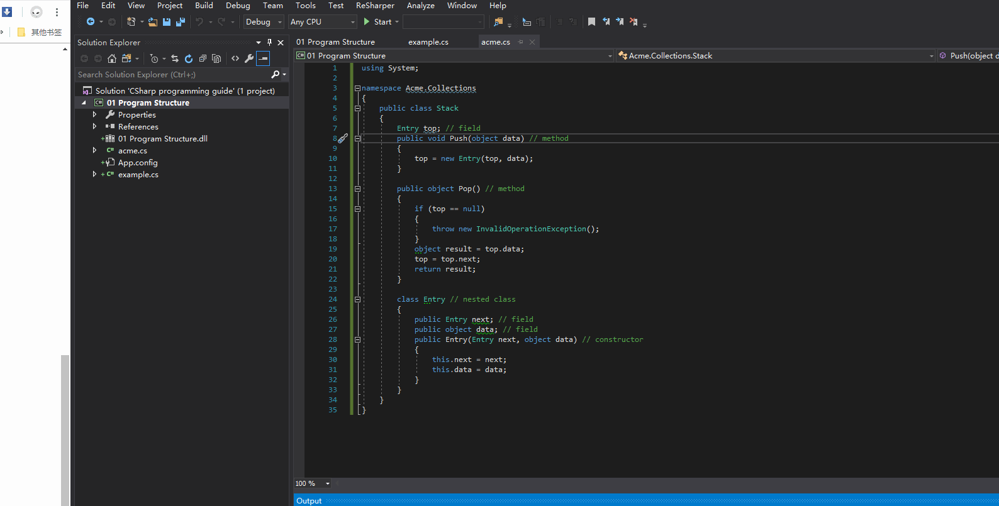

# [Introduction to C#](https://docs.microsoft.com/zh-cn/dotnet/csharp/tutorials/intro-to-csharp/index)

## 01 [Hello world](https://docs.microsoft.com/zh-cn/dotnet/csharp/tutorials/intro-to-csharp/hello-world)

### 打印`"Hello World"`

```c#
using System;

namespace _01_Hello_World
{
    class Program
    {
        static void Main(string[] args)
        {
            Console.WriteLine("Hello World!");
        }
    }
}
```

### 声明和使用变量

```c#
using System;

namespace _01_Hello_World
{
    class Program
    {
        static void Main(string[] args)
        {
            Console.WriteLine("Hello World!");
            string aFrined = "Bill";
            Console.WriteLine(aFrined);
        }
    }
}
```

```c#
using System;

namespace _01_Hello_World
{
    class Program
    {
        static void Main(string[] args)
        {
            Console.WriteLine("Hello World!");

            string aFriend = "Bill";
            Console.WriteLine(aFriend);

            aFriend = "Maira";
            Console.WriteLine(aFriend);
        }
    }
}
```

```c#
using System;

namespace _01_Hello_World
{
    class Program
    {
        static void Main(string[] args)
        {
            Console.WriteLine("Hello World!");

            string aFriend = "Bill";
            Console.WriteLine(aFriend);

            aFriend = "Maira";
            Console.WriteLine(aFriend);

            Console.WriteLine("Hello " + aFriend);
        }
    }
}
```

```c#
using System;

namespace _01_Hello_World
{
    class Program
    {
        static void Main(string[] args)
        {
            Console.WriteLine("Hello World!");

            string aFriend = "Bill";
            Console.WriteLine(aFriend);

            aFriend = "Maira";
            Console.WriteLine(aFriend);

            Console.WriteLine("Hello " + aFriend);

            Console.WriteLine($"Hello {aFriend}"); // 字符串内插
        }
    }
}
```

### 使用字符串

```c#
using System;

namespace _01_Hello_World
{
    class Program
    {
        static void Main(string[] args)
        {
            string firstFriend = "Maria";
            string secondFriend = "Sage";
            Console.WriteLine($"My friends are {firstFriend} and {secondFriend}");

            Console.WriteLine($"The name {firstFriend} has {firstFriend.Length} letters.");
            Console.WriteLine($"The name {secondFriend} has {secondFriend.Length} letters.");
        }
    }
}
```

### 发掘字符串的更多精彩用途

- 使用`Trim,TrimStart,TrimEnd`剔除字符串前后的空格

```c#
using System;

namespace _01_Hello_World
{
    class Program
    {
        static void Main(string[] args)
        {
            string greeting = "      Hello World!       ";
            Console.WriteLine($"[{greeting}]");

            string trimmedGreeting = greeting.TrimStart();
            Console.WriteLine($"[{trimmedGreeting}]");

            trimmedGreeting = greeting.TrimEnd();
            Console.WriteLine($"[{trimmedGreeting}]");

            trimmedGreeting = greeting.Trim();
            Console.WriteLine($"[{trimmedGreeting}]");
        }
    }
}
```

- 使用`Replace`

```c#
using System;

namespace _01_Hello_World
{
    class Program
    {
        static void Main(string[] args)
        {
            string sayHello = "Hello World!";
            Console.WriteLine(sayHello);
            sayHello = sayHello.Replace("Hello", "Greetings");
            Console.WriteLine(sayHello);
          
          	Console.WriteLine(sayHello.ToUpper());
						Console.WriteLine(sayHello.ToLower());
        }
    }
```

### 搜索字符串

- 使用`Contains,StartsWith,EndsWith`

```c#
using System;

namespace _01_Hello_World
{
    class Program
    {
        static void Main(string[] args)
        {
            string songLyrics = "You say goodbye, and I say hello";
            Console.WriteLine(songLyrics.Contains("goodbye"));
            Console.WriteLine(songLyrics.Contains("greetings"));

            Console.WriteLine(songLyrics.StartsWith("You"));
            Console.WriteLine(songLyrics.EndsWith("Hello"));
        }
    }
}
```

## 02 [Numbers in C#](https://docs.microsoft.com/zh-cn/dotnet/csharp/tutorials/intro-to-csharp/numbers-in-csharp)

### 探索整数数学运算

```c#
using System;

namespace _02_Explore_integer_math
{
    class Program
    {
        static void Main(string[] args)
        {
            int a = 18;
            int b = 6;
            int c = a + b;
            Console.WriteLine(c);

            c = a - b;
            Console.WriteLine(c);

            c = a * b;
            Console.WriteLine(c);

            c = a / b;
            Console.WriteLine(c);
        }
    }
}
```

### 探索运算顺序

```c#
using System;

namespace _02_Explore_integer_math
{
    class Program
    {
        static void Main(string[] args)
        {
            int a = 5;
            int b = 4;
            int c = 2;

            int d = a + b * c;
            Console.WriteLine(d);

            d = (a + b) * c;
            Console.WriteLine(d);

            d = (a + b) / c;
            Console.WriteLine(d);
        }
    }
}
```

### 探索整数运算精度和限值

```c#
using System;

namespace _02_Explore_integer_math
{
    class Program
    {
        static void Main(string[] args)
        {
            int a = 7;
            int b = 4;
            int c = 3;
            int d = (a + b) / c;
            int e = (a + b) % c;
            Console.WriteLine($"quotient: {d}");
            Console.WriteLine($"remainder: {e}");
        }
    }
}
```

```c#
using System;

namespace _02_Explore_integer_math
{
    class Program
    {
        static void Main(string[] args)
        {
            int max = int.MaxValue;
            int min = int.MinValue;
            Console.WriteLine($"The range of integers is {min} to {max}");
        }
    }
}
```

```c#
using System;

namespace _02_Explore_integer_math
{
    class Program
    {
        static void Main(string[] args)
        {
            int max = int.MaxValue;
            int min = int.MinValue;
            Console.WriteLine($"The range of integers is {min} to {max}");
            int what = max + 3;
            Console.WriteLine($"An example of overflow: {what}");
        }
    }
}
```

### 使用双精度类型

```c#
using System;

namespace _02_Explore_integer_math
{
    class Program
    {
        static void Main(string[] args)
        {
            double a = 5;
            double b = 4;
            double c = 2;
            double d = (a + b) / c;
            Console.WriteLine(d);
        }
    }
}
```

```c#
using System;

namespace _02_Explore_integer_math
{
    class Program
    {
        static void Main(string[] args)
        {
            double a = 19;
            double b = 23;
            double c = 8;
            double d = (a + b) / c;
            Console.WriteLine(d);
        }
    }
}
```

```c#
using System;

namespace _02_Explore_integer_math
{
    class Program
    {
        static void Main(string[] args)
        {
            double max = double.MaxValue;
            double min = double.MinValue;
            Console.WriteLine($"The range of double is {min} to {max}");
        }
    }
}
```

```c#
using System;

namespace _02_Explore_integer_math
{
    class Program
    {
        static void Main(string[] args)
        {
            double third = 1.0 / 3.0;
            Console.WriteLine(third);
        }
    }
}
```

### 使用固定点类型

```c#
using System;

namespace _02_Explore_integer_math
{
    class Program
    {
        static void Main(string[] args)
        {
            decimal min = decimal.MinValue;
            decimal max = decimal.MaxValue;
            Console.WriteLine($"The range of the decimal type is {min} to {max}");
        }
    }
}
```

```c#
using System;

namespace _02_Explore_integer_math
{
    class Program
    {
        static void Main(string[] args)
        {
            double a = 1.0;
            double b = 3.0;
            Console.WriteLine(a / b);

            decimal c = 1.0M;
            decimal d = 3.0M;
            Console.WriteLine(c / d);
        }
    }
}
```

## 03 [Branches and loops](https://docs.microsoft.com/zh-cn/dotnet/csharp/tutorials/intro-to-csharp/branches-and-loops)

### 使用 if 语句做出决定

```c#
using System;

namespace _03_Branches_and_loops
{
    class Program
    {
        static void Main(string[] args)
        {
            int a = 5;
            int b = 6;
            if (a + b > 10)
                Console.WriteLine("The answer is greater than 10.");

            b = 3;
            if (a + b > 10)
                Console.WriteLine("The answer is greater than 10.");
        }
    }
}
```

### 让 if 和 else 完美配合

```c#
using System;

namespace _03_Branches_and_loops
{
    class Program
    {
        static void Main(string[] args)
        {
            int a = 5;
            int b = 3;
            if (a + b > 10)
                Console.WriteLine("The answer is greater than 10");
            else
                Console.WriteLine("The answer is not greater than 10");
        }
    }
}
```

```c#
using System;

namespace _03_Branches_and_loops
{
    class Program
    {
        static void Main(string[] args)
        {
            int a = 5;
            int b = 3;
            if (a + b > 10)
            {
                Console.WriteLine("The answer is greater than 10");
            }
            else
            {
                Console.WriteLine("The answer is not greater than 10");
            }
        }
    }
}
```

```c#
using System;

namespace _03_Branches_and_loops
{
    class Program
    {
        static void Main(string[] args)
        {
            int a = 5;
            int b = 3;
            int c = 4;
            if ((a + b + c > 10) && (a > b))
            {
                Console.WriteLine("The answer is greater than 10");
                Console.WriteLine("And the first number is greater than the second");
            }
            else
            {
                Console.WriteLine("The answer is not greater than 10");
                Console.WriteLine("Or the first number is not greater than the second");
            }
        }
    }
}
```

```c#
using System;

namespace _03_Branches_and_loops
{
    class Program
    {
        static void Main(string[] args)
        {
            int a = 5;
            int b = 3;
            int c = 4;
            if ((a + b + c > 10) || (a > b))
            {
                Console.WriteLine("The answer is greater than 10");
                Console.WriteLine("Or the first number is greater than the second");
            }
            else
            {
                Console.WriteLine("The answer is not greater than 10");
                Console.WriteLine("And the first number is not greater than the second");
            }
        }
    }
}
```

### 使用循环重复执行运算

```c#
using System;

namespace _03_Branches_and_loops
{
    class Program
    {
        static void Main(string[] args)
        {
            int counter = 0;
            while (counter < 10)
            {
                Console.WriteLine($"Hello World! The counter is {counter}");
                counter++;
            }
        }
    }
}
```

```c#
using System;

namespace _03_Branches_and_loops
{
    class Program
    {
        static void Main(string[] args)
        {
            int counter = 0;
            do
            {
                Console.WriteLine($"Hello World! The counter is {counter}");
                counter++;
            } while (counter < 10);
        }
    }
}
```

### 使用 for 循环

```c#
using System;

namespace _03_Branches_and_loops
{
    class Program
    {
        static void Main(string[] args)
        {
            for (int counter = 0; counter < 10; counter++)
            {
                Console.WriteLine($"Hello World! The counter is {counter}");
            }
        }
    }
}
```

### 结合使用分支和循环

```c#
using System;

namespace _03_Branches_and_loops
{
    class Program
    {
        static void Main(string[] args)
        {
            int sum = 0;
            for (int number = 1; number < 21; number++)
            {
                if (number % 3 == 0)
                {
                    sum = sum + number;
                }
            }
            Console.WriteLine($"The sum is {sum}");
        }
    }
}
```


## 04 [String interpolation](https://docs.microsoft.com/zh-cn/dotnet/csharp/tutorials/intro-to-csharp/interpolated-strings)

### 创建内插字符串

```c#
using System;

namespace _04_String_interpolation
{
    class Program
    {
        static void Main(string[] args)
        {
            var name = "<name>";
            Console.WriteLine($"Hello, {name}. It's a pleasure to meet you!");
        }
    }
}
```

### 包含不同的数据类型

```C#
using System;

namespace _04_String_interpolation
{
    class Program
    {
        static void Main(string[] args)
        {
            var item = new Vegetable("eggplant");
            var date = DateTime.Now;
            var price = 1.99m;
            var unit = Unit.item;
            Console.WriteLine($"On {date}, the price of {item} was {price} per {unit}.");
        }
    }

    public class Vegetable
    {
        public Vegetable(string name) => Name = name;

        public string Name { get; }

        public override string ToString() => Name;
    }

    public enum Unit { item, kilogram, gram, dozen };
}
```

### 控制内插表达式的格式

```c#
using System;

namespace _04_String_interpolation
{
    class Program
    {
        static void Main(string[] args)
        {
            var item = new Vegetable("eggplant");
            var date = DateTime.Now;
            var price = 1.99m;
            var unit = Unit.item;
            Console.WriteLine($"On {date}, the price of {item} was {price} per {unit}.");
            Console.WriteLine($"On {date:d}, the price of {item} was {price:C2} per {unit}.");
        }
    }

    public class Vegetable
    {
        public Vegetable(string name) => Name = name;

        public string Name { get; }

        public override string ToString() => Name;
    }

    public enum Unit { item, kilogram, gram, dozen };
}
```

### 控制内插表达式的字段宽度和对齐方式

```c#
using System;
using System.Collections.Generic;

namespace _04_String_interpolation
{
    class Program
    {
        static void Main(string[] args)
        {
            var inventory = new Dictionary<string, int>()
            {
                ["hammer, ball pein"] = 18,
                ["hammer, cross pein"] = 5,
                ["screwdriver, Phillips #2"] = 14
            };

            Console.WriteLine($"Inventory on {DateTime.Now:d}");
            Console.WriteLine(" ");
            Console.WriteLine($"|{"Item",-25}|{"Quantity",10}|");
            foreach (var item in inventory)
                Console.WriteLine($"|{item.Key,-25}|{item.Value,10}|");
        }
    }
}
```

```c#
using System;

namespace _04_String_interpolation
{
    class Program
    {
        static void Main(string[] args)
        {
            Console.WriteLine($"[{DateTime.Now,-20:d}] Hour [{DateTime.Now,-10:HH}] [{1063.342,15:N2}] feet");
        }
    }
}
```


## 05 [List collection](https://docs.microsoft.com/zh-cn/dotnet/csharp/tutorials/intro-to-csharp/list-collection)

### 创建列表

```c#
using System;
using System.Collections.Generic;

namespace _05_List_collection
{
    class Program
    {
        static void Main(string[] args)
        {
            var names = new List<string> { "<name>", "Ana", "Felipe" };
            foreach (var name in names)
            {
                Console.WriteLine($"Hello {name.ToUpper()}!");
            }
        }
    }
}
```

### 修改列表内容

```c#
using System;
using System.Collections.Generic;

namespace _05_List_collection
{
    class Program
    {
        static void Main(string[] args)
        {
            var names = new List<string> { "<name>", "Ana", "Felipe" };
            foreach (var name in names)
            {
                Console.WriteLine($"Hello {name.ToUpper()}!");
            }

            Console.WriteLine();
            names.Add("Maria");
            names.Add("Bill");
            names.Remove("Ana");
            foreach (var name in names)
            {
                Console.WriteLine($"Hello {name.ToUpper()}!");
            }

            Console.WriteLine();
            Console.WriteLine($"My name is {names[0]}.");
            Console.WriteLine($"I've added {names[2]} and {names[3]} to the list.");

            Console.WriteLine();
            Console.WriteLine($"The list has {names.Count} people in it");
        }
    }
}
```

### 搜索列表并进行排序

```c#
using System;
using System.Collections.Generic;

namespace _05_List_collection
{
    class Program
    {
        static void Main(string[] args)
        {
            var names = new List<string> { "<name>", "Ana", "Felipe" };
            var index = names.IndexOf("Felipe");
            if (index != -1)
                Console.WriteLine($"The name {names[index]} is at index {index}");

            var notFound = names.IndexOf("Not Found");
            Console.WriteLine($"When an item is not found, IndexOf returns {notFound}");

            names.Sort();
            foreach (var name in names)
            {
                Console.WriteLine($"Hello {name.ToUpper()}!");
            }
        }
    }
}
```

### 其他类型的列表

```c#
using System;
using System.Collections.Generic;

namespace _05_List_collection
{
    class Program
    {
        static void Main(string[] args)
        {
            var fibonacciNumbers = new List<int> { 1, 1 };
            var previous = fibonacciNumbers[fibonacciNumbers.Count - 1];
            var previous2 = fibonacciNumbers[fibonacciNumbers.Count - 2];

            fibonacciNumbers.Add(previous + previous2);

            foreach (var item in fibonacciNumbers)
                Console.WriteLine(item);
        }
    }
}
```

### 挑战

```c#
var fibonacciNumbers = new List<int> {1, 1};

while (fibonacciNumbers.Count < 20)
{
    var previous = fibonacciNumbers[fibonacciNumbers.Count - 1];
    var previous2 = fibonacciNumbers[fibonacciNumbers.Count - 2];

    fibonacciNumbers.Add(previous + previous2);
}
foreach(var item in fibonacciNumbers)
    Console.WriteLine(item);
```

## 06 [Introduction to classes](https://docs.microsoft.com/zh-cn/dotnet/csharp/tutorials/intro-to-csharp/introduction-to-classes)

- 准备创建的三个文件

```c#
BankAccount.cs // 帐户
Program.cs
transaction.cs // 交易
```

### 创建表示账户的类

```c#
// BankAccount.cs
using System;

namespace classes
{
    public class BankAccount
    {
        /// <summary>
        /// 属性元素 : 账号
        /// </summary>
        public string Number { get; }
        /// <summary>
        /// 属性元素 : 拥有者
        /// </summary>
        public string Owner { get; set; }
        /// <summary>
        /// 属性元素 : 金额
        /// </summary>
        public decimal Balance { get; }
      
        /// <summary>
        /// 构造函数
        /// </summary>
        /// <param name="name">姓名</param>
        /// <param name="initialBalance">初始账户金额</param>
        public BankAccount(string name, decimal initialBalance)
        {
            this.Owner = name;
            this.Balance = initialBalance;
        }
    }
}

        /// <summary>
        /// 方法 : 钱存
        /// </summary>
        /// <param name="amount">账户</param>
        /// <param name="date">日期</param>
        /// <param name="note">记录</param>
        public void MakeDeposit(decimal amount, DateTime date, string note)
        {
        }

        /// <summary>
        /// 方法 : 取钱
        /// </summary>
        /// <param name="amount">账户</param>
        /// <param name="date"> 日期 </param>
        /// <param name="note">记录</param>
        public void MakeWithdrawal(decimal amount, DateTime date, string note)
        {
        }
```

```c#
// Program.cs
using System;

namespace classes
{
    class Program
    {
        static void Main(string[] args)
        {
            var account = new BankAccount("<name>", 1000);
            Console.WriteLine($"Account {account.Number} was created for {account.Owner} with {account.Balance} initial balance.");
        }
    }
}
```

### 使用分离公共责任（如拥有帐号）与私有实现（如何生成帐号）的方法

```c#
// BankAccount.cs
using System;

namespace classes
{
    public class BankAccount
    {
        /// <summary>
        /// 属性元素 : 账号
        /// </summary>
        public string Number { get; }
        /// <summary>
        /// 属性元素 : 拥有者
        /// </summary>
        public string Owner { get; set; }
        /// <summary>
        /// 属性元素 : 金额
        /// </summary>
        public decimal Balance { get; }

        private static int accountNumberSeed = 1234567890;

        /// <summary>
        /// 构造函数
        /// </summary>
        /// <param name="name">姓名</param>
        /// <param name="initialBalance">账户初始金额</param>
        public BankAccount(string name, decimal initialBalance)
        {
            this.Owner = name;
            this.Balance = initialBalance;
            this.Number = accountNumberSeed.ToString();
            accountNumberSeed++;
        }

        /// <summary>
        /// 方法 : 钱存
        /// </summary>
        /// <param name="amount">账户</param>
        /// <param name="date">日期</param>
        /// <param name="note">记录</param>
        public void MakeDeposit(decimal amount, DateTime date, string note)
        {
        }

        /// <summary>
        /// 方法 : 取钱
        /// </summary>
        /// <param name="amount">账户</param>
        /// <param name="date"> 日期 </param>
        /// <param name="note">记录</param>
        public void MakeWithdrawal(decimal amount, DateTime date, string note)
        {
        }
    }
}
```

### 创建表示交易的类

```c#
// Transaction.cs
using System;

namespace _06_Introduction_to_classes
{
    public class Transaction
    {
        public decimal Amount { get; }
        public DateTime Date { get; }
        public string Notes { get; }

        public Transaction(decimal amount, DateTime date, string note)
        {
            this.Amount = amount;
            this.Date = date;
            this.Notes = note;
        }
    }
}
```
- 加入`allTransactions`
```c#
// BankAccount.cs
using System;
using System.Collections.Generic;

namespace _06_Introduction_to_classes
{
    public class BankAccount
    {
        /// <summary>
        /// 属性元素 : 账号
        /// </summary>
        public string Number { get; }
        /// <summary>
        /// 属性元素 : 拥有者
        /// </summary>
        public string Owner { get; set; }
        /// <summary>
        /// 属性元素 : 金额
        /// </summary>
        public decimal Balance { get; }

        private List<Transaction> allTransactions = new List<Transaction>();

        private static int accountNumberSeed = 1234567890;

        /// <summary>
        /// 构造函数
        /// </summary>
        /// <param name="name">姓名</param>
        /// <param name="initialBalance">账户初始金额</param>
        public BankAccount(string name, decimal initialBalance)
        {
            this.Owner = name;
            this.Balance = initialBalance;
            this.Number = accountNumberSeed.ToString();
            accountNumberSeed++;
        }

        /// <summary>
        /// 方法 : 钱存
        /// </summary>
        /// <param name="amount">账户</param>
        /// <param name="date">日期</param>
        /// <param name="note">记录</param>
        public void MakeDeposit(decimal amount, DateTime date, string note)
        {
        }

        /// <summary>
        /// 方法 : 取钱
        /// </summary>
        /// <param name="amount">账户</param>
        /// <param name="date"> 日期 </param>
        /// <param name="note">记录</param>
        public void MakeWithdrawal(decimal amount, DateTime date, string note)
        {
        }
    }
}
```

- 修改数据成员`Balance`的初始化,以及修改构造函数

```c#
// BankAccount.cs
using System;
using System.Collections.Generic;

namespace _06_Introduction_to_classes
{
    public class BankAccount
    {
        /// <summary>
        /// 属性元素 : 账号
        /// </summary>
        public string Number { get; }
        /// <summary>
        /// 属性元素 : 拥有者
        /// </summary>
        public string Owner { get; set; }
        /// <summary>
        /// 属性元素 : 金额
        /// </summary>
        public decimal Balance {
            get {
                decimal balance = 0;
                foreach (var item in allTransactions)
                {
                    balance += item.Amount;
                }

                return balance;
            }
        }

        private List<Transaction> allTransactions = new List<Transaction>();

        private static int accountNumberSeed = 1234567890;

        /// <summary>
        /// 构造函数
        /// </summary>
        /// <param name="name">姓名</param>
        /// <param name="initialBalance">账户初始金额</param>
        public BankAccount(string name, decimal initialBalance)
        {
            this.Owner = name;
            this.Number = accountNumberSeed.ToString();
            accountNumberSeed++;
        }

        /// <summary>
        /// 方法 : 钱存
        /// </summary>
        /// <param name="amount">账户</param>
        /// <param name="date">日期</param>
        /// <param name="note">记录</param>
        public void MakeDeposit(decimal amount, DateTime date, string note)
        {
        }

        /// <summary>
        /// 方法 : 取钱
        /// </summary>
        /// <param name="amount">账户</param>
        /// <param name="date"> 日期 </param>
        /// <param name="note">记录</param>
        public void MakeWithdrawal(decimal amount, DateTime date, string note)
        {
        }
    }
}
```

- 实现成员函数`MakeDeposit`和`MakeWithdrawal`,修改构造函数

```c#
// BankAccount.cs
using System;
using System.Collections.Generic;

namespace _06_Introduction_to_classes
{
    public class BankAccount
    {
        /// <summary>
        /// 属性元素 : 账号
        /// </summary>
        public string Number { get; }
        /// <summary>
        /// 属性元素 : 拥有者
        /// </summary>
        public string Owner { get; set; }
        /// <summary>
        /// 属性元素 : 账户金额
        /// </summary>
        public decimal Balance {
            get {
                decimal balance = 0;
                foreach (var item in allTransactions)
                {
                    balance += item.Amount;
                }

                return balance;
            }
        }

        private List<Transaction> allTransactions = new List<Transaction>();

        private static int accountNumberSeed = 1234567890;

        /// <summary>
        /// 构造函数
        /// </summary>
        /// <param name="name">姓名</param>
        /// <param name="initialBalance">账户初始金额</param>
        public BankAccount(string name, decimal initialBalance)
        {
            this.Number = accountNumberSeed.ToString();
            accountNumberSeed++;

            this.Owner = name;
            MakeDeposit(initialBalance, DateTime.Now, "Initial balance");
        }

        /// <summary>
        /// 方法 : 钱存
        /// </summary>
        /// <param name="amount">金额</param>
        /// <param name="date">日期</param>
        /// <param name="note">记录</param>
        public void MakeDeposit(decimal amount, DateTime date, string note)
        {
            if (amount <= 0)
            {
                throw new ArgumentOutOfRangeException(nameof(amount), "Amount of deposit must be positive");
            }

            var deposit = new Transaction(amount, date, note);

            allTransactions.Add(deposit);
        }

        /// <summary>
        /// 方法 : 取钱
        /// </summary>
        /// <param name="amount">金额</param>
        /// <param name="date"> 日期 </param>
        /// <param name="note">记录</param>
        public void MakeWithdrawal(decimal amount, DateTime date, string note)
        {
            if (amount <= 0)
            {
                throw new ArgumentOutOfRangeException(nameof(amount), "Amount of withdrawal must be positive");
            }

            if (Balance - amount < 0)
            {
                throw new InvalidOperationException("Not sufficient funds for this withdrawal");
            }

            var withdrawal = new Transaction(-amount, date, note);

            allTransactions.Add(withdrawal);
        }
    }
    }
}
```

### 测试

- 添加几个存款和取款, 进行测试

```c#
// Program.cs
using System;

namespace _06_Introduction_to_classes
{
    class Program
    {
        static void Main(string[] args)
        {
            var account = new BankAccount("<name>", 1000);
            Console.WriteLine($"Account {account.Number} was created for {account.Owner} with {account.Balance} initial balance.");

            // 添加几个存款和取款, 进行测试
            account.MakeWithdrawal(500, DateTime.Now, "Rent payment");
            Console.WriteLine(account.Balance);
            account.MakeDeposit(100, DateTime.Now, "friend paid me back");
            Console.WriteLine(account.Balance);
        }
    }
}
```

- 尝试创建初始余额为负数的帐户，测试能否捕获到错误条件

```c#
// Program.cs
using System;

namespace _06_Introduction_to_classes
{
    class Program
    {
        static void Main(string[] args)
        {
            var account = new BankAccount("<name>", 1000);
            Console.WriteLine($"Account {account.Number} was created for {account.Owner} with {account.Balance} initial balance.");

            // 添加几个存款和取款, 进行测试
            account.MakeWithdrawal(500, DateTime.Now, "Rent payment");
            Console.WriteLine(account.Balance);
            account.MakeDeposit(100, DateTime.Now, "friend paid me back");
            Console.WriteLine(account.Balance);

            // Test that the initial balances must be positive:
            try
            {
                var invalidAccount = new BankAccount("invalid", -55);
            }
            catch (ArgumentOutOfRangeException e)
            {
                Console.WriteLine("Exception caught creating account with negative balance");
                Console.WriteLine(e.ToString());
            }
        }
    }
}
```

- 使用相同的技术，测试代码能否在取款后的余额为负数时引发异常

```c#
using System;

namespace _06_Introduction_to_classes
{
    class Program
    {
        static void Main(string[] args)
        {
            var account = new BankAccount("<name>", 1000);
            Console.WriteLine($"Account {account.Number} was created for {account.Owner} with {account.Balance} initial balance.");

            // 添加几个存款和取款, 进行测试
            account.MakeWithdrawal(500, DateTime.Now, "Rent payment");
            Console.WriteLine(account.Balance);
            account.MakeDeposit(100, DateTime.Now, "friend paid me back");
            Console.WriteLine(account.Balance);

            // Test that the initial balances must be positive:
            try
            {
                var invalidAccount = new BankAccount("invalid", -55);
            }
            catch (ArgumentOutOfRangeException e)
            {
                Console.WriteLine("Exception caught creating account with negative balance");
                Console.WriteLine(e.ToString());
            }

            // Test for a negative balance
            try
            {
                account.MakeWithdrawal(750, DateTime.Now, "Attempt to overdraw");
            }
            catch (InvalidOperationException e)
            {
                Console.WriteLine("Exception caught trying to overdraw");
                Console.WriteLine(e.ToString());
            }
        }
    }
}
```

### 挑战 - 记录所有交易

- 编写 `GetAccountHistory` 方法，为交易历史记录创建 `string`。 将此方法添加到 `BankAccount` 类型中

```c#
// BankAccount.cs
using System;
using System.Collections.Generic;

namespace _06_Introduction_to_classes
{
    public class BankAccount
    {
        /// <summary>
        /// 属性元素 : 账号
        /// </summary>
        public string Number { get; }
        /// <summary>
        /// 属性元素 : 拥有者
        /// </summary>
        public string Owner { get; set; }
        /// <summary>
        /// 属性元素 : 账户金额
        /// </summary>
        public decimal Balance {
            get {
                decimal balance = 0;
                foreach (var item in allTransactions)
                {
                    balance += item.Amount;
                }

                return balance;
            }
        }

        private List<Transaction> allTransactions = new List<Transaction>();

        private static int accountNumberSeed = 1234567890;

        /// <summary>
        /// 构造函数
        /// </summary>
        /// <param name="name">姓名</param>
        /// <param name="initialBalance">账户初始金额</param>
        public BankAccount(string name, decimal initialBalance)
        {
            this.Number = accountNumberSeed.ToString();
            accountNumberSeed++;

            this.Owner = name;
            MakeDeposit(initialBalance, DateTime.Now, "Initial balance");
        }

        /// <summary>
        /// 方法 : 钱存
        /// </summary>
        /// <param name="amount">金额</param>
        /// <param name="date">日期</param>
        /// <param name="note">记录</param>
        public void MakeDeposit(decimal amount, DateTime date, string note)
        {
            if (amount <= 0)
            {
                throw new ArgumentOutOfRangeException(nameof(amount), "Amount of deposit must be positive");
            }

            var deposit = new Transaction(amount, date, note);

            allTransactions.Add(deposit);
        }

        /// <summary>
        /// 方法 : 取钱
        /// </summary>
        /// <param name="amount">金额</param>
        /// <param name="date"> 日期 </param>
        /// <param name="note">记录</param>
        public void MakeWithdrawal(decimal amount, DateTime date, string note)
        {
            if (amount <= 0)
            {
                throw new ArgumentOutOfRangeException(nameof(amount), "Amount of withdrawal must be positive");
            }

            if (Balance - amount < 0)
            {
                throw new InvalidOperationException("Not sufficient funds for this withdrawal");
            }

            var withdrawal = new Transaction(-amount, date, note);

            allTransactions.Add(withdrawal);
        }

        public string GetAccountHistory()
        {
            var report = new System.Text.StringBuilder();

            report.AppendLine("Date\t\tAmount\tNote");
            foreach (var item in allTransactions)
            {
                report.AppendLine($"{item.Date.ToShortDateString()}\t{item.Amount}\t{item.Notes}");
            }

            return report.ToString();
        }
    }
}
```

```c#
// Program.cs
using System;

namespace _06_Introduction_to_classes
{
    class Program
    {
        static void Main(string[] args)
        {
            var account = new BankAccount("<name>", 1000);
            Console.WriteLine($"Account {account.Number} was created for {account.Owner} with {account.Balance} initial balance.");

            // 添加几个存款和取款, 进行测试
            account.MakeWithdrawal(500, DateTime.Now, "Rent payment");
            Console.WriteLine(account.Balance);
            account.MakeDeposit(100, DateTime.Now, "friend paid me back");
            Console.WriteLine(account.Balance);

            Console.WriteLine(account.GetAccountHistory());
        }
    }
}
```

# [Explore C# 6](https://docs.microsoft.com/zh-cn/dotnet/csharp/tutorials/exploration/csharp-6)

## Read-only auto-properties enable read-only types

只读自动属性支持只读类型

通过自动属性语法的两个改进，可以更轻松地在更多位置使用自动属性：只读自动属性和自动属性初始值设定项。 请参考此小程序：

```c#
using System;

namespace _01_Read_only_auto_properties_enable_read_only_types
{
    public class Person
    {
        public string FirstName { get; private set; }
        public string LastName { get; private set; }

        public Person(string first, string last)
        {
            FirstName = first;
            LastName = last;
        }

        public override string ToString()
        {
            return FirstName + " " + LastName;
        }

        public string AllCaps()
        {
            FirstName = FirstName.ToUpper();
            LastName = LastName.ToUpper();
            return ToString();
        }
    }

    public class Program
    {
        public static void Main()
        {
            var p = new Person("Bill", "Wagner");
            Console.WriteLine("The name, in all caps: " + p.AllCaps());
            Console.WriteLine("The name: " + p);
        }
    }
}
```
- 运行代码. AllCaps 具有不良副作用，即它会修改属性值并返回大写字符串。 Person 类的创建者希望 FirstName 和 LastName 的字符串为只读字符串。 使用 C#6，可以清楚地表达该意图。 从这两个属性中删除 private set 以创建只读自动属性。
- 再次运行代码, 可以看到编译器发现 FirstName 和 LastName 属性在两个位置发生了更改，而这两个属性在这两个位置本不应更改。 可以将 AllCaps 方法更改为以下代码，以修复编译器错误：
```c#
using System;

namespace _01_Read_only_auto_properties_enable_read_only_types
{
    public class Person
    {
        public string FirstName { get; }
        public string LastName { get; }

        public Person(string first, string last)
        {
            FirstName = first;
            LastName = last;
        }

        public override string ToString()
        {
            return FirstName + " " + LastName;
        }

        public string AllCaps()
        {
            return ToString().ToUpper();
        }
    }

    public class Program
    {
        public static void Main()
        {
            var p = new Person("Bill", "Wagner");
            Console.WriteLine("The name, in all caps: " + p.AllCaps());
            Console.WriteLine("The name: " + p);
        }
    }
}
```

## Initialize backing fields for auto-properties

初始化自动属性的支持字段
- C# 6 中的新语法支持使用自动属性的初始值设定项。 
  - 之前只能在构造函数中初始化属性
- 随着类增加新的功能，这一点变得越来越重要。 
- 添加一个中间名称属性和一个新的构造函数，该构造函数会将三个字符串添加到 `Person` 类中

```c#
using System;

namespace _02_Initialize_backing_fields_for_auto_properties
{
    public class Person
    {
        public string FirstName { get; }
        public string LastName { get; }
        public string MiddleName { get; } = ""; // 初始化自动属性

        public Person(string first, string last)
        {
            FirstName = first;
            LastName = last;
        }

        public Person(string first, string middle, string last)
        {
            FirstName = first;
            MiddleName = middle;
            LastName = last;
        }

        public override string ToString()
        {
            return FirstName + " " + LastName;
        }

        public string AllCaps()
        {
            return ToString().ToUpper();
        }
    }

    public class Program
    {
        public static void Main()
        {
            var p1 = new Person("Bill", "Wagner");
            Console.WriteLine("The name: " + p1);
            var p2 = new Person("FirstName", "MiddleName", "LastName");
            Console.WriteLine("The name: " + p2);
        }
    }
}
```

## Expression-bodied members

Expression-bodied 成员为轻量级方法提供轻量级语法。 `Person` 类有两个很好的候选项。 

请查看 `ToString` 的声明：

```c#
public override string ToString()
{
    return FirstName + " " + LastName;
}
```

将 `ToString` 声明替换为以下代码：

```c#
public override string ToString() => FirstName + " " + LastName;
```

使用 `Caps` 方法，执行相同操作。 这是一个小的改进，但是如果使用得当，它会创建更具可读性的代码，特别是对于数据传输对象 (DTO) 和其他具有最小行为的类型。

## Importing a single class

如果在整个代码中反复使用类的静态方法，则每次包含类名都会模糊代码的含义。 `Person` 类目前导入 `System` 命名空间，尽管只会使用 [System.Console](https://docs.microsoft.com/zh-cn/dotnet/api/system.console)。 

修改 `using` 语句，如下所示：

```c#
using static System.Console;
```

在广泛使用具有许多静态方法的单个类（比如 [`string`](https://docs.microsoft.com/zh-cn/dotnet/api/system.string) 类或 [System.Math](https://docs.microsoft.com/zh-cn/dotnet/api/system.math) 类）的大型程序中，`static using` 语句变得更加有用。

## A better string format

C# 6 包含新语法，用于从字符串和嵌入的表达式编写字符串，可以通过计算这些字符串来生成其他字符串值。 可以更改 `ToString` 和 `AllCaps` 方法，以使用以下语法：

```c#
public override string ToString() => $"{FirstName} {LastName}";
public string AllCaps() => ToString().ToUpper();
```

可以直接编写 C# 表达式，而不是 `{` 和 `}` 之间的位置参数。 可以在 `Main` 方法中执行相同操作。将现有代码替换为以下代码：

```c#
var p = new Person("Bill", "Wagner");
WriteLine($"The name, in all caps: {p.AllCaps()}");
WriteLine($"The name is: {p}");
```

不仅限于这些表达式中的单个变量。 让我们从一个新的示例开始，修改该示例，以演示可以与字符串内插配合使用的其他表达式。 将以下代码粘贴到 `Main` 方法中的交互式窗口：

```c#
var phrase = "the quick brown fox jumps over the lazy dog";
var wordLength = from word in phrase.Split(" ") select word.Length;
var average = wordLength.Average();
WriteLine(average);
```

可以删除局部变量 `average`，并在内插字符串表达式中执行该计算。 将最后两行替换为以下部分：

```c#
WriteLine($"The average word length is: {wordLength.Average()}");
```

运行前面的示例，你可能会发现 `Average` 的输出的小数位数比你需要的多。 字符串内插语法支持可使用前面的格式设置方法的所有格式字符串。 在大括号内指定格式字符串。 在要设置格式的表达式后面添加 `:`：

```c#
WriteLine($"The average word length is: {wordLength.Average():F2}");
```

## Quick and easy null checks

借助 `?.`（null 条件）运算符，可轻松编写包含 `null` 值的逻辑，无需额外的 `if` 检查。 若要探索此功能，

请先将以下代码复制到交互式窗口，然后进行尝试：

```c#
using System;

namespace _06_Quick_and_easy_null_checks
{
    public class Program
    {
        public static void Main()
        {
            string s = null;
            Console.WriteLine(s.Length);
        }
    }
}
```
将 . 成员访问运算符更改为 null 条件运算符:
```c#
using System;

namespace _06_Quick_and_easy_null_checks
{
    public class Program
    {
        public static void Main()
        {
            string s = null;
            // Console.WriteLine(s.Length);
            Console.WriteLine(s?.Length);
        }
    }
}
```
做此更改后，不会有任何输出。 这是因为`s.Length`的结果为 int 时，`s?.Length` 的结果为 `int?`。 在此示例中，`s?.Length` 为 `null`。 如果 `?.` 的左操作数为 `null`，则它返回 null。 如果右操作数的类型为值类型，则 `?. `运算符为该类型返回可以为 `null` 的类型。 除了 `?. `之外，还可以使用 `?[] `进行数组或索引访问。 

试运行以下代码：

```c#
char? c = s?[0];
Console.WriteLine(c.HasValue);
```

多个条件运算符可以组合成一个表达式。 `null` 左操作数生成 `null` 结果，这样就可以很容易地避免嵌套 if 子句以访问成员的成员。 

例如，在交互式窗口中，试运行以下代码：

```c#
string s = null;
bool? hasMore = s?.ToCharArray()?.GetEnumerator()?.MoveNext();
Console.WriteLine(hasMore.HasValue);
```

null 条件运算符可以帮助你编写使核心逻辑清晰，同时无缝测试 `null` 值的代码。

## Exception filers
使用异常筛选器可以捕获基于某些条件的异常。 
- 典型用法是创建筛选器方法，该方法记录异常，但从不处理这些异常。 异
- 常筛选器为布尔表达式，应执行 `catch` 子句时该表达式为 `true`，不应由 `catch` 子句捕获异常时，该表达式为 `false`。 

尝试运行该程序:它将异常类型和消息记录到控制台。 返回 false，表示无法处理异常。

```c#
using System;

public class Program
{
    public static void Main()
    {
        try 
        {
            string s = null;
            Console.WriteLine(s.Length);

        } catch (Exception e) when (LogException(e))
        {
        }
        Console.WriteLine("Exception must have been handled");
    }

    private static bool LogException(Exception e)
    {
        Console.WriteLine($"\tIn the log routine. Caught {e.GetType()}");
        Console.WriteLine($"\tMessage: {e.Message}");
        return false;
    }
}
```

应该先发送来自 `LogException` 方法的消息，然后发送默认异常消息。 尝试将 `return false` 语句更改为 `return true`，然后再运行一次。 现在，捕获到异常，并且程序运行直到完成。

除日志记录场景外，异常筛选器在异常的属性确定采取何种操作时可能最有用。 

- 例如，可以查看[AggregateException](https://docs.microsoft.com/zh-cn/dotnet/api/system.aggregateexception) 中包含的异常，并根据特定的异常采取适当的操作。

## Using nameof

`nameof` 运算符返回任何变量或类型的名称。

尝试运行以下代码，了解工作原理

```c#
using System;

public class Program
{
    public static void Main()
    {
        Console.WriteLine(nameof(System.String));
        int j = 5;
        Console.WriteLine(nameof(j));
        List<string> names = new List<string>();
        Console.WriteLine(nameof(names));
    }
}
```

输出与变量或类型的名称相匹配。 即使提供了完全限定的类型名称（如 `System.String`），`nameof`运算符也会返回不限定的名称。 如果需要将参数或属性名称转换为字符串，此功能非常有用。 示例包括捕获用于引发 [ArgumentNullException](https://docs.microsoft.com/zh-cn/dotnet/api/system.argumentnullexception) 或 [ArgumentException](https://docs.microsoft.com/zh-cn/dotnet/api/system.argumentexception) 的参数的名称，或者捕获实现[INotifyPropertyChanged](https://docs.microsoft.com/zh-cn/dotnet/api/system.componentmodel.inotifypropertychanged) 时更改的属性的名称。

## New object initialization syntax

通过新的对象初始化，可以创建更容易初始化字典和其他类型的方法。 开始使用字典。 

在中运行以下代码：

```c#
var messages = new Dictionary<int, string>
{
    [404] = "Page not Found",
    [302] = "Page moved, but left a forwarding address.",
    [500] = "The web server can't come out to play today."
};

Console.WriteLine(messages[302]);
```

可以将此语法扩展到实现 [IEnumerable](https://docs.microsoft.com/zh-cn/dotnet/api/system.collections.ienumerable) 并具有公共可访问 `Add` 方法的任何类。 在交互式窗口中，尝试以下示例。 它创建 `Path` 类，该类实现 `IEnumerable<Point3D>` 并具有用于添加点（包含三个参数）的方法。 它还结合本教程中已演示过的其他技术，如 expression-bodied 成员和字符串内插。

在 `Main` 方法中，通过提供点的坐标来初始化路径。 这些的点通过 `Add` 方法添加到集合中。

“Add”方法也可以是扩展方法。 可以按以下方式更新前面的示例。 由于沙盒限制，此示例无法在交互式体验中进行编译。 但你可以在自己的计算机上进行尝试。

```c#
public class Path : IEnumerable<Point3D>
{
    private List<Point3D> points = new List<Point3D>();
    public IEnumerator<Point3D> GetEnumerator() => points.GetEnumerator();
    IEnumerator IEnumerable.GetEnumerator() => points.GetEnumerator();

    public void Add(Point3D pt) => points.Add(pt);
}

public static class Extensions
{
    public static void Add(this Path path, double x, double y, double z) => path.Add(new Point3D(x, y, z));
}
```

> 此处实现有问题

# Explore C# 7

## What's new in C# 7.0

### `out` 变量

### 元组

### 弃元

### 模式匹配

#### `is` 表达式

#### `switch` 语句更新

### Ref 局部变量和返回结果

### 本地函数

### 更多的 expression-bodied 成员

### 引发表达式

### 通用的异步返回类型

### 数字文本语法改进


## What's new in C# 7.1

### 异步 `main` 方法

### 默认文本表达式

### 推断元组元素名称


## What's new in C# 7.2

### 安全高效的代码的增强功能

### 非尾随命名参数

### 数值文字中的前导下划线

### *private protected* 访问修饰符

### 条件 `ref` 表达式

## What's new in C# 7.3

### 启用更高效的安全代码

#### 索引 `fixed` 字段不需要进行固定

#### 可能会重新分配 `ref` 局部变量

#### `stackalloc` 数组支持初始值设定项

#### 更多类型支持 `fixed` 语句

#### 增强的泛型约束

### 提升了现有功能

#### 元组支持 `==` 和 `!=`

#### 将特性添加到自动实现的属性的支持字段

#### `in` 方法重载解析决胜属性

#### 扩展初始值设定项中的表达式变量

#### 改进了重载候选项

### 新的编译器选项

#### 公共或开放源代码签名

#### pathmap

# Explore C# 8

https://github.com/dotnet/roslyn/blob/master/docs/Language%20Feature%20Status.md

## [使用可为空引用类型](https://docs.microsoft.com/zh-cn/dotnet/csharp/tutorials/nullable-reference-types)

# [A Tour of the C# Language](https://docs.microsoft.com/zh-cn/dotnet/csharp/tour-of-csharp/)

C#

- 面向对象
- 面向组件

## Program Structure

- C# 中的关键组织结构概念包括程序、命名空间、类型、成员和程序集
- C# 程序由一个或多个源文件组成
- 程序声明类型，而类型则包含成员，并被整理到命名空间中
- 类型示例包括类和接口。 
  - 成员示例包括字段、方法、属性和事件
- 编译完的 C# 程序实际上会打包到程序集中
  - 程序集的文件扩展名通常为 `.exe` 或 `.dll`，具体取决于实现的是***应用程序***还是***库***

```c#
// acme.cs
using System;

namespace Acme.Collections
{
    public class Stack
    {
        Entry top; // field 
        public void Push(object data) // method
        {
            top = new Entry(top, data);
        }

        public object Pop() // method
        {
            if (top == null)
            {
                throw new InvalidOperationException();
            }
            object result = top.data;
            top = top.next;
            return result;
        }

        class Entry // nested class
        {
            public Entry next; // field 
            public object data; // field 
            public Entry(Entry next, object data) // constructor
            {
                this.next = next;
                this.data = data;
            }
        }
    }
}
```

### 将示例编译成库



```c#
// example.cs
using System;
using Acme.Collections;
class Example
{
    static void Main() 
    {
        Stack s = new Stack();
        s.Push(1);
        s.Push(10);
        s.Push(100);
        Console.WriteLine(s.Pop());
        Console.WriteLine(s.Pop());
        Console.WriteLine(s.Pop());
    }
}
```

## [Types and variables](https://docs.microsoft.com/zh-cn/dotnet/csharp/tour-of-csharp/types-and-variables)

C# 有两种类型

- 值类型和引用类型

值类型

- 值类型的变量直接包含数据
- 对于值类型，每个变量都有自己的数据副本；因此，对一个变量执行的运算不会影响另一个变量
  - `ref` 和 `out` 参数变量除外
- 值类型又细分为
  - 简单类型
    - 有符号的整型：
      - `sbyte`：8 位，介于 -128 到 127 之间
      - `short`：16 位，介于 -32,768 到 32,767 之间
      - `int`：32 位，介于 -2,147,483,648 到 2,147,483,647 之间
      - `long`：64 位，介于 -9,223,372,036,854,775,808 到 9,223,372,036,854,775,807 之间
    - 无符号的整型：
      - `byte`：8 位，介于 0 到 255 之间
      - `ushort`：16 位，介于 0 到 65,535 之间
      - `uint`：32 位，介于 0 到 4,294,967,295 之间
      - `ulong`：64 位，介于 0 到 18,446,744,073,709,551,615 之间
    - Unicode 字符：`char`
    - IEEE 浮点：
      - `float`：32 位，介于 $1.5 \times 10^{-45} $到 $3.4 \times 10^38$ 之间，7 位精度
      - `double`：64 位，介于 $5.0 \times 10^{-324}$ 到 $1.7 \times 10^{308}$ 之间，15 位精度
    - 高精度小数：
      - `decimal`：128 位，至少介于 $-7.9 \times 10^{-28}$ 到 $7.9 \times 10^{28}$ 之间，至少为 28 位精度
    - 布尔：`bool`
  - 枚举类型
    - 格式为 `enum E {...}` 的用户定义类型
  - 结构类型(`struct`)
    - 格式为 `struct S {...}` 的用户定义类型
  - 可以为 null 的值类型
    - 值为 `null` 的其他所有值类型的扩展
    - 可以为 null 的值类型可以无需先声明即可使用。 
    - 对于所有不可以为 null 的值类型 `T`，都有对应的可以为 null 的值类型 `T?`，后者可以包含附加值 `null`。 
      - 例如，`int?` 是可以包含任何 32 位整数或值 `null` 的类型。

引用类型

- 引用类型的变量则存储对数据（称为“对象”）的引用
- 对于引用类型，两个变量可以引用同一对象, 对一个变量执行的运算可能会影响另一个变量引用的对象
- 引用类型又细分为
  - 类类型(`class`)
    - 其他所有类型的最终基类：`object`
    - Unicode 字符串：`string
    - 格式为 `class C {...}` 的用户定义类型
  - 接口类型(`interface`)
    - 格式为 `interface I {...}` 的用户定义类型
  - 数组类型
    - 一维和多维，例如 `int[]` 和 `int[,]`
    - C# 支持任意类型的一维和多维数组。 
    - 与其他类型不同，数组类型无需先声明即可使用。 
    - 相反，数组类型是通过在类型名称后面添加方括号构造而成。 
    - 例如，`int[]` 是 `int` 类型的一维数组，`int[,]` 是 `int` 类型的二维数组，`int[][]` 是由 `int` 类型的一维数组构成的一维数组。
  - 委托类型
    - 格式为 `delegate int D(...)` 的用户定义类型

C# 程序使用*类型声明*创建新类型。 

- 类型声明指定新类型的名称和成员。 

用户可定义以下五种 C# 类型：

- 类类型
  - `class` 类型定义包含数据成员（字段）和函数成员（方法、属性及其他）的数据结构。 
  - 类类型支持单一继承和多形性，即派生类可以扩展和专门针对基类的机制。
- 结构类型
  - `struct` 类型定义包含数据成员和函数成员的结构，这一点与类类型相似。 
  - 不过，与类不同的是，结构是值类型，通常不需要进行堆分配。 结构类型不支持用户指定的继承，并且所有结构类型均隐式继承自类型 `object`。
- 接口类型
  - `interface` 类型将协定定义为一组已命名的公共函数成员。 
  - 实现 `interface` 的 `class` 或 `struct` 必须提供接口函数成员的实现代码。 
  - `interface` 可以继承自多个基接口，`class` 和 `struct` 可以实现多个接口。
- 枚举类型
  - `enum` 类型是一种包含已命名常量的独特类型。 
  - 每个 `enum` 类型都有一个基础类型（必须是八种整型类型之一）。 
  - `enum` 类型的值集与基础类型的值集相同。
- 委托类型
  - `delegate` 类型表示引用包含特定参数列表和返回类型的方法。 
  - 通过委托，可以将方法视为可分配给变量并可作为参数传递的实体。
  - 委托类同于函数式语言提供的函数类型。 
  - 委托也类似于其他一些语言中的函数指针概念，但与函数指针不同的是，委托不仅面向对象，还类型安全。
- `class`、`struct`、`interface` 和 `delegate` 类型全部都支持泛型，因此可以使用其他类型对它们进行参数化。

C# 采用统一的类型系统，因此任意类型的值都可视为 `object`。 

- 每种 C# 类型都直接或间接地派生自 `object` 类类型，而 `object`是所有类型的最终基类。 
- 只需将值视为类型 `object`，即可将引用类型的值视为对象。 
- 通过执行*装箱*和*取消装箱操作*，可以将值类型的值视为对象。 
- 在以下示例中，`int` 值被转换成 `object`，然后又恢复成 `int`。

```c#
using System;
class BoxingExample
{
    static void Main()
    {
        int i = 123;
        object o = i;    // Boxing
        int j = (int)o;  // Unboxing
    }
}
```

当值类型的值转换成 `object` 类型时，将分配 `object` 实例（亦称为“箱”）来包含值，然后该值会复制到相应的箱中。 相反，当 `object` 引用被显式转换成值类型时，将检查引用的 `object` 是否是具有正确值类型的箱；如果检查成功，则会将箱中的值复制出来。

C# 的统一类型系统实际上意味着可以“按需”将值类型转换成对象。 鉴于这种统一性，使用类型 `object` 的常规用途库可以与引用类型和值类型结合使用。

C# 有多种*变量*，其中包括字段、数组元素、局部变量和参数。 变量表示存储位置，每个变量都具有一种类型，用于确定可以在变量中存储哪些值，如下文所述。

- 不可以为 null 的值类型
  - 具有精确类型的值
- 可以为 null 的值类型
  - `null` 值或具有精确类型的值
- object
  - `null` 引用、对任意引用类型的对象的引用，或对任意值类型的装箱值的引用
- 类类型
  - `null` 引用、对类类型实例的引用，或对派生自类类型的类实例的引用
- 接口类型
  - `null` 引用、对实现接口类型的类类型实例的引用，或对实现接口类型的值类型的装箱值的引用
- 数组类型
  - `null` 引用、对数组类型实例的引用，或对兼容的数组类型实例的引用
- 委托类型
  - `null` 引用或对兼容的委托类型实例的引用

## [Expressions](https://docs.microsoft.com/zh-cn/dotnet/csharp/tour-of-csharp/expressions)

*表达式*是在*操作数*和*运算符*的基础之上构造而成。 

- 表达式 = 操作数 + 运算符

- 表达式的运算符指明了向操作数应用的运算。 

- 运算符的示例包括 `+`、`-`、`*`、`/` 和 `new`。 
- 操作数的示例包括文本、字段、局部变量和表达式。

### 表达式的运算符的优先级

- 如果表达式包含多个运算符，那么运算符的*优先级*决定了各个运算符的计算顺序。 例如，表达式 `x + y * z` 相当于计算 `x + (y * z)`，因为 `*` 运算符的优先级高于 `+` 运算符。

- 如果操作数两边的两个运算符的优先级相同，那么运算符的*结合性*决定了运算的执行顺序：
  - 除了赋值运算符之外，所有二元运算符均为*左结合*运算符，即从左向右执行运算。 例如，`x + y + z` 将计算为 `(x + y) + z`。
  - 赋值运算符和条件运算符 (`?:`) 为*右结合*运算符，即从右向左执行运算。 例如，`x = y = z` 将计算为 `x = (y = z)`。
  - 可以使用括号控制优先级和结合性。 例如，`x + y * z` 先计算 `y` 乘 `z`，并将结果与 `x` 相加，而 `(x + y) * z` 则先计算 `x` 加 `y`，然后将结果与 `z` 相乘。

### 运算符重载

- 大多数运算符都可以*重载*。 借助运算符重载，可以为一个或两个操作数为用户定义类或结构类型的运算指定用户定义运算符实现代码。

### 按优先级从高到低的顺序列出了各类运算符

下面总结了 C# 运算符，按优先级从高到低的顺序列出了各类运算符。 同一类别的运算符的优先级也相同。 每个类别下均列出了相应类别的表达式，以及对每种表达式类型的说明。

- 基本
  - `x.m`：成员访问
  - `x(...)`：方法和委托调用
  - `x[...]`：数组和索引器访问
  - `x++`：后置递增
  - `x--`：后置递减
  - `new T(...)`：创建对象和委托
  - `new T(...){...}`：使用初始值设定项的对象创建
  - `new {...}`：匿名对象初始值设定项
  - `new T[...]`：数组创建
  - `typeof(T)`：获取 `T` 的 [Type](https://docs.microsoft.com/zh-cn/dotnet/api/system.type) 对象
  - `checked(x)`：在已检查的上下文中计算表达式
  - `unchecked(x)`：在未检查的上下文中计算表达式
  - `default(T)`：获取类型为 `T` 的默认值
  - `delegate {...}`：匿名函数（匿名方法）
- 一元
  - `+x`：标识
  - `-x`：取反
  - `!x`：逻辑取反
  - `~x`：按位取反
  - `++x`：前置递增
  - `--x`：前置递减
  - `(T)x`：将 `x` 显式转换成类型 `T`
  - `await x`：异步等待 `x` 完成
- 乘法
  - `x * y`：乘法
  - `x / y`：除法
  - `x % y`：求余
- 加法
  - `x + y`：加法、字符串串联、委托组合
  - `x – y`：减法、委托删除
- 移位
  - `x << y`：左移位
  - `x >> y`：右移位
- 关系和类型测试
  - `x < y`：小于
  - `x > y`：大于
  - `x <= y`：小于或等于
  - `x >= y`：大于或等于
  - `x is T`：如果 `x` 是 `T`，返回 `true`；否则，返回 `false`
  - `x as T`：返回类型为 `T` 的 `x`；如果 `x` 的类型不是 `T`，返回 `null`
- 相等
  - `x == y`：等于
  - `x != y`：不等于
- 逻辑“与”
  - `x & y`：整数型位AND，布尔型逻辑 AND
- 逻辑 XOR
  - `x ^ y`：整数型位 XOR，布尔型逻辑 XOR
- 逻辑“或”
  - `x | y`：整数型位 OR，布尔型逻辑 OR
- 条件“与”
  - `x && y`：仅当 `x` 不是 `false` 时，才计算 `y`
- 条件“或”
  - `x || y`：仅当 `x` 不是 `true` 时，才计算 `y`
- null 合并
  - `x ?? y`：如果 `x` 为 null，计算结果为 `y`；否则，计算结果为 `x`
- 条件运算
  - `x ? y : z`：如果 `x` 为 `true`，计算 `y`；如果 `x` 为 `false`，计算 `z`
- 赋值或匿名函数
  - `x = y`：赋值
  - `x op= y`：复合赋值；支持以下运算符
    - `*=` `/=` `%=` `+=` `-=` `<<=` `>>=` `&=` `^=` `|=`
  - `(T x) => y`：匿名函数（lambda 表达式）

## Statements

程序操作使用*语句*进行表示。 

C# 支持几种不同的语句，其中许多语句是从嵌入语句的角度来定义的。

代码块

- 使用*代码块*，可以在允许编写一个语句的上下文中编写多个语句。 
- 代码块是由一系列在分隔符 `{` 和 `}` 内编写的语句组成。

声明语句

- 用于声明局部变量和常量。

表达式语句

- 用于计算表达式。 
- 可用作语句的表达式包括方法调用、使用 `new` 运算符的对象分配、使用 `=` 和复合赋值运算符的赋值、使用 `++` 和 `--` 运算符和 `await` 表达式的递增和递减运算。

选择语句

- 用于根据一些表达式的值从多个可能的语句中选择一个以供执行。 这一类语句包括 `if` 和 `switch` 语句。

迭代语句

- 用于重复执行嵌入语句。 
- 这一类语句包括 `while`、`do`、`for` 和 `foreach` 语句。

跳转语句

- 用于转移控制权。
-  这一类语句包括 `break`、`continue`、`goto`、`throw`、`return` 和 `yield` 语句。

`try`...`catch` 语句

- 用于捕获在代码块执行期间发生的异常，`try`...`finally` 语句用于指定始终执行的最终代码，无论异常发生与否。

`checked` 和 `unchecked` 语句

- 用于控制整型类型算术运算和转换的溢出检查上下文。

`lock` 语句

- 用于获取给定对象的相互排斥锁定，执行语句，然后解除锁定。

`using` 

- 语句用于获取资源，执行语句，然后释放资源。

### 每种语句的示例

- 局部变量声明：

```csharp
static void Declarations(string[] args)
{
    int a;
    int b = 2, c = 3;
    a = 1;
    Console.WriteLine(a + b + c);
}
```

- 局部常量声明：

```csharp
static void ConstantDeclarations(string[] args)
{
    const float pi = 3.1415927f;
    const int r = 25;
    Console.WriteLine(pi * r * r);
}
```

- 表达式语句：

```csharp
static void Expressions(string[] args)
{
    int i;
    i = 123;                // Expression statement
    Console.WriteLine(i);   // Expression statement
    i++;                    // Expression statement
    Console.WriteLine(i);   // Expression statement
}
```

- `if` 语句：

```csharp
static void IfStatement(string[] args)
{
    if (args.Length == 0)
    {
        Console.WriteLine("No arguments");
    }
    else 
    {
        Console.WriteLine("One or more arguments");
    }
}
```

- `switch` 语句：

```csharp
static void SwitchStatement(string[] args)
{
    int n = args.Length;
    switch (n) 
    {
        case 0:
            Console.WriteLine("No arguments");
            break;
        case 1:
            Console.WriteLine("One argument");
            break;
        default:
            Console.WriteLine($"{n} arguments");
            break;
    }
}
```

- `while` 语句：

```csharp
static void WhileStatement(string[] args)
{
    int i = 0;
    while (i < args.Length) 
    {
        Console.WriteLine(args[i]);
        i++;
    }
}

```

- `do` 语句：

```csharp
static void DoStatement(string[] args)
{
    string s;
    do 
    {
        s = Console.ReadLine();
        Console.WriteLine(s);
    } while (!string.IsNullOrEmpty(s));
}

```

- `for` 语句：

```csharp
static void ForStatement(string[] args)
{
    for (int i = 0; i < args.Length; i++) 
    {
        Console.WriteLine(args[i]);
    }
}

```

- `foreach` 语句：

```csharp
static void ForEachStatement(string[] args)
{
    foreach (string s in args) 
    {
        Console.WriteLine(s);
    }
}

```

- `break` 语句：

```csharp
static void BreakStatement(string[] args)
{
    while (true) 
    {
        string s = Console.ReadLine();
        if (string.IsNullOrEmpty(s)) 
            break;
        Console.WriteLine(s);
    }
}

```

- `continue` 语句：

```csharp
static void ContinueStatement(string[] args)
{
    for (int i = 0; i < args.Length; i++) 
    {
        if (args[i].StartsWith("/")) 
            continue;
        Console.WriteLine(args[i]);
    }
}

```

- `goto` 语句：

```csharp
static void GoToStatement(string[] args)
{
    int i = 0;
    goto check;
    loop:
    Console.WriteLine(args[i++]);
    check:
    if (i < args.Length) 
        goto loop;
}

```

- `return` 语句：

```csharp
static int Add(int a, int b) 
{
    return a + b;
}
static void ReturnStatement(string[] args)
{
   Console.WriteLine(Add(1, 2));
   return;
}

```

- `yield` 语句：

```csharp
static System.Collections.Generic.IEnumerable<int> Range(int from, int to) 
{
    for (int i = from; i < to; i++) 
    {
        yield return i;
    }
    yield break;
}
static void YieldStatement(string[] args)
{
    foreach (int i in Range(-10,10)) 
    {
        Console.WriteLine(i);
    }
}

```

- `throw` 和 `try` 语句：

```csharp
static double Divide(double x, double y) 
{
    if (y == 0) 
        throw new DivideByZeroException();
    return x / y;
}
static void TryCatch(string[] args) 
{
    try 
    {
        if (args.Length != 2) 
        {
            throw new InvalidOperationException("Two numbers required");
        }
        double x = double.Parse(args[0]);
        double y = double.Parse(args[1]);
        Console.WriteLine(Divide(x, y));
    }
    catch (InvalidOperationException e) 
    {
        Console.WriteLine(e.Message);
    }
    finally 
    {
        Console.WriteLine("Good bye!");
    }
}

```

- `checked` 和 `unchecked` 语句：

```csharp
static void CheckedUnchecked(string[] args) 
{
    int x = int.MaxValue;
    unchecked 
    {
        Console.WriteLine(x + 1);  // Overflow
    }
    checked 
    {
        Console.WriteLine(x + 1);  // Exception
    }     
}

```

- `lock` 语句：

```csharp
class Account
{
    decimal balance;
    private readonly object sync = new object();
    public void Withdraw(decimal amount) 
    {
        lock (sync) 
        {
            if (amount > balance) 
            {
                throw new Exception(
                    "Insufficient funds");
            }
            balance -= amount;
        }
    }
}

```

- `using` 语句：
```csharp
static void UsingStatement(string[] args) 
{
    using (TextWriter w = File.CreateText("test.txt")) 
    {
        w.WriteLine("Line one");
        w.WriteLine("Line two");
        w.WriteLine("Line three");
    }
}

```
## [Classes and objects](https://docs.microsoft.com/zh-cn/dotnet/csharp/tour-of-csharp/classes-and-objects)
*类*是最基本的 C# 类型。 
- 类是一种数据结构，可在一个单元中就将状态（字段）和操作（方法和其他函数成员）结合起来。 
- 类为动态创建的类*实例*（亦称为“*对象*”）提供了定义。 
- 类支持*继承*和*多形性*，即*派生类*可以扩展和专门针对*基类*的机制。

新类使用类声明进行创建。 
- 类声明的开头是标头，指定了类的特性和修饰符、类名、基类（若指定）以及类实现的接口。 
- 标头后面是类主体，由在分隔符 `{` 和 `}` 内编写的成员声明列表组成。

类 `Point` 的声明

```c#
public class Point
{
    public int x, y;
    public Point(int x, int y) 
    {
        this.x = x;
        this.y = y;
    }
}
```
类实例是使用 `new` 运算符进行创建，此运算符为新实例分配内存，调用构造函数来初始化实例，并返回对实例的引用。

- 创建两个 Point 对象，并将对这些对象的引用存储在两个变量中
```c#
Point p1 = new Point(0, 0);
Point p2 = new Point(10, 20);
```

> 当无法再访问对象时，对象占用的内存会被自动回收。 既没必要，也无法在 C# 中显式解除分配对象。

### 成员 Members
类成员
- 静态成员
	- 静态成员属于类
- 实例成员。 
	- 实例成员则属于对象（类实例）。

下面概述了类可以包含的成员类型。
- 常量
  - 与类相关联的常量值
- 字段
  - 类的常量
- 方法
  - 类可以执行的计算和操作
- 属性
  - 与读取和写入类的已命名属性相关联的操作
- 索引器
  - 与将类实例编入索引（像处理数组一样）相关联的操作
- 事件
  - 类可以生成的通知
- 运算符
  - 类支持的转换和表达式运算符
- 构造函数
  - 初始化类实例或类本身所需的操作
- 终结器
  - 永久放弃类实例前要执行的操作
- 类型
  - 类声明的嵌套类型

### 可访问性 Accessibility
每个类成员都有关联的可访问性，用于控制能够访问成员的程序文本区域。 

可访问性有六种可能的形式。 
总结如下。
- `public`:
  - 访问不受限
- `protected`:
  - 只能访问此类或派生自此类的类
- `internal`:
  - 访问限于当前程序集（.exe、.dll 等）
- `protected internal`: 
  - 访问限于包含类、派生自包含类的类或同一程序集中的类
- `private`:
  - 只能访问此类
- `private protected`: 
  - 访问限于同一程序集中的包含类或派生自包含类的类

### 类型参数 Type parameters
类定义可能会按如下方式指定一组类型参数：
- 在类名后面用尖括号括住类型参数名称列表。 
- 然后，可以在类声明的主体中使用类型参数来定义类成员。 

在以下示例中，`Pair` 的类型参数是 `TFirst` 和 `TSecond`：
```c#
public class Pair<TFirst,TSecond>
{
    public TFirst First;
    public TSecond Second;
}
```
> 类似于C++的模板

声明为需要使用类型参数的类类型被称为*泛型类类型*。
- 结构、接口和委托类型也可以是泛型。 

使用泛型类时，必须为每个类型参数提供类型自变量
```C#
Pair<int,string> pair = new Pair<int,string> { First = 1, Second = "two" };
int i = pair.First;     // TFirst is int
string s = pair.Second; // TSecond is string
```

包含类型自变量的泛型类型（如上面的 `Pair<int,string>`）被称为*构造泛型类型*。

### 基类 Base classes
类声明可能会按如下方式指定基类：
- 在类名和类型参数后面编写冒号和基类名。 
- 省略基类规范与从 `object` 类型派生相同。 

在以下示例中，`Point3D` 的基类是 `Point`，`Point` 的基类是 `object`：
```c#
public class Point
{
    public int x, y;
    public Point(int x, int y) 
    {
        this.x = x;
        this.y = y;
    }
}
public class Point3D: Point
{
    public int z;
    public Point3D(int x, int y, int z) : 
        base(x, y) 
    {
        this.z = z;
    }
}
```
类继承其基类的成员。 
- 继承是指隐式包含其基类的所有成员的类，实例和静态构造函数以及基类的终结器除外。 
- 派生类可以其继承的类添加新成员，但无法删除继承成员的定义。 

在上面的示例中，`Point3D` 从 `Point` 继承了 `x` 和 `y` 字段，每个 `Point3D` 实例均包含三个字段（`x`、`y` 和 `z`）。

可以将类类型隐式转换成其任意基类类型。
因此，类类型的变量可以引用相应类的实例或任意派生类的实例。 
例如，类声明如上，`Point` 类型的变量可以引用 `Point` 或 `Point3D`：
```c#
Point a = new Point(10, 20);
Point b = new Point3D(10, 20, 30);
```

### 字段 Fields

字段
- 与类或类实例相关联的变量。
- 使用静态修饰符声明的字段定义的是静态字段。 
- 静态字段只指明一个存储位置。 
- 无论创建多少个类实例，永远只有一个静态字段副本。
- 不使用静态修饰符声明的字段定义的是实例字段。 
- 每个类实例均包含相应类的所有实例字段的单独副本。

在以下示例中，每个 `Color` 类实例均包含 `r`、`g` 和 `b` 实例字段的单独副本，但分别只包含 `Black`、`White`、`Red`、`Green` 和 `Blue` 静态字段的一个副本：

```c#
public class Color
{
    public static readonly Color Black = new Color(0, 0, 0);
    public static readonly Color White = new Color(255, 255, 255);
    public static readonly Color Red = new Color(255, 0, 0);
    public static readonly Color Green = new Color(0, 255, 0);
    public static readonly Color Blue = new Color(0, 0, 255);
    private byte r, g, b;
    public Color(byte r, byte g, byte b) 
    {
        this.r = r;
        this.g = g;
        this.b = b;
    }
}
```
如上面的示例所示，可以使用 `readonly` 修饰符声明*只读字段*。 
只能在字段声明期间或在同一个类的构造函数中向 `readonly` 字段赋值。

### 方法 Methods
方法
- 方法是实现对象或类可执行的计算或操作的成员。 
- *静态方法*是通过类进行访问。 
- *实例方法*是通过类实例进行访问。

方法
- 可能具有*参数*列表，用于表示传递给方法的值或变量引用；
- 并具有*返回类型*，用于指定方法计算并返回的值的类型。 
  - 如果方法未返回值，则其返回类型为 `void`。

方法
- 可能也包含一组类型参数，必须在调用方法时指定类型自变量，这一点与类型一样。 
- 与类型不同的是，通常可以根据方法调用的自变量推断出类型自变量，无需显式指定。

声明方法

- 在声明方法的类中，方法的*签名*必须是唯一的。 
- 方法签名包含方法名称、类型参数数量及其参数的数量、修饰符和类型。 
  - 方法签名不包含返回类型。

#### 参数 Parameters
参数
- 用于将值或变量引用传递给方法。 
- 方法参数从调用方法时指定的*自变量*中获取其实际值。 
- 有四类参数：值参数、引用参数、输出参数和参数数组。

值参数
- 用于传递输入自变量。 
- 值参数对应于局部变量，从为其传递的自变量中获取初始值。
-  修改值参数不会影响为其传递的自变量。
- 可以指定默认值，从而省略相应的自变量，这样值参数就是可选的。

引用参数
- 用于按引用传递自变量。 
- 为引用参数传递的自变量必须是具有明确值的变量，并且在方法执行期间，引用参数指明的存储位置与自变量相同。 
- 引用参数使用 `ref` 修饰符进行声明。 

下面的示例展示了如何使用 `ref`参数。
```c#
using System;
class RefExample
{
    static void Swap(ref int x, ref int y) 
    {
        int temp = x;
        x = y;
        y = temp;
    }
    public static void SwapExample() 
    {
        int i = 1, j = 2;
        Swap(ref i, ref j);
        Console.WriteLine($"{i} {j}");    // Outputs "2 1"
    }
}
```
输出参数
- 用于按引用传递自变量。 
- 输出参数与引用参数类似，不同之处在于，不要求向调用方提供的自变量显式赋值。 
- 输出参数使用 `out` 修饰符进行声明。 

下面的示例演示如何通过 C# 7 中引入的语法使用 `out` 参数。

```c#
using System;
class OutExample
{
    static void Divide(int x, int y, out int result, out int remainder) 
    {
        result = x / y;
        remainder = x % y;
    }
    public static void OutUsage() 
    {
        Divide(10, 3, out int res, out int rem);
        Console.WriteLine("{0} {1}", res, rem);	// Outputs "3 1"
    }
}
```
*参数数组*
- 允许向方法传递数量不定的自变量。 
- 参数数组使用 `params` 修饰符进行声明。 
- 参数数组只能是方法的最后一个参数，且参数数组的类型必须是一维数组类型。

[System.Console](https://docs.microsoft.com/zh-cn/dotnet/api/system.console) 类的 Write 和 WriteLine 方法是参数数组用法的典型示例。 它们的声明方式如下。

```c#
public class Console
{
    public static void Write(string fmt, params object[] args) { }
    public static void WriteLine(string fmt, params object[] args) { }
    // ...
}
```

​       在使用参数数组的方法中，参数数组的行为与数组类型的常规参数完全相同。 不过，在调用包含参数数组的方法时，要么可以传递参数数组类型的一个自变量，要么可以传递参数数组的元素类型的任意数量自变量。 在后一种情况中，数组实例会自动创建，并初始化为包含给定的自变量。 

以下示例：

```c#
Console.WriteLine("x={0} y={1} z={2}", x, y, z);
```

等同于编写以下代码：

```c#
string s = "x={0} y={1} z={2}";
object[] args = new object[3];
args[0] = x;
args[1] = y;
args[2] = z;
Console.WriteLine(s, args);
```


#### 方法主体和局部变量 Method body and local variables
方法主体
- 指定了在调用方法时执行的语句。
方法主体
- 可以声明特定于方法调用的变量。 
- 此类变量称为*局部变量*。 
  - 局部变量声明指定了类型名称、变量名称以及可能的初始值。 

下面的示例声明了初始值为零的局部变量 `i` 和无初始值的局部变量 `j`。
```c#
using System;
class Squares
{
    public static void WriteSquares() 
    {
        int i = 0;
        int j;
        while (i < 10) 
        {
            j = i * i;
            Console.WriteLine($"{i} x {i} = {j}");
            i = i + 1;
        }
    }
}
```
C# 要求必须先*明确赋值*局部变量，然后才能获取其值。 
- 例如，如果上面的 `i` 声明未包含初始值，那么编译器会在后面使用 `i` 时报告错误，因为在后面使用时 `i` 不会在程序中进行明确赋值。

方法可以使用 `return` 语句将控制权返回给调用方。 
- 在返回 `void` 的方法中，`return` 语句无法指定表达式。 
- 在不返回 void 的方法中，`return` 语句必须包括用于计算返回值的表达式。

#### 静态和实例方法 Static and instance methods

使用静态修饰符声明的方法是*静态方法*。 

- 静态方法不对特定的实例起作用，只能直接访问静态成员。

不使用静态修饰符声明的方法是*实例方法*。 

- 实例方法对特定的实例起作用，并能够访问静态和实例成员。 
- 其中调用实例方法的实例可以作为 `this` 显式访问。 
- 在静态方法中引用 `this` 会生成错误。

以下 `Entity` 类包含静态和实例成员。

```c#
class Entity
{
    static int nextSerialNo;
    int serialNo;
    public Entity() 
    {
        serialNo = nextSerialNo++;
    }
    public int GetSerialNo() 
    {
        return serialNo;
    }
    public static int GetNextSerialNo() 
    {
        return nextSerialNo;
    }
    public static void SetNextSerialNo(int value) 
    {
        nextSerialNo = value;
    }
}
```

- 每个 `Entity` 实例均有一个序列号（很可能包含此处未显示的其他一些信息）。 

- `Entity` 构造函数（类似于实例方法）将新实例初始化为包含下一个可用的序列号。 
- 由于构造函数是实例成员，因此可以访问 `serialNo` 实例字段和 `nextSerialNo` 静态字段。

- `GetNextSerialNo` 和 `SetNextSerialNo` 静态方法可以访问 `nextSerialNo` 静态字段，但如果直接访问 `serialNo` 实例字段，则会生成错误。

下面的示例展示了如何使用 Entity 类。

```c#
using System;
class EntityExample
{
    public static void Usage() 
    {
        Entity.SetNextSerialNo(1000);
        Entity e1 = new Entity();
        Entity e2 = new Entity();
        Console.WriteLine(e1.GetSerialNo());            // Outputs "1000"
        Console.WriteLine(e2.GetSerialNo());            // Outputs "1001"
        Console.WriteLine(Entity.GetNextSerialNo());    // Outputs "1002"
    }
}
```

请注意，`SetNextSerialNo` 和 `GetNextSerialNo` 静态方法是在类中调用，而 `GetSerialNo` 实例方法则是在类实例中调用。

#### 虚方法、重写方法和抽象方法 Virtual, override, and abstract methods

虚方法和非虚方法

- 如果实例方法声明中有 `virtual` 修饰符，可以将实例方法称为“*虚方法*”。 
- 如果没有 `virtual` 修饰符，可以将实例方法称为“*非虚方法*”。

- 调用虚方法时，为其调用方法的实例的*运行时类型*决定了要调用的实际方法实现代码。 
- 调用非虚方法时，实例的*编译时类型*是决定性因素。

可以在派生类中*重写*虚方法。 

- 如果实例方法声明中有 override 修饰符，那么实例方法可以重写签名相同的继承虚方法。 
- 但如果虚方法声明中引入新方法，重写方法声明通过提供相应方法的新实现代码，专门针对现有的继承虚方法。

*抽象方法*是没有实现代码的虚方法。 

- 抽象方法使用 abstract 修饰符进行声明，只能在同样声明了 abstract 的类中使用。 
- 必须在所有非抽象派生类中重写抽象方法。

下面的示例声明了一个抽象类 `Expression`，用于表示表达式树节点；还声明了三个派生类（`Constant`、`VariableReference` 和 `Operation`），用于实现常量、变量引用和算术运算的表达式树节点。 （这与表达式树类型相似，但不能与之混淆）。

```c#
using System;
using System.Collections.Generic;
public abstract class Expression
{
    public abstract double Evaluate(Dictionary<string,object> vars);
}
public class Constant: Expression
{
    double value;
    public Constant(double value) 
    {
        this.value = value;
    }
    public override double Evaluate(Dictionary<string,object> vars) 
    {
        return value;
    }
}
public class VariableReference: Expression
{
    string name;
    public VariableReference(string name) 
    {
        this.name = name;
    }
    public override double Evaluate(Dictionary<string,object> vars) 
    {
        object value = vars[name];
        if (value == null) 
        {
            throw new Exception("Unknown variable: " + name);
        }
        return Convert.ToDouble(value);
    }
}
public class Operation: Expression
{
    Expression left;
    char op;
    Expression right;
    public Operation(Expression left, char op, Expression right) 
    {
        this.left = left;
        this.op = op;
        this.right = right;
    }
    public override double Evaluate(Dictionary<string,object> vars) 
    {
        double x = left.Evaluate(vars);
        double y = right.Evaluate(vars);
        switch (op) {
            case '+': return x + y;
            case '-': return x - y;
            case '*': return x * y;
            case '/': return x / y;
        }
        throw new Exception("Unknown operator");
    }
}
```

上面的四个类可用于进行算术表达式建模。 

例如，使用这些类的实例，可以按如下方式表示表达式 `x + 3`。

```c#
Expression e = new Operation(
    new VariableReference("x"),
    '+',
    new Constant(3));
```

调用 `Expression` 实例的 `Evaluate` 方法可以计算给定的表达式并生成 `double` 值。 

- 此方法需要使用自变量 `Dictionary`，其中包含变量名称（作为项键）和值（作为项值）。 
- 因为 `Evaluate` 是一个抽象方法，因此派生自 `Expression` 的非抽象类必须替代 `Evaluate`。

`Constant` 的 `Evaluate` 实现代码只返回存储的常量。

-  `VariableReference` 实现代码查找字典中的变量名称，并返回结果值。
-  `Operation` 实现代码先计算左右操作数（以递归方式调用其 `Evaluate` 方法），然后执行给定的算术运算。

以下程序使用 `Expression` 类根据不同的 `x` 和 `y` 值计算表达式 `x * (y + 2)`。

```c#
using System;
using System.Collections.Generic;
class InheritanceExample
{
    public static void ExampleUsage() 
    {
        Expression e = new Operation(
            new VariableReference("x"),
            '*',
            new Operation(
                new VariableReference("y"),
                '+',
                new Constant(2)
            )
        );
        Dictionary<string,object> vars = new Dictionary<string, object>();
        vars["x"] = 3;
        vars["y"] = 5;
        Console.WriteLine(e.Evaluate(vars));		// Outputs "21"
        vars["x"] = 1.5;
        vars["y"] = 9;
        Console.WriteLine(e.Evaluate(vars));		// Outputs "16.5"
    }
}   
```

#### 方法重载 Method overloading

借助方法*重载*，同一类中可以有多个同名的方法，只要这些方法具有唯一签名即可。 

- 编译如何调用重载的方法时，编译器使用*重载决策*来确定要调用的特定方法。 
- 重载决策查找与自变量最匹配的方法；
- 如果找不到最佳匹配项，则会报告错误。 

下面的示例展示了重载决策的实际工作方式。 `UsageExample` 方法中每个调用的注释指明了实际调用的方法。
```c#
using System;
class OverloadingExample
{
    static void F() 
    {
        Console.WriteLine("F()");
    }
    static void F(object x) 
    {
        Console.WriteLine("F(object)");
    }
    static void F(int x) 
    {
        Console.WriteLine("F(int)");
    }
    static void F(double x) 
    {
        Console.WriteLine("F(double)");
    }
    static void F<T>(T x) 
    {
        Console.WriteLine("F<T>(T)");
    }
    static void F(double x, double y) 
    {
        Console.WriteLine("F(double, double)");
    }
    public static void UsageExample()
    {
        F();            // Invokes F()
        F(1);           // Invokes F(int)
        F(1.0);         // Invokes F(double)
        F("abc");       // Invokes F<string>(string)
        F((double)1);   // Invokes F(double)
        F((object)1);   // Invokes F(object)
        F<int>(1);      // Invokes F<int>(int)
        F(1, 1);        // Invokes F(double, double)
    }
}
```

如示例所示，可以随时将自变量显式转换成确切的参数类型，并/或显式提供类型自变量，从而选择特定的方法。

### 其他函数成员

- 包含可执行代码的成员统称为类的*函数成员*。

- 上一部分介绍了作为主要函数成员类型的方法。 

- 此部分将介绍 C# 支持的其他类型函数成员：构造函数、属性、索引器、事件、运算符和终结器。

下面的示例展示了 List 泛型类，用于实现对象的可扩充列表。 此类包含最常见类型函数成员的多个示例。

```c#
public class List<T>
{
    // Constant
    const int defaultCapacity = 4;

    // Fields
    T[] items;
    int count;

    // Constructor
    public List(int capacity = defaultCapacity) 
    {
        items = new T[capacity];
    }

    // Properties
    public int Count => count; 

    public int Capacity 
    {
        get { return items.Length; }
        set 
        {
            if (value < count) value = count;
            if (value != items.Length) 
            {
                T[] newItems = new T[value];
                Array.Copy(items, 0, newItems, 0, count);
                items = newItems;
            }
        }
    }

    // Indexer
    public T this[int index] 
    {
        get 
        {
            return items[index];
        }
        set 
        {
            items[index] = value;
            OnChanged();
        }
    }
    
    // Methods
    public void Add(T item) 
    {
        if (count == Capacity) Capacity = count * 2;
        items[count] = item;
        count++;
        OnChanged();
    }
    protected virtual void OnChanged() =>
        Changed?.Invoke(this, EventArgs.Empty);

    public override bool Equals(object other) =>
        Equals(this, other as List<T>);

    static bool Equals(List<T> a, List<T> b) 
    {
        if (Object.ReferenceEquals(a, null)) return Object.ReferenceEquals(b, null);
        if (Object.ReferenceEquals(b, null) || a.count != b.count)
            return false;
        for (int i = 0; i < a.count; i++) 
        {
            if (!object.Equals(a.items[i], b.items[i])) 
            {
                return false;
            }
        }
    return true;
    }

    // Event
    public event EventHandler Changed;

    // Operators
    public static bool operator ==(List<T> a, List<T> b) => 
        Equals(a, b);

    public static bool operator !=(List<T> a, List<T> b) => 
        !Equals(a, b);
}
```

#### 构造函数 Constructors

C# 支持实例和静态构造函数。 

- *实例构造函数*是实现初始化类实例所需执行的操作的成员。
- *静态构造函数*是实现在首次加载类时初始化类本身所需执行的操作的成员。

构造函数的声明

- 构造函数的声明方式像一个没有返回值的方法，函数名且与所含类同名。 
- 如果构造函数声明包含静态修饰符，
  - 则声明的是静态构造函数。 
  - 否则，声明的是实例构造函数。

实例构造函数可以重载，并能包含可选参数。 

- 例如，`List<T>` 类声明两个实例构造函数：一个没有参数，另一个需要使用 `int` 参数。 
- 实例构造函数使用 `new` 运算符进行调用。 
- 下面的语句使用包含和不包含可选自变量的 `List` 类构造函数来分配两个 `List<string>` 实例。

```c#
List<string> list1 = new List<string>();
List<string> list2 = new List<string>(10);
```

与其他成员不同，实例构造函数不能被继承，且类中只能包含实际已声明的实例构造函数。 

如果没有为类提供实例构造函数，则会自动提供不含参数的空实例构造函数。

#### 属性 Properties

*属性*

- 是字段的自然扩展。 

- 两者都是包含关联类型的已命名成员，用于访问字段和属性的语法也是一样的。 
- 不过，与字段不同的是，属性不指明存储位置。 相反，属性包含*访问器*，用于指定在读取或写入属性值时要执行的语句。

属性的声明

- 属性的声明方式与字段类似，不同之处在于，属性声明以在分隔符 `{` 和 `}` 内写入的 get 访问器和/或 set 访问器结束，而不是以分号结束。 
- 同时包含 get 访问器和 set 访问器的属性是*读写属性*，
  - 仅包含 get 访问器的属性是*只读属性*，
  - 仅包含 set 访问器的属性是*只写属性*。

get 访问器

- 对应于包含属性类型的返回值的无参数方法。 
- 如果在表达式中引用属性，除了作为赋值目标以外，调用的属性 get 访问器还可用于计算属性值。

set 访问器

- 对应于包含一个名为 value 的参数但不含返回类型的方法。 
- 如果将属性引用为赋值目标或 `++/-- `的操作数，将调用 set 访问器（由自变量提供新值）。

`List<T>` 类声明以下两个属性：`Count` 和 `Capacity`（分别是只读和只写属性）。 

下面的示例展示了如何使用这些属性。

```c#
List<string> names = new List<string>();
names.Capacity = 100;   // Invokes set accessor
int i = names.Count;    // Invokes get accessor
int j = names.Capacity; // Invokes get accessor
```

类似于字段和方法，C# 支持实例属性和静态属性。 静态属性使用静态修饰符进行声明，而实例属性则不使用静态修饰符进行声明。

属性的访问器可以是虚的。 如果属性声明包含 `virtual`、`abstract` 或 `override` 修饰符，则适用于属性的访问器。

#### 索引器 Indexers

借助*索引器*成员，可以将对象编入索引（像处理数组一样）。 

索引器的声明方式与属性类似，不同之处在于，索引器成员名称格式为后跟分隔符 `[` 和 `]`，其中写入参数列表。 这些参数在索引器的访问器中可用。 类似于属性，索引器分为读写、只读和只写索引器，且索引器的访问器可以是虚的。

`List` 类声明一个需要使用 `int` 参数的读写索引器。 借助索引器，可以使用 `int` 值将 `List` 实例编入索引。

例如:

```c#
List<string> names = new List<string>();
names.Add("Liz");
names.Add("Martha");
names.Add("Beth");
for (int i = 0; i < names.Count; i++) 
{
    string s = names[i];
    names[i] = s.ToUpper();
}
```

索引器可以进行重载。也就是说，类可以声明多个索引器，只要其参数的数量或类型不同即可。

#### 事件 Events

事件

- 借助*事件*成员，类或对象可以提供通知。 
- 事件的声明方式与字段类似，不同之处在于，事件声明包括事件关键字，且类型必须是委托类型。

事件的声明

- 在声明事件成员的类中，事件的行为与委托类型的字段完全相同（前提是事件不是抽象的，且不声明访问器）。
- 字段存储对委托的引用，委托表示已添加到事件的事件处理程序。
-  如果没有任何事件处理程序，则字段为 `null`。

`List<T>` 类声明一个 `Changed` 事件成员，指明已向列表添加了新项。 Changed 事件由 `OnChanged` 虚方法引发，此方法会先检查事件是否是 `null`（即不含任何处理程序）。 引发事件的概念恰恰等同于调用由事件表示的委托，因此，没有用于引发事件的特殊语言构造。

客户端通过*事件处理程序*响应事件。 

- 使用 `+=` 和 `-=` 运算符分别可以附加和删除事件处理程序。 

下面的示例展示了如何向 `List<string>` 的 `Changed` 事件附加事件处理程序。

```c#
class EventExample
{
    static int changeCount;
    static void ListChanged(object sender, EventArgs e) 
    {
        changeCount++;
    }
    public static void Usage() 
    {
        List<string> names = new List<string>();
        names.Changed += new EventHandler(ListChanged);
        names.Add("Liz");
        names.Add("Martha");
        names.Add("Beth");
        Console.WriteLine(changeCount);		// Outputs "3"
    }
}
```

#### 运算符 Operators

*运算符*

- 是定义向类实例应用特定表达式运算符的含义的成员。 
- 可以定义三种类型的运算符：
  - 一元运算符、二元运算符和转换运算符。 
- 所有运算符都必须声明为 `public` 和 `static`。

`List<T>` 类声明两个运算符（`operator ==` 和 `operator !=`），因此定义了向 `List` 实例应用这些运算符的表达式的新含义。 具体而言，这些运算符定义的是两个 `List<T>` 实例的相等性（使用其 Equals 方法比较所包含的每个对象）。 下面的示例展示了如何使用 `==` 运算符比较两个 `List<int>` 实例。

```c#
List<int> a = new List<int>();
a.Add(1);
a.Add(2);
List<int> b = new List<int>();
b.Add(1);
b.Add(2);
Console.WriteLine(a == b);  // Outputs "True" 
b.Add(3);
Console.WriteLine(a == b);  // Outputs "False"
```

第一个 `Console.WriteLine` 输出 `True`，因为两个列表包含的对象不仅数量相同，而且值和顺序也相同。 如果 `List<T>` 未定义 `operator ==`，那么第一个 `Console.WriteLine` 会输出 `False`，因为 `a` 和 `b` 引用不同的 `List<int>` 实例。

#### 终结器 Finalizers

*终结器*是实现完成类实例所需的操作的成员。 终结器既不能包含参数和可访问性修饰符，也不能进行显式调用。实例的终结器在垃圾回收期间自动调用。

垃圾回收器在决定何时收集对象和运行终结器时有很大自由度。 具体来说，终结器的调用时间具有不确定性，可以在任意线程上执行终结器。 因为这样或那样的原因，只有在没有其他可行的解决方案时，类才能实现终结器。

处理对象析构的更好方法是使用 `using` 语句。

## 结构 Structs

***结构***

- 是可以包含数据成员和函数成员的数据结构，这一点与类一样；
- 与类不同的是，结构是值类型，无需进行堆分配。 
- 结构类型的变量直接存储结构数据，而类类型的变量存储对动态分配的对象的引用。 
- 结构类型不支持用户指定的继承，并且所有结构类型均隐式继承自类型 [ValueType](https://docs.microsoft.com/zh-cn/dotnet/api/system.valuetype)，后者又隐式继承自 `object`。

结构对包含值语义的小型数据结构特别有用。 复数、坐标系中的点或字典中的键值对都是结构的典型示例。 对小型数据结构使用结构（而不是类）在应用程序执行的内存分配次数上存在巨大差异。 

例如，以下程序创建并初始化包含 100 个点的数组。 通过将 `Point` 实现为类，可单独实例化 101 个对象，一个对象用于数组，其他所有对象分别用于 100 个元素。

```c#
public class PointExample
{
    public static void Main() 
    {
        Point[] points = new Point[100];
        for (int i = 0; i < 100; i++)
            points[i] = new Point(i, i);
    }
}
```

也可以选择将 Point 实现为结构。

```c#
struct Point
{
    public int x, y;
    public Point(int x, int y) 
    {
        this.x = x;
        this.y = y;
    }
}
```

现在，仅实例化一个对象（即用于数组的对象），`Point` 实例存储内嵌在数组中。

使用 `new` 运算符调用结构构造函数，类似于类构造函数。 然而，结构构造函数只返回结构值本身（通常在堆栈的临时位置中），并在必要时复制此值，而非在托管堆上动态分配对象并返回对此对象的引用。

借助类，两个变量可以引用同一对象；因此，对一个变量执行的运算可能会影响另一个变量引用的对象。 借助结构，每个变量都有自己的数据副本；因此，对一个变量执行的运算不会影响另一个变量。 例如，以下代码片段生成的输出取决于 Point 是类还是结构。

```c#
Point a = new Point(10, 10);
Point b = a;
a.x = 20;
Console.WriteLine(b.x);
```

如果 `Point` 是类，则输出 20，因为 a 和 b 引用同一对象。 如果 Point 是结构，则输出 10，因为将 `a` 赋值给 `b` 创建了值副本，而此副本不受后面对 `a.x` 的赋值的影响。

以上示例突出显示了结构的两个限制。 首先，复制整个结构通常比复制对象引用效率更低，因此通过结构进行的赋值和值参数传递可能比通过引用类型成本更高。 其次，除 `in`、`ref` 和 `out` 参数以外，无法创建对结构的引用，这就表示在很多应用场景中都不能使用结构。

## 数组 Arrays

***数组***

- 是一种数据结构，其中包含许多通过计算索引访问的变量。 
- 数组中的变量（亦称为数组的***元素***）均为同一种类型，我们将这种类型称为数组的***元素类型***。

数组的声明

- 数组类型是引用类型，声明数组变量只是为引用数组实例预留空间。 
- 实际的数组实例是在运行时使用 new 运算符动态创建而成。 
- new 运算指定了新数组实例的***长度***，然后在此实例的生存期内固定使用这个长度。 
  - 数组元素的索引介于 `0` 到 `Length - 1` 之间。 
  - `new` 运算符自动将数组元素初始化为其默认值
    - 例如，所有数值类型的默认值为 0，所有引用类型的默认值为 `null`。

以下示例创建 `int` 元素数组，初始化此数组，然后打印输出此数组的内容。

```c#
using System;
class ArrayExample
{
    static void Main() 
    {
        int[] a = new int[10];
        for (int i = 0; i < a.Length; i++) 
        {
            a[i] = i * i;
        }
        for (int i = 0; i < a.Length; i++) 
        {
            Console.WriteLine($"a[{i}] = {a[i]}");
        }
    }
}
```

上面的示例创建***一维数组***，并对其执行运算。 C# 还支持***多维数组***。 数组类型的维数（亦称为数组类型的***秩***）是 1 与数组类型方括号内的逗号数量相加的结果。 

以下示例分别分配一维、二维、三维数组。

```c#
int[] a1 = new int[10];
int[,] a2 = new int[10, 5];
int[,,] a3 = new int[10, 5, 2];
```

`a1` 数组包含 10 个元素，`a2` 数组包含 50 个元素 (10 × 5)，`a3` 数组包含 100 个元素 (10 × 5 × 2)。 
数组的元素类型可以是任意类型（包括数组类型）。 
包含数组类型元素的数组有时称为***交错数组***，因为元素数组的长度不必全都一样。 

以下示例分配由 `int` 数组构成的数组：

```c#
int[][] a = new int[3][];
a[0] = new int[10];
a[1] = new int[5];
a[2] = new int[20];
```

第一行创建包含三个元素的数组，每个元素都是 `int[]` 类型，并且初始值均为 `null`。 后面的代码行将这三个元素初始化为引用长度不同的各个数组实例。

通过 new 运算符，可以使用***数组初始值设定项***（在分隔符 `{` 和 `}` 内编写的表达式列表）指定数组元素的初始值。 

以下示例分配 `int[]`，并将其初始化为包含三个元素。

```c#
int[] a = new int[] {1, 2, 3};
```

请注意，可从 { 和 } 内的表达式数量推断出数组的长度。 局部变量和字段声明可以进一步缩短，这样就不用重新声明数组类型了。

```c#
int[] a = {1, 2, 3};
```

以上两个示例等同于以下示例：

```c#
int[] t = new int[3];
t[0] = 1;
t[1] = 2;
t[2] = 3;
int[] a = t;
```

## 接口 Interfaces

接口
- 定义了可由类和结构实现的协定。 
- 接口可以包含方法、属性、事件和索引器。 
- 接口不提供所定义的成员的实现代码，仅指定必须由实现接口的类或结构提供的成员。
- 接口可以采用***多重继承***。 

在以下示例中，接口 `IComboBox` 同时继承自 `ITextBox` 和 `IListBox`。

```c#
interface IControl
{
    void Paint();
}
interface ITextBox: IControl
{
    void SetText(string text);
}
interface IListBox: IControl
{
    void SetItems(string[] items);
}
interface IComboBox: ITextBox, IListBox {}
```

类和结构可以实现多个接口。 

在以下示例中，类 `EditBox` 同时实现 `IControl` 和 `IDataBound`。

```c#
interface IDataBound
{
    void Bind(Binder b);
}
public class EditBox: IControl, IDataBound
{
    public void Paint() { }
    public void Bind(Binder b) { }
} 
```

当类或结构实现特定接口时，此类或结构的实例可以隐式转换成相应的接口类型。 

例如

```c#
EditBox editBox = new EditBox();
IControl control = editBox;
IDataBound dataBound = editBox;
```

如果已知实例不是静态地实现特定接口，可以使用动态类型显式转换功能。 

例如，以下语句使用动态类型显式转换功能来获取对象的 `IControl` 和 `IDataBound` 接口实现代码。 因为对象的运行时实际类型是 `EditBox`，所以显式转换会成功。

```c#
object obj = new EditBox();
IControl control = (IControl)obj;
IDataBound dataBound = (IDataBound)obj;
```

在前面的 `EditBox` 类中，`IControl` 接口中的 `Paint` 方法和 `IDataBound` 接口中的 `Bind` 方法均使用公共成员进行实现。 

C# 还支持显式***接口成员实现代码***，这样类或结构就不会将成员设为公共成员。 显式接口成员实现代码是使用完全限定的接口成员名称进行编写。 

例如，`EditBox` 类可以使用显式接口成员实现代码来实现 `IControl.Paint` 和 `IDataBound.Bind` 方法，如下所示。

```c#
public class EditBox: IControl, IDataBound
{
    void IControl.Paint() { }
    void IDataBound.Bind(Binder b) { }
}
```

显式接口成员只能通过接口类型进行访问。 

例如，只有先将 `EditBox` 引用转换成 `IControl` 接口类型，才能调用上面 EditBox 类提供的 `IControl.Paint` 实现代码。

```c#
EditBox editBox = new EditBox();
editBox.Paint();            // Error, no such method
IControl control = editBox;
control.Paint();            // Ok
```

## 枚举 Enums

***枚举类型***

- 是包含一组已命名常量的独特值类型。 
- 需要定义包含一组离散值的类型时，可以定义枚举。 
- 枚举使用一种整型值类型作为其基础存储， 并提供离散值的语义含义。

以下示例声明并使用名为“`Color`”的 `enum` 类型，其中包含三个常量值（`Red`、`Green` 和 `Blue`）。

```c#
using System;
enum Color
{
    Red,
    Green,
    Blue
}
class EnumExample
{
    static void PrintColor(Color color) 
    {
        switch (color) 
        {
            case Color.Red:
                Console.WriteLine("Red");
                break;
            case Color.Green:
                Console.WriteLine("Green");
                break;
            case Color.Blue:
                Console.WriteLine("Blue");
                break;
            default:
                Console.WriteLine("Unknown color");
                break;
        }
    }
    static void Main() 
    {
        Color c = Color.Red;
        PrintColor(c);
        PrintColor(Color.Blue);
    }
}
```

每个 `enum` 类型都有对应的整型类型（称为 `enum` 类型的***基础类型***）。 如果 `enum` 类型未显式声明基础类型，则基础类型为 `int`。 `enum` 类型的存储格式和可取值范围由基础类型决定。 `enum` 类型需要使用的一组值不受其 `enum` 成员限制。 尤其是，基础类型的 `enum` 的任何值都可以显式转换成 `enum` 类型，并作为 `enum` 类型的不同有效值。

以下示例声明基础类型为 `sbyte` 且名为“`Alignment`”的 `enum` 类型。

```c#
enum Alignment: sbyte
{
    Left = -1,
    Center = 0,
    Right = 1
}
```

如上面的示例所示，`enum` 成员声明可以包含用于指定成员值的常数表达式。 每个 `enum` 成员的常量值都必须介于 `enum` 的基础类型范围内。 如果 `enum` 成员声明未显式指定值，那么会为成员指定值 0（如果是 `enum` 类型中的首个成员）或原文前一个 `enum` 成员的值加 1。

可使用类型显式转换功能将 `Enum` 值转换成整型值，反之亦然。 例如:

```c#
int i = (int)Color.Blue;    // int i = 2;
Color c = (Color)2;         // Color c = Color.Blue;
```

任何 `enum` 类型的默认值都是已转换成 `enum` 类型的整型值 0。 如果变量被自动初始化为默认值，这就是为 `enum` 类型的变量指定的值。 为了让 `enum` 类型的默认值可供方便使用，文本类型 `0` 隐式转换成任意 `enum` 类型。 因此，可以运行以下命令。

```c#
Color c = 0;
```

## 委托 Delegates

***委托类型***

- 表示对具有特定参数列表和返回类型的方法的引用。 
- 通过委托，可以将方法视为可分配给变量并可作为参数传递的实体。 
- 委托类似于其他一些语言中的函数指针概念，但与函数指针不同的是，委托不仅面向对象，还类型安全。

下面的示例声明并使用 `Function` 委托类型。

```c#
using System;
delegate double Function(double x);
class Multiplier
{
    double factor;
    public Multiplier(double factor) 
    {
        this.factor = factor;
    }
    public double Multiply(double x) 
    {
        return x * factor;
    }
}
class DelegateExample
{
    static double Square(double x) 
    {
        return x * x;
    }
    static double[] Apply(double[] a, Function f) 
    {
        double[] result = new double[a.Length];
        for (int i = 0; i < a.Length; i++) result[i] = f(a[i]);
        return result;
    }
    static void Main() 
    {
        double[] a = {0.0, 0.5, 1.0};
        double[] squares = Apply(a, Square);
        double[] sines = Apply(a, Math.Sin);
        Multiplier m = new Multiplier(2.0);
        double[] doubles =  Apply(a, m.Multiply);
    }
}
```

`Function` 委托类型实例可以引用需要使用 `double` 自变量并返回 `double` 值的方法。 `Apply` 方法将给定的函数应用于 `double[]` 的元素，从而返回包含结果的 `double[]`。 在 `Main` 方法中，`Apply` 用于向 `double[]` 应用三个不同的函数。

委托可以引用静态方法（如上面示例中的 `Square` 或 `Math.Sin`）或实例方法（如上面示例中的 `m.Multiply`）。引用实例方法的委托还会引用特定对象，通过委托调用实例方法时，该对象会变成调用中的 `this`。

还可以使用匿名函数创建委托，这些函数是便捷创建的“内联方法”。 匿名函数可以查看周围方法的局部变量。 因此，可以更轻松地编写上面的乘数示例，而无需使用 Multiplier 类：

```c#
double[] doubles =  Apply(a, (double x) => x * 2.0);
```

委托的一个有趣且有用的属性是，它不知道也不关心所引用的方法的类；只关心引用的方法是否具有与委托相同的参数和返回类型。

## 特性 Attributes

C# 程序中的类型、成员和其他实体支持使用修饰符来控制其行为的某些方面。例如，方法的可访问性是由 `public`、`protected`、`internal` 和 `private` 修饰符控制。 C# 整合了这种能力，以便可以将用户定义类型的声明性信息附加到程序实体，并在运行时检索此类信息。 程序通过定义和使用***特性***来指定此类额外的声明性信息。

以下示例声明了 `HelpAttribute` 特性，可将其附加到程序实体，以提供指向关联文档的链接。

```c#
using System;

public class HelpAttribute: Attribute
{
    string url;
    string topic;
    public HelpAttribute(string url) 
    {
        this.url = url;
    }

    public string Url => url;

    public string Topic {
        get { return topic; }
        set { topic = value; }
    }
}
```

所有特性类都派生自标准库提供的 [Attribute](https://docs.microsoft.com/zh-cn/dotnet/api/system.attribute) 基类。 特性的应用方式为，在相关声明前的方括号内指定特性的名称以及任意自变量。 如果特性的名称以 `Attribute` 结尾，那么可以在引用特性时省略这部分名称。 例如，可按如下方法使用 `HelpAttribute`。

```c#
[Help("https://docs.microsoft.com/dotnet/csharp/tour-of-csharp/attributes")]
public class Widget
{
    [Help("https://docs.microsoft.com/dotnet/csharp/tour-of-csharp/attributes", 
    Topic = "Display")]
    public void Display(string text) {}
}
```

此示例将 `HelpAttribute` 附加到 `Widget` 类。 还向此类中的 `Display` 方法附加了另一个 `HelpAttribute`。 特性类的公共构造函数控制了将特性附加到程序实体时必须提供的信息。 可以通过引用特性类的公共读写属性（如上面示例对 `Topic` 属性的引用），提供其他信息。

可以在运行时使用反射来读取和操纵特性定义的元数据。 如果使用这种方法请求获取特定特性，便会调用特性类的构造函数（在程序源中提供信息），并返回生成的特性实例。 如果是通过属性提供其他信息，那么在特性实例返回前，这些属性会设置为给定值。

下面的代码示例展示了如何获取与 `Widget` 类及其 `Display` 方法相关联的 `HelpAttribute` 实例。

```c#
Type widgetType = typeof(Widget);

//Gets every HelpAttribute defined for the Widget type
object[] widgetClassAttributes = widgetType.GetCustomAttributes(typeof(HelpAttribute), false);

if (widgetClassAttributes.Length > 0)
{
    HelpAttribute attr = (HelpAttribute)widgetClassAttributes[0];
    Console.WriteLine($"Widget class help URL : {attr.Url} - Related topic : {attr.Topic}");
}

System.Reflection.MethodInfo displayMethod = widgetType.GetMethod(nameof(Widget.Display));

//Gets every HelpAttribute defined for the Widget.Display method
object[] displayMethodAttributes = displayMethod.GetCustomAttributes(typeof(HelpAttribute), false);

if (displayMethodAttributes.Length > 0)
{
    HelpAttribute attr = (HelpAttribute)displayMethodAttributes[0];
    Console.WriteLine($"Display method help URL : {attr.Url} - Related topic : {attr.Topic}");
}

Console.ReadLine();
```


